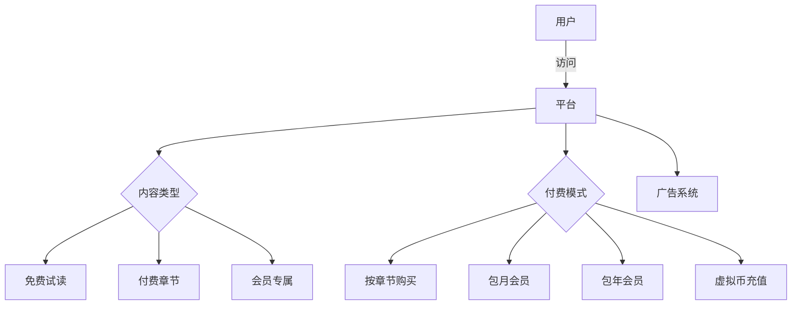
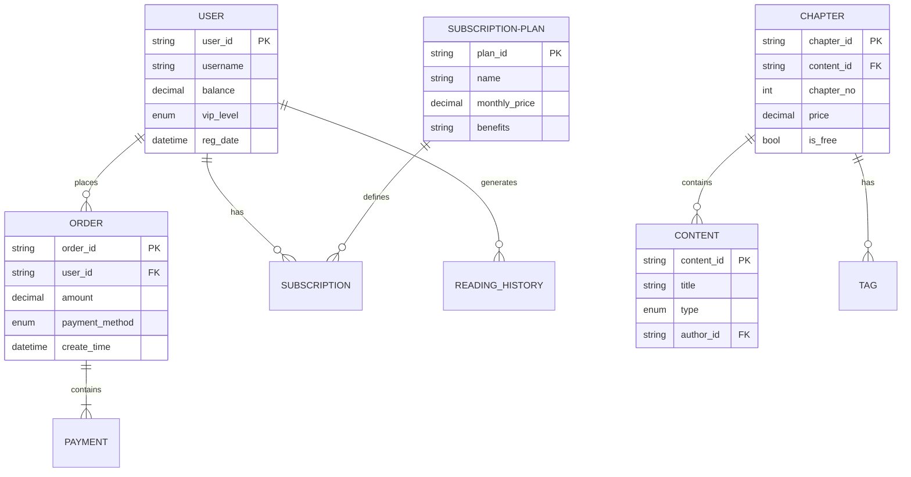
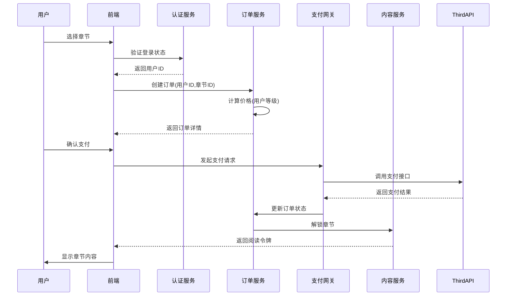
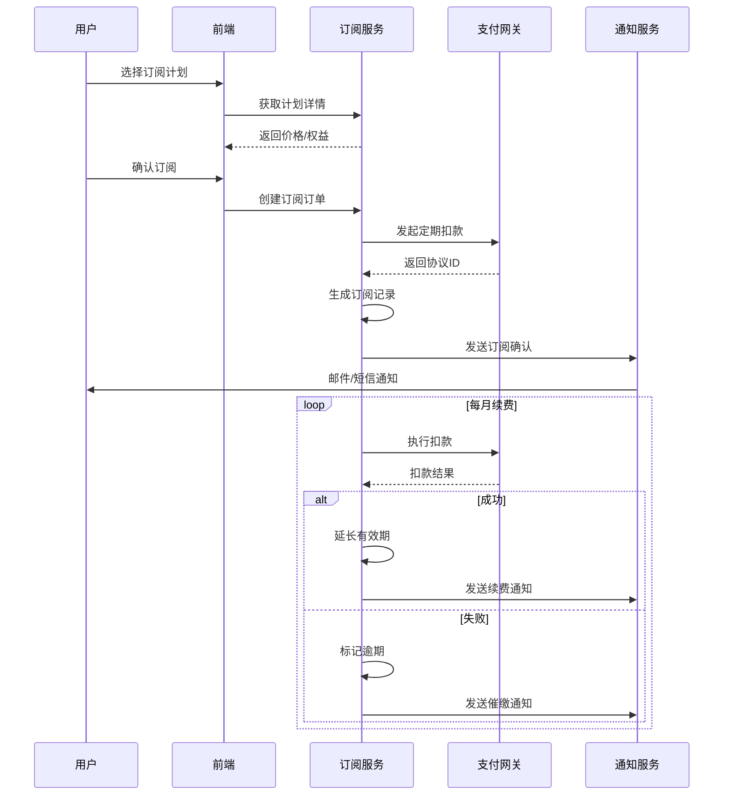
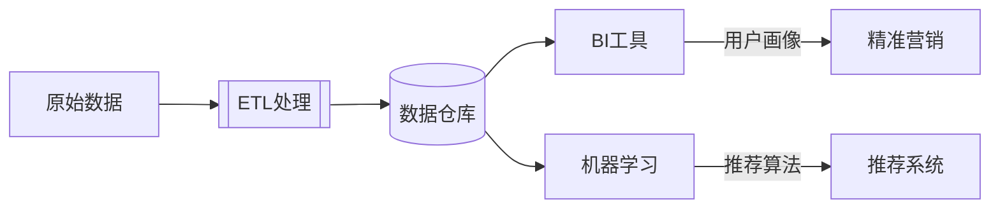

以下是一个完整的在线漫画/小说平台业务规则描述、数据模型设计及时序图构建方案：

---
### 一、业务规则与功能扩展
#### 1. 核心业务场景


#### 2. 详细规则扩展
**2.1 内容分级策略**
- 免费章节：前3章免费+随机插页广告
- 付费章节：单价=基础价×(1+作者等级×0.1)
- 会员权益：
  - 白银会员：免广告+9折购章
  - 黄金会员：全站免费+优先阅读
  - 钻石会员：专属内容+实体周边

**2.2 促销规则**
```python
def calculate_price(user, chapter):
    base = chapter.price
    if user.vip_level == 'gold':
        return 0
    discount = 1 - user.vip_discount
    if datetime.now() in promotion_periods:
        discount *= 0.8
    return base * discount
```

**2.3 虚拟经济系统**
- 1元=10平台币（可反向兑换）
- 充值阶梯奖励：
  - 充100元额外送10%
  - 充500元送限定头像框
- 创作分成：作者获得收益的60%

---
### 二、数据模型设计
#### 1. 核心ER图


#### 2. 表结构示例
```sql
-- 用户订阅表
CREATE TABLE user_subscriptions (
    sub_id VARCHAR(36) PRIMARY KEY,
    user_id VARCHAR(36) NOT NULL,
    plan_id VARCHAR(36) NOT NULL,
    start_date DATETIME,
    end_date DATETIME,
    auto_renew BOOLEAN DEFAULT true,
    FOREIGN KEY (user_id) REFERENCES users(user_id),
    FOREIGN KEY (plan_id) REFERENCES subscription_plans(plan_id)
);

-- 内容访问记录
CREATE TABLE reading_records (
    record_id VARCHAR(36) PRIMARY KEY,
    user_id VARCHAR(36) NOT NULL,
    chapter_id VARCHAR(36) NOT NULL,
    access_type ENUM('free', 'purchase', 'vip') NOT NULL,
    access_time DATETIME DEFAULT CURRENT_TIMESTAMP,
    cost DECIMAL(10,2),
    FOREIGN KEY (user_id) REFERENCES users(user_id),
    FOREIGN KEY (chapter_id) REFERENCES chapters(chapter_id)
);
```

---
### 三、业务流程时序图
#### 1. 章节购买流程


#### 2. 会员订阅流程


---
### 四、扩展设计建议
1. **风控系统**：
   - 建立用户信用评分模型
   - 实现反欺诈规则引擎（如IP异常检测）
   - 设置单日消费限额

2. **数据分析**：


3. **缓存策略**：
```python
# 伪代码示例：章节内容缓存
def get_chapter_content(chapter_id):
    cache_key = f"chapter:{chapter_id}"
    content = redis.get(cache_key)
    if not content:
        content = db.query("SELECT * FROM chapters WHERE id=?", chapter_id)
        redis.setex(cache_key, 3600, content)  # 缓存1小时
    return content
```

该设计方案完整覆盖了从业务规则到技术实现的各个层面，可根据实际业务需求扩展支付渠道整合（微信/支付宝/Stripe）、多语言支持、跨平台同步等功能模块。