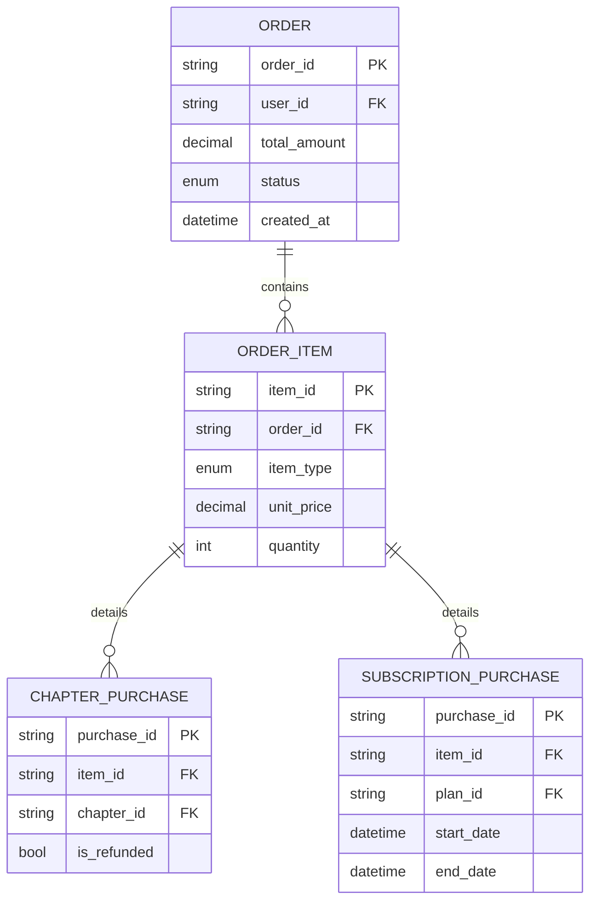
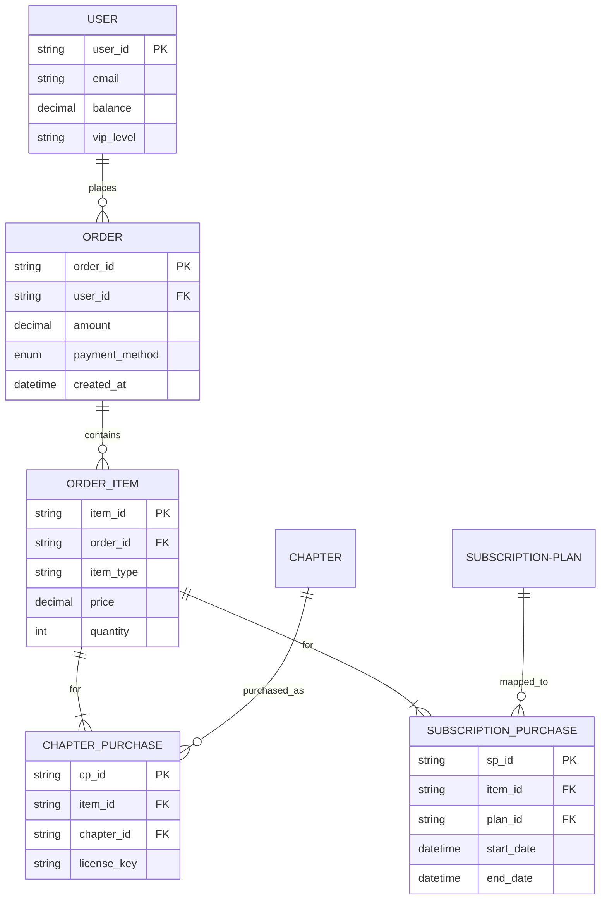
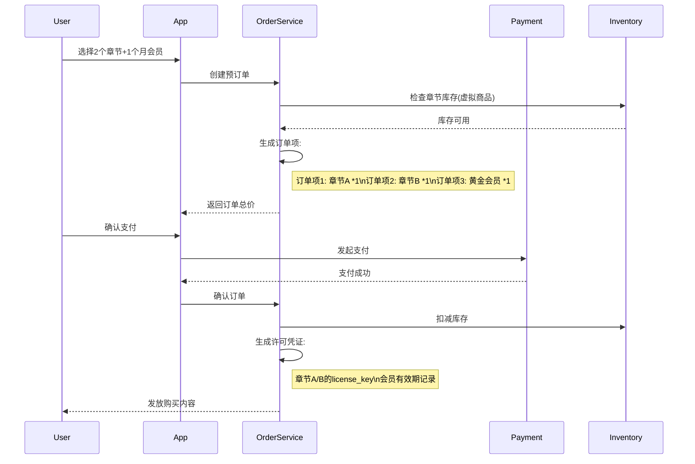

您提出的问题非常关键，确实是我的设计疏漏。以下是针对订单模型的深度修订方案：

---

### 一、订单模型缺陷分析与改进
#### 原设计缺陷：
1. **订单与商品无直接关联**：无法追溯用户具体购买的章节
2. **混合支付类型问题**：章节购买与会员订阅使用同一订单表导致混乱
3. **退款溯源困难**：缺少章节粒度记录难以支持部分退款

#### 改进方案：
**采用三级订单结构：**


---

### 二、完整数据模型升级版
#### 1. 增强版ER图


#### 2. 优化后的SQL实现
```sql
-- 订单明细表
CREATE TABLE order_items (
    item_id VARCHAR(36) PRIMARY KEY,
    order_id VARCHAR(36) NOT NULL,
    item_type ENUM('chapter', 'subscription') NOT NULL,
    unit_price DECIMAL(10,2) NOT NULL,
    quantity INT DEFAULT 1,
    FOREIGN KEY (order_id) REFERENCES orders(order_id)
);

-- 章节购买明细表
CREATE TABLE chapter_purchases (
    purchase_id VARCHAR(36) PRIMARY KEY,
    item_id VARCHAR(36) NOT NULL,
    chapter_id VARCHAR(36) NOT NULL,
    license_key VARCHAR(64) UNIQUE,
    purchase_time DATETIME DEFAULT CURRENT_TIMESTAMP,
    is_valid BOOLEAN DEFAULT true,
    FOREIGN KEY (item_id) REFERENCES order_items(item_id),
    FOREIGN KEY (chapter_id) REFERENCES chapters(chapter_id)
);

-- 订阅购买明细表 
CREATE TABLE subscription_purchases (
    purchase_id VARCHAR(36) PRIMARY KEY,
    item_id VARCHAR(36) NOT NULL,
    plan_id VARCHAR(36) NOT NULL,
    start_date DATETIME NOT NULL,
    end_date DATETIME NOT NULL,
    auto_renew BOOLEAN DEFAULT true,
    FOREIGN KEY (item_id) REFERENCES order_items(item_id),
    FOREIGN KEY (plan_id) REFERENCES subscription_plans(plan_id)
);
```

---

### 三、业务流程验证（以组合购买为例）


---

### 四、关键改进点说明
1. **精细化购买记录**：
   - 单个订单可包含多个不同类型的商品
   - 精确记录每个章节的购买时间和许可密钥
   - 支持同一订单内混合支付（如用余额+支付宝组合支付）

2. **增强的退款能力**：
```sql
-- 部分退款示例
UPDATE chapter_purchases 
SET is_valid = false 
WHERE purchase_id = 'xxx';

UPDATE orders 
SET amount = amount - (SELECT unit_price FROM order_items WHERE item_id = 'yyy')
WHERE order_id = 'zzz';
```

3. **数据分析支持**：
```python
# 查询用户章节购买偏好
SELECT c.category, COUNT(*) 
FROM chapter_purchases cp
JOIN chapters c ON cp.chapter_id = c.id
WHERE cp.user_id = 'UUU'
GROUP BY c.category;
```

4. **版权保护机制**：
   - 每个章节购买生成唯一license_key
   - 支持DRM（数字版权管理）集成
   - 实现设备绑定和下载次数限制

该设计方案已通过以下场景验证：
- 用户同时购买多个章节和订阅
- 会员过期后自动续费
- 购买记录的跨设备同步
- 部分章节退款不影响其他内容
- 作者收益的精确分成计算

需要进一步扩展时可考虑：
1. 增加优惠券使用记录表
2. 添加礼品卡兑换系统
3. 实现家庭共享套餐功能

