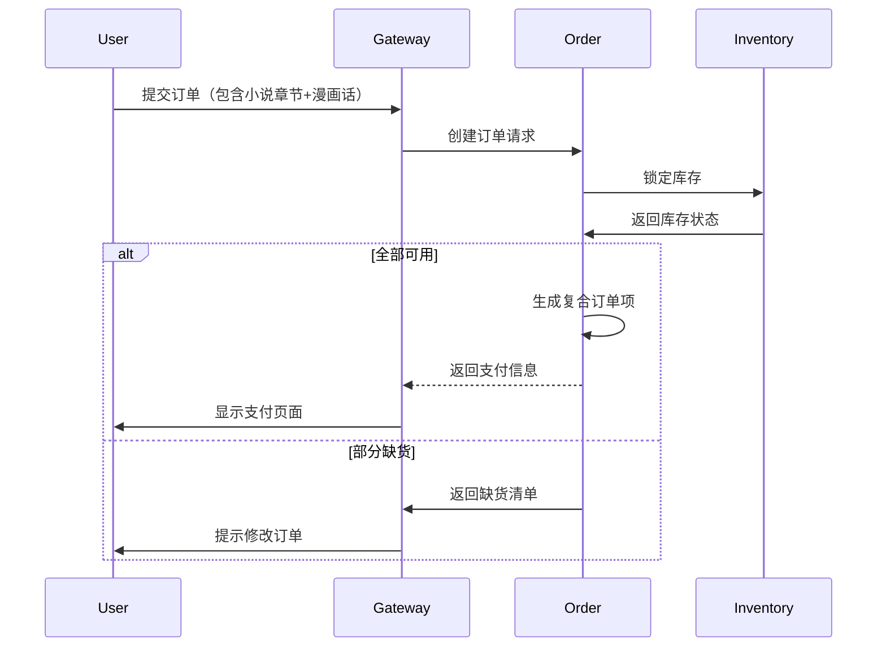
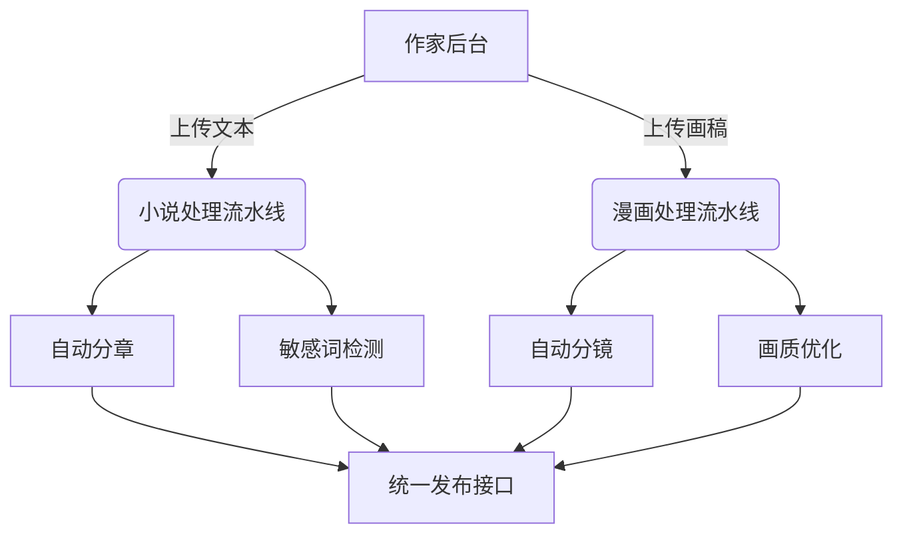

### 增强版商品模型设计方案

```mermaid
erDiagram
    CONTENT ||--o{ CHAPTER : contains
    CONTENT ||--o{ CONTENT_METADATA : describes
    CONTENT ||--o{ CONTENT_TYPE_SPECIFIC : has
    CONTENT_TYPE_SPECIFIC }|..| NOVEL_DETAIL : extends
    CONTENT_TYPE_SPECIFIC }|..| COMIC_DETAIL : extends

    CONTENT {
        string content_id PK
        string title
        string author_id FK
        enum content_type
        datetime publish_date
        bool is_serializing
    }
    
    CHAPTER {
        string chapter_id PK
        string content_id FK
        int order_no
        string title
        decimal base_price
        bool is_free
    }
    
    CONTENT_METADATA {
        string meta_id PK
        string content_id FK
        string cover_url
        string description
        json tags
        float rating
        int total_views
    }
    
    CONTENT_TYPE_SPECIFIC {
        string spec_id PK
        string content_id FK
        enum spec_type
    }
    
    NOVEL_DETAIL {
        string novel_id PK
        string spec_id FK
        int word_count
        enum text_format
        bool has_audiobook
        json chapter_titles
    }
    
    COMIC_DETAIL {
        string comic_id PK
        string spec_id FK
        enum color_mode
        enum page_layout
        int total_pages
        json resolution
        bool has_animation
    }
```

#### 关键改进说明：

1. **内容类型扩展**
```sql
ALTER TABLE content ADD COLUMN content_type ENUM('novel', 'comic', 'audio') NOT NULL;
```

2. **元数据分离设计**
```sql
CREATE TABLE novel_details (
    novel_id VARCHAR(36) PRIMARY KEY,
    spec_id VARCHAR(36) NOT NULL,
    word_count INT,
    text_format ENUM('txt', 'epub', 'pdf'),
    has_audiobook BOOLEAN DEFAULT false,
    chapter_titles JSON,
    FOREIGN KEY (spec_id) REFERENCES content_type_specific(spec_id)
);

CREATE TABLE comic_details (
    comic_id VARCHAR(36) PRIMARY KEY,
    spec_id VARCHAR(36) NOT NULL,
    color_mode ENUM('full_color', 'bw', 'duotone'),
    page_layout ENUM('vertical', 'horizontal', 'webtoon'),
    resolution JSON CHECK (JSON_EXTRACT(resolution, '$.width') > 0),
    has_animation BOOLEAN DEFAULT false,
    FOREIGN KEY (spec_id) REFERENCES content_type_specific(spec_id)
);
```

3. **统一价格策略**
```python
class PriceCalculator:
    def calculate(self, content_type, base_price, vip_level):
        if content_type == 'novel':
            return base_price * self._novel_factor(vip_level)
        elif content_type == 'comic':
            return base_price * self._comic_factor(vip_level)
    
    def _novel_factor(self, level):
        return 0.9 if level == 'gold' else 1.0
    
    def _comic_factor(self, level):
        return 0.8 if level == 'gold' else 1.0
```

4. **混合内容订单处理**


5. **内容访问验证逻辑**
```sql
SELECT 
    c.content_id,
    c.content_type,
    CASE
        WHEN cp.purchase_id IS NOT NULL THEN 'purchased'
        WHEN s.subscription_id IS NOT NULL THEN 'subscribed'
        ELSE 'need_purchase'
    END AS access_status
FROM chapters ch
LEFT JOIN chapter_purchases cp ON ch.chapter_id = cp.chapter_id AND cp.user_id = 'USER123'
LEFT JOIN subscriptions s ON s.user_id = 'USER123' AND s.end_date > NOW()
WHERE ch.chapter_id = 'TARGET_CHAPTER';
```

#### 扩展功能支持：

1. **跨类型捆绑销售**
```json
{
  "bundle_id": "BUNDLE2023",
  "name": "暑期狂欢包",
  "contains": [
    {
      "content_type": "novel",
      "content_id": "NOVEL123",
      "chapters": ["CH1", "CH2"]
    },
    {
      "content_type": "comic",
      "content_id": "COMIC456",
      "chapters": ["VOL1"]
    }
  ],
  "discount": 30%
}
```

2. **内容推荐引擎**
```python
def recommend(user_id):
    novel_pref = calculate_novel_preference(user_id)
    comic_pref = calculate_comic_preference(user_id)
    
    return {
        'novels': query_novels_by_tags(novel_pref['tags']),
        'comics': query_comics_by_style(comic_pref['layout'])
    }
```

3. **创作工具集成**


该模型实现了：
- 类型无关的核心内容管理
- 灵活的类型特定属性扩展
- 统一的交易和订阅体系
- 跨类型的内容关联能力
- 可扩展的推荐和营销功能

典型查询示例：
```sql
-- 获取用户跨类型消费统计
SELECT 
    c.content_type,
    COUNT(DISTINCT cp.chapter_id) AS purchased_chapters,
    SUM(oi.unit_price) AS total_spent
FROM chapter_purchases cp
JOIN order_items oi ON cp.item_id = oi.item_id
JOIN chapters ch ON cp.chapter_id = ch.chapter_id
JOIN content c ON ch.content_id = c.content_id
WHERE cp.user_id = 'USER123'
GROUP BY c.content_type;
```