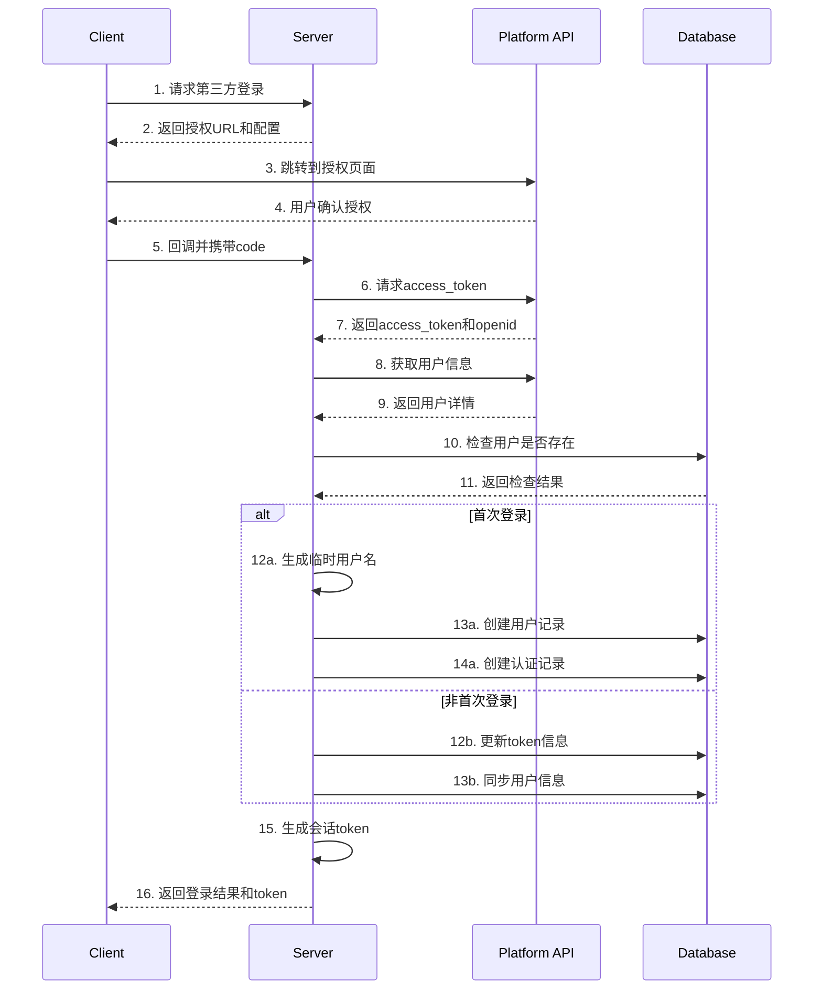

# AKA Music 项目蓝图

## 1. 项目初始化

### 1.1 技术栈选择

#### 前端技术栈
- Vue 3 - 核心框架
- TypeScript - 类型系统
- Ant Design Vue - UI组件库
- Pinia - 状态管理
- Vue Router - 路由管理
- Vite - 构建工具

#### 后端技术栈
- Python
- FastAPI
- SQLAlchemy
- PostgreSQL

### 1.2 目录结构

```
/aka_music
├── frontend/           # 前端项目目录
│   ├── src/
│   │   ├── assets/     # 静态资源
│   │   ├── components/ # 组件
│   │   ├── router/     # 路由配置
│   │   ├── store/      # 状态管理
│   │   ├── views/      # 页面组件
│   │   ├── App.vue     # 根组件
│   │   └── main.ts     # 入口文件
│   ├── package.json
│   └── vite.config.ts
├── backend/            # 后端项目目录
│   ├── app/
│   │   ├── models/     # 数据模型
│   │   ├── routes/     # 路由处理
│   │   └── utils/      # 工具函数
│   ├── tests/          # 测试目录
│   └── requirements.txt # 依赖配置
├── docs/               # 文档目录
└── README.md
```

### 1.3 已完成的配置

#### 前端配置
1. 初始化Vue 3项目
2. 集成Ant Design Vue
3. 配置Pinia状态管理
4. 设置基础路由

```typescript
// main.ts
import { createApp } from 'vue'
import { createPinia } from 'pinia'
import Antd from 'ant-design-vue'
import App from './App.vue'
import router from './router'
import 'ant-design-vue/dist/reset.css'

const app = createApp(App)
const pinia = createPinia()

app.use(pinia)
app.use(router)
app.use(Antd)

app.mount('#app')
```

#### 状态管理配置
```typescript
// store/index.ts
import { defineStore } from 'pinia'

export const useUserStore = defineStore('user', {
  state: () => ({
    token: '',
    userInfo: null
  }),
  actions: {
    setToken(token: string) {
      this.token = token
    },
    setUserInfo(userInfo: any) {
      this.userInfo = userInfo
    },
    logout() {
      this.token = ''
      this.userInfo = null
    }
  },
  persist: true
})
```

#### 路由配置
```typescript
// router/index.ts
import { createRouter, createWebHistory } from 'vue-router'

const router = createRouter({
  history: createWebHistory(),
  routes: [
    {
      path: '/',
      name: 'home',
      component: () => import('../views/Home.vue')
    },
    {
      path: '/login',
      name: 'login',
      component: () => import('../views/Login.vue')
    },
    {
      path: '/profile',
      name: 'profile',
      component: () => import('../views/Profile.vue')
    }
  ]
})

export default router
```

## 2. 认证系统设计

### 2.1 第三方登录流程



### 2.2 安全考虑

1. **Token管理**：
   - access_token加密存储
   - 定期刷新机制
   - 失效处理

2. **账号绑定保护**：
   - 防止重复绑定
   - 解绑确认机制
   - 操作日志记录