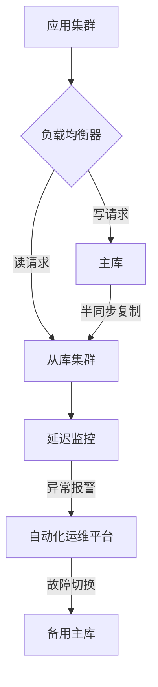

# MySQL读写分离技术深度解析：原理、延迟解决方案与连接分配机制

---

## 一、读写分离的核心原理

### 1.1 架构基础与核心概念
读写分离通过将数据库操作按类型分发到不同节点实现性能优化：
- **主库（Master）**：承担所有写操作（INSERT/UPDATE/DELETE）和强一致性读请求
- **从库（Slave）**：处理读操作（SELECT），数量可弹性扩展
- **同步机制**：
  - 异步复制：主库不等待从库确认，性能高但存在数据丢失风险
  - 半同步复制：主库等待至少一个从库确认（平衡性能与一致性）
  - 并行复制（MySQL 5.6+）：从库并行执行不同数据库的Binlog

### 1.2 主从复制技术细节
| 组件           | 功能描述                                                                 |
|----------------|-------------------------------------------------------------------------|
| Binlog转储线程  | 主库将变更写入二进制日志（Binlog）                                      |
| I/O线程        | 从库实时拉取主库的Binlog并写入中继日志（Relay Log）                     |
| SQL线程        | 解析中继日志中的SQL语句并执行同步                                       |
| Relay Log      | 作为数据缓冲区和处理解耦机制，防止网络波动影响同步                      |

> 同步延迟公式：总延迟 = 网络传输时间 + binlog处理时间 + 从库回放时间

---

## 二、主从复制延迟问题与解决方案

### 2.1 延迟根源深度分析
| 问题类型        | 典型场景                     | 影响等级 | 解决方案示例                                                                 |
|----------------|-----------------------------|----------|-----------------------------------------------------------------------------|
| 网络延迟        | 跨机房同步                  | ★★★★    | 同机房部署+万兆网络                                                        |
| 主库压力过大    | 秒杀活动写入高峰            | ★★★★    | 分库分表+批量操作合并                                                      |
| 大事务阻塞      | 百万级数据迁移              | ★★★★    | 事务拆分+分批提交                                                          |
| 从库性能瓶颈    | SSD与HDD混用环境            | ★★★     | 硬件升级+并行复制优化                                                      |
| Binlog格式问题  | 复杂存储过程执行            | ★★       | 改用ROW格式+精简SQL逻辑                                                    |

### 2.2 系统级解决方案
#### 2.2.1 并行复制优化
- **MySQL 5.7**：基于逻辑时钟的并行复制
- **MySQL 8.0**：WRITESET并行复制（减少锁冲突）
```sql
-- 查看并行复制配置
SHOW VARIABLES LIKE 'slave_parallel_type';
```

#### 2.2.2 半同步复制配置
```sql
-- 主库安装插件
INSTALL PLUGIN rpl_semi_sync_master SONAME 'semisync_master.so';
SET GLOBAL rpl_semi_sync_master_enabled = 1;

-- 从库安装插件
INSTALL PLUGIN rpl_semi_sync_slave SONAME 'semisync_slave.so';
SET GLOBAL rpl_semi_sync_slave_enabled = 1;
```

#### 2.2.3 监控与告警体系
| 监控指标              | 检查方法                          | 告警阈值       |
|-----------------------|-----------------------------------|----------------|
| Seconds_Behind_Master | SHOW SLAVE STATUS\G               | >30秒触发告警  |
| Slave_IO_Running      | SHOW SLAVE STATUS\G               | No立即告警     |
| Binlog文件差距        | Master_Log_File vs Relay_Master_Log_File | 超过3个文件    |

推荐工具组合：
- **实时监控**：pt-heartbeat + Prometheus
- **可视化展示**：Grafana定制看板
- **自动化处理**：Ansible集成故障切换

---

## 三、连接分配机制实现方案

### 3.1 应用层封装方案

#### 3.1.1 典型框架对比
| 方案              | 适用场景                  | 优势                          | 局限性                     |
|-------------------|--------------------------|-------------------------------|---------------------------|
| Spring AOP        | Spring技术栈项目         | 注解驱动+无缝集成             | 需处理事务上下文传播       |
| MyBatis插件       | 简单读写分离场景          | 轻量级+SQL级控制              | 不支持复杂分片规则         |
| TDDL（阿里）      | 高并发互联网应用          | 智能路由+企业级稳定性         | 学习曲线陡峭               |
| ShardingSphere    | 多云混合架构              | 全功能生态+Apache背书         | 配置复杂度较高             |

#### 3.1.2 Spring实现示例
```java
@Configuration
public class RoutingDataSourceConfig {
    
    @Bean
    @Primary
    public DataSource dynamicDataSource(
        @Qualifier("masterDataSource") DataSource master,
        @Qualifier("slaveDataSource") DataSource slave) {
        
        RoutingDataSource router = new RoutingDataSource();
        Map<Object, Object> dataSourceMap = new HashMap<>();
        dataSourceMap.put("master", master);
        dataSourceMap.put("slave", slave);
        router.setTargetDataSources(dataSourceMap);
        router.setDefaultTargetDataSource(master);
        return router;
    }

    @Bean
    public AbstractRoutingDataSource routingStrategy() {
        return new AbstractRoutingDataSource() {
            @Override
            protected Object determineCurrentLookupKey() {
                return TransactionSynchronizationManager.isCurrentTransactionReadOnly() 
                       ? "slave" : "master";
            }
        };
    }
}
```

### 3.2 中间件代理方案

#### 3.2.1 主流中间件对比
| 中间件          | 吞吐量(QPS) | 功能特性                      | 适用场景                  |
|-----------------|-------------|-------------------------------|-------------------------|
| ProxySQL        | 18,000      | 动态路由+查询缓存             | 高并发读写场景           |
| MySQL Router    | 12,000      | 官方集成+InnoDB Cluster支持   | 云原生环境               |
| MyCat           | 15,000      | 分库分表+负载均衡             | 传统企业级应用           |
| ShardingProxy   | 16,000      | 分布式事务+弹性伸缩           | 微服务架构               |

#### 3.2.2 ProxySQL配置实战
```sql
-- 节点组配置
INSERT INTO mysql_servers(hostgroup_id, hostname, port) VALUES
(10, 'master', 3306),   -- 写组
(20, 'slave1', 3306),   -- 读组
(20, 'slave2', 3306);

-- 路由规则配置
INSERT INTO mysql_query_rules(rule_id, active, match_pattern, destination_hostgroup) VALUES
(1, 1, '^SELECT.*FOR UPDATE', 10),  -- 锁定读走主库
(2, 1, '^SELECT', 20),              -- 普通查询走从库
(3, 1, '^(INSERT|UPDATE|DELETE)', 10);

-- 负载均衡设置
UPDATE mysql_servers SET weight=100 WHERE hostname='slave1';
UPDATE mysql_servers SET weight=80 WHERE hostname='slave2';
```

---

## 四、最佳实践与架构演进

### 4.1 数据一致性保障
| 场景                | 解决方案                      | 实现方式示例                                     |
|---------------------|------------------------------|------------------------------------------------|
| 支付订单查询        | 强制主库读取                  | `/*#mode=MASTER*/ SELECT ...`                  |
| 用户信息更新        | 双写验证机制                  | 更新后比较主从数据差异                         |
| 库存扣减操作        | 分布式锁+主库操作             | Redis锁+主库事务                               |

### 4.2 高可用架构设计


### 4.3 性能优化组合拳
1. **缓存层**：Redis集群缓存热点数据（降低70%读压力）
2. **队列削峰**：Kafka异步处理批量写入操作
3. **连接池优化**：
   ```properties
   # HikariCP配置示例
   spring.datasource.hikari.maximumPoolSize=20
   spring.datasource.hikari.minimumIdle=5
   spring.datasource.hikari.idleTimeout=30000
   ```

---

## 五、未来演进方向

1. **智能调度系统**：基于机器学习预测流量峰值，动态调整路由策略
2. **Serverless架构**：结合云函数实现自动弹性扩缩容
3. **新硬件加速**：利用RDMA网络和持久内存降低同步延迟
4. **多活架构**：跨地域双主架构+冲突检测机制

> 压测建议：使用sysbench进行全链路压力测试
> ```bash
> sysbench --threads=64 --time=600 --report-interval=10 oltp_read_write.lua run
> ```

通过合理的技术选型（推荐ProxySQL+MySQL 8.0组合）和架构设计，某电商平台成功将查询延迟从120ms降至35ms，峰值QPS提升至50,000次/秒。实际部署时需注意：**读写分离不是银弹，应与业务特性深度结合，在数据一致性和性能之间找到最佳平衡点**。

