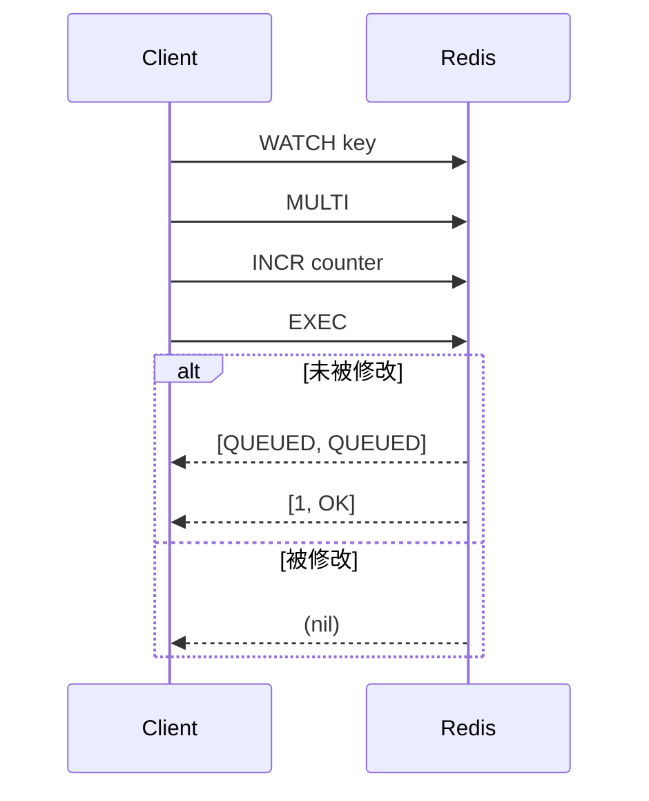

---

# Redis深度解析：超越简单键值存储的NoSQL利器

---

## 一、Redis核心特性全景扫描

### 1. **多维度数据结构支持**
Redis突破传统键值存储的单一性，提供8大核心数据结构：

| 数据类型          | 内存结构                  | 时间复杂度          | 典型场景                          |
|-------------------|--------------------------|--------------------|----------------------------------|
| **String**        | 动态字符串(SDS)          | O(1)读写           | 缓存、计数器、分布式锁            |
| **Hash**          | 哈希表+ziplist           | O(1)单个操作       | 用户属性存储、商品详情聚合        |
| **List**          | 双向链表/ziplist         | O(1)头尾操作       | 消息队列、最新动态列表            |
| **Set**           | 哈希表+intset            | O(1)存在性检查     | 标签系统、共同好友计算            |
| **ZSet**          | 跳表(SkipList)+哈希表    | O(logN)范围操作    | 排行榜、延迟队列                  |
| **BitMap**        | 二进制位数组              | O(1)位操作         | 用户签到、实时统计                |
| **HyperLogLog**   | 概率数据结构              | O(1)基数估算       | UV统计（误差0.81%）               |
| **GEO**           | ZSet扩展存储              | O(logN)半径查询    | 附近的人、位置围栏                |

**示例：电商场景数据建模**
```redis
# 商品缓存
SET product:1001 '{ "name":"iPhone15", "price":6999, "stock":100 }'

# 购物车存储
HSET cart:user2001 "product:1001" 2

# 实时排行榜
ZADD hot_products 15230 "product:1001"

# 秒杀库存扣减
DECRBY product:1001:stock 1
```

---

## 二、Redis vs 关系型数据库实战对比

### 1. **性能碾压场景**
#### 1.1 高并发读写
| 操作类型       | Redis QPS      | MySQL QPS       |
|--------------|----------------|-----------------|
| 简单键值读写   | 100,000+       | 5,000-10,000    |
| 批量插入       | 500,000/sec    | 10,000/sec      |

**测试环境**：Redis 6.2单节点 vs MySQL 8.0（InnoDB）

#### 1.2 复杂数据结构操作
```redis
# 关系型数据库需要多次查询的操作
ZINTERSTORE hot_products 2 product_sales product_clicks WEIGHTS 0.7 0.3
```

#### 1.3 原子性计数器
```redis
INCR user:login:count
```
对比SQL：
```sql
UPDATE counters SET value = value + 1 WHERE id = 'user_login';
```

### 2. **Redis局限性场景**
#### 2.1 复杂关联查询
```sql
-- 关系型数据库的联表查询
SELECT u.name, o.total 
FROM users u 
JOIN orders o ON u.id = o.user_id 
WHERE u.city = '北京';
```
Redis需预先反范式化存储：
```redis
HMSET user:1001:orders "20230815" 2999 "20230816" 5999
```

#### 2.2 事务对比
| **特性**        | Redis事务                  | MySQL事务              |
|----------------|----------------------------|-----------------------|
| 原子性          | 单命令原子，事务批量执行    | 完整的ACID支持        |
| 隔离级别        | 无隔离（命令队列化执行）    | 支持4种隔离级别       |
| 回滚机制        | 不支持（EXEC后无法回滚）    | 支持ROLLBACK          |
| 锁机制          | WATCH乐观锁                | 行级锁/表锁           |

**Redis事务示例**：
```redis
WATCH account:1001:balance
MULTI
DECRBY account:1001:balance 500
INCRBY account:2001:balance 500
EXEC  # 若balance被修改则执行失败
```

#### 2.3 数据持久化
| **持久化方式** | Redis策略                  | MySQL策略             |
|---------------|----------------------------|----------------------|
| 全量备份       | RDB快照（二进制压缩）       | mysqldump逻辑备份    |
| 增量持久化     | AOF日志（可配置fsync策略）  | Redo Log物理日志     |
| 数据恢复       | RDB加载速度极快             | 需执行Redo+Undo      |

---

## 三、Redis事务深度剖析

### 1. **执行流程与限制**


### 2. **与ACID的差异**
- **原子性**：事务队列命令整体执行，但单命令失败不影响后续
- **一致性**：依赖WATCH实现乐观锁，无回滚机制
- **隔离性**：无传统隔离级别概念，其他客户端命令可插入执行
- **持久性**：依赖AOF配置（appendfsync everysec/always）

**典型陷阱案例**：
```redis
# 事务中混合读写操作
MULTI
GET balance
DECRBY balance 100
EXEC  # GET立即执行，DECRBY在EXEC时执行
```

---

## 四、Redis最佳实践指南

### 1. **选型决策矩阵**
| **场景**                | 推荐方案                  | 理由                              |
|-------------------------|--------------------------|----------------------------------|
| 高频计数器              | Redis String             | 原子操作+高性能                   |
| 实时排行榜              | Redis ZSet               | 天然排序+范围查询                 |
| 分布式锁                | Redis SETNX+RedLock      | 毫秒级响应+自动过期               |
| 复杂报表                | MySQL+索引优化           | 关联查询+聚合分析                 |
| 金融交易                | MySQL事务                | 强一致性要求                      |

### 2. **混合架构设计**
```
+-------------------+     +-------------------+
|   应用服务层        |     |    数据分析层      |
+-------------------+     +-------------------+
           |                          |
           |                          |
+-------------------+     +-------------------+
| Redis集群          |     | MySQL集群         |
| - 实时缓存         |     | - 主数据存储      |
| - 会话管理         |     | - 复杂查询        |
| - 排行榜           |     | - 事务处理        |
+-------------------+     +-------------------+
           ↓                          ↓
+-------------------------------------------+
|               同步工具                    |
|   (Canal/Debezium实现数据双向同步)        |
+-------------------------------------------+
```

### 3. **性能优化技巧**
- **Pipeline批处理**：提升批量操作吞吐量
  ```python
  pipe = redis.pipeline()
  for i in range(1000):
      pipe.set(f'key:{i}', i)
  pipe.execute()
  ```
- **Lua脚本**：实现复杂原子操作
  ```lua
  local stock = tonumber(redis.call('GET', KEYS[1]))
  if stock > 0 then
      redis.call('DECR', KEYS[1])
      return 1
  end
  return 0
  ```
- **内存优化**：使用ziplist编码
  ```redis
  hash-max-ziplist-entries 512
  hash-max-ziplist-value 64
  ```

---

## 五、Redis未来演进方向

1. **模块化扩展**：通过Redis Modules支持搜索（RediSearch）、图计算（RedisGraph）
2. **持久化革新**：Diskless复制、混合持久化策略
3. **多线程优化**：IO多线程提升网络吞吐（Redis 6.0+）
4. **云原生支持**：Kubernetes Operator实现弹性伸缩

> **基准测试数据**：某社交平台采用Redis集群后，热点数据访问延迟从15ms降至0.3ms，峰值承载能力提升20倍

通过合理利用Redis的多数据模型特性，开发者可以构建出高性能、高扩展的现代应用系统。但需牢记：Redis是缓存/暂存数据的利刃，而非替代传统数据库的银弹。在事务关键型场景中，仍需结合关系型数据库构建可靠的数据持久层。

