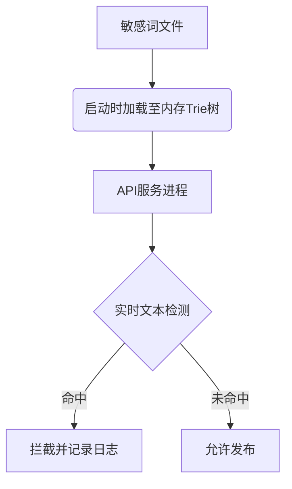
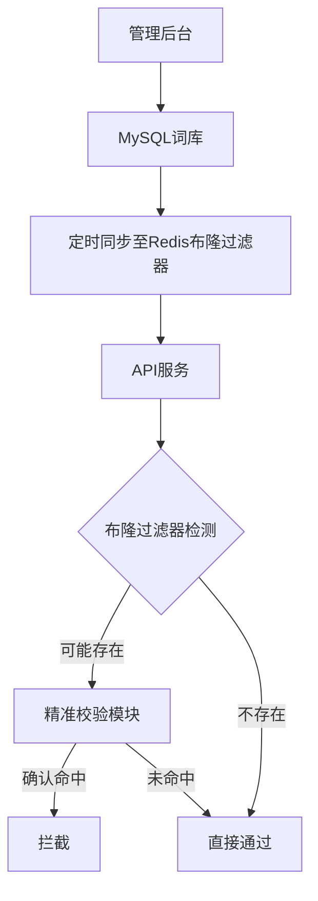
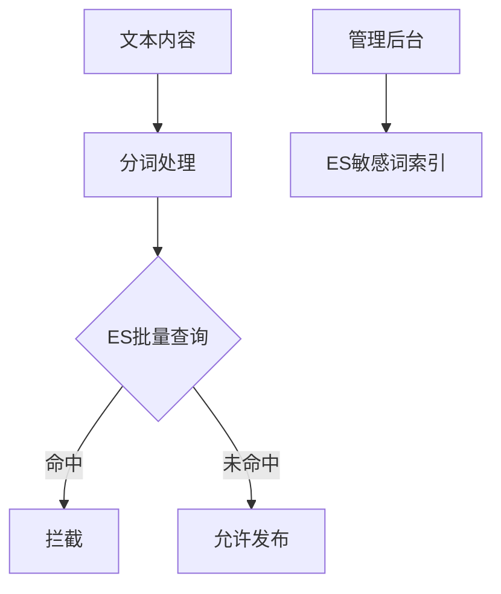
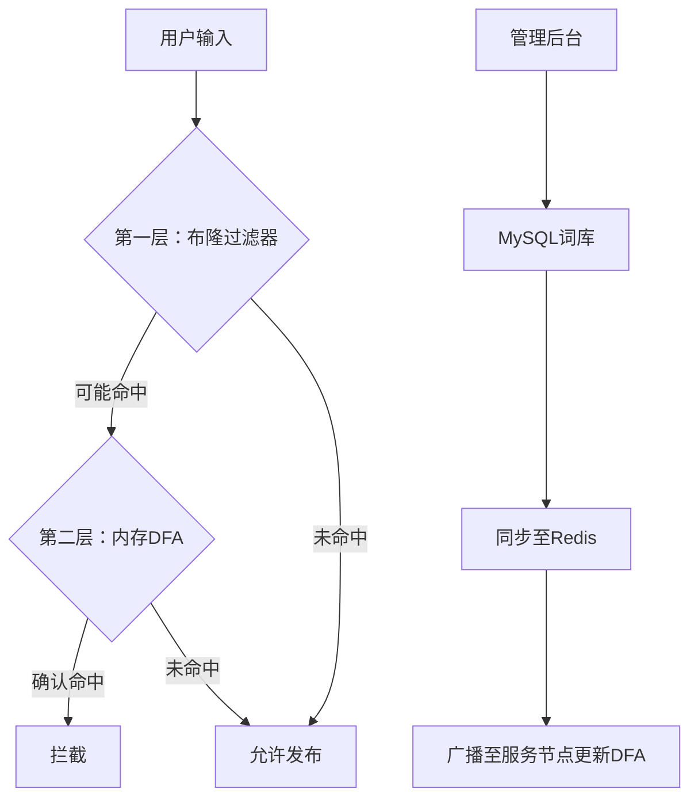

---

# 内容平台敏感词过滤多方案设计与对比

---

## 一、核心需求分析

| **指标**        | **要求**                           |
|----------------|----------------------------------|
| 响应时间        | 99%请求<50ms，峰值QPS>10,000      |
| 词库更新效率     | 新词生效延迟<10s                 |
| 匹配精度        | 支持中文分词、模糊匹配（如变体字、同音字）|
| 存储规模        | 支持千万级敏感词，可动态扩展        |
| 运维复杂度      | 支持灰度发布、快速回滚              |

---

## 二、候选技术方案

### **方案1：内存Trie树+文件存储**
#### 实现逻辑


#### 性能指标
| **指标**        | **数值**               |
|----------------|-----------------------|
| 单次检测时间     | 0.1-2ms              |
| 内存占用        | 1GB/百万词（含树结构优化）|
| 词库更新延迟     | 分钟级（需重启服务）     |

#### 优缺点
- **优点**：极致性能、零外部依赖  
- **缺点**：更新需重启、多节点一致性难保障

---

### **方案2：Redis布隆过滤器+持久化存储**
#### 架构设计


#### 性能指标
| **指标**        | **数值**               |
|----------------|-----------------------|
| 布隆检测时间     | 0.5-3ms              |
| 精准校验时间     | 2-10ms（需查DB）      |
| 误判率          | 0.1%-1%              |
| 词库更新延迟     | 秒级（异步同步）       |

#### 优缺点
- **优点**：空间效率高、支持动态更新  
- **缺点**：存在误判、需二级校验

---

### **方案3：Elasticsearch语义分析**
#### 实现逻辑


#### 性能指标
| **指标**        | **数值**               |
|----------------|-----------------------|
| 平均检测时间     | 20-100ms             |
| 索引更新延迟     | 近实时（1s内）        |
| 存储成本        | 高（需存原始文本及变体）|

#### 优缺点
- **优点**：支持语义分析、模糊匹配能力强  
- **缺点**：硬件成本高、性能依赖集群规模

---

### **方案4：DFA算法+数据库热加载**
#### 技术实现
```python
# 敏感词热更新示例
class HotWordLoader:
    def __init__(self):
        self.dfa = DFA()
        self.conn = KafkaConsumer('word_update_topic')
    
    def listen_updates(self):
        for msg in self.conn:
            if msg.op == 'ADD':
                self.dfa.add_word(msg.word)
            elif msg.op == 'DEL':
                self.dfa.delete_word(msg.word)

# 检测流程
def check_content(text):
    return dfa.search(text)
```

#### 性能指标
| **指标**        | **数值**               |
|----------------|-----------------------|
| 检测时间        | 1-5ms                |
| 更新生效延迟     | 毫秒级                |
| 内存占用        | 1.2GB/百万词          |

#### 优缺点
- **优点**：平衡性能与实时性  
- **缺点**：开发复杂度高、需维护状态同步

---

## 三、方案对比矩阵

| **维度**         | 内存Trie树          | Redis布隆过滤器     | Elasticsearch       | DFA+DB热加载       |
|------------------|---------------------|---------------------|---------------------|--------------------|
| **响应时间**     | ⭐⭐⭐⭐⭐ (0.1ms)    | ⭐⭐⭐⭐ (3ms)        | ⭐⭐ (50ms)          | ⭐⭐⭐⭐ (2ms)       |
| **更新效率**     | ⭐ (分钟级)         | ⭐⭐⭐ (秒级)         | ⭐⭐⭐⭐ (近实时)      | ⭐⭐⭐⭐⭐ (毫秒级)    |
| **匹配精度**     | ⭐⭐⭐ (精确匹配)     | ⭐⭐ (需二次校验)     | ⭐⭐⭐⭐⭐ (语义分析)   | ⭐⭐⭐⭐ (支持变体)   |
| **硬件成本**     | ⭐⭐⭐⭐ (低)         | ⭐⭐⭐ (中)           | ⭐ (高)             | ⭐⭐⭐ (中)          |
| **扩展性**       | ⭐⭐ (单机受限)      | ⭐⭐⭐⭐ (分布式)      | ⭐⭐⭐⭐⭐ (集群)       | ⭐⭐⭐ (需状态同步)  |
| **适用场景**     | 中小型固定词库       | 高频检测+动态更新    | 复杂语义审核         | 高实时性大规模场景  |

---

## 四、混合方案推荐

### **架构设计：分层过滤+异步更新**


#### 核心优势
1. **性能分层**：99%请求在布隆过滤层完成（3ms内），仅1%进入DFA精准检测  
2. **实时更新**：通过Redis PubSub实现秒级词库同步  
3. **资源优化**：DFA仅加载高频敏感词（如Top 10万），MySQL存储全量词库  

#### 性能指标
| **场景**         | **指标**                     |
|------------------|-----------------------------|
| 正常内容检测      | 平均1.2ms，峰值QPS 15,000   |
| 敏感内容检测      | 平均5ms（二次校验）          |
| 词库更新生效      | <500ms                      |

---

## 五、关键技术选型建议

1. **基础组件**  
   - **存储**：MySQL（全量词库）+ Redis（布隆过滤器）  
   - **实时通信**：Kafka/RabbitMQ（词库变更通知）  
   - **计算框架**：Aho-Corasick算法（高效多模式匹配）  

2. **优化技巧**  
   - **DFA压缩**：双数组Trie（DAT）减少内存占用30%  
   - **局部更新**：仅同步变更词条，降低网络开销  
   - **分级词库**：按风险等级拆分（暴恐、色情、广告等），差异化检测策略  

3. **运维保障**  
   - **监控**：Prometheus统计拦截率/误判率  
   - **灰度机制**：新词先进入5%流量测试，确认无误后全量生效  
   - **降级策略**：检测服务超时自动放行，事后审计补扫  

---

## 六、总结
对于内容平台敏感词过滤场景，**不存在银弹方案**。推荐采用分层混合架构，兼顾性能与灵活性。中小型平台可优先选择`内存DFA+文件`简化部署，大型高并发场景应采用`布隆过滤器+DFA热加载`组合方案，AI驱动的语义审核需叠加`Elasticsearch/NLP模型`增强复杂场景处理能力。