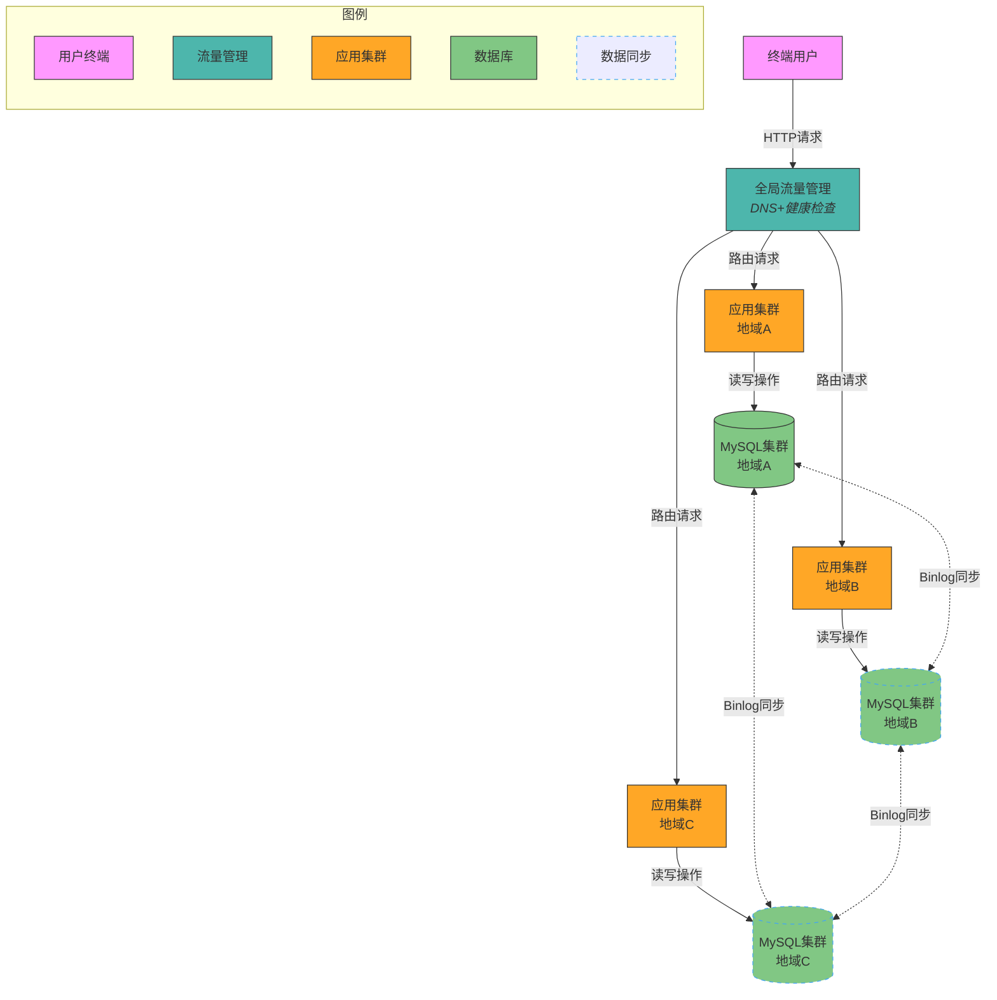

# 异地多活架构技术方案

## 1. 核心概念
异地多活架构是指在多个地理位置部署应用系统，每个系统都能独立处理业务请求，并通过数据同步机制保证数据一致性。其主要目标是提高系统的可用性和容灾能力。

想象一下，如果将传统的单一数据中心比作"把所有鸡蛋放在一个篮子里"，那么异地多活架构就是"将鸡蛋分散在多个篮子里"的策略。当一个地区发生自然灾害或网络故障时，其他地区的系统仍能正常运行，用户几乎感知不到服务中断。就像一个跨国企业在全球设立多个办公室，即使总部休假，其他分部仍能正常运转，保证业务连续性。

## 2. 目标
- **高可用性**：通过多地域部署，确保在单一地域故障时，其他地域能继续提供服务。
- **容灾能力**：在灾难发生时，能快速切换到其他地域，减少业务中断时间。
- **负载均衡**：通过全局流量管理，合理分配用户请求，优化系统性能。

这就像现代城市的电力系统设计：不依赖单一发电厂，而是通过多个发电站和智能电网相互备份。当一个发电站出现故障，其他发电站会自动增加发电量，居民家中的灯依然亮着，电视依然工作——这正是异地多活架构追求的无感知切换体验。对企业而言，这意味着即使面临地震、断电等灾难性事件，业务依然能够持续运行，避免巨大的经济损失和用户流失。

## 3. 挑战
- **数据一致性**：多地域数据同步的延迟和冲突问题。
- **网络延迟**：跨地域通信的延迟对系统性能的影响。
- **成本控制**：多地域部署带来的硬件和运维成本增加。

实现异地多活就像指挥一场跨越多个城市的交响乐演奏：每个乐团（数据中心）都有完整的乐谱（数据），但如何确保他们演奏的是同一首曲子、保持同样的节奏？当一个城市的乐团改变了某个音符（数据更新），如何确保其他城市的乐团也同步更新？这种同步面临着物理距离带来的延迟挑战——就像声音传播需要时间一样，数据同步也需要时间。同时，维护多个乐团的成本远高于单一乐团，这就要求我们在系统设计时权衡投入与收益，找到最佳平衡点。

## 4. 关键技术组件

### 4.1 全局流量管理（GTM）
GTM负责将用户请求路由到最优的地域节点，通常基于用户地理位置、网络状况和系统负载进行决策。

全局流量管理就像是一个智能交通指挥系统，根据道路拥堵情况、距离远近和车辆类型，为每辆车规划最佳路线。当北京用户访问服务时，GTM可能将请求引导至华北数据中心；当上海用户访问时，则可能引导至华东数据中心。当某个数据中心负载过高或出现故障时，GTM会像交通指挥官一样，迅速调整路由策略，将流量引导至其他健康的数据中心，确保用户请求得到及时响应。

### 4.2 数据同步机制
- **实时同步**：通过消息队列或数据库复制技术，实现数据的实时同步。
- **异步同步**：在数据一致性要求不高的场景下，采用异步同步以减少网络延迟影响。
- **退步方案（当实时同步不可行时）**：
  - 消息队列：通过异步消息队列（如Kafka、RabbitMQ）实现数据变更的异步同步，降低网络延迟影响，但需接受一定的数据延迟。
  - 二次读取：在本地数据未同步时，通过二次读取操作访问源地域数据，确保数据一致性。
  - 回源读取：当本地数据未及时同步时，读取操作回源到主地域获取最新数据（适用于读多写少场景）。
  - 数据重新分配：通过动态调整数据分片策略，将热点数据重新分配到多个地域，减少跨地域同步压力。

数据同步机制就像是多地办公的跨国公司如何保持文件一致性。实时同步类似于共享云盘，一个地区的员工修改文件后，其他地区的员工立即看到最新版本；而异步同步则像是定时邮件推送，接受一定的延迟来换取系统效率。当网络条件不佳时，公司可能采用多种备选方案：比如通过专门的信息传递员（消息队列）定期传递更新；或者在重要决策前直接打电话给总部确认最新情况（二次读取）；对于不常变化但经常需要查阅的资料，可能在各地设立档案室但标记"以总部为准"（回源读取）；对于各地区特有的业务，则完全下放管理权限（数据重新分配）。这些策略共同确保了公司信息的一致性和业务的连续性。

### 4.3 负载均衡策略
- **轮询**：将请求均匀分配到各个地域节点。
- **加权轮询**：根据地域节点的负载情况，动态调整请求分配权重。
- **最少连接**：将请求分配到当前连接数最少的节点。

负载均衡策略就像是银行窗口的排队系统。简单轮询相当于顾客按顺序依次到不同窗口办理业务；加权轮询则类似于根据每个窗口办理效率的快慢，分配不同数量的顾客；最少连接策略则像是引导顾客去排队最短的窗口。在实际应用中，系统可能会综合考虑服务器性能、网络状况、地理位置等因素，动态调整这些策略，就像银行在高峰期会增开窗口、调整人员配置一样，确保整体服务效率最大化。

## 5. 数据一致性保障
- **分布式事务**：通过两阶段提交（2PC）或三阶段提交（3PC）保证跨地域事务的一致性。
- **最终一致性**：在数据一致性要求不高的场景下，采用最终一致性模型，通过异步同步实现数据一致性。

数据一致性保障就像是多地连锁餐厅如何确保菜单变更的同步。分布式事务类似于总部下达新菜单指令时，先确认各分店是否已准备好所需食材和厨师（准备阶段），然后再统一发出"今日起正式提供新菜品"的命令（提交阶段）。如果任何一家分店无法满足条件，则所有分店都不会推出新菜品，确保顾客在任何分店看到的菜单都是一致的。而最终一致性则更为灵活，类似于告知各分店"未来一周内逐步更新菜单"，允许短时间内各分店菜单存在差异，但最终会达到一致。对于银行转账这类关键业务，通常采用分布式事务；而对于社交媒体点赞数这类非关键数据，则可采用最终一致性模型，以提高系统性能。

## 6. 流量调度
- **智能DNS**：根据用户地理位置和网络状况，动态解析到最优地域的IP地址。
- **HTTP重定向**：通过HTTP 302重定向，将用户请求引导到最优地域。

流量调度就像是一个全球导航系统，为用户找到最快到达目的地的路径。当你在手机上输入网址（如www.example.com）时，智能DNS就像是一个了解全球路况的导航员，会根据你的位置、当前网络状况等因素，告诉你"从这个入口进入最快"（返回最近数据中心的IP地址）。而HTTP重定向则像是到达某个景点后，工作人员告诉你"今天这个入口人太多，请绕到南门入口"（服务器返回302状态码和新地址）。这两种机制共同确保用户请求能够被引导到最合适的服务节点，提供最佳的访问体验。

## 7. 故障切换和恢复机制
- **自动切换**：在检测到地域故障时，自动将流量切换到其他地域。
- **手动切换**：在自动切换无法满足需求时，通过手动操作进行切换。
- **数据恢复**：在故障恢复后，通过数据同步机制恢复数据一致性。

故障切换和恢复机制就像是电力系统的应急预案。当一个城市的发电厂因故障停机时，智能电网会自动切换到备用电源（自动切换）；在复杂情况下，可能需要调度中心人工干预，重新规划电力分配（手动切换）；当故障发电厂修复后，需要逐步恢复负载并同步运行参数，确保与其他发电厂协调一致（数据恢复）。在互联网服务中，这些机制通常对用户是无感知的——就像你在使用手机App时，可能不会察觉到背后的服务器已经从北京切换到了上海，这正是高可用架构的魅力所在。

## 8. 不同业务场景的承载能力

### 8.1 同城跨机房多活
- **适用场景**：对数据一致性要求高、网络延迟敏感的业务，如金融交易系统。
- **核心考量**：数据同步延迟、网络带宽、机房距离。

同城跨机房多活就像是一个城市内的多家医院协同工作。这些医院距离相对较近，可以通过高速专线网络连接，患者信息能够快速同步。当一家医院的某个科室暂时无法接诊时，可以迅速将患者转诊到同城其他医院的对应科室，而患者的电子病历和检查结果可以实时共享，确保诊疗的连续性。这种模式特别适合银行、证券交易所等对数据一致性和响应速度要求极高的场景，因为同城部署可以将网络延迟控制在毫秒级别，满足实时交易的严格要求。

### 8.2 跨城多活
- **适用场景**：对数据一致性要求较高、但能容忍一定延迟的业务，如电商系统。
- **核心考量**：数据同步机制、网络延迟、成本控制。

跨城多活就像是全国连锁的大型零售商。北京的商场和上海的商场都有完整的商品库存和销售系统，顾客可以在任一城市的门店购物。当北京的某款商品售罄时，系统会显示上海仍有库存，顾客可以选择从上海发货（可能需要额外的配送时间）。这种模式适合电商平台、内容网站等业务，它们需要较高的数据一致性（如商品库存、用户订单），但可以接受短时间的数据不一致（如商品评论可能有几分钟的延迟同步）。跨城部署既提供了较好的灾备能力，又能为不同地区的用户提供就近访问的便利，是大型互联网服务的常见架构选择。

### 8.3 跨国异地多活
- **适用场景**：对数据一致性要求较低、能容忍较高延迟的业务，如内容分发系统。
- **核心考量**：数据同步策略、网络延迟、法律法规。

跨国异地多活就像是一个全球化的新闻媒体网络。在美国、欧洲、亚洲等不同大洲都设有独立运营的新闻中心，每个中心都能采集、编辑和发布新闻，同时通过卫星通信或海底光缆与其他中心交换信息。读者总是从最近的新闻中心获取内容，确保阅读体验流畅。这种架构特别适合视频网站、社交媒体、内容分发网络(CDN)等服务，它们通常将静态内容（如视频、图片）完整复制到各地数据中心，而用户生成的内容（如评论）则可以接受较长时间的同步延迟。跨国部署还需特别注意各国的数据隐私法规（如欧盟GDPR、中国网络安全法），可能需要针对不同地区实施差异化的数据处理策略。

## 9. 常见误区
- **误区1：所有数据都需要实时同步**  
  不是所有业务数据都需要实时同步。对于一致性要求高的核心数据（如交易数据），可采用强一致性方案；而对于非核心数据（如用户偏好），可采用最终一致性或异步同步策略，以降低同步复杂度和网络延迟影响。

- **误区2：所有业务都必须进行多活设计**  
  并非所有业务都适合多活架构。需根据业务特性（如数据一致性要求、实时性需求、成本预算）评估是否采用多活。例如，低频访问或强本地化业务可能更适合单地域部署。

这些误区就像是装修新房时的常见认知偏差。第一个误区类似于认为"家里所有房间都需要安装最高级的智能家居系统"——实际上，卧室可能需要智能温控和灯光，但储物间可能只需要基础照明。同样，在系统设计中，用户余额数据需要实时同步，但用户浏览历史可能允许延迟同步。第二个误区则像是"每个家庭都需要别墅级的空间规划"——对于小型家庭或预算有限的情况，一套紧凑型公寓可能更为合适。在技术选型时，我们需要避免盲目追求高大上的架构，而应根据实际业务需求和资源约束，选择最适合的解决方案。

## 10. 实施步骤与关键措施
### 10.1 业务分级
#### 考量因素：
- 业务类型（金融交易/内容服务/社交互动）
- 容灾等级要求（RPO/RTO指标）
- 用户流量分布特征
- 数据一致性敏感度
- 业务依赖关系（上下游服务调用链）
- 合规性要求（数据存储和传输的法规限制）

业务分级就像是医院的急诊分诊系统。当多名患者同时到达急诊室时，医护人员会根据病情严重程度进行分级：心脏骤停需要立即抢救（核心业务），骨折需要及时处理但可短暂等待（重要业务），而轻微擦伤则可以安排在最后（非核心业务）。在异地多活架构中，我们同样需要对业务进行"分诊"——支付交易系统可能需要五个9（99.999%）的可用性和秒级RPO（恢复点目标），而用户头像上传功能可能只需要四个9的可用性和分钟级RPO。通过合理的业务分级，我们可以集中资源保障核心业务，为不同级别的业务制定差异化的多活策略，实现资源的最优配置。

#### 技术实施方案：
1. **分级标准制定**  
   - 核心业务：金融交易、支付系统（强一致性要求）
   - 普通业务：用户资料、内容展示（最终一致性）
   - 非核心业务：日志服务、缓存数据（可容忍丢失）

2. **动态路由权重管理**
   - 基于地域负载和网络状况的动态权重调整
   - 实时监控和自动故障切换机制
   - 灰度发布和流量控制策略

3. **分级评审机制**
   - 定期业务分级评审会议
   - 分级变更审批流程
   - 分级影响评估报告

### 10.2 数据分类
#### 数据分类模型：
- 核心数据：交易记录、账户信息（强一致性）
- 重要数据：用户资料、订单信息（最终一致性）
- 普通数据：日志、统计信息（可容忍丢失）

#### 存储分层策略：
- 热数据：内存缓存+本地SSD存储
- 温数据：分布式文件系统
- 冷数据：对象存储+归档存储

#### 数据管理措施：
- 数据生命周期管理
- 数据加密和访问控制
- 数据备份和恢复策略

### 10.3 数据同步
#### 同步策略设计：
- 实时同步：核心业务数据，采用分布式事务
- 异步同步：重要业务数据，采用消息队列
- 批量同步：普通业务数据，采用定时任务

#### 冲突解决机制：
- 时间戳优先策略
- 业务规则优先策略
- 人工干预机制

#### 同步监控措施：
- 同步延迟监控
- 数据一致性校验
- 异常告警和自动修复

### 10.4 异常处理
#### 多级熔断机制：
- **服务级别熔断**：当服务调用失败率超过阈值时，自动熔断服务调用，避免级联故障。
- **数据同步熔断**：当数据同步延迟或错误率超过阈值时，暂停数据同步，防止数据污染。
- **全局流量熔断**：当整体系统负载过高时，启动全局流量控制，保障核心业务稳定运行。

#### 数据修复方案：
- **自动数据修复**：通过校验和比对机制，自动发现并修复不一致数据。
- **人工数据修复**：对于复杂冲突或自动修复失败的数据，提供人工干预界面。
- **数据校验和补偿**：定期执行数据一致性校验，并通过补偿事务修复不一致数据。

#### 应急响应预案：
- **故障切换流程**：明确故障判定标准、切换决策流程和回滚机制。
- **数据恢复流程**：建立数据备份策略和恢复流程，确保数据可恢复性。
- **事后分析和改进**：故障解决后进行根因分析和复盘，持续优化系统设计。

## 16. 异常处理的常见措施

### 16.1 网络异常处理

#### 网络波动应对策略：
- **重试机制**：针对网络抖动导致的临时失败，实施指数退避重试策略。
- **超时控制**：为跨地域请求设置合理的超时阈值，避免长时间等待。
- **断路器模式**：当检测到网络异常时，快速失败并启用本地降级策略。
- **网络质量监测**：实时监控跨地域网络质量，提前预警网络异常。

#### 网络分区容错：
- **分区容忍设计**：系统设计时考虑网络分区场景，确保单地域可独立运行。
- **数据缓存策略**：在网络分区期间，本地缓存关键数据，保障基本服务可用。
- **异步操作队列**：将写操作缓存在本地队列，等网络恢复后再同步。
- **业务降级方案**：定义网络分区时的业务降级策略，保障核心功能可用。

### 16.2 数据同步异常处理

#### 数据冲突解决：
- **版本控制**：使用向量时钟或版本号标识数据版本，解决并发修改冲突。
- **冲突检测算法**：实现高效的冲突检测算法，及时发现数据不一致。
- **合并策略**：针对不同数据类型，定义自动合并规则（如字段级合并、最新胜出等）。
- **冲突日志记录**：详细记录冲突情况，便于后续分析和人工处理。

#### 同步异常恢复：
- **增量同步**：基于变更日志实现增量同步，减少全量同步开销。
- **校验点机制**：设置同步校验点，便于从断点恢复同步。
- **优先级同步**：定义数据同步优先级，确保核心数据优先恢复一致性。
- **同步状态监控**：实时监控同步状态，及时发现并处理异常。

### 16.3 服务异常处理

#### 服务降级策略：
- **功能降级**：在系统压力大时，自动关闭非核心功能，保障核心业务。
- **读写分离降级**：优先保障读操作，限制写操作，减轻系统负担。
- **静态资源降级**：使用本地缓存或CDN提供静态资源，减轻应用服务器压力。
- **简化版服务**：提供功能简化版本的服务，在极端情况下保障基本可用。

#### 容量规划与弹性扩展：
- **容量预估模型**：建立准确的容量预估模型，提前规划资源需求。
- **自动扩缩容**：实现服务的自动扩缩容，应对流量波动。
- **资源隔离**：核心业务与非核心业务资源隔离，避免互相影响。
- **峰值应对预案**：针对业务高峰期，制定专项资源保障方案。

### 16.4 灾难性故障处理

#### 灾备切换机制：
- **灾备演练**：定期进行灾备切换演练，验证灾备系统可用性。
- **自动化切换**：实现灾备系统的自动化切换，减少人工干预。
- **数据一致性保障**：确保灾备切换过程中的数据一致性。
- **业务连续性管理**：制定完整的业务连续性计划，明确各角色职责。

#### 故障恢复流程：
- **故障等级划分**：根据影响范围和严重程度，划分故障等级。
- **恢复时间目标（RTO）**：为不同业务设定明确的恢复时间目标。
- **恢复点目标（RPO）**：为不同数据类型设定可接受的数据丢失范围。
- **阶段性恢复策略**：制定分阶段恢复策略，优先恢复核心业务。

### 16.5 异常预防与监控

#### 预防性措施：
- **混沌工程实践**：通过主动注入故障，验证系统韧性。
- **限流与流量整形**：实施精细化的限流策略，防止流量突增导致系统崩溃。
- **依赖服务隔离**：使用隔板模式隔离依赖服务，防止故障传播。
- **防雪崩设计**：实施超时控制、熔断、舱壁模式等防雪崩措施。

#### 全方位监控体系：
- **多维度监控**：覆盖基础设施、应用、业务、用户体验等多个维度。
- **异常检测算法**：应用机器学习算法，实现异常行为的早期检测。
- **全链路追踪**：实现请求的全链路追踪，快速定位故障点。
- **健康度评分**：建立系统健康度评分机制，直观反映系统状态。

### 16.6 事后分析与持续改进

事后分析与持续改进就像是一支专业运动队赛后的复盘与训练调整。当一场重要比赛结束后，无论胜负，教练团队都会组织队员观看比赛录像，分析表现不佳的环节，找出问题根源，并据此调整训练计划和战术策略，为下一场比赛做好准备。在异地多活架构中，每次系统故障或性能波动都是宝贵的学习机会，通过系统性的分析和持续改进，可以不断提升系统的稳定性和韧性。

#### 根因分析方法：
- **故障复盘机制**：建立无责任追究的故障复盘文化，鼓励透明分享。
- **5Why分析法**：通过持续追问"为什么"，深入挖掘故障根因。
- **故障树分析**：使用故障树分析法，系统性分析复杂故障。
- **共性问题归纳**：归纳分析常见故障模式，制定系统性解决方案。

根因分析方法就像运动队的赛后分析工具箱。故障复盘机制类似于团队的开放式讨论，每位队员都可以坦诚分享自己的观察和想法，而不必担心被指责；5Why分析法则如同教练不断追问"为什么传球失误？为什么站位不当？为什么体力不支？"，层层深入直至找到根本原因；故障树分析则像是将比赛中的关键失误点连成一张决策树，分析每个决策点的影响；共性问题归纳则是发现球队在多场比赛中反复出现的问题模式，如"每次面对高压防守就容易失误"，并有针对性地制定解决方案。

#### 持续改进流程：
- **故障知识库**：建立故障案例知识库，沉淀处理经验。
- **自动化测试强化**：针对发现的问题，强化自动化测试覆盖。
- **架构优化迭代**：基于故障分析，持续优化系统架构设计。
- **运维工具改进**：改进运维工具和流程，提高异常处理效率。

持续改进流程就像是运动队的训练体系升级。故障知识库类似于球队的战术手册，记录过去比赛中遇到的各种情况和应对策略；自动化测试强化则如同针对性训练项目，专门强化团队的薄弱环节；架构优化迭代就像是根据球员特点调整阵型和打法，使团队整体更加协调高效；运维工具改进则类似于引入先进的训练设备和数据分析系统，帮助教练团队更精准地监控和指导训练过程。通过这些持续改进措施，系统会变得越来越健壮，就像经过系统训练的运动队，面对各种挑战都能从容应对。

## 11. 架构图示

异地多活架构就像是一个精心设计的交通网络系统，将用户请求智能地分配到最合适的"服务站点"。想象一下高速公路网络，全局流量管理（GTM）就像是智能导航系统，根据路况和距离，引导车辆选择最优路线；各地域的应用集群则如同不同城市的服务中心，每个中心都能独立提供完整服务；数据库集群则像是这些服务中心的信息档案室，通过实时同步机制保持信息一致。当一个城市的服务中心临时关闭，导航系统会自动引导车辆前往附近城市，用户几乎感受不到服务中断，这正是异地多活架构的核心价值。

## 12. 性能优化与监控

异地多活架构的性能优化与监控就像是为一辆高性能赛车进行调校和实时监测。一辆赛车要在各种赛道上保持最佳状态，需要精细调校发动机、传动系统、轮胎等各个部件，同时通过仪表盘实时监控各项指标，及时发现并解决潜在问题。在系统架构中，我们同样需要对各个组件进行精细优化，并建立全面的监控体系，确保系统在各种复杂环境下都能高效运行。

### 12.1 性能优化策略
- **数据库优化**：分库分表、读写分离、索引优化。
- **缓存优化**：多级缓存、热点数据预加载、缓存一致性维护。
- **网络优化**：专线连接、网络加速、数据压缩传输。

数据库优化就像是对赛车引擎的调校，通过分库分表将数据分散存储，就像将大型引擎模块化设计，使每个部分都能高效运转；缓存优化则像是赛车的涡轮增压系统，通过预先存储常用数据，大幅提升响应速度；网络优化则如同赛道上的专用赛道，通过专线连接和数据压缩，确保数据传输的高速与稳定。

### 12.2 监控体系
- **基础设施监控**：服务器、网络、存储等硬件资源监控。
- **应用监控**：服务响应时间、吞吐量、错误率等指标监控。
- **数据同步监控**：同步延迟、冲突率、数据一致性等指标监控。

监控体系就像赛车的遥测系统，不仅监测发动机温度、油压（基础设施监控），还监测车速、加速度（应用监控）以及轮胎抓地力（数据同步监控）。这些数据通过无线传输到维修站，让工程师能够实时了解赛车状态，预判可能出现的问题。在系统架构中，全面的监控体系同样能让运维团队对系统状态了如指掌，在问题扩大前及时干预。

### 12.3 告警机制
- **多级告警**：根据告警严重程度，设置不同级别的告警机制。
- **智能告警**：通过机器学习算法，识别异常模式，减少误报。
- **告警聚合**：将相关告警聚合，减少告警风暴。

告警机制就像赛车的预警系统，不同颜色的警示灯代表不同级别的问题：黄灯可能只需要注意，红灯则需要立即处理。智能告警则像是经验丰富的车队工程师，能够从众多数据中识别出真正的异常，而不会被正常波动所干扰。告警聚合则如同将相关问题归类处理，而不是为每个小问题都惊动车队经理，确保团队能够专注于最关键的问题。

## 13. 安全与合规

在异地多活架构中，安全与合规就像是一座城市的安保系统与法律框架。一座现代化城市不仅需要警察、监控摄像头和安全门禁等安保措施来保障居民安全，还需要遵守各种法律法规，确保城市运行符合社会规范。同样，异地多活系统也需要全方位的安全防护和严格的合规管理，特别是当系统跨越多个国家和地区时，这种需求更为迫切。

### 13.1 安全策略
- **数据加密**：传输加密、存储加密、敏感数据脱敏。
- **访问控制**：身份认证、权限管理、审计日志。
- **安全防护**：防火墙、入侵检测、DDoS防护。

数据加密就像是城市的保密通信系统，无论是政府机构之间的通信（传输加密），还是重要文件的保管（存储加密），都需要加密措施确保信息不被窃取或篡改。访问控制则如同城市的门禁系统，不同区域需要不同级别的访问权限，同时记录所有进出记录（审计日志）。安全防护则像是城市的警察巡逻和监控系统，通过主动防御和实时监测，及时发现并阻止潜在威胁。

### 13.2 合规要求
- **数据主权**：遵循各国数据主权要求，合理规划数据存储和传输。
- **隐私保护**：遵循GDPR等隐私保护法规，保护用户隐私。
- **行业规范**：遵循行业特定的合规要求，如金融行业的监管要求。

合规要求就像是城市必须遵守的法律法规。数据主权类似于不同国家的海关规定，某些物品不能随意跨境流通，某些数据同样需要遵循当地法规存储和处理。隐私保护则如同居民隐私权的保障，城市的监控系统不能侵犯居民的私人空间。行业规范则像是特定行业的专门法规，例如餐饮业需要遵守食品安全标准，金融机构需要遵守更严格的安全和审计要求。在设计异地多活架构时，必须将这些合规要求纳入考量，避免因合规问题导致的法律风险和业务中断。

## 14. 成本控制

异地多活架构的成本控制就像是经营一家连锁企业的财务管理。开设多家分店可以扩大业务覆盖范围、提高品牌影响力，但同时也带来了更高的租金、设备和人力成本。如何在保证服务质量的前提下，合理控制成本，是连锁企业和异地多活系统都面临的关键挑战。

### 14.1 成本评估
- **硬件成本**：服务器、存储、网络等硬件设备成本。
- **软件成本**：数据库、中间件、监控工具等软件许可成本。
- **运维成本**：人力成本、运维工具成本、培训成本。

成本评估就像是连锁企业的预算规划。硬件成本类似于店面装修、设备采购等固定资产投入；软件成本则如同特许经营权、管理系统等无形资产投入；运维成本则对应门店员工薪资、培训和日常运营支出。在异地多活架构中，由于需要在多个地域部署完整的系统，这些成本会成倍增加，因此需要更加精细的成本评估和控制。

### 14.2 成本优化
- **资源弹性**：根据业务负载，动态调整资源配置。
- **技术选型**：选择性价比高的技术方案，如开源软件、云服务。
- **自动化运维**：通过自动化工具，减少人力成本。

成本优化策略就像连锁企业的精益管理。资源弹性类似于根据客流量调整员工排班，在高峰期增加人手，淡季则减少人力投入；技术选型如同在保证品质的前提下，选择性价比更高的供应商和原材料；自动化运维则像是引入自助点餐系统、智能库存管理等技术，减少人工操作，提高效率。通过这些优化措施，可以在保证系统性能和可靠性的同时，有效控制异地多活架构的总体拥有成本。

## 15. 总结与展望

异地多活架构就像是现代城市规划的演进历程。从最初的单一城市中心，到后来的卫星城发展，再到如今的城市群协同发展模式，城市规划理念不断革新，以应对人口增长和资源分配的挑战。同样，系统架构也从单一中心化部署，发展到如今的异地多活模式，并将继续演进，以适应数字化时代对系统可靠性、性能和用户体验的更高要求。

### 15.1 技术趋势
- **云原生架构**：利用云原生技术，提高系统弹性和可扩展性。
- **边缘计算**：将计算能力下沉到边缘节点，减少网络延迟。
- **智能运维**：通过AI技术，实现系统的自我监控、自我修复和自我优化。

技术趋势就像城市发展的新理念。云原生架构类似于模块化建筑技术，使城市能够根据需求快速扩展；边缘计算则如同在城市各区域设立社区服务中心，让居民不必远行就能获取所需服务；智能运维则像是智慧城市管理系统，通过物联网和人工智能技术，实现城市运行的智能监控和自动调节。这些新技术将使异地多活架构更加高效、灵活和智能，为用户提供更好的服务体验。

### 15.2 未来展望
- **全球一体化部署**：突破地域限制，实现全球范围内的无缝服务体验。
- **极致弹性架构**：根据需求自动扩缩，实现资源的最优配置。
- **零信任安全模型**：基于零信任原则，构建更安全的多活架构。

未来展望就像是城市规划师对未来城市的畅想。全球一体化部署如同世界各大城市通过高速交通网络紧密连接，市民可以在不同城市间自由流动而感受一致的生活体验；极致弹性架构则像是智能城市空间，能够根据人流自动调整功能区域；零信任安全模型则如同城市安全的新范式，不再依赖单一的城墙防御，而是在城市各处设置智能安全检查点，确保每一个活动都是安全可控的。这些创新将推动异地多活架构向更高层次发展，为数字化转型提供更坚实的基础设施支持。
- **人工智能**：利用AI技术，优化流量调度和故障预测。

### 15.2 实施建议
- **渐进式实施**：从非核心业务开始，逐步扩展到核心业务。
- **持续优化**：根据运行情况，持续优化架构和技术方案。
- **技术创新**：关注技术发展趋势，适时引入新技术。