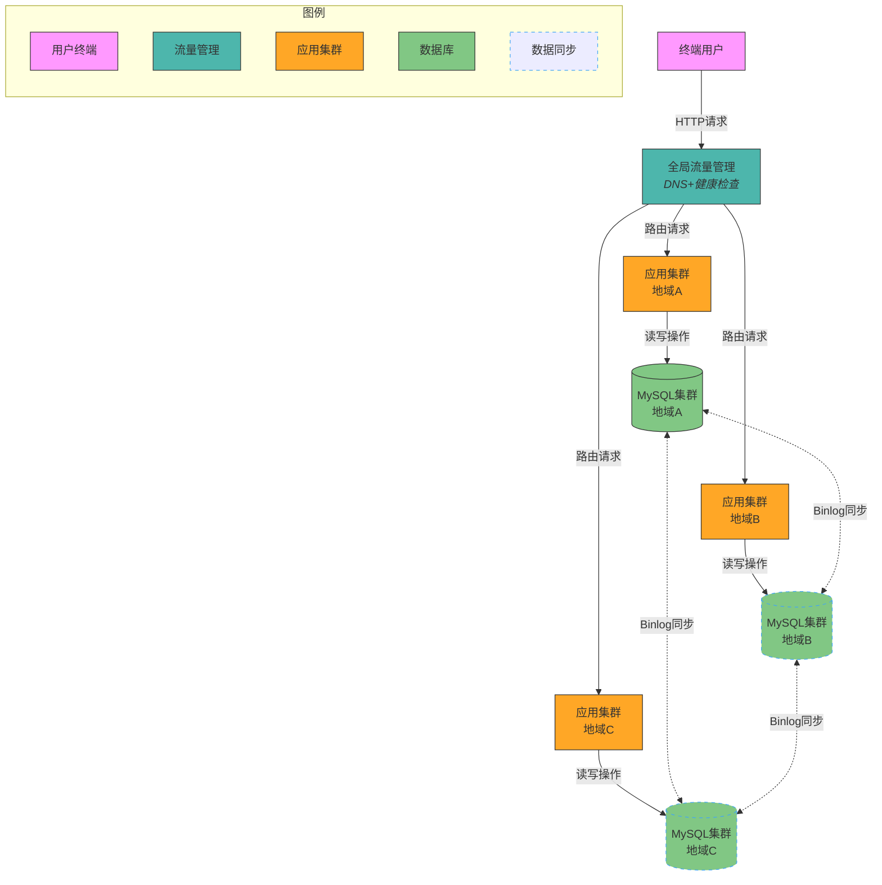

# 异地多活架构技术方案

## 1. 核心概念
异地多活架构是指在多个地理位置部署应用系统，每个系统都能独立处理业务请求，并通过数据同步机制保证数据一致性。其主要目标是提高系统的可用性和容灾能力。

## 2. 目标
- **高可用性**：通过多地域部署，确保在单一地域故障时，其他地域能继续提供服务。
- **容灾能力**：在灾难发生时，能快速切换到其他地域，减少业务中断时间。
- **负载均衡**：通过全局流量管理，合理分配用户请求，优化系统性能。

## 3. 挑战
- **数据一致性**：多地域数据同步的延迟和冲突问题。
- **网络延迟**：跨地域通信的延迟对系统性能的影响。
- **成本控制**：多地域部署带来的硬件和运维成本增加。

## 4. 关键技术组件

### 4.1 全局流量管理（GTM）
GTM负责将用户请求路由到最优的地域节点，通常基于用户地理位置、网络状况和系统负载进行决策。

### 4.2 数据同步机制
- **实时同步**：通过消息队列或数据库复制技术，实现数据的实时同步。
- **异步同步**：在数据一致性要求不高的场景下，采用异步同步以减少网络延迟影响。
- **退步方案（当实时同步不可行时）**：
  - 消息队列：通过异步消息队列（如Kafka、RabbitMQ）实现数据变更的异步同步，降低网络延迟影响，但需接受一定的数据延迟。
  - 二次读取：在本地数据未同步时，通过二次读取操作访问源地域数据，确保数据一致性。
  - 回源读取：当本地数据未及时同步时，读取操作回源到主地域获取最新数据（适用于读多写少场景）。
  - 数据重新分配：通过动态调整数据分片策略，将热点数据重新分配到多个地域，减少跨地域同步压力
  - **新增：流量降级策略**：当同步延迟超过阈值时，自动将非核心业务流量切换到单地域处理

### 4.2.1 核心技巧：绝大多数用户的异地多活支持
在实际工程中，完全保证所有用户的实时数据一致性存在以下限制：
- **网络延迟不可控**：跨地域（尤其是跨国）网络存在波动风险，可能导致同步失败
- **成本约束**：全量实时同步需要专线网络和高性能数据库集群，成本高昂
- **业务特性限制**：部分业务场景（如社交互动）可容忍一定时间的数据不同步

因此采用"绝大多数用户优先"策略：
1. **地理分区隔离**：将用户按地域划分主服务区，同一区域用户保证强一致性
2. **热点数据优先同步**：对高频访问数据设置优先级同步策略
3. **渐进式同步机制**：在非高峰时段进行全量数据校验和补充同步

### 4.3 负载均衡策略
- **轮询**：将请求均匀分配到各个地域节点。
- **加权轮询**：根据地域节点的负载情况，动态调整请求分配权重。
- **最少连接**：将请求分配到当前连接数最少的节点。

## 5. 数据一致性保障
- **分布式事务**：通过两阶段提交（2PC）或三阶段提交（3PC）保证跨地域事务的一致性。
- **最终一致性**：在数据一致性要求不高的场景下，采用最终一致性模型，通过异步同步实现数据一致性。

## 6. 流量调度
- **智能DNS**：根据用户地理位置和网络状况，动态解析到最优地域的IP地址。
- **HTTP重定向**：通过HTTP 302重定向，将用户请求引导到最优地域。

## 7. 故障切换和恢复机制
- **自动切换**：在检测到地域故障时，自动将流量切换到其他地域。
- **手动切换**：在自动切换无法满足需求时，通过手动操作进行切换。
- **数据恢复**：在故障恢复后，通过数据同步机制恢复数据一致性。

## 8. 不同业务场景的承载能力

### 8.1 同城跨机房多活
- **适用场景**：对数据一致性要求高、网络延迟敏感的业务，如金融交易系统。
- **核心考量**：数据同步延迟、网络带宽、机房距离。

### 8.2 跨城多活
- **适用场景**：对数据一致性要求较高、但能容忍一定延迟的业务，如电商系统。
- **核心考量**：数据同步机制、网络延迟、成本控制。

### 8.3 跨国异地多活
- **适用场景**：对数据一致性要求较低、能容忍较高延迟的业务，如内容分发系统。
- **核心考量**：数据同步策略、网络延迟、法律法规。

## 9. 常见误区
- **误区1：所有数据都需要实时同步**  
  不是所有业务数据都需要实时同步。对于一致性要求高的核心数据（如交易数据），可采用强一致性方案；而对于非核心数据（如用户偏好），可采用最终一致性或异步同步策略，以降低同步复杂度和网络延迟影响。

- **误区2：所有业务都必须进行多活设计**  
  并非所有业务都适合多活架构。需根据业务特性（如数据一致性要求、实时性需求、成本预算）评估是否采用多活。例如，低频访问或强本地化业务可能更适合单地域部署。

## 10. 实施步骤与关键措施
### 10.1 业务分级
#### 考量因素：
- 业务类型（金融交易/内容服务/社交互动）
- 容灾等级要求（RPO/RTO指标）
- 用户流量分布特征
- 数据一致性敏感度
- 业务依赖关系（上下游服务调用链）
- 合规性要求（数据存储和传输的法规限制）

#### 技术实施方案：
1. **分级标准制定**  
   - 核心业务：金融交易、支付系统（强一致性要求）
   - 普通业务：用户资料、内容展示（最终一致性）
   - 非核心业务：日志服务、缓存数据（可容忍丢失）

2. **动态路由权重管理**
   - 基于地域负载和网络状况的动态权重调整
   - 实时监控和自动故障切换机制
   - 灰度发布和流量控制策略

3. **分级评审机制**
   - 定期业务分级评审会议
   - 分级变更审批流程
   - 分级影响评估报告

### 10.2 数据分类
#### 数据分类模型：
- 核心数据：交易记录、账户信息（强一致性）
- 重要数据：用户资料、订单信息（最终一致性）
- 普通数据：日志、统计信息（可容忍丢失）

#### 存储分层策略：
- 热数据：内存缓存+本地SSD存储
- 温数据：分布式文件系统
- 冷数据：对象存储+归档存储

#### 数据管理措施：
- 数据生命周期管理
- 数据加密和访问控制
- 数据备份和恢复策略

### 10.3 数据同步
#### 同步策略设计：
- 实时同步：核心业务数据，采用分布式事务
- 异步同步：重要业务数据，采用消息队列
- 批量同步：普通业务数据，采用定时任务

#### 冲突解决机制：
- 时间戳优先策略
- 业务规则优先策略
- 人工干预机制

#### 同步监控措施：
- 同步延迟监控
- 数据一致性校验
- 异常告警和自动修复

### 10.4 异常处理
#### 多级熔断机制：
- 服务级别熔断
- 数据同步熔断
- 全局流量熔断

#### 数据修复方案：
- 自动数据修复
- 人工数据修复
- 数据校验和补偿

#### 应急响应预案：
- 故障切换流程
- 数据恢复流程
- 事后分析和改进

## 9. 架构图示

