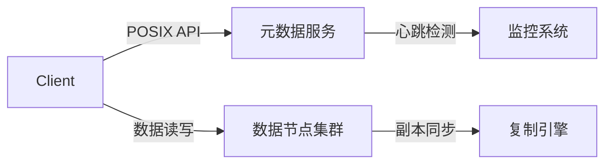

```markdown
# 分布式文件系统：核心原理与主流开源方案全景解析


## 一、核心架构原理

### 1.1 基本定义
分布式文件系统（Distributed File System，DFS）通过计算机网络将文件存储资源整合为统一的逻辑视图，主要特征包括：
- **透明访问**：用户无需感知物理存储位置
- **弹性扩展**：支持PB级数据存储和动态扩容
- **高可用性**：数据多副本/纠删码存储
- **一致性模型**：支持强一致性/最终一致性

### 1.2 核心组件


## 二、主流开源方案对比

### 2.1 HDFS（Hadoop Distributed File System）
**架构特征**：
- Master/Slave结构（NameNode + DataNode）
- 64MB/128MB大块存储设计
- 机架感知副本放置策略

**适用场景**：
- 大数据分析（MapReduce/Spark）
- 海量冷数据存储
- 顺序读写为主的工作负载

**部署示例**：
```bash
# 配置hdfs-site.xml
<property>
  <name>dfs.replication</name>
  <value>3</value>
</property>

# 启动集群
hdfs namenode -format
start-dfs.sh
```

**优劣势**：
- ✅ 成熟稳定，生态完善
- ✅ 适合批处理场景
- ❌ 单点NameNode风险
- ❌ 不支持文件随机修改

---

### 2.2 Ceph
**核心原理**：
- CRUSH算法实现数据分布
- RADOS对象存储基础层
- 支持三种接口：对象/块/文件

**典型部署**：
```yaml
# ceph.conf配置示例
[osd]
osd journal size = 10240

[mon]
mon cluster log file = /var/log/ceph/ceph-mon.log

# 部署命令
ceph-deploy new node1 node2 node3
ceph-deploy mon create-initial
```

**优劣势分析**：
- ✅ 统一存储架构
- ✅ 自动故障恢复
- ❌ 运维复杂度高
- ❌ 小文件性能瓶颈

---

### 2.3 GlusterFS
**架构创新**：
- 无中心元数据服务
- 弹性哈希算法定位数据
- 支持多种卷类型（Distribute/Replicate/Stripe）

**部署流程**：
```bash
# 节点准备
gluster peer probe node2

# 创建分布式复制卷
gluster volume create gv0 replica 3 node1:/brick node2:/brick node3:/brick
gluster volume start gv0
```

**适用场景**：
- 云原生存储
- 虚拟化平台存储
- 内容分发网络

---

### 2.4 MinIO
**核心特性**：
- S3兼容对象存储
- 纠删码数据保护（EC:4+2）
- 强一致性保证

**快速启动**：
```bash
# 单节点部署
minio server /data

# 分布式部署
export MINIO_ROOT_USER=admin
export MINIO_ROOT_PASSWORD=password
minio server http://node{1...4}/data
```

**优劣势**：
- ✅ 轻量易部署
- ✅ 高性能对象存储
- ❌ 缺乏文件系统语义
- ❌ 元数据扩展性限制

---

## 三、方案选型矩阵

| 维度          | HDFS       | Ceph       | GlusterFS  | MinIO      |
|---------------|------------|------------|------------|------------|
| **接口类型**  | 文件       | 对象/块/文件 | 文件       | 对象       |
| **一致性模型**| 强一致     | 可配置      | 最终一致   | 强一致     |
| **扩展上限**  | 百节点级   | 千节点级    | 百节点级   | 千节点级   |
| **典型延迟**  | 50-100ms   | 10-30ms    | 20-50ms    | 5-10ms     |
| **适用场景**  | 大数据分析 | 云平台存储  | 文件共享   | 对象存储   |

## 四、部署最佳实践

### 4.1 硬件规划建议
- 存储节点：HDD/SDD混合配置
- 网络架构：10Gbps以上带宽，RDMA优化
- 内存配比：每TB数据分配1GB内存

### 4.2 监控指标清单
```yaml
critical_metrics:
  - 节点存活状态
  - 存储空间利用率
  - IOPS/吞吐量
  - 请求延迟(P99)
  - 副本同步延迟
```

### 4.3 故障排查指南
1. 检查网络分区：`ping/traceroute`
2. 验证副本完整性：`rados scrub` (Ceph)
3. 分析慢请求：`iostat -x 1`
4. 检查元数据健康：`hdfs fsck /` (HDFS)

## 五、未来演进方向
1. 存储计算分离架构
2. 基于NVMe-oF的加速方案
3. 智能分层存储（热/温/冷数据自动迁移）
4. 与Kubernetes深度集成（CSI标准）


