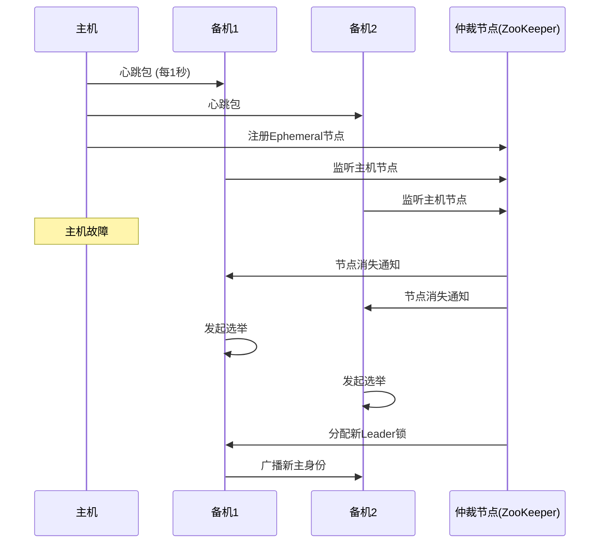
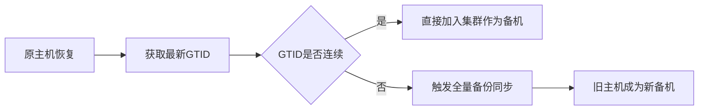
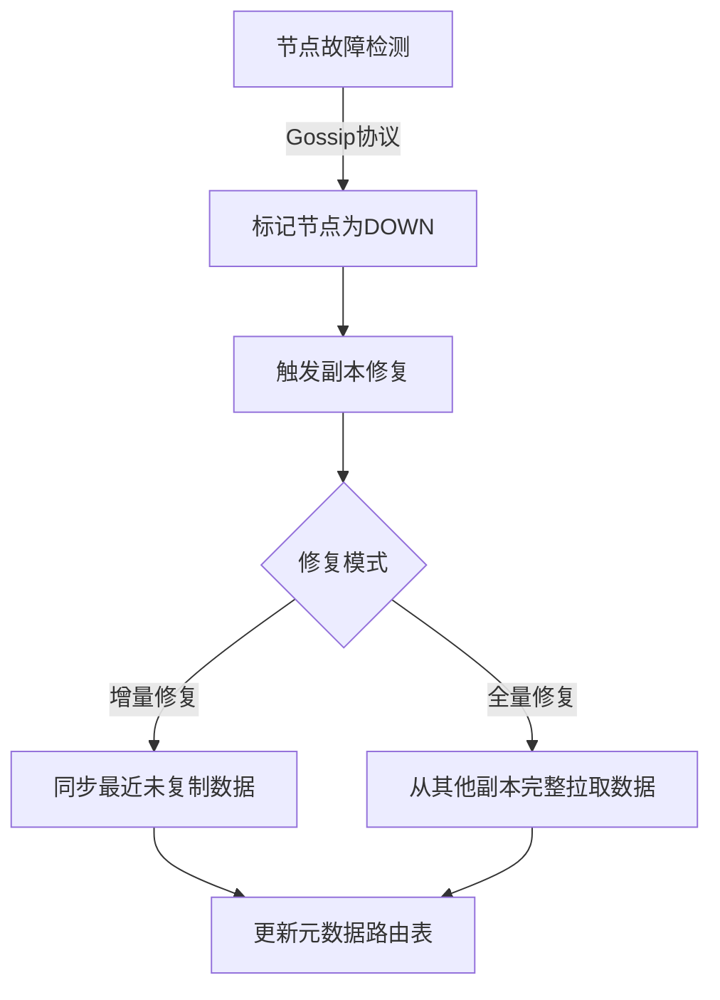
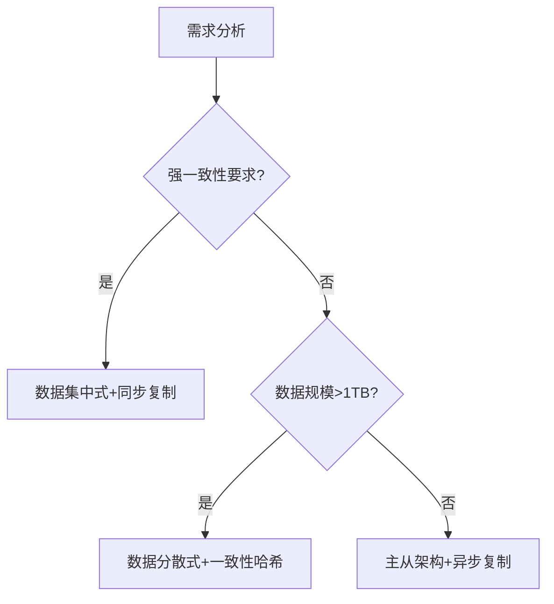

# 高可用存储架构深度解析（增强版）  
——数据集中式与分散式架构的终极挑战与解决方案  

---

## 一、数据集中式架构的复杂性剖析  

### 1. **多备机状态感知与脑裂难题**  
#### 核心问题：如何让多个备机对主机状态达成一致认知？  
**典型架构与流程**：  

**关键技术与策略**：  
- **心跳检测**：  
  - **分层心跳**：主机→备机直连心跳 + 第三方仲裁节点检测（如ZooKeeper临时节点）  
  - **超时策略**：连续3次心跳丢失判定为故障（避免网络抖动误判）  
- **选举算法**：  
  - **基于优先级**：预先设定备机优先级（如ID顺序）  
  - **分布式共识**：Raft协议（如ETCD）、Paxos（如Google Chubby）  

**经典案例**：  
- **MySQL MGR**：基于Paxos变种实现多节点自动选主  
- **Redis Sentinel**：通过Raft协议实现哨兵节点共识  

---

### 2. **主机切换后的数据同步与一致性**  
#### 场景：原主机恢复后，新旧数据如何合并？  
**数据同步策略**：  

**关键技术**：  
- **GTID（全局事务标识）**：  
  - 每个事务绑定唯一ID，用于断点续传（如MySQL GTID）  
- **逻辑日志 vs 物理日志**：  
  - **逻辑日志（ROW格式）**：记录行级变更，兼容异构数据同步  
  - **物理日志（Binlog）**：记录磁盘页变更，效率高但依赖存储引擎  

**冲突解决示例**：  
- **时间戳优先**：以最新写入时间为准  
- **业务规则合并**：如账户余额取最大值，库存取最小值  

---

## 二、数据分散式架构的核心挑战  

### 1. **数据分布均匀性：算法决定一切**  
#### 常见数据分配算法对比  
| **算法**          | **原理**                                | **优点**                  | **缺点**                  | **代表产品**       |  
|-------------------|----------------------------------------|--------------------------|--------------------------|-------------------|  
| **一致性哈希**     | 虚拟节点环，扩缩容仅影响相邻节点          | 扩缩容影响小              | 热点问题需手动干预         | DynamoDB, Cassandra |  
| **范围分区**       | 按主键范围划分（如user_id 1-1000）       | 范围查询高效              | 易产生数据倾斜             | HBase, TiDB       |  
| **哈希取模**       | 对Key哈希后取模分配节点                   | 简单易实现                | 扩缩容需全量数据迁移        | Redis Cluster     |  

**Cassandra虚拟节点示例**：  
```python  
# 计算Token分布  
tokens = [  
    (i * (2**127) // 3) for i in range(num_vnodes)  
]  
# 数据路由  
def get_node(key):  
    hash = murmur3(key)  
    token = find_smallest_token_greater_than(hash)  
    return token_to_node[token]  
```  

---

### 2. **容错性设计：多副本与故障恢复**  
#### 多副本策略的权衡  
| **策略**          | **写入一致性**          | **读一致性**            | **容错能力**      | **案例**          |  
|-------------------|------------------------|-------------------------|------------------|-------------------|  
| **强同步（ALL）**  | 所有副本确认后返回成功    | 线性一致                 | N副本容忍N-1故障  | MongoDB副本集     |  
| **法定数（QUORUM）** | 多数副本确认即成功        | 最终一致                 | N副本容忍(N-1)/2故障 | Cassandra         |  
| **异步复制**       | 主节点确认即返回          | 可能读取旧数据           | 仅主节点故障可恢复 | Redis主从         |  

**故障恢复流程**：  


**经典设计**：  
- **HDFS**：通过Block副本（默认3副本）抵御磁盘故障  
- **Ceph**：CRUSH算法动态计算副本位置，避免机架级故障  

---

### 3. **可伸缩性：动态扩缩容与数据再平衡**  
**扩容难题**：如何在不中断服务的情况下添加新节点？  
**解决方案**：  
- **虚拟节点（vNode）技术**：  
  ```python  
  # Cassandra扩容示例  
  old_tokens = [100, 300, 500]  
  new_tokens = sorted(old_tokens + [200, 400])  
  # 仅迁移200-300、400-500区间的数据  
  ```  
- **分片迁移协议**：  
  - **在线双写**：新旧节点同时接收数据  
  - **增量同步**：根据Checkpoint追日志  
  - **原子切换**：通过ZooKeeper原子更新路由表  

**自动再平衡示例（Elasticsearch）**：  
```json  
PUT _cluster/settings  
{  
  "transient": {  
    "cluster.routing.rebalance.enable": "all"  
  }  
}  
```  

---

## 三、混合架构与未来趋势  

### 1. **全球化部署：分区规则与合规性**  
**典型分区策略**：  
| **层级**        | **规则**                              | **技术实现**                      |  
|-----------------|---------------------------------------|----------------------------------|  
| **洲际级**       | 数据存储在用户所在大洲                  | AWS Region, GCP Multi-Region    |  
| **国家级**       | 遵守数据主权法（如GDPR）                | MongoDB Zone Sharding           |  
| **城市级**       | 低延迟访问（如CDN边缘节点）              | Akamai, Cloudflare Workers      |  

**Google Spanner 真时分区示例**：  
```sql  
-- 创建分表规则  
CREATE TABLE Users (  
    UserId INT64,  
    Country STRING  
) PRIMARY KEY (UserId),  
  INTERLEAVE IN PARENT Countries ON DELETE CASCADE,  
  PARTITION BY LIST(Country) (  
    PARTITION EU VALUES IN ('DE', 'FR', 'IT'),  
    PARTITION NA VALUES IN ('US', 'CA')  
  );  
```  

### 2. **AI驱动的自适应架构**  
- **智能数据分布**：  
  - 基于历史访问模式预测热点数据，动态调整副本位置  
- **故障自愈**：  
  - 使用强化学习模型自动选择最优恢复路径  
- **弹性伸缩**：  
  - 实时监控QPS/CPU，自动触发K8s扩缩容  

---

## 四、总结：没有银弹，只有权衡  

### 1. **架构选型决策树**  


### 2. **经典产品架构映射**  
| **产品**        | **架构类型**         | **核心技术**                      |  
|-----------------|---------------------|----------------------------------|  
| **Oracle RAC**  | 数据集中式           | 共享存储+Cache Fusion            |  
| **Cassandra**   | 数据分散式           | 一致性哈希+Gossip协议             |  
| **MongoDB分片** | 混合架构             | 范围分片+配置服务器               |  
| **TiDB**        | 分散式NewSQL         | Raft协议+PD调度器                 |  

---

通过本文的深度解析，读者可全面掌握数据集中式与分散式架构的核心挑战与解决方案，在真实场景中设计出兼具高可用、高扩展与高性价比的存储系统。