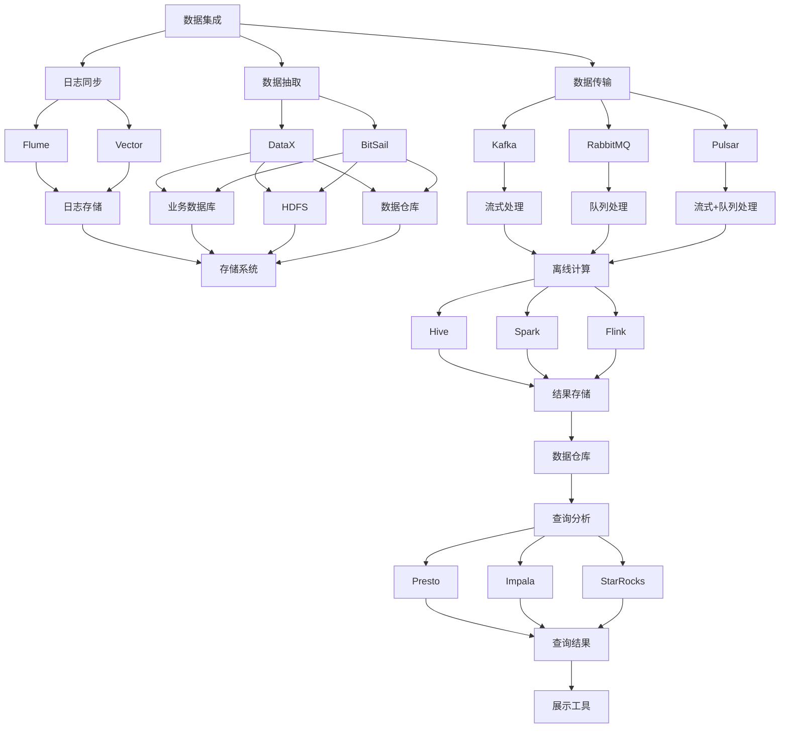

# 大数据架构平台搭建指南

---

## 一、大数据平台架构概述

大数据平台通常由以下几个核心模块组成：

1. **数据集成**：负责数据的采集、同步和传输。
2. **存储与计算**：用于数据的存储和处理。
3. **分布式调度**：管理任务的执行和资源的分配。
4. **查询分析**：提供高效的数据查询和分析能力。

### 📌 大数据平台架构图

---

## 二、数据集成

### 2.1 日志同步

- **Flume**：适用于云原生场景，支持日志的实时采集。
- **Vector**：新兴的高效日志同步工具，支持多种数据格式。

### 📌 日志同步流程图

### 2.2 数据抽取工具

- **DataX**：支持多种数据库和存储系统。
- **BitSail**：基于 Flink 的数据同步工具，支持离线、实时、全量、增量等场景。

### 📌 数据抽取流程图

### 2.3 数据传输队列

- **Kafka**：流式传输，适合实时数据处理。
- **RabbitMQ**：队列传输，适合任务调度。
- **Pulsar**：支持流式和队列传输，架构更先进。

### 📌 数据传输流程图

---

## 三、数据处理：存储与计算

### 3.1 数据存储：HDFS

- **特点**：横向扩展、高容错性。
- **优化方向**：读写分离、读写优化、架构改进。

### 📌 HDFS 优化流程图

### 3.2 数据计算

#### （1）离线计算引擎

- **MapReduce**：Hadoop 的基础计算框架。
- **Hive**：基于 MapReduce 的封装，适合离线分析。
- **Spark**：高效、稳定，支持内存计算，适合近实时处理。

### 📌 离线计算流程图

#### （2）实时计算引擎

- **Storm**：早期流计算框架，使用较少。
- **Spark Streaming**：基于 Spark 的流处理框架，使用率较低。
- **Flink**：支持流计算和批计算，是当前主流选择。

### 📌 实时计算流程图

---

## 四、数据调度

### 4.1 常用任务调度系统

- **Crontab**：简单定时任务调度。
- **Apache Airflow**：国外广泛使用，适合复杂任务调度。
- **DolphinScheduler**：中文调度系统，适合大数据场景。

### 📌 任务调度流程图

### 4.2 资源调度系统

- **Yarn**：Hadoop 的资源管理器，上层组件依赖它。
- **Azkaban**：资源调度的小众工具，使用较少。

### 📌 资源调度流程图

---

## 五、大数据查询

### 5.1 大数据查询引擎

- **Presto**：易用性强，但性能一般。
- **Impala**：适合 Hadoop 生态，性能接近 Presto。
- **StarRocks**：性能最强，但资源消耗大。

### 📌 查询引擎流程图

### 5.2 大数据查询优化工具

- **Alluxio**：支持多存储系统缓存，通用性强。
- **JuiceFS**：提供元数据与数据分离的存储，适合云存储。
- **JindoFS**：阿里云专属，支持内存级缓存。

### 📌 查询优化流程图

---

## 六、总结

构建一个高效的大数据平台需要从数据集成、存储与计算、调度、查询等多个方面综合考虑。选择合适的工具和架构，结合实际业务需求，才能打造一个稳定、高效、可扩展的大数据平台。

---

## 七、附录：推荐工具对比表

| 工具 | 类型 | 优点 | 缺点 | 适用场景 |
|------|------|------|------|----------|
| Flume | 日志同步 | 云原生友好 | 易用性差 | 日志采集 |
| Vector | 日志同步 | 高效 | 新兴 | 日志采集 |
| DataX | 数据抽取 | 支持多种数据源 | 速度较慢 | 离线同步 |
| BitSail | 数据抽取 | 基于 Flink | 实时场景支持好 | 实时同步 |
| Kafka | 数据传输 | 流式传输 | 易用性差 | 实时数据 |
| Pulsar | 数据传输 | 架构先进 | 新兴 | 实时数据 |
| HDFS | 存储 | 横向扩展 | NameNode 单点 | 大数据存储 |
| Hive | 离线计算 | 稳定可靠 | 速度慢 | 离线分析 |
| Spark | 离线计算 | 高效 | 内存消耗大 | 近实时处理 |
| Flink | 实时计算 | 流批一体 | 离线处理弱 | 实时处理 |
