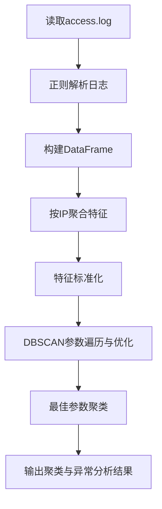
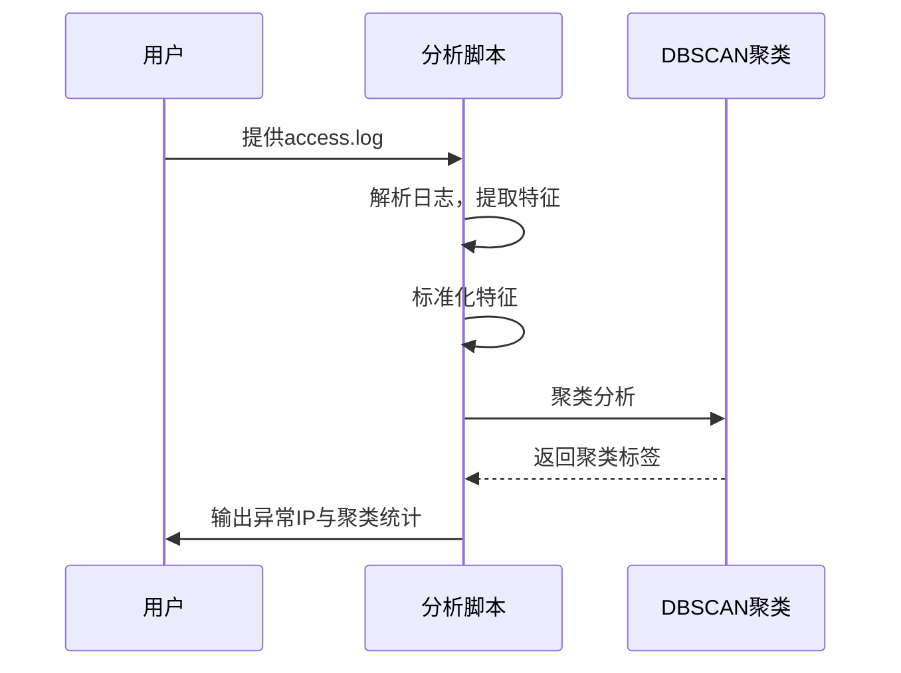

# Web访问日志异常检测技术方案

## 一、背景与目标

在Web安全与运维场景中，自动检测异常访问IP（如扫描、攻击、异常爬虫等）是重要需求。传统阈值法难以适应多变的访问模式，聚类算法（如DBSCAN）可基于多维特征自动识别“异常”行为。

本方案基于DBSCAN聚类算法，对Nginx访问日志进行特征工程、聚类分析，自动检测出异常IP。

---

## 二、DBSCAN原理简介

- **DBSCAN**（Density-Based Spatial Clustering of Applications with Noise）是一种基于密度的聚类算法。
- **核心思想**：在特征空间中，密度高的点归为一类，密度低的点（即“孤立”点）被视为噪声（异常）。
- **主要参数**：
  - `eps`：邻域半径，决定“密度”范围。
  - `min_samples`：邻域内最小点数，决定“核心点”。
- **优点**：无需预设簇数，能发现任意形状的簇，能自动识别异常点。

---

## 三、数据处理与特征工程

### 1. 日志样例

```
192.168.1.10 - - [19/Jun/2025:10:01:23 +0800] "GET /index.html HTTP/1.1" 200 1234
10.0.0.5 - - [19/Jun/2025:10:01:41 +0800] "GET /wp-admin HTTP/1.1" 404 210
...
```

### 2. 主要特征

- **request_count**：每个IP的请求总数
- **error_rate**：4xx/5xx错误率
- **avg_size**：平均响应体积
- **unique_urls**：访问的唯一URL数量

### 3. 处理流程

1. **正则解析日志**，提取IP、时间、方法、URL、状态码、响应大小。
2. **按IP聚合**，统计上述特征。
3. **特征标准化**，消除量纲影响。
4. **DBSCAN聚类**，自动识别异常IP。

---

## 四、代码实现详解

### 1. 日志解析与特征提取

```python
pattern = r'(\d+\.\d+\.\d+\.\d+) - - \[(.*?)\] "(\w+) ([^ ]+) [^"]+" (\d+) (\d+)'
logs = []
with open('access.log') as f:
    for line in f:
        m = re.match(pattern, line)
        if not m:
            continue
        ip, timestamp, method, url, status, size = m.groups()
        logs.append([ip, timestamp, method, url, status, size])
df = pd.DataFrame(logs, columns=['ip', 'timestamp', 'method', 'url', 'status', 'size'])
```
- 用正则表达式精确提取日志字段，避免split分割带来的错位。

### 2. 特征工程

```python
ip_stats = df.groupby('ip').agg(
    request_count=('ip', 'count'),
    error_rate=('status', lambda s: (s.str.startswith('4') | s.str.startswith('5')).mean()),
    avg_size=('size', lambda x: pd.to_numeric(x, errors='coerce').mean()),
    unique_urls=('url', 'nunique')
).reset_index()
```
- 按IP聚合，统计4个关键特征。

### 3. 特征标准化

```python
scaler = StandardScaler()
features = scaler.fit_transform(ip_stats[['request_count', 'error_rate', 'avg_size', 'unique_urls']])
```
- 标准化后，特征均值为0，方差为1，便于聚类。

### 4. DBSCAN聚类与参数自动优化

```python
from sklearn.metrics import silhouette_score
best_score = -1
best_params = (0.5, 5)
for eps in [0.1, 0.3, 0.5, 0.7, 1.0]:
    for min_samples in [3, 5, 10, 20]:
        dbscan = DBSCAN(eps=eps, min_samples=min_samples)
        labels = dbscan.fit_predict(features)
        if len(set(labels)) > 1 and (labels != -1).sum() > 0:
            try:
                score = silhouette_score(features, labels)
                if score > best_score:
                    best_score = score
                    best_params = (eps, min_samples)
            except Exception:
                continue
```
- 自动遍历参数组合，选取轮廓系数（silhouette_score）最高的参数。

### 5. 聚类与异常输出

```python
dbscan = DBSCAN(eps=best_params[0], min_samples=best_params[1])
labels = dbscan.fit_predict(features)
ip_stats['cluster'] = labels
ip_stats['is_anomaly'] = (labels == -1)
print(ip_stats.groupby('cluster').agg(
    ip_count=('ip', 'count'),
    avg_request_count=('request_count', 'mean'),
    avg_error_rate=('error_rate', 'mean'),
    avg_size=('avg_size', 'mean'),
    avg_unique_urls=('unique_urls', 'mean')
))
print(ip_stats[ip_stats['is_anomaly']][['ip', 'request_count', 'error_rate', 'avg_size', 'unique_urls']])
```
- `cluster=-1` 的IP即为异常点。

---

## 五、运行结果解读

- **最佳DBSCAN参数**：eps=1.0, min_samples=3, silhouette_score=0.422
- **异常IP**（如10.0.0.5、10.1.2.3、203.0.113.8等）被识别为噪声点，通常表现为高错误率、请求数异常等。
- **正常IP**聚为一簇，特征均值表现正常。

---

## 六、流程图与时序图（Mermaid）

### 1. 数据处理与聚类流程



### 2. 时序图：单条日志到异常检测



---

## 七、总结与扩展

- 本方案可自动适应不同访问模式，无需人工设阈值。
- 可扩展特征（如UA、Referer、时序特征等）提升检测能力。
- 可结合可视化、报警等模块，形成完整的安全监控体系。

---

如需进一步扩展（如特征可视化、自动报警、与业务系统联动等），可在此基础上继续开发。