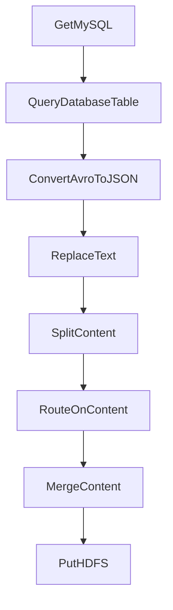

在企业数据集成项目中，Apache NiFi 被广泛用于整合来自多个系统的数据。数据流包括从 MySQL、HDFS、Kafka 等数据源采集数据，进行清洗、转换和路由，最终存储到目标系统中。NiFi 的处理器如 `MergeContent` 和 `SplitContent` 用于处理复杂的数据流逻辑。以下是对该复杂实施方案的细化技术方案与实施方案，结合代码和流程图进行说明。

### 一、系统架构概述

NiFi 是一个基于 Java 的开源数据流处理工具，支持自动化数据流的采集、传输、处理和分发。其核心是 **FlowFile**，它由 **内容**（Content）和 **属性**（Attributes）组成。NiFi 提供了丰富的处理器（Processors）来实现数据的清洗、转换、路由和存储等功能。

#### 1.1 数据源
- **MySQL**：用于查询结构化数据。
- **HDFS**：用于存储大规模非结构化数据。
- **Kafka**：用于实时事件流的采集和传输。

#### 1.2 数据处理
- **清洗**：去除无效数据、重复数据。
- **转换**：格式转换（如 JSON、Avro、CSV）。
- **路由**：根据内容或属性将数据分发到不同的处理路径。
- **合并**：将多个数据流合并为一个，以减少 I/O 操作。

#### 1.3 数据存储
- **HDFS**：用于存储处理后的数据。
- **其他目标系统**：如数据库、消息队列等。

### 二、技术方案细化

#### 2.1 数据采集

##### 2.1.1 从 MySQL 采集数据
使用 `QueryDatabaseTable` 处理器从 MySQL 数据库中读取数据，并将其转换为 Avro 格式。  
```xml
<fragment>
  <component>
    <name>QueryDatabaseTable</name>
    <description>从 MySQL 数据库中读取数据并转换为 Avro 格式。</description>
    <properties>
      <property name="sql">SELECT * FROM sales_data;</property>
      <property name="connectionPool">DBCPConnectionPool</property>
    </properties>
  </component>
</fragment>
```


##### 2.1.2 从 Kafka 采集数据
使用 `ConsumeKafka` 处理器从 Kafka 主题中消费消息。
```xml
<fragment>
  <component>
    <name>ConsumeKafka</name>
    <description>从 Kafka 主题中消费消息。</description>
    <properties>
      <property name="topic">sales_events</property>
      <property name="bootstrapServers">kafka-broker:9092</property>
    </properties>
  </component>
</fragment>
```


#### 2.2 数据清洗与转换

##### 2.2.1 数据清洗
使用 `ReplaceText` 处理器添加时间戳，用于数据去重和排序。
```xml
<fragment>
  <component>
    <name>ReplaceText</name>
    <description>向 FlowFile 添加时间戳。</description>
    <properties>
      <property name="content">timestamp: ${timestamp}</property>
    </properties>
  </component>
</fragment>
```


##### 2.2.2 格式转换
使用 `ConvertAvroToJSON` 处理器将 Avro 格式转换为 JSON 格式。
```xml
<fragment>
  <component>
    <name>ConvertAvroToJSON</name>
    <description>将 Avro 格式转换为 JSON 格式。</description>
  </component>
</fragment>
```


#### 2.3 数据合并

##### 2.3.1 使用 `MergeContent` 合并数据流
`MergeContent` 处理器用于将多个 FlowFile 合并为一个，以减少 I/O 操作。  
```xml
<fragment>
  <component>
    <name>MergeContent</name>
    <description>将多个 FlowFile 合并为一个。</description>
    <properties>
      <property name="mergeStrategy">Merge</property>
      <property name="archiveFormat">ZIP</property>
    </properties>
  </component>
</fragment>
```


##### 2.3.2 合并策略
- **Merge**：将多个 FlowFile 合并为一个。
- **Defragment**：重新整理碎片，恢复原始顺序。
- **Archive**：将多个 FlowFile 打包为 ZIP 或 TAR 文件。

#### 2.4 数据存储

##### 2.4.1 存储到 HDFS
使用 `PutHDFS` 处理器将合并后的数据写入 HDFS。
```xml
<fragment>
  <component>
    <name>PutHDFS</name>
    <description>将数据写入 HDFS。</description>
    <properties>
      <property name="path">/user/hadoop/sales_data</property>
    </properties>
  </component>
</fragment>
```


### 三、流程图与时序说明

#### 3.1 数据流流程图




#### 3.2 时序说明

1. **数据采集**：从 MySQL 或 Kafka 采集数据。
2. **数据清洗**：使用 `ReplaceText` 添加时间戳。
3. **数据转换**：将 Avro 格式转换为 JSON 格式。
4. **数据分割**：使用 `SplitContent` 将数据分割为多个 FlowFile。
5. **数据路由**：根据内容或属性将数据分发到不同的处理路径。
6. **数据合并**：使用 `MergeContent` 将多个 FlowFile 合并为一个。
7. **数据存储**：将合并后的数据写入 HDFS。

### 四、性能优化与注意事项

#### 4.1 队列大小配置
在 NiFi 中，队列大小对性能有重要影响。如果队列过小，可能导致数据丢失；如果队列过大，可能导致内存不足。  
```xml
<fragment>
  <component>
    <name>ControlRate</name>
    <description>控制数据流的速率。</description>
    <properties>
      <property name="maxConcurrentTasks">10</property>
    </properties>
  </component>
</fragment>
```


#### 4.2 内存管理
在合并大量 FlowFile 时，需要注意内存管理。如果合并的 FlowFile 数量过多，可能导致 NiFi 崩溃。  
```xml
<fragment>
  <component>
    <name>MergeContent</name>
    <description>合并 FlowFile 时注意内存限制。</description>
    <properties>
      <property name="maxMemory">1024MB</property>
    </properties>
  </component>
</fragment>
```


#### 4.3 日志与监控
NiFi 提供了丰富的日志和监控功能，可以用于跟踪数据流的执行情况。  
```xml
<fragment>
  <component>
    <name>ProvenanceRepository</name>
    <description>记录数据流的执行日志。</description>
  </component>
</fragment>
```


### 五、总结

Apache NiFi 提供了一个强大的数据流处理框架，支持从多个数据源采集数据，进行清洗、转换、路由和存储。`MergeContent` 和 `SplitContent` 是处理复杂数据流逻辑的关键处理器。通过合理的配置和优化，可以实现高效、可靠的数据集成方案。


