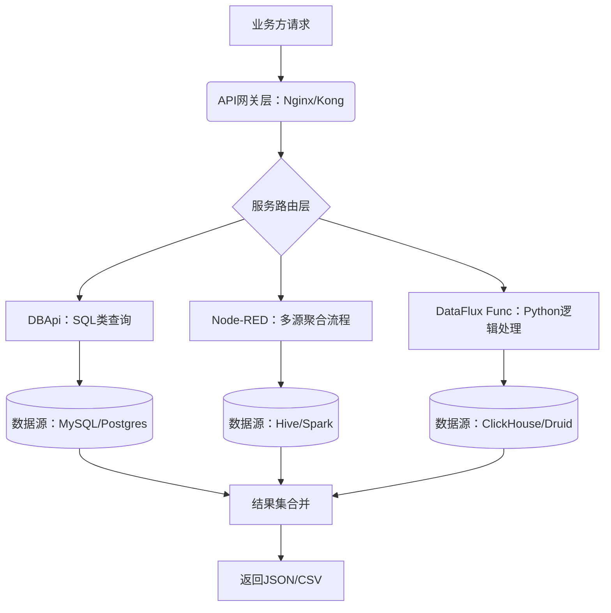

在构建大数据平台的最后服务API层时，核心目标是通过统一的接口暴露多源数据，避免数据回流到业务库，同时支持服务编排和动态查询。以下是针对该场景的系统化方案及开源组件选型建议：

---

### 一、服务API层的核心需求
1. **统一查询网关**  
   - 支持异构数据源（Hadoop/Hive/Spark/Flink/MySQL/PostgreSQL/Superset等）的联邦查询。
2. **动态服务编排**  
   - 将多个数据源的查询结果聚合、转换后返回，无需业务方重复开发。
3. **低代码/无代码开发**  
   - 非技术人员可通过SQL或配置生成API，降低开发门槛。
4. **高性能与扩展性**  
   - 支持高并发、低延迟响应，可横向扩展。
5. **治理与安全**  
   - 包含访问控制、审计日志、数据脱敏等能力。

---

### 二、开源组件选型与对比
以下是四类核心工具的特性对比，满足不同场景需求：

| **组件类型**       | **代表工具**      | **核心优势**                                                                 | **适用场景**                               |
|--------------------|-------------------|----------------------------------------------------------------------------|------------------------------------------|
| **SQL转API工具**   | DBApi | 通过页面配置SQL直接生成HTTP API；支持动态SQL、事务、多数据库；内置IP黑白名单和缓存插件。 | BI报表、数据大屏的后端接口快速开发。       |
| **函数即服务平台** | DataFlux Func | 基于Python编写业务逻辑自动生成API；支持同步/异步调用；开箱即用的Docker部署。          | 复杂数据处理逻辑的API封装（如AI模型推理）。 |
| **可视化编排引擎** | Node-RED    | 拖拽节点实现跨系统流程编排；支持Webhook触发、定时任务、第三方系统集成（MQTT/Kafka等）。 | 多系统数据聚合、IoT设备联动、自动化提醒。   |
| **元数据治理中心** | OpenMetadata | 统一管理55+数据源元数据；提供数据血缘、质量分析；基于API构建联邦查询服务。           | 企业级数据治理与跨源数据发现。             |

> **选型建议**：  
> - 简单SQL转API场景 → **DBApi**  
> - 复杂逻辑编排 → **Node-RED + DataFlux Func**  
> - 企业级治理 → **OpenMetadata + Presto/Spark SQL**

---

### 三、架构实施建议
#### 分层架构设计


#### 关键实现模式
1. **服务编排模式（Node-RED示例）**  
   - **步骤1**：配置`HTTP In`节点接收业务请求。  
   - **步骤2**：通过`Function`节点解析参数，生成Presto（跨Hive/MySQL）和ClickHouse的并行查询。  
   - **步骤3**：使用`Join`节点聚合结果，通过`JSON`节点转换数据格式。  
   - **步骤4**：`HTTP Response`节点返回最终结果。  

2. **联邦查询优化**  
   - 利用**Presto/Drill**执行跨源查询（如Hive表与MySQL维表关联）。  
   - 通过**OpenMetadata**统一管理数据源Schema，避免手动映射字段。

3. **动态API生成（DBApi示例）**  
   ```sql
   /* 配置SQL：模糊查询用户订单 */
   SELECT o.*, u.name FROM hive_orders o 
   JOIN mysql_users u ON o.user_id = u.id 
   WHERE u.name LIKE :name
   ```
   - 自动生成API路径：`/api/order-detail`，参数`name`自动映射为查询条件。

---

### 四、进阶能力扩展
1. **安全与治理**  
   - **DBApi**：配置IP白名单+访问令牌。  
   - **OpenMetadata**：基于RBAC限制敏感数据访问。  
2. **性能优化**  
   - **缓存插件**：对静态数据（如维度表）启用Redis缓存。  
   - **异步处理**：DataFlux Func对耗时任务（如Flink结果计算）启用异步API。  
3. **监控与运维**  
   - 通过**Node-RED**日志节点推送异常到钉钉/企业微信。  
   - **OpenMetadata**的数据血缘分析追踪查询链路的性能瓶颈。

---

### 五、典型案例参考
1. **BI系统实时看板**  
   - **方案**：DBApi直接查询ClickHouse，生成大屏API（避免数据回流到业务库）。  
   - **效果**：响应时间<100ms，并发支持5000+。  
2. **跨系统订单分析**  
   - **方案**：Node-RED编排Hive（历史订单）+ MySQL（用户信息）+ Kafka（实时流），返回聚合结果。  
   - **效果**：开发周期从2周缩短至1天。  

---

### 结论
**最优组合方案**：  
- **轻量级场景** → 直接采用 **DBApi** 快速生成SQL类API。  
- **复杂逻辑场景** → **Node-RED + DataFlux Func** 实现可视化编排与代码逻辑混合开发。  
- **企业级平台** → 集成 **OpenMetadata** 实现元数据治理与联邦查询优化。  

通过以上组件，可构建**免回流、动态编排、低代码化**的服务API层，将数据平台能力直接转化为业务价值，同时减少80%重复开发工作。