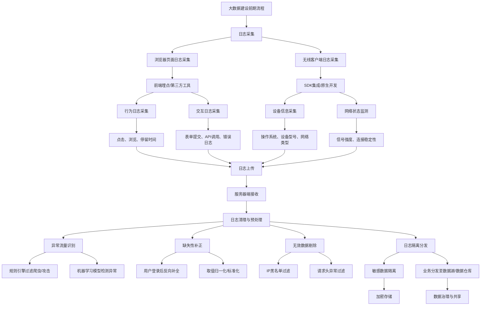

## 数据采集

### **整体流程图（Mermaid）**


---

### **详细说明**

---

#### **1. 浏览器页面日志采集**
**目标**：捕获用户在浏览器端的行为和交互数据，为业务分析和优化提供依据。  
**实现方式**：
- **前端埋点**：通过 JavaScript 动态监听用户行为（如点击、滚动、页面停留时间）。
  ```javascript
  // 示例：监听点击事件
  document.addEventListener("click", function(event) {
      sendLog({
          type: "click",
          element: event.target.tagName,
          timestamp: new Date().toISOString()
      });
  });
  ```
- **第三方工具**：使用 Google Analytics、Matomo 等工具自动采集页面访问、来源、设备信息等。
  ```html
  <!-- Google Analytics 埋点示例 -->
  <script async src="https://www.googletagmanager.com/gtag/js?id=GA_MEASUREMENT_ID"></script>
  <script>
    window.dataLayer = window.dataLayer || [];
    function gtag(){dataLayer.push(arguments);}
    gtag('js', new Date());
    gtag('config', 'GA_MEASUREMENT_ID');
  </script>
  ```

**关键日志类型**：
- **行为日志**：用户点击、页面浏览、停留时间。
- **交互日志**：表单提交、API 调用、错误日志（如 404、500 错误）。

---

#### **2. 无线客户端日志采集**
**目标**：捕获移动端用户行为、设备状态及网络环境数据。  
**实现方式**：
- **SDK 集成**：在客户端应用中集成日志 SDK（如 Firebase、友盟），自动采集以下信息：
  - **设备信息**：操作系统版本、设备型号、屏幕分辨率。
  - **网络状态**：信号强度、连接类型（Wi-Fi/4G/5G）、连接稳定性。
  - **用户行为**：功能使用频率、页面停留时间、崩溃日志。
- **原生开发**：通过代码直接封装日志逻辑（如 Android 的 `Logcat` 或 iOS 的 `os_log`）。

**特殊场景**：
- **离线日志缓存**：在网络不稳定时，本地缓存日志，待恢复后批量上传。
- **隐私保护**：对用户敏感信息（如地理位置、IMEI）进行脱敏处理。

---

#### **3. 服务器端日志清理与预处理**
**目标**：清洗原始日志，识别异常流量，并标准化数据格式。  
**核心步骤**：

##### **(1) 异常流量识别**
- **规则引擎过滤**：
  - **爬虫/攻击检测**：基于 IP 黑名单、请求频率阈值（如每秒请求数 > 1000）、User-Agent 字符串匹配。
  - **规则示例**：
    ```python
    # Python 示例：检测高频请求
    def detect_abnormal_traffic(logs):
        from collections import defaultdict
        ip_request_count = defaultdict(int)
        for log in logs:
            ip = log["ip"]
            ip_request_count[ip] += 1
        return [log for log in logs if ip_request_count[log["ip"]] > 1000]
    ```
- **机器学习模型**：
  - 使用聚类算法（如 DBSCAN）或分类模型（如 XGBoost）检测异常模式（如突发流量、非正常请求路径）。

##### **(2) 缺失性补正**
- **用户登录后反向补全**：
  - 用户登录后，通过会话 ID 回溯其未登录状态下的请求，补全用户信息（如 ID、角色）。
  - **示例**：
    ```sql
    -- SQL 示例：关联登录记录与未登录日志
    UPDATE logs
    SET user_id = (SELECT user_id FROM login_records WHERE logs.session_id = login_records.session_id)
    WHERE user_id IS NULL;
    ```
- **标准化处理**：
  - 对字段进行归一化（如统一时间格式、单位转换）。
  - **示例**：
    ```python
    # Python 示例：时间标准化
    from datetime import datetime
    def normalize_time(timestamp):
        return datetime.strptime(timestamp, "%Y-%m-%d %H:%M:%S")
    ```

##### **(3) 无效数据剔除**
- **IP 黑名单过滤**：屏蔽已知恶意 IP 地址。
- **请求头异常过滤**：丢弃缺失关键字段（如 `User-Agent`、`Referer`）的请求。

##### **(4) 日志隔离分发**
- **敏感数据隔离**：将含用户隐私的日志（如支付记录、身份证号）单独加密存储。
- **业务分发**：
  - 将清洗后的日志按业务需求分发至数据湖（如 Azure Data Lake Storage Gen2）或数据仓库（如 Snowflake）。
  - **示例**：
    ```bash
    # Shell 脚本示例：分发日志
    aws s3 cp processed_logs/sensitive_data s3://private-bucket/
    aws s3 cp processed_logs/business_data s3://public-bucket/
    ```

---

#### **4. 特殊场景与注意事项**
| **场景**                | **注意事项**                                                                 |
|-------------------------|-----------------------------------------------------------------------------|
| **高并发流量**           | 采用分布式日志采集框架（如 Kafka + Flink）应对突发流量，避免系统过载。                   |
| **多语言/多平台兼容性**   | 统一日志格式（如 JSON Schema），确保浏览器、移动端、服务器端日志可互操作。                 |
| **数据一致性**           | 使用事务日志或幂等性设计，防止日志重复或丢失。                                       |
| **合规性**               | 遵循 GDPR/CCPA 等法规，对用户数据进行匿名化或脱敏处理。                             |
| **实时性要求**           | 对关键业务场景（如反欺诈）采用实时日志分析（如 Apache Flink、Kafka Streams）。       |
| **资源成本控制**          | 对低价值日志（如调试日志）采用压缩存储（如 Parquet、ORC），减少存储开销。                |

---

### **总结**
日志采集与预处理是大数据建设的基石，需结合业务需求设计灵活的采集策略，并通过规则引擎与机器学习技术保障数据质量。同时，需重点关注数据安全、合规性及成本控制，为后续分析提供高质量的数据基础。