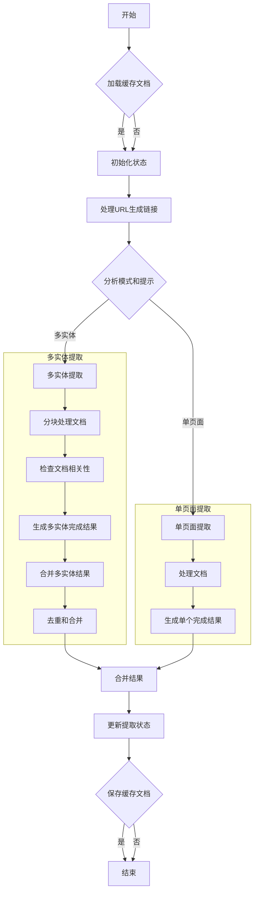

## Explaining
```shell
/Users/shhaofu/Code/Codes/firecrawl/apps/api/src/controllers/v1/map.ts

export async function mapController(

// Max Links that /map can return
const MAX_MAP_LIMIT = 30000;
// Max Links that "Smart /map" can return
const MAX_FIRE_ENGINE_RESULTS = 500;

interface MapResult {
  success: boolean;
  links: string[];
  scrape_id?: string;
  job_id: string;
  time_taken: number;
  mapResults: MapDocument[];
}

export async function getMapResults({
  url,
  search,
  limit = MAX_MAP_LIMIT,
  ignoreSitemap = false,
  includeSubdomains = true,
  crawlerOptions = {},
  teamId,
  plan,
  origin,
  includeMetadata = false,
  allowExternalLinks,
  abort = new AbortController().signal, // noop
  mock,
}: {
  url: string;
  search?: string;
  limit?: number;
  ignoreSitemap?: boolean;
  includeSubdomains?: boolean;
  crawlerOptions?: any;
  teamId: string;
  plan?: string;
  origin?: string;
  includeMetadata?: boolean;
  allowExternalLinks?: boolean;
  abort?: AbortSignal;
  mock?: string;
}): Promise<MapResult> {
  const id = uuidv4();
  let links: string[] = [url];
  let mapResults: MapDocument[] = [];

  const sc: StoredCrawl = {
    originUrl: url,
    crawlerOptions: {
      ...crawlerOptions,
      limit: crawlerOptions.sitemapOnly ? 10000000 : limit,
      scrapeOptions: undefined,
    },
    scrapeOptions: scrapeOptions.parse({}),
    internalOptions: {},
    team_id: teamId,
    createdAt: Date.now(),
    plan: plan,
  };

  const crawler = crawlToCrawler(id, sc);

  try {
    sc.robots = await crawler.getRobotsTxt(false, abort);
    crawler.importRobotsTxt(sc.robots);
  } catch (_) {}

  // If sitemapOnly is true, only get links from sitemap
  if (crawlerOptions.sitemapOnly) {
    const sitemap = await crawler.tryGetSitemap(
      (urls) => {
        urls.forEach((x) => {
          links.push(x);
        });
      },
      true,
      true,
      30000,
      abort,
      mock,
    );
    if (sitemap > 0) {
      links = links
        .slice(1)
        .map((x) => {
          try {
            return checkAndUpdateURLForMap(x).url.trim();
          } catch (_) {
            return null;
          }
        })
        .filter((x) => x !== null) as string[];
      // links = links.slice(1, limit); // don't slice, unnecessary
    }
  } else {
    let urlWithoutWww = url.replace("www.", "");

    let mapUrl =
      search && allowExternalLinks
        ? `${search} ${urlWithoutWww}`
        : search
          ? `${search} site:${urlWithoutWww}`
          : `site:${url}`;

    const resultsPerPage = 100;
    const maxPages = Math.ceil(
      Math.min(MAX_FIRE_ENGINE_RESULTS, limit) / resultsPerPage,
    );

    const cacheKey = `fireEngineMap:${mapUrl}`;
    const cachedResult = await redis.get(cacheKey);

    let allResults: any[] = [];
    let pagePromises: Promise<any>[] = [];

    if (cachedResult) {
      allResults = JSON.parse(cachedResult);
    } else {
      const fetchPage = async (page: number) => {
        return fireEngineMap(mapUrl, {
          numResults: resultsPerPage,
          page: page,
        }, abort);
      };

      pagePromises = Array.from({ length: maxPages }, (_, i) =>
        fetchPage(i + 1),
      );
      allResults = await Promise.all(pagePromises);

      await redis.set(cacheKey, JSON.stringify(allResults), "EX", 48 * 60 * 60); // Cache for 48 hours
    }

    // Parallelize sitemap index query with search results
    const [sitemapIndexResult, ...searchResults] = await Promise.all([
      querySitemapIndex(url, abort),
      ...(cachedResult ? [] : pagePromises),
    ]);

    const twoDaysAgo = new Date();
    twoDaysAgo.setDate(twoDaysAgo.getDate() - 2);

    // If sitemap is not ignored and either we have few URLs (<100) or the data is stale (>2 days old), fetch fresh sitemap
    if (
      !ignoreSitemap &&
      (sitemapIndexResult.urls.length < 100 ||
        new Date(sitemapIndexResult.lastUpdated) < twoDaysAgo)
    ) {
      try {
        await crawler.tryGetSitemap(
          (urls) => {
            links.push(...urls);
          },
          true,
          false,
          30000,
          abort,
        );
      } catch (e) {
        logger.warn("tryGetSitemap threw an error", { error: e });
      }
    }

    if (!cachedResult) {
      allResults = searchResults;
    }

    mapResults = allResults
      .flat()
      .filter((result) => result !== null && result !== undefined);

    const minumumCutoff = Math.min(MAX_MAP_LIMIT, limit);
    if (mapResults.length > minumumCutoff) {
      mapResults = mapResults.slice(0, minumumCutoff);
    }

    if (mapResults.length > 0) {
      if (search) {
        // Ensure all map results are first, maintaining their order
        links = [
          mapResults[0].url,
          ...mapResults.slice(1).map((x) => x.url),
          ...links,
        ];
      } else {
        mapResults.map((x) => {
          links.push(x.url);
        });
      }
    }

    // Add sitemap-index URLs
    links.push(...sitemapIndexResult.urls);

    // Perform cosine similarity between the search query and the list of links
    if (search) {
      const searchQuery = search.toLowerCase();
      links = performCosineSimilarity(links, searchQuery);
    }

    links = links
      .map((x) => {
        try {
          return checkAndUpdateURLForMap(x).url.trim();
        } catch (_) {
          return null;
        }
      })
      .filter((x) => x !== null) as string[];

    // allows for subdomains to be included
    links = links.filter((x) => isSameDomain(x, url));

    // if includeSubdomains is false, filter out subdomains
    if (!includeSubdomains) {
      links = links.filter((x) => isSameSubdomain(x, url));
    }

    // remove duplicates that could be due to http/https or www
    links = removeDuplicateUrls(links);
  }

  const linksToReturn = crawlerOptions.sitemapOnly
    ? links
    : links.slice(0, limit);

  //

  await getIndexQueue().add(
    id,
    {
      originUrl: url,
      visitedUrls: linksToReturn,
    },
    {
      priority: 10,
    },
  );

  return {
    success: true,
    links: linksToReturn,
    mapResults: mapResults,
    scrape_id: origin?.includes("website") ? id : undefined,
    job_id: id,
    time_taken: (new Date().getTime() - Date.now()) / 1000,
  };
}
```

```shell
尝试获取站点的sitemap.xml

public async tryGetSitemap(
    urlsHandler: (urls: string[]) => unknown,
    fromMap: boolean = false,
    onlySitemap: boolean = false,
    timeout: number = 120000,
    abort?: AbortSignal,
    mock?: string,
  ): Promise<number> {
    this.logger.debug(`Fetching sitemap links from ${this.initialUrl}`, {
      method: "tryGetSitemap",
    });
    let leftOfLimit = this.limit;

    const normalizeUrl = (url: string) => {
      url = url.replace(/^https?:\/\//, "").replace(/^www\./, "");
      if (url.endsWith("/")) {
        url = url.slice(0, -1);
      }
      return url;
    };

    const _urlsHandler = async (urls: string[]) => {
      if (fromMap && onlySitemap) {
        return urlsHandler(urls);
      } else {
        let filteredLinks = this.filterLinks(
          [...new Set(urls)],
          leftOfLimit,
          this.maxCrawledDepth,
          fromMap,
        );
        leftOfLimit -= filteredLinks.length;
        let uniqueURLs: string[] = [];
        for (const url of filteredLinks) {
          if (
            await redisConnection.sadd(
              "sitemap:" + this.jobId + ":links",
              normalizeUrl(url),
            )
          ) {
            uniqueURLs.push(url);
          }
        }

        await redisConnection.expire(
          "sitemap:" + this.jobId + ":links",
          3600,
          "NX",
        );
        if (uniqueURLs.length > 0) {
          return urlsHandler(uniqueURLs);
        }
      }
    };

    const timeoutPromise = new Promise((_, reject) => {
      setTimeout(() => reject(new Error("Sitemap fetch timeout")), timeout);
    });

    try {
      let count = (await Promise.race([
        Promise.all([
          this.tryFetchSitemapLinks(this.initialUrl, _urlsHandler, abort, mock),
          ...this.robots
            .getSitemaps()
            .map((x) => this.tryFetchSitemapLinks(x, _urlsHandler, abort, mock)),
        ]).then((results) => results.reduce((a, x) => a + x, 0)),
        timeoutPromise,
      ])) as number;

      if (count > 0) {
        if (
          await redisConnection.sadd(
            "sitemap:" + this.jobId + ":links",
            normalizeUrl(this.initialUrl),
          )
        ) {
          urlsHandler([this.initialUrl]);
        }
        count++;
      }

      return count;
    } catch (error) {
      if (error.message === "Sitemap fetch timeout") {
        this.logger.warn("Sitemap fetch timed out", {
          method: "tryGetSitemap",
          timeout,
        });
        return 0;
      }
      this.logger.error("Error fetching sitemap", {
        method: "tryGetSitemap",
        error,
      });
      return 0;
    }
  }
```

```shell

  private async tryFetchSitemapLinks(
    url: string,
    urlsHandler: (urls: string[]) => unknown,
    abort?: AbortSignal,
    mock?: string,
  ): Promise<number> {
    const sitemapUrl = url.endsWith(".xml")
      ? url
      : `${url}${url.endsWith("/") ? "" : "/"}sitemap.xml`;

    let sitemapCount: number = 0;

    // Try to get sitemap from the provided URL first
    try {
      sitemapCount = await getLinksFromSitemap(
        { sitemapUrl, urlsHandler, mode: "fire-engine" },
        this.logger,
        this.jobId,
        this.sitemapsHit,
        abort,
        mock,
      );
    } catch (error) {
      if (error instanceof TimeoutSignal) {
        throw error;
      } else {
        this.logger.debug(`Failed to fetch sitemap from ${sitemapUrl}`, {
          method: "tryFetchSitemapLinks",
          sitemapUrl,
          error,
        });
      }
    }

    // If this is a subdomain, also try to get sitemap from the main domain
    try {
      const urlObj = new URL(url);
      const hostname = urlObj.hostname;
      const domainParts = hostname.split(".");

      // Check if this is a subdomain (has more than 2 parts and not www)
      if (domainParts.length > 2 && domainParts[0] !== "www") {
        // Get the main domain by taking the last two parts
        const mainDomain = domainParts.slice(-2).join(".");
        const mainDomainUrl = `${urlObj.protocol}//${mainDomain}`;
        const mainDomainSitemapUrl = `${mainDomainUrl}/sitemap.xml`;

        try {
          // Get all links from the main domain's sitemap
          sitemapCount += await getLinksFromSitemap(
            {
              sitemapUrl: mainDomainSitemapUrl,
              urlsHandler(urls) {
                return urlsHandler(
                  urls.filter((link) => {
                    try {
                      const linkUrl = new URL(link);
                      return linkUrl.hostname.endsWith(hostname);
                    } catch {}
                  }),
                );
              },
              mode: "fire-engine",
            },
            this.logger,
            this.jobId,
            this.sitemapsHit,
            abort,
            mock,
          );
        } catch (error) {
          if (error instanceof TimeoutSignal) {
            throw error;
          } else {
            this.logger.debug(
              `Failed to fetch main domain sitemap from ${mainDomainSitemapUrl}`,
              { method: "tryFetchSitemapLinks", mainDomainSitemapUrl, error },
            );
          }
        }
      }
    } catch (error) {
      if (error instanceof TimeoutSignal) {
        throw error;
      } else {
        this.logger.debug(`Error processing main domain sitemap`, {
          method: "tryFetchSitemapLinks",
          url,
          error,
        });
      }
    }

    // If no sitemap found yet, try the baseUrl as a last resort
    if (sitemapCount === 0) {
      const baseUrlSitemap = `${this.baseUrl}/sitemap.xml`;
      try {
        sitemapCount += await getLinksFromSitemap(
          { sitemapUrl: baseUrlSitemap, urlsHandler, mode: "fire-engine" },
          this.logger,
          this.jobId,
          this.sitemapsHit,
          abort,
          mock,
        );
      } catch (error) {
        if (error instanceof TimeoutSignal) {
          throw error;
        } else {
          this.logger.debug(`Failed to fetch sitemap from ${baseUrlSitemap}`, {
            method: "tryFetchSitemapLinks",
            sitemapUrl: baseUrlSitemap,
            error,
          });
          if (error instanceof AxiosError && error.response?.status === 404) {
            // ignore 404
          } else {
            sitemapCount += await getLinksFromSitemap(
              { sitemapUrl: baseUrlSitemap, urlsHandler, mode: "fire-engine" },
              this.logger,
              this.jobId,
              this.sitemapsHit,
              abort,
              mock,
            );
          }
        }
      }
    }

    if (this.sitemapsHit.size >= 20) {
      this.logger.warn("Sitemap limit hit!", { crawlId: this.jobId, url: this.baseUrl });
    }

    return sitemapCount;
  }
}
```

```shell
2025-03-08 15:32:24 info [ScrapeURL:]: Scraping URL "https://www.taoboa.com/sitemap.xml"...
2025-03-08 15:32:24 info [ScrapeURL:]: Scraping via fetch...
2025-03-08 15:32:24 info [ScrapeURL:]: Scrape via fetch deemed successful.
2025-03-08 15:32:24 error [scrapeURL:extractLinks]: Failed to call html-transformer! Falling back to cheerio... {"error":{"name":"Error","message":"Rust html-transformer shared library not found","stack":"Error: Rust html-transformer shared library not found\n    at Function.getInstance (/Users/shhaofu/Code/Codes/firecrawl/apps/api/src/lib/html-transformer.ts:45:15)\n    at async transformHtml (/Users/shhaofu/Code/Codes/firecrawl/apps/api/src/lib/html-transformer.ts:134:21)\n    at async htmlTransform (/Users/shhaofu/Code/Codes/firecrawl/apps/api/src/scraper/scrapeURL/lib/removeUnwantedElements.ts:60:12)\n    at async deriveHTMLFromRawHTML (/Users/shhaofu/Code/Codes/firecrawl/apps/api/src/scraper/scrapeURL/transformers/index.ts:44:19)\n    at async executeTransformers (/Users/shhaofu/Code/Codes/firecrawl/apps/api/src/scraper/scrapeURL/transformers/index.ts:185:16)\n    at async scrapeURLLoop (/Users/shhaofu/Code/Codes/firecrawl/apps/api/src/scraper/scrapeURL/index.ts:372:14)\n    at async scrapeURL (/Users/shhaofu/Code/Codes/firecrawl/apps/api/src/scraper/scrapeURL/index.ts:392:16)\n    at async getLinksFromSitemap (/Users/shhaofu/Code/Codes/firecrawl/apps/api/src/scraper/WebScraper/sitemap.ts:39:24)\n    at async WebCrawler.tryFetchSitemapLinks (/Users/shhaofu/Code/Codes/firecrawl/apps/api/src/scraper/WebScraper/crawler.ts:603:22)\n    at async Promise.all (index 0)\n    at async WebCrawler.tryGetSitemap (/Users/shhaofu/Code/Codes/firecrawl/apps/api/src/scraper/WebScraper/crawler.ts:295:20)\n    at async getMapResults (/Users/shhaofu/Code/Codes/firecrawl/apps/api/src/controllers/v1/map.ts:181:9)\n    at async mapController (/Users/shhaofu/Code/Codes/firecrawl/apps/api/src/controllers/v1/map.ts:290:14)"},"module":"scrapeURL","method":"extractLinks"}
2025-03-08 15:32:24 error [scrapeURL:extractMetadata]: Failed to call html-transformer! Falling back to cheerio... {"module":"scrapeURL","scrapeId":"sitemap;6cd83505-b048-45d1-aabd-4e9839a77374","scrapeURL":"https://www.taoboa.com/sitemap.xml","method":"extractMetadata","error":{"name":"Error","message":"Rust html-transformer shared library not found","stack":"Error: Rust html-transformer shared library not found\n    at Function.getInstance (/Users/shhaofu/Code/Codes/firecrawl/apps/api/src/lib/html-transformer.ts:45:15)\n    at async extractMetadata (/Users/shhaofu/Code/Codes/firecrawl/apps/api/src/lib/html-transformer.ts:127:23)\n    at async extractMetadataRust (/Users/shhaofu/Code/Codes/firecrawl/apps/api/src/scraper/scrapeURL/lib/extractMetadata.ts:10:20)\n    at async extractMetadata (/Users/shhaofu/Code/Codes/firecrawl/apps/api/src/scraper/scrapeURL/lib/extractMetadata.ts:27:12)\n    at async deriveMetadataFromRawHTML (/Users/shhaofu/Code/Codes/firecrawl/apps/api/src/scraper/scrapeURL/transformers/index.ts:28:9)\n    at async executeTransformers (/Users/shhaofu/Code/Codes/firecrawl/apps/api/src/scraper/scrapeURL/transformers/index.ts:185:16)\n    at async scrapeURLLoop (/Users/shhaofu/Code/Codes/firecrawl/apps/api/src/scraper/scrapeURL/index.ts:372:14)\n    at async scrapeURL (/Users/shhaofu/Code/Codes/firecrawl/apps/api/src/scraper/scrapeURL/index.ts:392:16)\n    at async getLinksFromSitemap (/Users/shhaofu/Code/Codes/firecrawl/apps/api/src/scraper/WebScraper/sitemap.ts:39:24)\n    at async WebCrawler.tryFetchSitemapLinks (/Users/shhaofu/Code/Codes/firecrawl/apps/api/src/scraper/WebScraper/crawler.ts:603:22)\n    at async Promise.all (index 0)\n    at async WebCrawler.tryGetSitemap (/Users/shhaofu/Code/Codes/firecrawl/apps/api/src/scraper/WebScraper/crawler.ts:295:20)\n    at async getMapResults (/Users/shhaofu/Code/Codes/firecrawl/apps/api/src/controllers/v1/map.ts:181:9)\n    at async mapController (/Users/shhaofu/Code/Codes/firecrawl/apps/api/src/controllers/v1/map.ts:290:14)"}}
2025-03-08 15:32:24 error [WebCrawler:getLinksFromSitemap]: Request failed for sitemap fetch {"crawlId":"6cd83505-b048-45d1-aabd-4e9839a77374","module":"WebCrawler","method":"getLinksFromSitemap","mode":"fire-engine","sitemapUrl":"https://www.taoboa.com/sitemap.xml","error":{"rawHtml":"<!DOCTYPE html>\n<html style=\"height:100%\">\n<head>\n<meta name=\"viewport\" content=\"width=device-width, initial-scale=1, shrink-to-fit=no\" />\n<title> 404 Not Found\r\n</title><style>@media (prefers-color-scheme:dark){body{background-color:#000!important}}</style></head>\n<body style=\"color: #444; margin:0;font: normal 14px/20px Arial, Helvetica, sans-serif; height:100%; background-color: #fff;\">\n<div style=\"height:auto; min-height:100%; \">     <div style=\"text-align: center; width:800px; margin-left: -400px; position:absolute; top: 30%; left:50%;\">\n        <h1 style=\"margin:0; font-size:150px; line-height:150px; font-weight:bold;\">404</h1>\n<h2 style=\"margin-top:20px;font-size: 30px;\">Not Found\r\n</h2>\n<p>The resource requested could not be found on this server!</p>\n</div></div><div style=\"color:#f0f0f0; font-size:12px;margin:auto;padding:0px 30px 0px 30px;position:relative;clear:both;height:100px;margin-top:-101px;background-color:#474747;border-top: 1px solid rgba(0,0,0,0.15);box-shadow: 0 1px 0 rgba(255, 255, 255, 0.3) inset;\">\n<br>Proudly powered by LiteSpeed Web Server<p>Please be advised that LiteSpeed Technologies Inc. is not a web hosting company and, as such, has no control over content found on this site.</p></div></body></html>\n","metadata":{"title":"404 Not Found","ogLocaleAlternate":[],"scrapeId":"sitemap;6cd83505-b048-45d1-aabd-4e9839a77374","viewport":"width=device-width, initial-scale=1, shrink-to-fit=no","sourceURL":"https://www.taoboa.com/sitemap.xml","url":"https://www.taoboa.com/sitemap.xml","statusCode":404}}}
2025-03-08 15:32:24 warn [WebCrawler:]: This sitemap has already been hit. {"crawlId":"6cd83505-b048-45d1-aabd-4e9839a77374","module":"WebCrawler","sitemapUrl":"https://www.taoboa.com/sitemap.xml"}
```


```shell
curl -X POST http://localhost:3002/v1/map \
    -H 'Content-Type: application/json' \
    -H 'Authorization: Bearer localapikey' \
    -d '{
      "url": "https://www.xiaohuasheng.com"
    }'
```

```shell
curl -X POST http://localhost:3002/v1/map \
    -H 'Content-Type: application/json' \
    -H 'Authorization: Bearer localapikey' \
    -d '{
      "url": "https://firecrawl.dev"
    }'


curl -X POST http://localhost:3002/v1/map \
    -H 'Content-Type: application/json' \
    -H 'Authorization: Bearer localapikey' \
    -d '{
      "url": "https://www.aliyun.com/"
    }'

curl -X POST http://localhost:3002/v1/map \
    -H 'Content-Type: application/json' \
    -H 'Authorization: Bearer localapikey' \
    -d '{
      "url": "https://www.taoboa.com/"
    }'


TODO cheerio

curl -X POST http://localhost:3002/v1/extract \
    -H 'Content-Type: application/json' \
    -H 'Authorization: Bearer localapikey' \
    -d '{
      "urls": [
        "https://www.xiaohuasheng.cn/blog/2a9cf7dd09f8f692"
      ],
      "prompt": "提取关键信息，推荐书籍,启蒙书,数学",
      "schema": {
        "type": "object",
        "properties": {
          "推荐书籍": {
            "type": "string"
          },
          "启蒙书": {
            "type": "string"
          }
        }
      }
    }'
```

```shell
curl -X POST http://localhost:3002/v1/extract \
    -H 'Content-Type: application/json' \
    -H 'Authorization: Bearer localapikey' \
    -d '{
      "urls": [
        "https://firecrawl.dev/*", 
        "https://docs.firecrawl.dev/", 
        "https://www.ycombinator.com/companies"
      ],
      "prompt": "Extract the company mission, whether it is open source, and whether it is in Y Combinator from the page.",
      "schema": {
        "type": "object",
        "properties": {
          "company_mission": {
            "type": "string"
          },
          "is_open_source": {
            "type": "boolean"
          },
          "is_in_yc": {
            "type": "boolean"
          }
        },
        "required": [
          "company_mission",
          "is_open_source",
          "is_in_yc"
        ]
      }
    }'
```




```shell
#  1025  curl 'http://localhost:11434/v1/chat'
 1026  curl 'http://localhost:11434/api/generate'
#  1027  curl -X POST 'http://localhost:11434/api/generate' -d '{}'
#  1028  curl -X POST 'http://localhost:11434/api/generate' -d '{"model":"qwen2}'
 1029  curl -X POST 'http://localhost:11434/api/generate' -d '{"model":"qwen2","prompt":"who are you"}'
#  1030  curl -X POST 'http://localhost:11434/chat' -d '{"model":"qwen2","prompt":"who are you"}'
 1031  curl -X POST 'http://localhost:11434/api/chat' -d '{"model":"qwen2","prompt":"who are you"}'

 curl -X POST http://localhost:3002/v1/extract \
    -H 'Content-Type: application/json' \
    -H 'Authorization: Bearer localapikey' \
    -d '{
      "urls": [
        "https://firecrawl.dev/*",
        "https://docs.firecrawl.dev/",
        "https://www.ycombinator.com/companies"
      ],
      "prompt": "Extract the company mission, whether it is open source, and whether it is in Y Combinator from the page.",
      "schema": {
        "type": "object",
        "properties": {
          "company_mission": {
            "type": "string"
          },
          "is_open_source": {
            "type": "boolean"
          },
          "is_in_yc": {
            "type": "boolean"
          }
        },
        "required": [
          "company_mission",
          "is_open_source",
          "is_in_yc"
        ]
      }
    }'
{"success":true,"id":"9441627d-0c9f-4e22-ac2b-3a5102d73501","urlTrace":[]}%


https://www.bilibili.com/video/BV1e5411T77z/?spm_id_from=333.788.recommend_more_video.-1&vd_source=54dd9fa6521e9056203aaa082ba7245f


```

