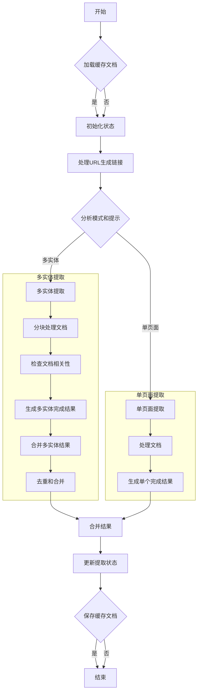
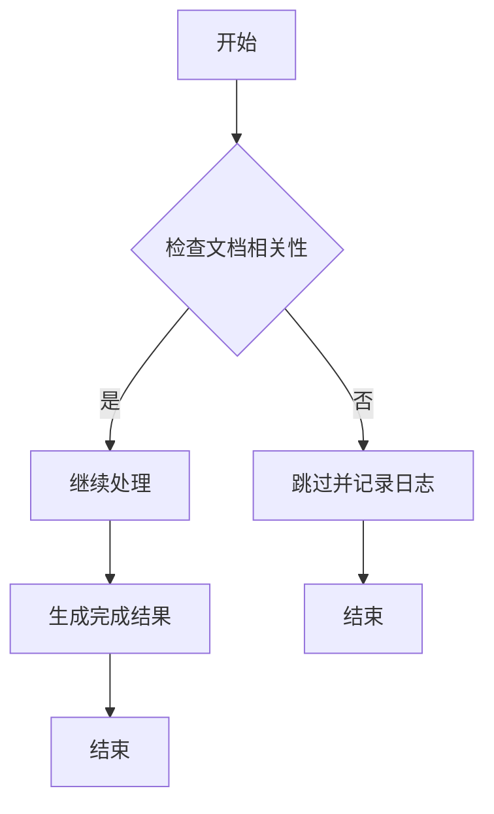

# 代码解释
这段 TypeScript 代码实现了一个异步函数 `performExtraction`，用于从给定的 URL 列表中提取信息，并根据请求配置生成最终结果。主要功能包括：

1. **初始化和缓存加载**：
   - 检查是否需要加载缓存文档。
   - 如果启用缓存模式，则尝试加载缓存并更新 `docsMap`。

2. **初始化状态**：
   - 更新提取状态为“处理中”，并记录初始步骤。

3. **URL 处理**：
   - 遍历请求中的 URL 列表，调用 `processUrl` 函数处理每个 URL，并收集发现的新链接。
   - 更新提取状态以反映处理进度。

4. **模式和提示分析**：
   - 分析请求模式和提示，确定是否为多实体提取。
   - 如果是多实体提取，进一步拆分模式为单个答案模式和多实体模式。

5. **多实体提取**：
   - 对于多实体提取，分块处理文档，逐个检查文档内容的相关性，并生成多个完成结果。
   - 合并多实体提取结果，进行去重和合并操作。

6. **单页面提取**：
   - 对于单个页面提取，直接处理文档并生成单个完成结果。
   - 更新提取状态以反映处理进度。

7. **结果合并与更新**：
   - 合并多实体和单个页面的结果，生成最终提取结果。
   - 更新提取状态为“完成”，并记录 LLM 使用情况和来源。

8. **缓存保存**：
   - 如果启用了缓存保存模式，则将处理后的文档保存到缓存中。

9. **返回结果**：
   - 返回包含成功标志、数据、提取 ID 等信息的对象。

# 控制流图


此控制流图详细展示了 `performExtraction` 函数的主要逻辑流程，确保每个步骤清晰明了。

# 关于文档相关性的部分详细解释

在 `performExtraction` 函数中，检查文档内容的相关性是多实体提取（Multi-entity Extraction）过程中的一个重要步骤。具体来说，这部分逻辑位于处理多实体文档的循环内，确保每个文档的内容与提示（prompt）和模式（schema）相关联。以下是详细的解释：

### 代码片段
```typescript
// Check if page should be extracted before proceeding
const { extract, tokenUsage: shouldExtractCheckTokenUsage } = await checkShouldExtract(
  request.prompt ?? "",
  multiEntitySchema,
  doc,
);

tokenUsage.push(shouldExtractCheckTokenUsage);

if (!extract) {
  logger.info(
    `Skipping extraction for ${doc.metadata.url} as content is irrelevant`,
  );
  return null;
}
```

### 功能说明
1. **调用 `checkShouldExtract` 函数**：
   - 该函数用于评估当前文档是否应该被提取。它接收三个参数：
     - `request.prompt`：用户的提示信息。
     - `multiEntitySchema`：多实体模式。
     - `doc`：当前处理的文档对象。
   - 返回一个包含 `extract` 和 `tokenUsage` 的对象：
     - `extract`：布尔值，表示文档内容是否相关。
     - `tokenUsage`：记录此次检查使用的令牌数。

2. **记录令牌使用情况**：
   - 将 `checkShouldExtract` 函数返回的 `tokenUsage` 添加到全局的 `tokenUsage` 数组中，以便后续统计和计费。

3. **判断是否跳过提取**：
   - 如果 `extract` 为 `false`，则表示文档内容与提示或模式不相关，因此跳过该文档的进一步处理，并记录日志信息。
   - 如果 `extract` 为 `true`，则继续处理该文档。

### 相关性检查的意义
- **提高效率**：通过提前过滤掉无关的文档，可以减少不必要的计算资源消耗，提高整体处理效率。
- **确保质量**：只处理相关文档，可以确保最终结果的质量，避免引入噪声数据。
- **优化成本**：减少对无关文档的处理，可以降低 LLM 使用的令牌数量，从而节省成本。

### 控制流图
为了更清晰地展示这一部分的控制流程，以下是对应的 Mermaid 流程图：



此流程图展示了在多实体提取过程中，如何通过检查文档内容的相关性来决定是否继续处理该文档。

