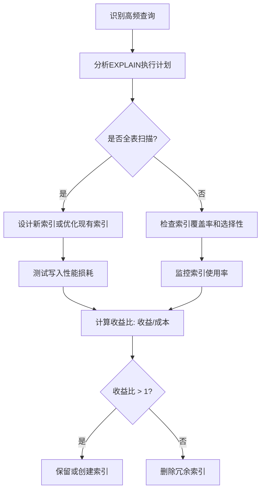

### 如何评估索引的成本与作用、查询速度及维护代价

---

#### **一、计算索引的成本与作用**

##### **1. 索引的成本**
- **存储成本**：
  - **计算公式**：索引大小 ≈ 表行数 × (索引列大小 + 索引元数据开销)
  - **示例**：  
    假设表有 `1,000,000` 行，索引列 `user_id` 为 `INT`（4 字节），InnoDB 索引元数据约 `10` 字节/行，则索引大小 ≈ `1,000,000 × (4 + 10) = 14 MB`。
  - **查看索引大小**：
    ```sql
    SELECT 
      table_name AS `表名`,
      index_name AS `索引名`,
      ROUND(stat_value * @@innodb_page_size / 1024 / 1024, 2) AS `索引大小(MB)`
    FROM mysql.innodb_index_stats
    WHERE database_name = 'your_db'
      AND stat_name = 'size';
    ```

- **写入性能成本**：
  - **插入/更新/删除**：每个索引都会增加 `O(log N)` 的维护时间（B+树调整）。
  - **基准测试**：  
    对比有索引和无索引时的写入速度：
    ```sql
    -- 无索引时插入 10,000 行
    INSERT INTO users (name) VALUES ('user1'), ('user2'), ...; -- 耗时 T1

    -- 有索引时插入 10,000 行
    ALTER TABLE users ADD INDEX idx_name (name);
    INSERT INTO users (name) VALUES ('user1'), ('user2'), ...; -- 耗时 T2
    写入性能损失 ≈ (T2 - T1) / T1 × 100%
    ```

##### **2. 索引的作用**
- **加速查询类型**：
  - **等值查询**：`WHERE user_id = 123`
  - **范围查询**：`WHERE created_at BETWEEN '2023-01-01' AND '2023-12-31'`
  - **排序与分组**：`ORDER BY last_login`
  - **覆盖索引**：避免回表，直接从索引返回数据。
    ```sql
    -- 使用覆盖索引
    SELECT user_id FROM users WHERE status = 'active'; -- 索引 (status, user_id)
    ```

- **作用量化**：
  - **索引选择性**：唯一值比例，选择性越高，索引效果越好。
    ```sql
    SELECT 
      COUNT(DISTINCT email) / COUNT(*) AS selectivity 
    FROM users;
    -- 选择性 > 0.1 时索引通常有效
    ```

---

#### **二、评估查询速度**

##### **1. 使用 `EXPLAIN` 分析执行计划**
- **关键指标**：
  - **type**：`const`（最优）、`ref`、`range`、`index`、`ALL`（全表扫描）。
  - **rows**：预估扫描行数。
  - **Extra**：`Using index`（覆盖索引）、`Using filesort`（需优化排序）。

- **示例**：
  ```sql
  EXPLAIN SELECT * FROM orders 
  WHERE user_id = 100 AND status = 'paid';
  -- 检查是否命中索引 (user_id, status)
  ```

##### **2. 实际查询耗时测试**
- **使用 `BENCHMARK` 函数或脚本**：
  ```sql
  SET @start = NOW();
  SELECT * FROM large_table WHERE indexed_column = 'value';
  SELECT TIMEDIFF(NOW(), @start) AS duration;
  ```

- **慢查询日志分析**：
  ```sql
  -- 启用慢查询日志
  SET GLOBAL slow_query_log = ON;
  SET GLOBAL long_query_time = 2; -- 记录超过 2 秒的查询

  -- 分析日志工具
  mysqldumpslow -s t /var/log/mysql/slow.log
  ```

##### **3. 索引覆盖率检查**
- **未覆盖索引的查询**：
  ```sql
  SELECT * FROM products 
  WHERE category = 'electronics' 
  ORDER BY price; -- 若索引是 (category)，则需回表查 price
  ```

---

#### **三、分析索引维护代价与收益**

##### **1. 维护代价分析**
- **写入性能监控**：
  ```sql
  -- 监控索引更新次数
  SHOW GLOBAL STATUS LIKE 'Handler_write%';
  -- Handler_write% 增加表示索引维护频繁
  ```

- **锁竞争**：
  - 在线 DDL 工具（如 `pt-online-schema-change`）减少锁表时间。

##### **2. 索引收益评估**
- **索引使用统计**：
  ```sql
  SELECT 
    object_schema AS `数据库`,
    object_name AS `表名`,
    index_name AS `索引名`,
    rows_read AS `通过索引读取的行数`,
    SELECT_LATENCY AS `查询延迟`
  FROM sys.schema_index_statistics
  WHERE object_schema = 'your_db';
  -- 删除 rows_read 为 0 的冗余索引
  ```

- **成本收益比公式**：
  ```
  收益比 = (查询时间减少量 × 查询频率) / (索引维护成本 + 存储成本)
  ```

##### **3. 索引优化策略**
- **复合索引设计**：
  - **最左前缀原则**：索引 `(A, B, C)` 可优化 `WHERE A=1 AND B=2`，但无法优化 `WHERE B=2`。
  - **索引下推（ICP）**：
    ```sql
    SET optimizer_switch = 'index_condition_pushdown=on';
    ```

- **索引合并与拆分**：
  - 合并高频查询条件到复合索引。
  - 拆分大字段索引（如 `TEXT`）为前缀索引：
    ```sql
    ALTER TABLE logs ADD INDEX idx_message (message(100));
    ```

---

#### **四、综合评估流程图**



---

#### **五、工具推荐**
1. **Percona Toolkit**：分析索引使用率、冗余索引。
2. **sys Schema**：内置性能视图，快速定位低效查询。
3. **Prometheus + Grafana**：实时监控索引维护开销。

---

通过量化存储成本、写入性能损耗、查询加速收益，结合执行计划和监控工具，可系统评估索引的价值，最终实现高性能与低成本的平衡。

