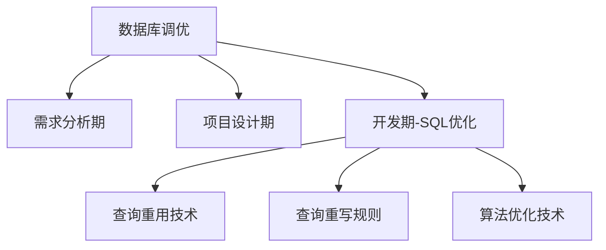

# 查询优化技术体系

## 与技术演进的关系
查询优化属于SQL层面的局部优化，与数据库全局调优形成互补。如下图所示：


## 表2-1 查询优化技术体系（与24号文档第三阶段关联）
| 优化类型 | 技术原理 | 适用场景 | 对应开发期阶段 |
|---------|---------|---------|--------------|
| 查询重用 | 缓存执行计划 | 高频重复查询 | SQL设计优化 |
| 查询重写 | 逻辑等价转换 | 复杂嵌套查询 | 索引策略实施 |
| 算法优化 | 选择最优执行路径 | 大数据量操作 | 执行计划分析 |

## 核心技术详解

### 1. 查询重用技术
```sql
-- gold_transactions表查询重用案例
PREPARE gold_query FROM 
'SELECT user_id, SUM(amount) FROM gold_transactions WHERE transaction_date BETWEEN ? AND ? GROUP BY user_id';

EXECUTE gold_query USING '2023-01-01', '2023-12-31';
```

### 2. 查询重写规则
```sql
-- 重写前
SELECT * FROM orders WHERE order_id IN (SELECT order_id FROM payments WHERE amount > 100);

-- 重写后（EXPLAIN分析显示性能提升）
EXPLAIN 
SELECT o.* FROM orders o 
JOIN payments p ON o.order_id = p.order_id 
WHERE p.amount > 100;
```

### 3. 算法优化实践
```sql
-- gold_transactions表索引优化案例
CREATE INDEX idx_gold_user_date ON gold_transactions(user_id, transaction_date);

EXPLAIN ANALYZE
SELECT user_id, AVG(amount) 
FROM gold_transactions
WHERE transaction_date > '2023-06-01'
GROUP BY user_id;
```

## 与全局调优的关系（对照24号文档）
| 优化维度 | 查询优化技术 | 数据库全局调优 |
|---------|-------------|---------------|
| 作用范围 | SQL语句级别 | 数据库实例级别 |
| 实施阶段 | 开发期（24号文档第三阶段） | 全生命周期 |
| 典型工具 | EXPLAIN/EXPLAIN ANALYZE | 慢查询日志分析 |

## 六大技术闭环实现
1. **重用技术**：通过执行计划缓存减少解析开销
2. **重写规则**：利用启发式规则优化查询逻辑
3. **算法优化**：基于代价模型选择最优join顺序
4. **并行查询**：分片执行+结果聚合（需结合24号文档的分布式策略）
5. **分布式优化**：数据本地化处理（对应24号文档的分片集群方案）
6. **混合技术**：物化视图+查询重写组合应用

## 最佳实践建议
1. 在开发期（对应24号文档第三阶段）启用EXPLAIN验证每个优化步骤
2. 结合数据库全局参数调整（如work_mem）提升优化效果
3. 定期使用ANALYZE更新统计信息，保持优化器决策准确性