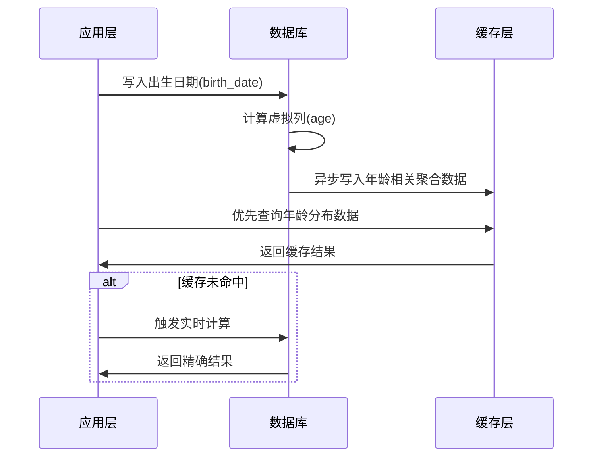

在数据库设计中处理年龄这类动态变化的信息时，需要通过多维度分析进行技术选型。以下是结合存储方式、计算策略、性能优化等多方面的详细解决方案：

---

### 一、核心设计原则
#### **不直接存储年龄数值**（关键原则）
```sql
-- ❌ 错误做法：存储静态年龄
CREATE TABLE users (
    age INT  -- 每年需要全表更新
);

-- ✅ 正确做法：存储出生日期
CREATE TABLE users (
    birth_date DATE  -- 精确到天的日期类型
);
```

---

### 二、技术方案对比分析
| 方案类型       | 实现方式                          | 优点                          | 缺点                          | 适用场景                  |
|----------------|-----------------------------------|-----------------------------|------------------------------|-------------------------|
| **虚拟列**     | 使用数据库生成的列自动计算年龄         | 实时准确，减少应用层计算负担    | 索引维护成本高，跨时区可能出错 | 高频查询且需要索引的场景  |
| **应用层计算** | 在业务代码中动态计算年龄              | 避免数据库计算压力            | 增加应用复杂度，存在时区问题   | 低频查询或高并发场景      |
| **混合存储**   | 存储出生日期+年更新年龄（定时任务）     | 查询性能最优                  | 数据存在延迟，维护成本高       | 对实时性要求不高的报表系统|

---

### 三、深度技术实现方案

#### 1. **基于虚拟列的精准计算（推荐方案）**
```sql
-- MySQL 示例（生成列）
CREATE TABLE users (
    birth_date DATE,
    age TINYINT 
        GENERATED ALWAYS AS (
            TIMESTAMPDIFF(YEAR, birth_date, CURDATE()) - 
            (RIGHT(CURDATE(),5) < RIGHT(birth_date,5))
        ) VIRTUAL,
    INDEX idx_age (age)  -- 可建立索引加速查询
);

-- 年龄计算逻辑分解：
-- 1. TIMESTAMPDIFF 计算年份差
-- 2. (RIGHT(date,5) 比较月日是否已过生日)
```

#### 2. **时区敏感型设计**
```sql
-- 带时区信息的解决方案
CREATE TABLE users (
    birth_date TIMESTAMP(6) WITH TIME ZONE,
    time_zone VARCHAR(64) NOT NULL DEFAULT 'Asia/Shanghai',
    age INT GENERATED ALWAYS AS (
        EXTRACT(YEAR FROM age(CURRENT_TIMESTAMP AT TIME ZONE time_zone, birth_date))
    ) STORED
);
```

#### 3. **年龄分段优化**
```sql
-- 创建年龄段分区表（PostgreSQL示例）
CREATE TABLE users_age_partitioned (
    user_id BIGSERIAL,
    birth_date DATE NOT NULL
) PARTITION BY RANGE (
    EXTRACT(YEAR FROM AGE(birth_date)) 
);

-- 创建子分区
CREATE TABLE users_child PARTITION OF users_age_partitioned
    FOR VALUES FROM (0) TO (18);

CREATE TABLE users_adult PARTITION OF users_age_partitioned
    FOR VALUES FROM (18) TO (65);
```

---

### 四、关键考量维度

#### 1. **时间精度维度**
| 精度级别       | 实现方式                          | 误差范围        | 适用场景                  |
|----------------|-----------------------------------|----------------|-------------------------|
| **年精度**     | YEAR(birth_date)                  | ±1 年          | 人口统计                 |
| **日精度**     | DATE(birth_date)                  | 精确到天        | 大多数业务场景            |
| **时分秒精度** | TIMESTAMP(birth_date)             | 精确到出生时刻  | 医疗/法律系统            |

#### 2. **法律合规性处理**
```sql
-- GDPR年龄验证处理
ALTER TABLE users 
ADD COLUMN age_verified BOOLEAN 
    GENERATED ALWAYS AS (
        birth_date <= CURRENT_DATE - INTERVAL '18 years'
    ) STORED;

-- 查询未成年人时需要特殊处理
SELECT * FROM users 
WHERE age_verified = false 
    AND country_code IN ('CN','KR','JP');  -- 不同国家年龄定义
```

#### 3. **性能优化方案**
```sql
-- 物化视图定期刷新（PostgreSQL）
CREATE MATERIALIZED VIEW users_age_summary AS
SELECT 
    FLOOR(EXTRACT(YEAR FROM AGE(birth_date))/10)*10 AS age_group,
    COUNT(*) AS user_count
FROM users
GROUP BY age_group
REFRESH EVERY 1 HOUR;

-- 配合索引覆盖查询
CREATE INDEX idx_users_birth_date ON users(birth_date)
    INCLUDE (user_id, gender);  -- 覆盖查询优化
```

---

### 五、全链路数据流设计


---

### 六、最佳实践建议

1. **存储层**：
   - 使用 `DATE` 类型存储精确出生日期
   - 添加 `CHECK` 约束防止未来日期
   ```sql
   ALTER TABLE users ADD CONSTRAINT chk_birth_date 
       CHECK (birth_date BETWEEN '1900-01-01' AND CURRENT_DATE);
   ```

2. **查询层**：
   - 避免全表扫描的年龄范围查询
   
   ```sql
   -- 优化前（全表扫描）
   SELECT * FROM users WHERE age > 18;

   -- 优化后（索引扫描）
   SELECT * FROM users 
   WHERE birth_date < CURRENT_DATE - INTERVAL '18 years';
   ```

3. **维护层**：
   - 定期重建虚拟列索引
   
   ```sql
   -- MySQL 优化
   ALTER TABLE users ENGINE=InnoDB;  -- 重建表优化索引
   ```

4. **国际化处理**：
   ```sql
   -- 考虑不同地区的年龄计算规则
   CASE 
       WHEN country_code = 'CN' THEN 
           TIMESTAMPDIFF(YEAR, birth_date, CURDATE()) + 1 
       ELSE 
           TIMESTAMPDIFF(YEAR, birth_date, CURDATE())
   END AS localized_age
   ```

---

通过结合虚拟列、分区策略、物化视图等多维度优化手段，可以在保证数据实时性的同时，实现高性能的年龄相关查询。最终方案需根据实际业务场景中的查询模式、数据规模、合规要求等综合决定。
