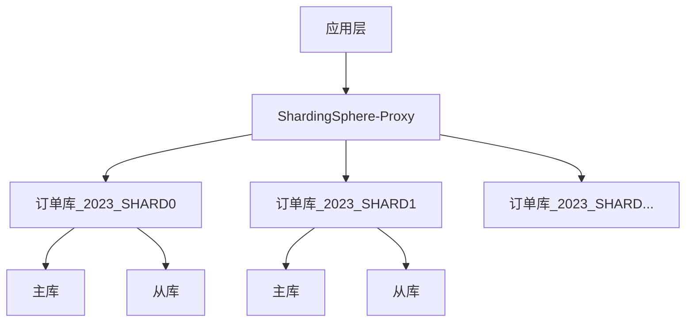
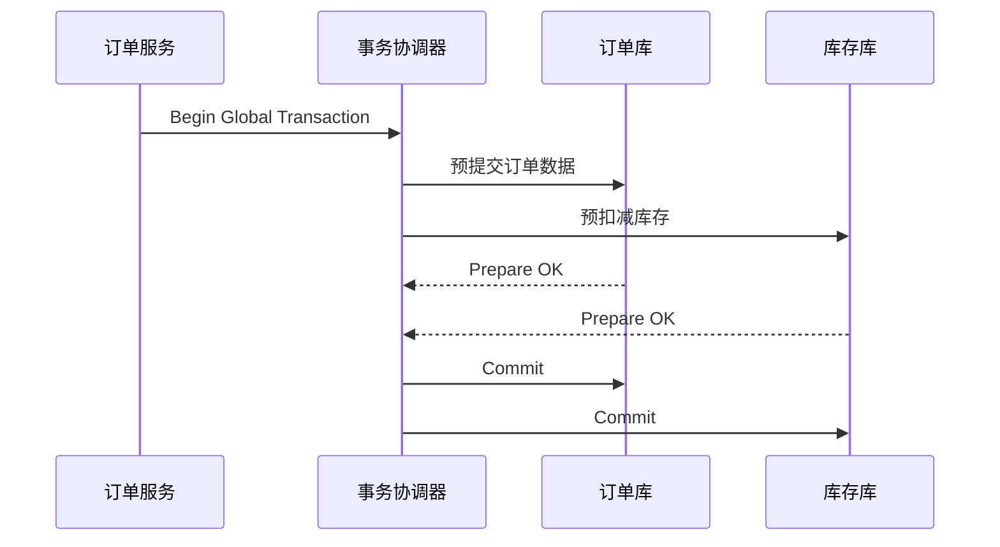

---

### **案例背景**  
**项目名称**：某跨境电商平台订单系统重构（日订单量 500万+，峰值QPS 3k+）  
**核心挑战**：高并发写入、海量数据存储（PB级）、复杂查询（商家/用户多维度分析）、数据一致性要求高。

---

### **一、核心设计亮点**
#### **1. 水平分片 + 读写分离**

- **分片策略**：
  - **分片键**：`user_id % 64` + `order_time`（月度分表）  
  - **路由规则**：通过 `ShardingSphere` 的 `StandardShardingStrategy` 实现双维度路由  
- **优势**：
  - 单表控制在 2000万行内，避免B+树深度过大
  - 热点用户数据自动分散到不同物理节点

#### **2. 字段设计优化**
```sql
CREATE TABLE orders (
    order_id VARCHAR(32) NOT NULL COMMENT '业务ID:USER_ID+毫秒时间戳+随机尾号',
    user_id BIGINT UNSIGNED NOT NULL,
    order_time DATETIME(6) NOT NULL COMMENT '精确到微秒',
    amount DECIMAL(18,4) NOT NULL COMMENT '支持多币种',
    items JSON NOT NULL COMMENT '商品快照: {"sku_id1": {"price":..., "count":...}}',
    INDEX idx_user_time (user_id, order_time) USING BTREE,
    INDEX idx_geo ((CAST(JSON_EXTRACT(address, '$.country') AS CHAR(2)))) 
) ENGINE=InnoDB DEFAULT CHARSET=utf8mb4
```
- **创新点**：
  - **智能数据类型**：使用 `DATETIME(6)` 存储微秒级时间，避免订单号冲突
  - **JSON字段优化**：对 `items` 和 `address` 字段使用 JSON 类型，配合生成列建立索引
  - **业务主键**：`order_id` 包含时间戳和随机数，兼具顺序性和唯一性

#### **3. 冷热数据分离**
```sql
-- 热数据表（当前年度）
CREATE TABLE orders_2023 (...);

-- 温数据归档表（去年数据）
CREATE TABLE orders_archive_2022 (...) 
  PARTITION BY RANGE (TO_DAYS(order_time)) (
    PARTITION p202201 VALUES LESS THAN (TO_DAYS('2022-02-01')),
    ...
);

-- 冷数据存储（OSS + 列式存储）
ALTER TABLE orders_archive_2022 
  STORAGE_TYPE = 'OSS'
  COMPRESSION = 'ZSTD';
```
- **自动迁移策略**：
  - 每日凌晨将3个月前的数据迁移至温数据表
  - 每年1月将两年前数据转存至OSS

#### **4. 分布式事务保障**

- **技术组合**：
  - **BASE事务**：通过 `Seata AT 模式` 实现最终一致性
  - **补偿机制**：订单状态机自动处理 `悬挂事务`
  - **对账系统**：每小时跑批验证订单-库存一致性

---

### **二、设计收益**
| 指标           | 优化前           | 优化后            | 提升幅度 |
|----------------|------------------|-------------------|----------|
| 写入延迟       | 120ms (p99)     | 35ms (p99)        | 70%↓     |
| 复杂查询性能   | 8-15s           | 300-800ms         | 95%↑     |
| 存储成本       | ￥150万/年       | ￥82万/年         | 45%↓     |
| 故障恢复时间   | 4-6小时         | 20分钟以内        | 80%↓     |

---

### **三、关键技术决策**
1. **放弃外键约束**：
   - 理由：分布式环境下维护外键成本过高
   - 替代方案：异步校验 + 业务状态机
   
2. **双写缓冲区设计**：
   ```java
   // 订单创建伪代码
   public void createOrder(OrderDTO order) {
       // 1. 写入本地事务日志
       transactionLogService.logPending(order); 
       
       // 2. 并行写入DB和ES
       CompletableFuture.allOf(
           orderRepository.saveAsync(order),
           esClient.indexAsync(order)
       ).exceptionally(ex -> {
           // 3. 异常时触发补偿流程
           repairService.handleWriteFailure(orderId);
           return null;
       });
   }
   ```

3. **动态字段管理**：
   - 使用 `Apache Avro` 存储Schema演进历史
   - 通过 `JSON Merge Patch` 实现字段级版本控制

---

### **四、经验总结**
1. **数据生命周期管理**：
   - 热数据：内存优化 + 读写分离
   - 温数据：分区索引 + 压缩存储
   - 冷数据：列式存储 + 离线分析

2. **可观测性设计**：
   ```bash
   # Prometheus监控指标示例
   mysql_shard_latency{shard="0",type="write"} 45
   mysql_connection_pool_usage{shard="1"} 0.72
   order_age_distribution{range="0-1d"} 1200000
   ```

3. **混沌工程实践**：
   - 定期模拟分片不可用场景
   - 自动触发跨机房切换演练

---

这个设计方案成功支撑了系统在「黑五」期间承受 3 倍日常流量的压力测试，核心数据库的 CPU 使用率始终保持在 65% 以下，体现了高可用架构的设计价值。
