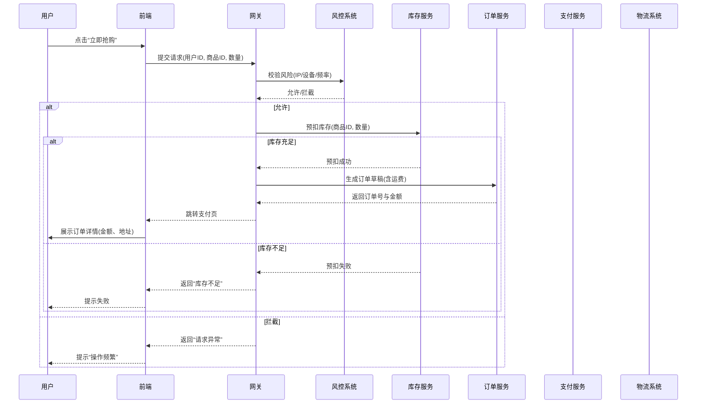

---

### **秒杀系统产品说明与业务流程文档**

---

#### **一、产品概述**  
秒杀系统是电商平台中针对限时、限量商品促销的核心模块，旨在短时间内高效处理海量用户请求，保障系统稳定性和数据一致性。系统支持从后台配置到前端交易的全链路管理，核心功能包括**商品配置、库存控制、用户限购、订单处理及物流触发**，适用于大促活动、新品首发等场景。

---

#### **二、后台配置管理**  

##### **1. 配置秒杀商品**  
- **功能说明**：选择参与秒杀的商品并设置活动规则。  
- **操作流程**：  
  1. **商品选择**：从商品库中选择目标商品，需满足以下条件：  
     - 商品状态为“已上架”。  
     - 商品未参与其他冲突活动（如满减、拼团）。  
  2. **设置秒杀价格**：  
     - 输入独立于原价的促销价（需≥平台最低价）。  
     - 支持设置阶梯价（如前100件特价）。  
  3. **活动时间设置**：  
     - 精确配置活动开始与结束时间（支持到秒级）。  
     - 可设置预热时间（前端展示倒计时）。  
  4. **库存配置**：  
     - 设置活动总库存（需≤商品实际库存）。  
     - 支持自动同步商品库存或独立分配秒杀库存池。  
  5. **包邮规则**：  
     - 勾选“包邮”或绑定运费模板（如满X件包邮）。  
  6. **可售区域**：  
     - 按省/市限制销售范围（如仅限华北地区）。  
  7. **购买数量限制**：  
     - 设置单人单账号限购数量（如1件/人）。  
     - 支持设备/IP级限购（防刷单）。  

- **数据校验**：  
  - 价格冲突检测：秒杀价不得低于成本价。  
  - 时间重叠检测：同一商品不可重复参与同期活动。  

---

##### **2. 配置流程图**  
```plaintext
[商品选择] → [设置价格] → [设置时间] → [分配库存]  
→ [包邮/运费规则] → [区域限制] → [限购设置] → [活动发布]  
```

---

#### **三、前端展示与交易流程**  

##### **1. 商品展示页**  
- **展示内容**：  
  - **基础信息**：商品名称、主图、原价/秒杀价对比。  
  - **活动状态**：  
    - 未开始：显示倒计时（如“距开始02:30:00”）。  
    - 进行中：高亮“立即抢购”按钮，实时显示剩余库存。  
    - 已结束：置灰按钮，提示“活动结束”。  
  - **用户提示**：  
    - 限购数量（如“每人限购1件”）。  
    - 包邮标识（如“全国包邮”）。  
    - 区域限制提示（如“仅支持北京地区购买”）。  

- **交互逻辑**：  
  - 用户进入页面时，前端调用接口获取实时库存与活动状态。  
  - 按钮动态控制：  
    - 未登录用户点击抢购，跳转登录页。  
    - 区域不符用户，提示“当前地区不可购买”。  

---

##### **2. 下单流程**  


---

##### **3. 支付与库存扣减**  
- **支付流程**：  
  1. 用户选择支付方式（微信/支付宝/银行卡）。  
  2. 前端调用支付服务，生成第三方支付链接。  
  3. 用户完成支付后，支付服务通知订单系统更新状态。  

- **库存最终扣减**：  
  - 支付成功后：  
    - 订单服务调用库存服务，扣减真实库存。  
    - 释放预扣库存池（若采用预扣机制）。  
  - 支付超时（如15分钟未支付）：  
    - 定时任务回滚预扣库存，订单状态变更为“已取消”。  

- **物流订单生成**：  
  - 订单状态变为“已支付”后，自动触发物流系统：  
    1. 推送订单至仓库管理系统（WMS）。  
    2. 生成物流单号并绑定订单。  
    3. 同步物流信息至用户端（如“已发货”）。  

---

##### **4. 状态流转图**  
```plaintext
[待支付] → (支付成功) → [已支付] → [物流发货] → [已完成]  
             ↓(支付超时)  
          [已取消]  
```

---

#### **四、异常处理与风控**  
- **库存超卖**：  
  - 双重校验：下单时预扣库存，支付时最终扣减。  
  - 超卖补偿：异常情况下自动补发优惠券或优先购买权。  
- **支付中断**：  
  - 引导用户重新发起支付，保留订单15分钟。  
- **区域限制冲突**：  
  - 下单时校验用户收货地址，拦截非法区域订单。  

---

#### **五、数据看板与监控**  
- **实时监控**：  
  - 活动期间库存消耗速率、订单成功率、支付转化率。  
- **预警规则**：  
  - 库存低于10%时触发告警，提示运营补充库存。  
  - 支付失败率突增时，自动排查支付通道异常。  

--- 

#### **六、总结**  
本系统通过**分层配置、动态风控、异步处理**，实现秒杀活动的高效管理：  
1. **后台灵活配置**：支持精细化规则，保障活动合规性。  
2. **前端体验优化**：实时状态反馈，减少用户流失。  
3. **交易稳定性**：预扣库存+最终一致性，杜绝超卖风险。  
4. **全链路闭环**：从下单到物流，自动触发关联系统。  

--- 

**附录**：如需技术架构细节（如Redis库存预扣、MQ削峰方案），可另附文档说明。