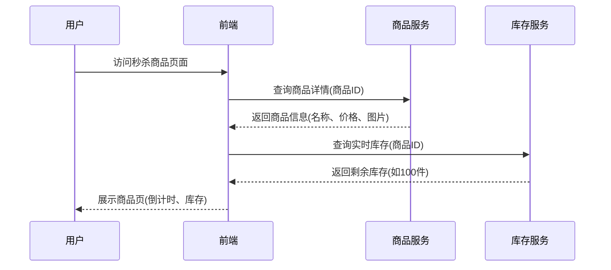
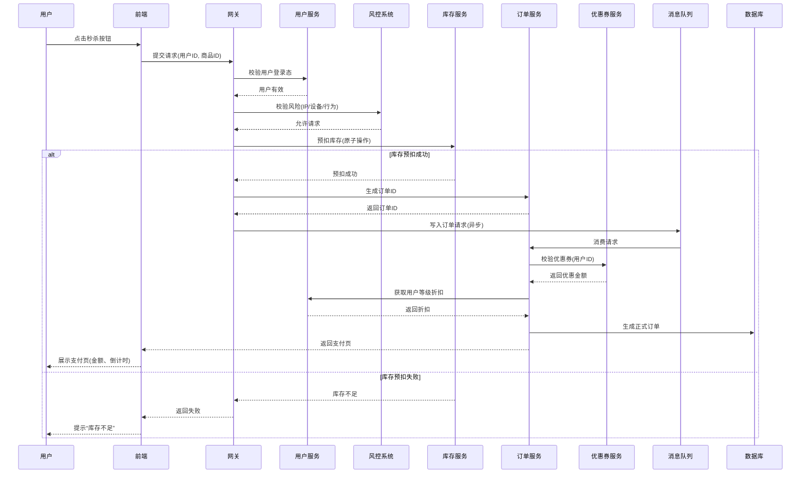
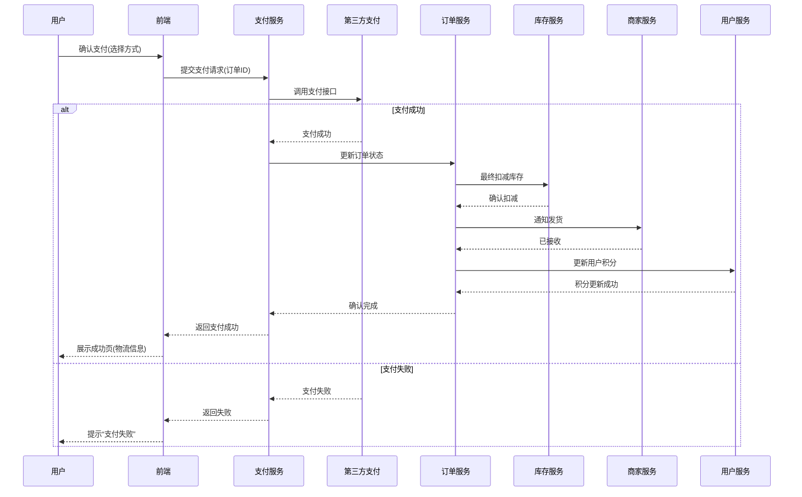

以下是使用 **Mermaid** 绘制的秒杀系统业务流程时序图，分为 **商品详情展示流程** 和 **支付流程**，并标注了关键系统交互与信息展示节点：

---

### **1. 商品详情展示流程**

---

### **2. 秒杀资格校验与订单生成流程**

---

### **3. 支付流程**

---

### **关键说明**
1. **商品详情流程**  
   - 前端通过缓存和CDN减轻服务端压力。  
   - 实时库存展示直接调用库存服务（Redis缓存）。  

2. **秒杀核心流程**  
   - 通过网关层拦截非法请求（用户验证、风控）。  
   - 库存预扣使用Redis原子操作（`DECR`或Lua脚本）。  
   - 订单生成异步化（消息队列缓冲高并发请求）。  

3. **支付流程**  
   - 支付成功后触发库存最终扣减和商家发货。  
   - 用户积分更新与订单状态同步。  

如果需要调整交互细节（如增加重试机制或更复杂的风控逻辑），可以进一步扩展时序图！

