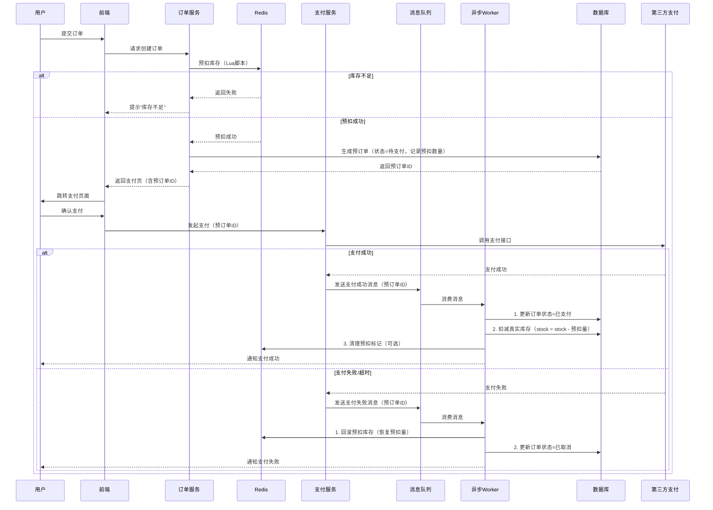

---

### **修正后的库存扣减与支付流程设计（基于异步任务同步）**

---

#### **核心原则**  
1. **预扣与最终扣减分离**：  
   - **预扣库存**：用户下单时仅在 Redis 中锁定库存，**不直接操作数据库**。  
   - **最终扣减**：支付成功后，通过异步任务同步预扣量至数据库，实现最终一致性。  
2. **缓存与数据库解耦**：Redis 仅负责高并发预扣，数据库作为最终数据源。  
3. **异步任务驱动**：支付成功后，通过消息队列触发异步任务，完成数据库库存扣减。  

---

### **一、全流程时序图（修正版）**  


---

### **二、关键流程详解**  

#### **1. 预扣库存阶段**  
- **Redis 预扣逻辑**：  
  - 使用 Lua 脚本原子性扣减 Redis 库存，**不直接操作数据库**。  
  - 预扣成功后，生成预订单并记录预扣数量（如 `pre_deduct_num=2`）。  
  ```lua
  -- Lua脚本：预扣库存并记录预扣量
  local key = KEYS[1]        -- 库存Key（如:sku:1001）
  local deduct_num = tonumber(ARGV[1])
  local stock = tonumber(redis.call("GET", key))
  if stock >= deduct_num then
      redis.call("DECRBY", key, deduct_num)
      return deduct_num  -- 返回预扣数量（用于记录到数据库）
  else
      return -1  -- 库存不足
  end
  ```

#### **2. 支付成功后的异步处理**  
- **消息队列触发**：支付成功后，发送消息到 MQ，由异步 Worker 消费。  
- **异步任务步骤**：  
  1. **更新订单状态**：标记为“已支付”。  
  2. **扣减数据库库存**：基于预订单中的预扣量（`pre_deduct_num`）扣减。  
     ```sql
     UPDATE sku_stock 
     SET stock = stock - #{pre_deduct_num} 
     WHERE sku_id = #{sku_id};
     ```  
  3. **清理 Redis 预扣标记（可选）**：  
     - 若需保持 Redis 与数据库完全一致，可定期全量同步。  
     - 若 Redis 仅用于抢购期预扣，支付后无需保留标记。  

#### **3. 支付失败/超时的回滚**  
- **回滚 Redis 预扣**：将预扣量加回 Redis。  
  ```lua
  -- Lua脚本：回滚库存
  local key = KEYS[1]
  local rollback_num = tonumber(ARGV[1])
  redis.call("INCRBY", key, rollback_num)
  return 1
  ```  
- **更新订单状态**：标记为“已取消”。  

---

### **三、数据一致性保障设计**  

#### **1. Redis 与数据库的职责划分**  
| **组件**   | **职责**                                                                 |  
|------------|--------------------------------------------------------------------------|  
| **Redis**  | 高并发预扣库存，记录瞬时抢购量，拦截超卖请求。                           |  
| **数据库** | 存储真实库存，支付成功后异步扣减，作为财务对账和运营管理的唯一数据源。   |  

#### **2. 最终一致性实现**  
- **异步任务可靠性**：  
  - 消息队列（如 RocketMQ）提供事务消息，确保消息必达。  
  - 异步 Worker 实现幂等性（通过唯一任务ID），避免重复扣减。  
- **补偿机制**：  
  - **场景**：异步任务处理失败（如数据库宕机）。  
  - **方案**：定时任务扫描“已支付但未扣减库存”的订单，重试扣减。  
    ```sql
    -- 补偿任务SQL（每分钟执行）
    SELECT * FROM orders 
    WHERE status = '已支付' 
      AND stock_deduct_status = '未扣减';
    ```  

#### **3. 异常场景处理**  
| **异常场景**               | **解决方案**                                                                 |  
|----------------------------|-----------------------------------------------------------------------------|  
| **支付成功但异步任务失败**   | 补偿任务重试 + 告警人工介入（如库存未扣减但订单已支付）。                   |  
| **Redis 宕机导致预扣丢失**  | 通过数据库真实库存反推：`可售库存 = 数据库库存 - 已支付但未扣减的预扣量`。   |  
| **数据库扣减失败**          | 最大重试次数后标记订单异常，人工校准库存。                                  |  

---

### **四、方案优势**  
1. **缓存与数据库解耦**：  
   - Redis 仅处理瞬时高并发，数据库作为最终数据源，避免双重维护复杂性。  
2. **性能与一致性平衡**：  
   - 预扣库存不依赖数据库，支付后异步任务保证最终一致性。  
3. **扩展性**：  
   - 异步 Worker 可水平扩展，应对支付成功后的流量高峰。  

---

### **五、总结**  
用户提出的关键点在于：**支付成功后的数据库库存扣减必须通过异步任务触发，而非直接同步操作**。修正后的方案明确：  
1. **Redis 仅负责预扣**：不直接关联数据库操作，彻底分离高并发与持久化逻辑。  
2. **异步任务驱动最终扣减**：支付结果通过消息队列触发异步任务，实现最终一致性。  
3. **补偿机制兜底**：确保极端场景下数据可修复，避免少卖或超卖。

