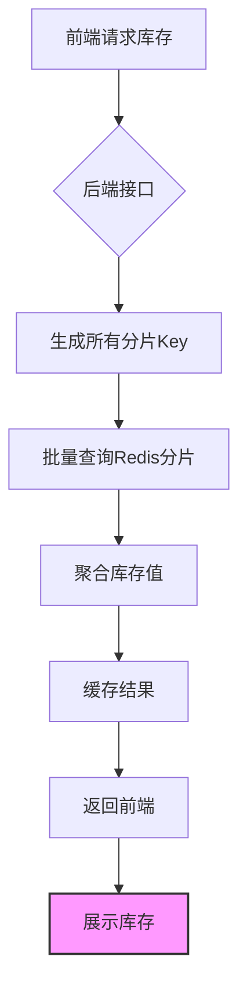

在分布式系统中，当Key被分散到多个节点以解决热Key问题时，前端无需直接处理分散的Key，而是通过后端服务聚合数据后统一展示。以下是具体方案设计及实现步骤：

---

### **1. 后端聚合分散Key的库存数据**
#### **1.1 Key分散策略**
假设原始Key为 `stock:product:123`，分散后可能生成类似以下Key：
```plaintext
stock:product:123:shard1
stock:product:123:shard2
stock:product:123:shard3
```
分散逻辑可以通过 **一致性Hash** 或 **取模分片** 实现（参考知识库[2]）。

#### **1.2 库存聚合逻辑**
后端服务根据商品ID生成所有可能的分散Key，查询每个Key的库存值并合并：
```java
// 示例代码：Java后端聚合库存
public int getAggregatedStock(String productId) {
    int totalStock = 0;
    // 生成所有分片Key
    List<String> keys = generateShardedKeys(productId); // 如：stock:product:123:shard1, ...
    // 使用Redis管道批量查询
    List<Object> results = redisTemplate.executePipelined(
        new RedisCallback<List<Object>>() {
            public List<Object> doInRedis(RedisConnection connection) {
                List<byte[]> keysBytes = keys.stream()
                    .map(key -> key.getBytes())
                    .collect(Collectors.toList());
                List<byte[]> values = connection.mGet(keysBytes.toArray(new byte[0][]));
                return values.stream()
                    .map(value -> value != null ? Integer.parseInt(new String(value)) : 0)
                    .collect(Collectors.toList());
            }
        }
    );
    for (Object result : results) {
        totalStock += (int) result;
    }
    return totalStock;
}
```

---

### **2. 前端展示**
前端只需调用后端接口获取聚合后的库存数据，无需关心Key的分散细节：
```javascript
// 前端请求示例（Axios）
axios.get('/api/stock/product/123')
    .then(response => {
        const totalStock = response.data.totalStock;
        document.getElementById('stock-display').innerText = `剩余库存：${totalStock}`;
    });
```

---

### **3. 数据一致性保障**
#### **3.1 库存更新的原子性**
- **分布式锁**：在更新库存时，使用Redis分布式锁保证同一时间只有一个线程操作（参考知识库[5]）。
- **事务或Lua脚本**：通过Redis的Lua脚本原子性地更新所有分片Key：
  ```lua
  -- Lua脚本示例：扣减库存
  local success = 1
  for _, key in ipairs(KEYS) do
      local current = tonumber(redis.call('GET', key))
      if current < 1 then
          success = 0
      else
          redis.call('DECR', key)
      end
  end
  return success
  ```

#### **3.2 最终一致性**
- **消息队列异步同步**：若某个分片更新失败，通过消息队列（如Kafka）重试（参考知识库[4][6]）。
- **版本号控制**：每个Key携带版本号，确保更新顺序一致（参考知识库[1][5]）。

---

### **4. 性能优化**
#### **4.1 缓存聚合结果**
- **本地缓存**：在应用层使用Caffeine缓存聚合后的库存值：
  ```java
  // Caffeine缓存配置
  private final Cache<String, Integer> stockCache = Caffeine.newBuilder()
      .expireAfterWrite(10, TimeUnit.SECONDS)
      .build(key -> getAggregatedStock(key));
  
  public int getStockFromCache(String productId) {
      return stockCache.get(productId);
  }
  ```

#### **4.2 预计算与分片聚合**
- **预聚合Key**：将分散Key的库存值预先汇总到一个总Key（如 `stock:total:product:123`），通过Redis的`INCR/DECR`维护总库存：
  ```plaintext
  # 分片Key更新时同步总Key
  redis> EVAL "local total = tonumber(redis.call('GET', 'stock:total:product:123') or 0)
               redis.call('DECR', KEYS[1])
               redis.call('DECRBY', 'stock:total:product:123', 1)
               return total - 1" 1 stock:product:123:shard1
  ```

---

### **5. 异常处理与降级**
#### **5.1 分片不可用时的降级**
- **熔断机制**：若某个分片节点不可用，暂时返回最近缓存值或默认值（参考知识库[5]）。
- **渐进式降级**：仅展示总库存的近似值，隐藏分片级细节。

#### **5.2 日志与监控**
- **监控分片健康状态**：通过Prometheus监控Redis节点的延迟和错误率。
- **报警规则**：当某个分片Key的QPS异常升高时，触发扩容或负载均衡。

---

### **6. 总结方案流程图**


---

### **关键点**
1. **前端透明化**：前端无需感知Key的分散逻辑，直接调用聚合接口。
2. **后端聚合**：通过Redis管道或预计算总Key实现高效聚合。
3. **一致性保障**：结合分布式锁、Lua脚本和消息队列确保最终一致性。
4. **性能优化**：本地缓存和分片预聚合减少实时计算开销。

通过以上方案，前端可以无缝展示分散Key后的库存数据，同时系统具备高可用性和抗热点能力。

