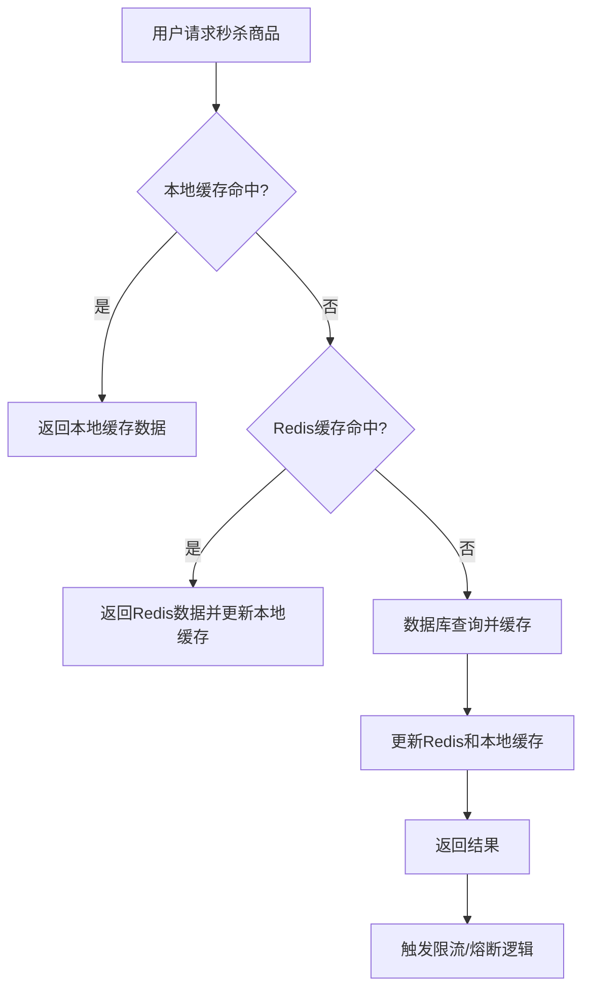

以下是针对秒杀系统热Key问题的整体解决方案细化设计，结合知识库中的技术方案和最佳实践，确保系统高可用、低延迟和抗压能力：

---

### **1. 分布式缓存集群与Key分散**
#### **1.1 Redis集群分片策略**
- **哈希槽分散**：  
  - 使用Redis Cluster的哈希槽（16384个slot）机制，将热点Key分散到不同节点。  
  - **Key设计**：为Key添加随机前缀或哈希标签（如`{random_prefix}:{original_key}`），确保Key均匀分布。  
    ```java
    // 示例：秒杀商品Key设计
    String key = "seckill:product:" + productId + ":" + random.nextInt(100); // 随机前缀分散Key
    ```
  - **数据迁移**：定期监控集群节点的Key访问频率，动态调整Key分布（如使用Redis的`CLUSTER REBALANCE`命令）。

- **主从复制与垂直扩容**：  
  - **主从架构**：每个Redis节点配置主从复制，主节点处理写请求，从节点分担读请求（读写分离）。  
  - **垂直扩容**：对单节点进行硬件升级（如增加内存、SSD存储），提升单节点性能。  
    ```yaml
    # Redis配置示例（增加内存）
    maxmemory 16gb
    maxmemory-policy allkeys-lru
    ```

#### **1.2 本地缓存与多级缓存**
- **本地缓存层**：  
  - 在应用层使用Caffeine或Guava Cache实现本地缓存，减少对Redis的直接访问。  
    ```java
    // Caffeine本地缓存配置
    Cache<String, Product> localCache = Caffeine.newBuilder()
        .maximumSize(10000)          // 缓存上限
        .expireAfterWrite(10, TimeUnit.MINUTES)
        .build();
    ```
  - **缓存穿透防护**：对不存在的Key设置默认值或空对象，避免频繁回源查询。  
    ```java
    // 示例：缓存穿透处理
    public Product getProduct(String key) {
        Product product = localCache.getIfPresent(key);
        if (product == null) {
            product = redisTemplate.opsForValue().get(key);
            if (product == null) {
                product = new Product(); // 空对象占位
                localCache.put(key, product); // 缓存穿透防护
            } else {
                localCache.put(key, product);
            }
        }
        return product;
    }
    ```

---

### **2. 动态缓存刷新与限流策略**
#### **2.1 缓存刷新策略**
- **主动刷新**：  
  - **实时更新**：对秒杀商品库存等实时数据，通过事件驱动（如MQ消息）触发主动刷新。  
    ```java
    // 示例：库存减少后触发刷新
    @RabbitListener(queues = "seckill-refresh")
    public void handleStockUpdate(StockEvent event) {
        String key = "seckill:stock:" + event.getProductId();
        redisTemplate.delete(key); // 强制失效
    }
    ```
  - **定时刷新**：对非实时数据（如商品详情），采用周期性任务（如每5分钟）批量刷新。  
    ```java
    @Scheduled(fixedRate = 300_000) // 每5分钟
    public void scheduledRefresh() {
        List<Product> products = productDao.findAll();
        products.forEach(p -> redisTemplate.opsForValue().set("product:" + p.getId(), p));
    }
    ```

- **延迟刷新**：  
  - 对低频访问的Key，采用“懒加载”策略，仅在首次访问时触发回源加载。  
    ```java
    // 示例：使用Redis的惰性加载（Lazy Loading）
    public Product getProductWithLazyLoad(String key) {
        Product product = redisTemplate.opsForValue().get(key);
        if (product == null) {
            product = productDao.findById(key).orElse(null);
            if (product != null) {
                redisTemplate.opsForValue().set(key, product, 1, TimeUnit.HOURS);
            }
        }
        return product;
    }
    ```

#### **2.2 限流与降级**
- **Redis限流**：  
  - 使用Lua脚本实现令牌桶算法，限制单Key的访问频率。  
    ```lua
    -- Redis Lua限流脚本（令牌桶）
    local key = KEYS[1]
    local capacity = tonumber(ARGV[1]) -- 桶容量
    local refillRate = tonumber(ARGV[2]) -- 每秒填充速率
    local current = tonumber(redis.call('get', key) or "0")
    local now = tonumber(redis.call('time')[1])
    local lastRefill = tonumber(redis.call('hget', key..':meta', 'last_refill') or now)
    -- 计算新增令牌数
    local delta = math.floor((now - lastRefill) * refillRate)
    current = math.min(current + delta, capacity)
    redis.call('hset', key..':meta', 'last_refill', now)
    redis.call('set', key, current)
    if current >= 1 then
        redis.call('decr', key)
        return 1 -- 允许请求
    else
        return 0 -- 拒绝请求
    end
    ```

- **熔断与降级**：  
  - 使用Sentinel或Hystrix实现熔断机制，当Redis响应超时或错误率过高时，返回降级数据（如静态页面或默认值）。  
    ```java
    @HystrixCommand(fallbackMethod = "getDefaultProduct", threadPoolKey = "seckill")
    public Product getSeckillProduct(String productId) {
        return redisTemplate.opsForValue().get("product:" + productId);
    }
    ```

---

### **3. 预防与监控**
#### **3.1 热Key预防**
- **Key前缀设计**：  
  - 对不同业务场景的Key使用独立前缀，避免Key命名冲突和集中访问。  
    ```plaintext
    seckill:product:12345  // 秒杀商品Key
    user:cart:1001         // 用户购物车Key
    ```
- **Key过期策略**：  
  - 为热点Key设置合理TTL（如1小时），避免长生命周期Key占用内存。  
    ```java
    redisTemplate.opsForValue().set(key, value, 1, TimeUnit.HOURS);
    ```

#### **3.2 实时监控与告警**
- **监控指标**：  
  - 监控Redis集群的CPU、内存、网络IO、命令执行时间（如`EVAL`、`GET`）。  
  - 使用Prometheus+Grafana监控Key访问频率（如`redis_commands`指标）。  
- **告警规则**：  
  - 当单Key QPS超过阈值（如1000次/秒）时触发告警，自动触发扩容或限流。  
  - 对内存占用超过80%的节点，触发自动扩容或数据迁移。

---

### **4. 应急兜底方案**
#### **4.1 流量突增处理**
- **限流降级**：  
  - 当检测到流量超过预期（如QPS突增10倍），自动启用降级策略：  
    - 关闭非核心功能（如商品详情页的评论展示）。  
    - 限制单用户请求频率（如每秒1次）。  
- **数据一致性保障**：  
  - 使用Redis事务或Lua脚本保证库存扣减的原子性。  
    ```lua
    -- 库存扣减Lua脚本
    if redis.call('get', KEYS[1]) > 0 then
        redis.call('DECR', KEYS[1])
        return 1
    else
        return 0
    end
    ```

#### **4.2 数据回源与缓存重建**
- **缓存失效后重建**：  
  - 当Redis节点故障时，通过本地缓存和数据库回源重建数据。  
    ```java
    // 示例：缓存失效后的重建逻辑
    public Product getSafeProduct(String key) {
        Product product = localCache.getIfPresent(key);
        if (product == null) {
            product = redisTemplate.opsForValue().get(key);
            if (product == null) {
                product = productDao.findById(key).orElse(null);
                if (product != null) {
                    redisTemplate.opsForValue().set(key, product, 1, TimeUnit.HOURS);
                    localCache.put(key, product);
                }
            }
        }
        return product;
    }
    ```

---

### **5. 技术选型与部署**
| **模块**         | **技术选型**                     | **说明**                                                                 |
|------------------|----------------------------------|-------------------------------------------------------------------------|
| **缓存层**       | Redis Cluster + Caffeine         | 集群分片抗热Key，本地缓存降低Redis压力                                 |
| **限流降级**     | Sentinel + Hystrix               | 动态限流与熔断降级，保障系统稳定性                                     |
| **监控告警**     | Prometheus + Grafana + ELK       | 实时监控指标，日志分析                                                 |
| **数据存储**     | MySQL + 分库分表                 | 主库处理写请求，从库分担读请求                                         |
| **消息队列**     | RabbitMQ/Kafka                   | 异步处理库存更新、缓存刷新                                             |

---

### **6. 流程示例：秒杀商品访问**


---

### **关键注意事项**
1. **数据一致性**：  
   - 使用Redis事务或Lua脚本保证库存扣减的原子性。  
2. **性能优化**：  
   - 本地缓存优先级高于Redis，避免穿透DB。  
3. **成本控制**：  
   - 根据业务流量动态调整Redis集群规模，避免过度预设资源。  
4. **合规性**：  
   - 遵循数据隐私法规（如GDPR），避免缓存敏感信息。  

通过以上方案，秒杀系统可有效应对热Key问题，同时具备高可用性和弹性扩展能力，确保在千万级流量下稳定运行。


