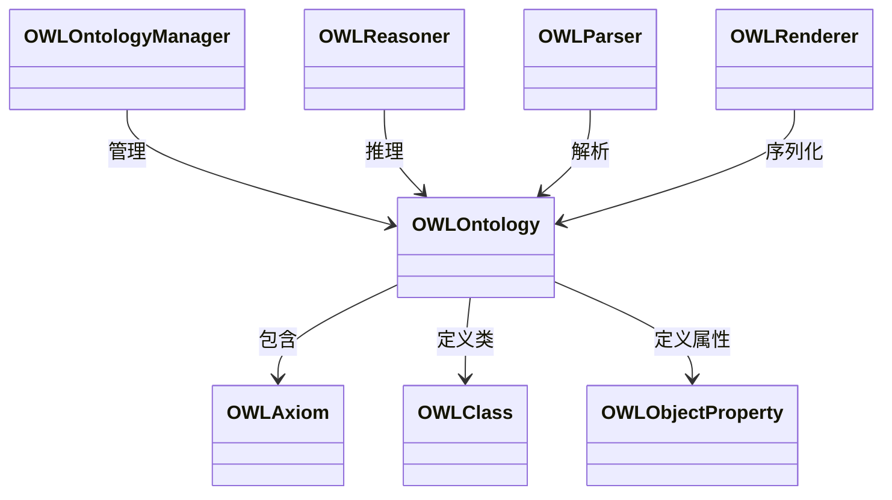
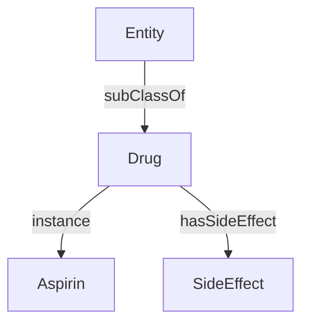

针对 **RDFLib**（Python库）和 **OWL API**（Java框架）在知识表示中应用的详细说明，包含核心功能、典型用法和实际案例：

---

### **1. RDFLib：Python生态的轻量级RDF工具**
#### **核心功能**
| 模块 | 功能描述 |
|------|----------|
| `Graph` | 内存中的RDF图容器，支持三元组操作 |
| `Namespace` | 管理URI命名空间（如`ex = Namespace("http://example.org/")`） |
| `SPARQLProcessor` | 执行SPARQL查询 |
| 序列化 | 支持Turtle/RDF-XML/JSON-LD等格式的读写 |
| 推理 | 集成OWL-RL等推理引擎 |

#### **典型使用场景**
##### (1) 构建RDF知识图谱
```python
from rdflib import Graph, URIRef, Literal, Namespace
from rdflib.namespace import RDF, RDFS

# 定义命名空间
ex = Namespace("http://example.org/ontology/")
g = Graph()

# 添加三元组
einstein = URIRef("http://example.org/Einstein")
g.add((einstein, RDF.type, ex.Physicist))
g.add((einstein, ex.discovered, ex.Relativity))
g.add((ex.Relativity, RDFS.label, Literal("相对论")))

# 序列化为Turtle
g.serialize("physics.ttl", format="turtle")
```

##### (2) SPARQL知识查询
```python
query = """
PREFIX ex: <http://example.org/ontology/>
SELECT ?scientist ?discovery WHERE {
  ?scientist ex:discovered ?discovery.
  ?discovery rdfs:label ?name.
}
"""
for row in g.query(query):
    print(f"{row.scientist} 发现了 {row.name}")
# 输出: http://example.org/Einstein 发现了 相对论
```

##### (3) 集成OWL推理
```python
from rdflib.plugins.sparql import prepareQuery
from owlrl import DeductiveClosure, OWLRL_Extension

# 添加本体公理
g.add((ex.Physicist, RDFS.subClassOf, ex.Scientist))

# 执行OWL推理
DeductiveClosure(OWLRL_Extension).expand(g)

# 查询所有科学家（包含推理结果）
query = prepareQuery("""
  SELECT ?scientist WHERE {
    ?scientist a ex:Scientist.
  }
""")
print(list(g.query(query)))  # 包含Einstein
```

#### **优势场景**
- 快速原型开发
- 中小规模知识图谱（<100万三元组）
- 与Python数据科学生态（Pandas, Numpy）集成

---

### **2. OWL API：企业级本体工程框架**
#### **核心架构**


#### **典型工作流**
##### (1) 构建医疗本体
```java
import org.semanticweb.owlapi.apibinding.OWLManager;
import org.semanticweb.owlapi.model.*;

// 创建本体管理器
OWLOntologyManager manager = OWLManager.createOWLOntologyManager();
OWLDataFactory df = manager.getOWLDataFactory();

// 创建新本体
IRI ontologyIRI = IRI.create("http://medical.org/ontology");
OWLOntology ontology = manager.createOntology(ontologyIRI);

// 定义类和属性
OWLClass drugClass = df.getOWLClass(IRI.create(ontologyIRI + "#Drug"));
OWLClass sideEffectClass = df.getOWLClass(IRI.create(ontologyIRI + "#SideEffect"));
OWLObjectProperty hasSideEffect = df.getOWLObjectProperty(IRI.create(ontologyIRI + "#hasSideEffect"));

// 添加公理：药物可能产生副作用
OWLAxiom axiom = df.getOWLObjectPropertyDomainAxiom(
    hasSideEffect, 
    drugClass
);
manager.addAxiom(ontology, axiom);
```

##### (2) 执行自动推理
```java
// 添加实例
OWLNamedIndividual aspirin = df.getOWLNamedIndividual(IRI.create(ontologyIRI + "#Aspirin"));
OWLClassAssertionAxiom classAxiom = df.getOWLClassAssertionAxiom(drugClass, aspirin);
manager.addAxiom(ontology, classAxiom);

// 使用HermiT推理机
OWLReasonerFactory reasonerFactory = new ReasonerFactory();
OWLReasoner reasoner = reasonerFactory.createReasoner(ontology);

// 获取Aspirin的所有类型（含推理结果）
NodeSet<OWLClass> types = reasoner.getTypes(aspirin, true);
types.entities().forEach(cls -> 
    System.out.println("类型: " + cls.getIRI().getShortForm()));
// 输出: 类型: Drug (显式)  类型: Entity (隐含父类)
```

##### (3) 本体可视化（集成Protégé）
```java
// 保存为OWL/XML格式
manager.saveOntology(ontology, 
    new OWLXMLDocumentFormat(), 
    IRI.create("file:///medical.owl")
);
```
在Protégé中打开后显示：


#### **关键优势**
- **完整OWL 2支持**：兼容所有描述逻辑特性
- **多推理机集成**：HermiT, Elk, Pellet等
- **工业级性能**：支持十亿级三元组
- **可视化扩展**：与Protégé深度集成

---

### **工具对比：适用场景选择**
| **维度** | RDFLib | OWL API |
|----------|--------|---------|
| **语言平台** | Python | Java |
| **知识复杂度** | RDF/SKOS | OWL 2 DL |
| **推理能力** | 基础推理 | 完备推理 |
| **执行性能** | <1M三元组 | >1B三元组 |
| **典型用户** | 数据科学家 | 本体工程师 |
| **学习曲线** | 平缓 | 陡峭 |

---

### **联合应用案例：药物副作用预警系统**
#### **步骤1：用RDFLib构建初始知识库**
```python
# 从CSV抽取药物-副作用关系
import pandas as pd
df = pd.read_csv("drug_effects.csv")
g = Graph()

for _, row in df.iterrows():
    drug = URIRef(f"http://medical.org/{row['drug_id']}")
    effect = URIRef(f"http://medical.org/{row['effect_id']}")
    g.add((drug, MED.hasSideEffect, effect))
```

#### **步骤2：用OWL API实现逻辑推理**
```java
// 定义规则：肝病患者禁用伤肝药物
OWLClass liverPatient = df.getOWLClass(IRI.create("#LiverPatient"));
OWLClass hepatotoxicDrug = df.getOWLClass(IRI.create("#HepatotoxicDrug"));
OWLAxiom rule = df.getOWLSubClassOfAxiom(
    liverPatient,
    df.getOWLObjectComplementOf(
        df.getOWLObjectSomeValuesFrom(MED.takes, hepatotoxicDrug)
    )
);
```

#### **步骤3：执行安全检测**
```python
# Python调用OWL API（通过JPype）
import jpype
jpype.startJVM()
ontology = jpype.JClass("org.semanticweb.owlapi.model.OWLOntology").load("rules.owl")

# 检查患者用药方案
if reasoner.isSatisfiable(patient_profile):
    print("用药安全")
else:
    print("风险警告：肝病患者使用伤肝药物！")
```

---

### **最佳实践建议**
1. **分层架构**：
   - 底层存储：RDFLib处理原始数据
   - 逻辑层：OWL API实现业务规则
   - 接口层：SPARQL端点提供查询服务

2. **性能优化**：
   ```mermaid
   graph LR
     A[RDFLib预处理] --> B[批量导入三元组]
     B --> C[OWL API构建本体]
     C --> D[增量推理]
   ```

3. **错误处理模式**：
   ```java
   try {
       OWLAxiom axiom = ...;
       manager.addAxiom(ontology, axiom);
       reasoner.flush(); // 刷新推理状态
   } catch (OWLOntologyChangeException e) {
       logger.error("本体冲突: " + e.getAxiom());
   }
   ```

RDFLib 6.0+已支持与OWL API的互操作（通过rdflib-owlapi桥接），可在Python中直接调用Java推理引擎，实现两全其美的解决方案。