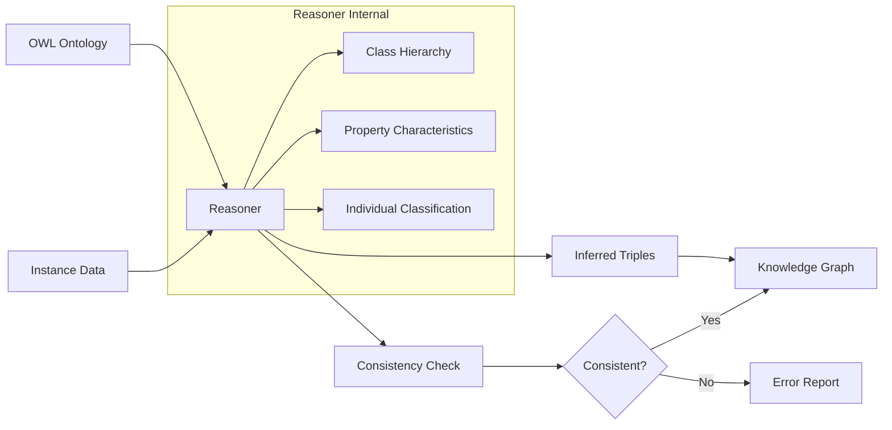
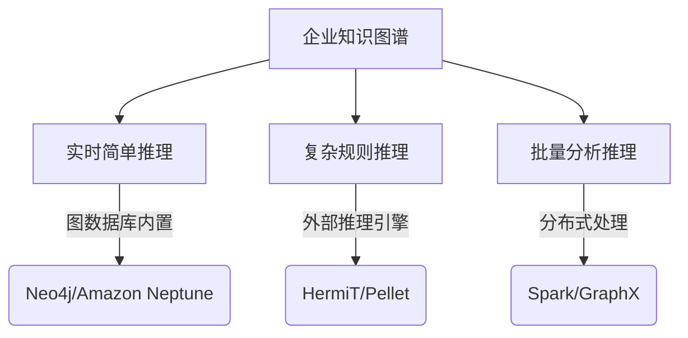
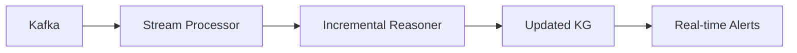

# OWL推理深度解析：原理、机制与企业级应用

## OWL推理的核心原理

OWL（Web Ontology Language）推理基于描述逻辑（Description Logic），通过形式化的语义规则自动推导隐含知识。其核心机制是通过预定义的本体公理和个体数据，利用推理引擎自动发现未显式声明的知识。

### OWL推理的数学基础
描述逻辑使用三元组 `<概念, 角色, 个体>` 的形式化表达：
- **概念(Concept)**：类（如 `Company`, `HighRiskCompany`）
- **角色(Role)**：属性（如 `hasSubsidiary`, `controls`）
- **个体(Individual)**：实例（如 `Tencent`, `Alibaba`）

推理的本质是计算模型 `I = (Δ^I, ·^I)` 的满足关系，其中：
- Δ^I 是解释域
- ·^I 是解释函数

## OWL推理的核心机制

### 1. 类层次推理 (Subsumption)
根据类公理推导类的包含关系

```owl
:TechCompany rdfs:subClassOf :Company .
:AICompany rdfs:subClassOf :TechCompany .

# 推理结果
:AICompany rdfs:subClassOf :Company .
```

### 2. 属性特征推理 (Property Characteristics)
利用属性声明进行关系推导

#### 传递性 (TransitiveProperty)
```owl
:controls a owl:TransitiveProperty .

:CompanyA :controls :CompanyB .
:CompanyB :controls :CompanyC .

# 推理结果
:CompanyA :controls :CompanyC .
```

#### 对称性 (SymmetricProperty)
```owl
:partner a owl:SymmetricProperty .

:CompanyA :partner :CompanyB .

# 推理结果
:CompanyB :partner :CompanyA .
```

### 3. 属性链推理 (Property Chains)
通过属性链推导新关系

```owl
:ownsFactory owl:propertyChainAxiom (:ownsLand :hasFactory) .

:CompanyA :ownsLand :LandParcel .
:LandParcel :hasFactory :FactoryX .

# 推理结果
:CompanyA :ownsFactory :FactoryX .
```

### 4. 个体分类 (Individual Classification)
基于类定义自动分类个体

```owl
:MonopolyCompany owl:equivalentClass [
    a owl:Restriction ;
    owl:onProperty :marketShare ;
    owl:hasValue 0.5
] .

:CompanyB :marketShare 0.6 .

# 推理结果
:CompanyB a :MonopolyCompany .
```

### 5. 一致性检测 (Consistency Checking)
识别逻辑冲突

```owl
:Company owl:disjointWith :Individual .

:CompanyA a :Company, :Individual .

# 推理结果
Inconsistent ontology! (矛盾)
```

## 企业知识图谱中的OWL推理案例

### 案例1：实际控制人识别
**本体定义**：
```owl
# 定义实际控制人：直接或间接持股≥50%
:ActualController owl:equivalentClass [
    owl:intersectionOf (
        :Person
        [ a owl:Restriction ;
          owl:onProperty :totalShareRatio ;
          owl:someValuesFrom [
              a rdfs:Datatype ;
              owl:onDatatype xsd:float ;
              owl:withRestrictions [ xsd:minInclusive 0.5 ]
          ]
        ]
    )
] .

# 计算总持股比例
:totalShareRatio owl:propertyChainAxiom (
    :directShareRatio
    :indirectShareRatio
) .
```

**数据实例**：
```turtle
:LiQing :directShareRatio 0.3 ;    # 直接持股30%
         :indirectShareRatio 0.25 . # 间接持股25%

:WangMing :directShareRatio 0.4 ;
          :indirectShareRatio 0.15 .
```

**推理过程**：
1. 计算总持股比例：
   - LiQing: 0.3 + 0.25 = 0.55
   - WangMing: 0.4 + 0.15 = 0.55
2. 应用实际控制人定义：
   - 两人持股均≥50%
3. 分类结果：
   ```turtle
   :LiQing a :ActualController .
   :WangMing a :ActualController .
   ```

### 案例2：风险传导分析
**本体定义**：
```owl
# 定义风险传导规则
:RiskPropagation owl:propertyChainAxiom (
    :hasSubsidiary
    :hasRisk
) .

# 高风险企业定义
:HighRiskCompany owl:equivalentClass [
    owl:unionOf (
        [ a owl:Restriction ;
          owl:onProperty :hasLawsuit ;
          owl:someValuesFrom [
              a owl:Restriction ;
              owl:onProperty :lawsuitAmount ;
              owl:minInclusive 10000000
          ]
        ]
        [ a owl:Restriction ;
          owl:onProperty :creditRating ;
          owl:hasValue "CCC"
        ]
    )
] .
```

**数据实例**：
```turtle
:ParentCo :hasSubsidiary :SubsidiaryA .
:SubsidiaryA :hasLawsuit [
        :lawsuitAmount 50000000 ; # 5000万诉讼
        :lawsuitType "Fraud"
    ] .
```

**推理过程**：
1. 识别高风险企业：
   - SubsidiaryA 有5000万诉讼 → HighRiskCompany
2. 应用风险传导规则：
   - ParentCo hasSubsidiary SubsidiaryA
   - SubsidiaryA hasRisk HighRisk
   - ∴ ParentCo hasRisk HighRisk (通过RiskPropagation)
3. 推理结果：
   ```turtle
   :SubsidiaryA a :HighRiskCompany .
   :ParentCo :hasRisk :HighRisk .
   ```

### 案例3：供应链依赖分析
**本体定义**：
```owl
# 关键供应商定义
:CriticalSupplier owl:equivalentClass [
    a owl:Restriction ;
    owl:onProperty :suppliesComponent ;
    owl:allValuesFrom :EssentialComponent
] .

# 供应链风险
:SupplyChainRisk owl:equivalentClass [
    owl:intersectionOf (
        :CriticalSupplier
        [ a owl:Restriction ;
          owl:onProperty :location ;
          owl:hasValue :HighRiskRegion
        ]
    )
] .

# 传递依赖
:supplyDependency a owl:TransitiveProperty .
```

**数据实例**：
```turtle
:ManufacturerA :supplier :SupplierB .
:SupplierB :supplier :SupplierC ;
           :location :RegionX .
:SupplierC :suppliesComponent :ChipX .

:ChipX a :EssentialComponent .
:RegionX a :HighRiskRegion .
```

**推理过程**：
1. 识别关键供应商：
   - SupplierC 提供关键组件 → CriticalSupplier
2. 识别高风险区域供应商：
   - SupplierC 位于高风险区域 → SupplyChainRisk
3. 应用传递依赖：
   - ManufacturerA → SupplierB → SupplierC
   - ∴ ManufacturerA supplyDependency SupplierC
4. 最终推理：
   ```turtle
   :SupplierC a :SupplyChainRisk .
   :ManufacturerA :hasSupplyChainRisk :SupplierC .
   ```

## OWL推理引擎工作流程



## 企业级推理优化策略

### 1. 增量推理
仅处理变更数据，避免全量推理
```python
from owlrl import IncrementalOWLRL_Semantics

# 初始推理
DeductiveClosure(IncrementalOWLRL_Semantics).expand(kg)

# 添加新数据
kg.add((co:NewCompany, rdf:type, ent:Company))

# 增量推理
DeductiveClosure(IncrementalOWLRL_Semantics).expand(
    kg, 
    added_props=[(co:NewCompany, rdf:type, ent:Company)]
)
```

### 2. 分层推理架构


### 3. 推理规则优化
```owl
# 优化前（低效）
:ParentCompany owl:equivalentClass [
    a owl:Restriction ;
    owl:onProperty :hasSubsidiary ;
    owl:minCardinality 1
] .

# 优化后（高效）
:ParentCompany owl:equivalentClass [
    a owl:Restriction ;
    owl:onProperty :hasSubsidiary ;
    owl:someValuesFrom :Company
] .
```

## OWL推理在企业中的典型应用

### 1. 风险传导网络分析
**问题**：集团内一家子公司出现风险，如何评估对整个集团的影响？
**推理方案**：
```owl
:RiskPropagation owl:propertyChainAxiom (
    :hasSubsidiary
    :hasRisk
) .

:GroupRisk owl:equivalentClass [
    owl:intersectionOf (
        :ParentCompany
        [ a owl:Restriction ;
          owl:onProperty :hasRisk ;
          owl:someValuesFrom :HighRisk
        ]
    )
] .
```
**输出**：自动识别受子公司风险影响的母公司

### 2. 反垄断合规检测
**问题**：企业并购是否构成市场垄断？
**推理方案**：
```owl
:MonopolyMarket owl:equivalentClass [
    a owl:Restriction ;
    owl:onProperty :marketShare ;
    owl:hasValue 0.5
] .

:IllegalAcquisition owl:equivalentClass [
    owl:intersectionOf (
        :Acquisition
        [ a owl:Restriction ;
          owl:onProperty :resultIn ;
          owl:someValuesFrom :MonopolyMarket
        ]
    )
] .
```
**输出**：自动标记可能导致垄断的收购行为

### 3. 供应链韧性评估
**问题**：关键供应商中断对生产的影响程度？
**推理方案**：
```owl
:SingleSourceDependency owl:equivalentClass [
    owl:intersectionOf (
        :EssentialComponent
        [ a owl:Restriction ;
          owl:onProperty :suppliedBy ;
          owl:maxCardinality 1
        ]
    )
] .

:HighRiskComponent owl:equivalentClass [
    owl:intersectionOf (
        :SingleSourceDependency
        [ a owl:Restriction ;
          owl:onProperty :suppliedBy/location ;
          owl:hasValue :HighRiskRegion
        ]
    )
] .
```
**输出**：识别高风险的单源关键零部件

## OWL推理的局限性及解决方案

### 1. 性能瓶颈
**问题**：大规模企业图谱推理缓慢
**解决方案**：
- 增量推理
- 分布式推理框架（如Sparklify）
- 近似推理算法

### 2. 概率推理缺失
**问题**：企业风险通常是概率性的
**解决方案**：扩展为概率OWL
```owl
:HighRiskCompany [
    a pr:ProbabilisticClass ;
    pr:probability 0.8 ;
    pr:definedBy [
        a owl:Restriction ;
        owl:onProperty :debtRatio ;
        owl:greaterThan 0.7
    ]
] .
```

### 3. 动态数据挑战
**问题**：企业数据实时变化
**解决方案**：流式推理架构


## 结论：OWL推理的商业价值

1. **深度洞察**：自动发现企业关联网络中的隐藏风险
   - 股权穿透识别实际控制人
   - 风险传导路径分析
   
2. **合规保障**：实时检测违规行为
   - 反垄断合规
   - 关联交易监控

3. **决策支持**：基于推理的战略分析
   - 供应链韧性评估
   - 并购影响预测

4. **效率提升**：减少人工分析成本
   - 自动生成风险评估报告
   - 实时监控预警

通过OWL推理，企业知识图谱从静态数据存储进化为具有认知能力的决策引擎，在金融风控、供应链管理、合规监管等领域创造核心价值。推理能力使企业数据服务提供商能够提供深度分析产品，如：
- **企业健康诊断报告**：自动生成多维风险评估
- **供应链哨兵系统**：实时监控供应商风险
- **投资决策支持平台**：识别潜在投资机会与风险
