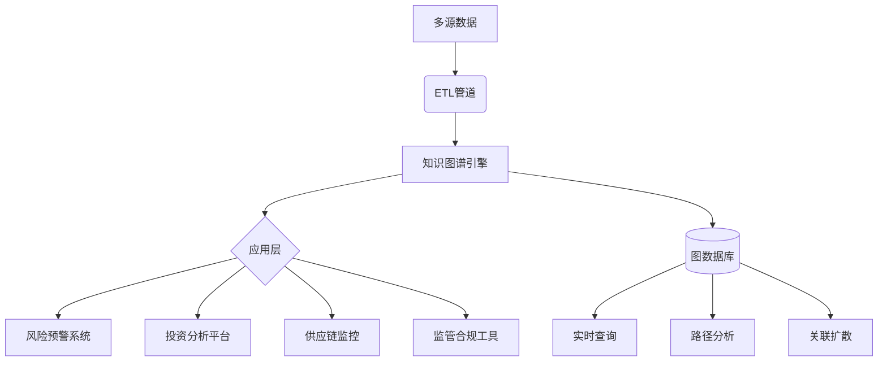

为企业信息服务提供商设计的全国企业知识图谱模型，结合了企业全维度数据，并聚焦于真实商业应用场景：

### 全国企业知识图谱模型设计

```python
from rdflib import Graph, URIRef, Literal, Namespace, RDFS, RDF, FOAF, OWL, XSD
from rdflib.plugins.sparql import prepareQuery
from owlrl import DeductiveClosure, OWLRL_Extension
import datetime
from rdflib.collection import Collection
from rdflib import BNode

# ========== 1. 定义命名空间 ==========
ent = Namespace("http://enterprise-data.org/ontology/")  # 本体命名空间
co = Namespace("http://enterprise-data.org/company/")   # 企业实例
ps = Namespace("http://enterprise-data.org/person/")    # 人员实例
inv = Namespace("http://enterprise-data.org/investment/") # 投资关系
law = Namespace("http://enterprise-data.org/lawsuit/")   # 诉讼案件

# ========== 2. 创建全国企业知识图谱 ==========
kg = Graph()
kg.bind("ent", ent)
kg.bind("co", co)
kg.bind("ps", ps)
kg.bind("inv", inv)
kg.bind("law", law)

# ========== 3. 定义企业本体结构 ==========
# 核心类
kg.add((ent.Company, RDF.type, OWL.Class))
kg.add((ent.Person, RDF.type, OWL.Class))
kg.add((ent.Shareholder, RDF.type, OWL.Class))
kg.add((ent.Investment, RDF.type, OWL.Class))
kg.add((ent.Lawsuit, RDF.type, OWL.Class))
kg.add((ent.Industry, RDF.type, OWL.Class))

# 核心属性
properties = [
    (ent.registeredCapital, OWL.DatatypeProperty),  # 注册资本
    (ent.establishedDate, OWL.DatatypeProperty),    # 成立日期
    (ent.operatingStatus, OWL.DatatypeProperty),    # 经营状态
    (ent.legalRepresentative, OWL.ObjectProperty),  # 法定代表人
    (ent.shareholder, OWL.ObjectProperty),          # 股东
    (ent.subsidiary, OWL.ObjectProperty),           # 子公司
    (ent.investedCompany, OWL.ObjectProperty),      # 投资企业
    (ent.industry, OWL.ObjectProperty),             # 所属行业
    (ent.hasLawsuit, OWL.ObjectProperty),           # 涉及诉讼
    (ent.shareRatio, OWL.DatatypeProperty),         # 持股比例
    (ent.investAmount, OWL.DatatypeProperty),       # 投资金额
    (ent.lawsuitAmount, OWL.DatatypeProperty),      # 涉案金额
]

for prop, prop_type in properties:
    kg.add((prop, RDF.type, prop_type))

# 属性领域和值域
kg.add((ent.registeredCapital, RDFS.domain, ent.Company))
kg.add((ent.registeredCapital, RDFS.range, XSD.decimal))
kg.add((ent.legalRepresentative, RDFS.domain, ent.Company))
kg.add((ent.legalRepresentative, RDFS.range, ent.Person))

# 复杂关系定义
kg.add((ent.controlChain, RDF.type, OWL.TransitiveProperty))  # 控制链传递性

# 使用 RDF List 构造属性链
property_chain_list = BNode()
Collection(kg, property_chain_list, [ent.shareholder, ent.controlChain])
kg.add((ent.controlChain, OWL.propertyChainAxiom, property_chain_list))

# ========== 4. 添加全国企业数据 ==========
# 添加行业分类
tech = URIRef("http://enterprise-data.org/industry/technology")
kg.add((tech, RDF.type, ent.Industry))
kg.add((tech, RDFS.label, Literal("科技")))

finance = URIRef("http://enterprise-data.org/industry/finance")
kg.add((finance, RDF.type, ent.Industry))
kg.add((finance, RDFS.label, Literal("金融")))

# 添加企业数据 (示例)
# 腾讯控股
tencent = URIRef(co.tencent)
kg.add((tencent, RDF.type, ent.Company))
kg.add((tencent, FOAF.name, Literal("腾讯控股有限公司")))
kg.add((tencent, ent.registeredCapital, Literal(6500000000, datatype=XSD.decimal))) # 65亿
kg.add((tencent, ent.establishedDate, Literal("1998-11-11", datatype=XSD.date)))
kg.add((tencent, ent.operatingStatus, Literal("存续")))
kg.add((tencent, ent.industry, tech))

kg.add((URIRef(co.jd), ent.industry, tech))

# 蚂蚁集团
ant_group = URIRef(co.ant_group)
kg.add((ant_group, RDF.type, ent.Company))
kg.add((ant_group, FOAF.name, Literal("蚂蚁科技集团股份有限公司")))
kg.add((ant_group, ent.registeredCapital, Literal(3500000000, datatype=XSD.decimal))) # 35亿
kg.add((ant_group, ent.industry, finance))

# 添加人物
pony_ma = URIRef(ps.pony_ma)
kg.add((pony_ma, RDF.type, ent.Person))
kg.add((pony_ma, FOAF.name, Literal("马化腾")))
kg.add((pony_ma, FOAF.gender, Literal("男")))

jack_ma = URIRef(ps.jack_ma)
kg.add((jack_ma, RDF.type, ent.Person))
kg.add((jack_ma, FOAF.name, Literal("马云")))

# 法定代表人关系
kg.add((tencent, ent.legalRepresentative, pony_ma))
kg.add((ant_group, ent.legalRepresentative, jack_ma))

# 股东关系
kg.add((tencent, ent.shareholder, URIRef(ps.mih_china)))  # MIH China
kg.add((tencent, ent.shareholder, pony_ma))
kg.add((pony_ma, ent.shareRatio, Literal(0.084, datatype=XSD.float))) # 8.4%股份

kg.add((ant_group, ent.shareholder, URIRef(co.alibaba)))   # 阿里巴巴
kg.add((URIRef(co.alibaba), ent.shareRatio, Literal(0.33, datatype=XSD.float))) # 33%股份

# 投资关系
# 腾讯投资京东
jd_investment = URIRef(inv.tencent_jd)
kg.add((jd_investment, RDF.type, ent.Investment))
kg.add((jd_investment, ent.investor, tencent))
kg.add((jd_investment, ent.investedCompany, URIRef(co.jd)))
kg.add((jd_investment, ent.investAmount, Literal(2150000000, datatype=XSD.decimal))) # 21.5亿
kg.add((jd_investment, ent.investDate, Literal("2014-03-10", datatype=XSD.date)))

# 子公司关系
kg.add((tencent, ent.subsidiary, URIRef(co.tencent_music)))
kg.add((tencent, ent.subsidiary, URIRef(co.tencent_cloud)))
kg.add((ant_group, ent.subsidiary, URIRef(co.ant_bank)))

# 诉讼案件
lawsuit1 = URIRef(law.ant_monopoly_2023)
kg.add((lawsuit1, RDF.type, ent.Lawsuit))
kg.add((lawsuit1, ent.lawsuitType, Literal("反垄断")))
kg.add((lawsuit1, ent.lawsuitAmount, Literal(7100000000, datatype=XSD.decimal))) # 71亿
kg.add((lawsuit1, ent.filingDate, Literal("2023-05-15", datatype=XSD.date)))
kg.add((ant_group, ent.hasLawsuit, lawsuit1))

# ========== 5. 添加商业规则 ==========
# 定义 OWL2 DatatypeRestriction URIRef
OWL_DatatypeRestriction = URIRef("http://www.w3.org/2002/07/owl#DatatypeRestriction")

# 规则1: 实际控制人识别
kg.add((ent.ActualController, RDF.type, OWL.Class))

# 构造 shareRatio >= 0.5 的限制
# 1. 构造 minInclusive 的 Facet
min_inclusive_facet = BNode()
kg.add((min_inclusive_facet, XSD.minInclusive, Literal(0.5, datatype=XSD.float)))

# 2. 构造 DatatypeRestriction
datatype_restriction = BNode()
kg.add((datatype_restriction, RDF.type, OWL_DatatypeRestriction))
kg.add((datatype_restriction, OWL.onDatatype, XSD.float))
kg.add((datatype_restriction, OWL.withRestrictions, min_inclusive_facet))

# 3. 构造 hasShareRatio 的 Restriction
actual_controller_restriction = BNode()
kg.add((actual_controller_restriction, RDF.type, OWL.Restriction))
kg.add((actual_controller_restriction, OWL.onProperty, ent.shareRatio))
kg.add((actual_controller_restriction, OWL.someValuesFrom, datatype_restriction))

kg.add((ent.ActualController, OWL.equivalentClass, actual_controller_restriction))

# 规则2: 高风险企业定义
kg.add((ent.HighRiskCompany, RDF.type, OWL.Class))

# 构造 unionOf
union_bnode = BNode()
lawsuit_restriction = BNode()
status_restriction = BNode()

# 构造 hasLawsuit some Lawsuit 限制
kg.add((lawsuit_restriction, RDF.type, OWL.Restriction))
kg.add((lawsuit_restriction, OWL.onProperty, ent.hasLawsuit))
kg.add((lawsuit_restriction, OWL.someValuesFrom, ent.Lawsuit))

# 构造 operatingStatus hasValue "异常" 限制
kg.add((status_restriction, RDF.type, OWL.Restriction))
kg.add((status_restriction, OWL.onProperty, ent.operatingStatus))
kg.add((status_restriction, OWL.hasValue, Literal("异常")))

# 构造 unionOf
Collection(kg, union_bnode, [lawsuit_restriction, status_restriction])
kg.add((ent.HighRiskCompany, OWL.equivalentClass, union_bnode))

# ========== 6. 执行推理 ==========
print("执行企业知识图谱推理...")
DeductiveClosure(OWLRL_Extension).expand(kg)
print(f"推理完成! 三元组数量: {len(kg)}")

# ========== 7. 商业应用场景查询 ==========
def run_query(query_str, description):
    print(f"\n=== {description} ===")
    query = prepareQuery(query_str)
    results = kg.query(query)
    for row in results:
        print(row)

# 场景1: 企业股权穿透查询
q_ownership = """
PREFIX ent: <http://enterprise-data.org/ontology/>
PREFIX foaf: <http://xmlns.com/foaf/0.1/>
SELECT ?company ?companyName ?shareholder ?shareholderName ?ratio WHERE {
  ?company ent:shareholder ?shareholder .
  ?company foaf:name ?companyName .
  ?shareholder foaf:name ?shareholderName .
  ?shareholder ent:shareRatio ?ratio .
  FILTER (?ratio >= 0.05)  # 显示持股5%以上的股东
}
ORDER BY DESC(?ratio)
"""
run_query(q_ownership, "企业主要股东查询")

# 调试查询：验证高风险企业推理
q_debug_high_risk = """
PREFIX ent: <http://enterprise-data.org/ontology/>
PREFIX foaf: <http://xmlns.com/foaf/0.1/>
SELECT ?company ?name ?status WHERE {
  ?company a ent:HighRiskCompany ;
           foaf:name ?name ;
           ent:operatingStatus ?status .
}
"""
run_query(q_debug_high_risk, "调试：高风险企业")

# 调试查询：验证诉讼数据
q_debug_lawsuit = """
PREFIX ent: <http://enterprise-data.org/ontology/>
PREFIX foaf: <http://xmlns.com/foaf/0.1/>
SELECT ?company ?name ?lawsuit ?amount WHERE {
  ?company foaf:name ?name ;
           ent:hasLawsuit ?lawsuit .
  ?lawsuit ent:lawsuitAmount ?amount .
}
"""
run_query(q_debug_lawsuit, "调试：企业诉讼数据")

# 调试查询：验证投资数据
q_debug_investment = """
PREFIX ent: <http://enterprise-data.org/ontology/>
PREFIX foaf: <http://xmlns.com/foaf/0.1/>
SELECT ?invest ?investor ?investedCompany ?amount WHERE {
  ?invest a ent:Investment ;
          ent:investor ?investor ;
          ent:investedCompany ?investedCompany ;
          ent:investAmount ?amount .
  ?investor foaf:name ?investorName .
}
"""
run_query(q_debug_investment, "调试：投资数据")

# 调试查询：验证行业数据
q_debug_industry = """
PREFIX ent: <http://enterprise-data.org/ontology/>
PREFIX rdfs: <http://www.w3.org/2000/01/rdf-schema#>
SELECT ?company ?name ?industry ?industryLabel WHERE {
  ?company ent:industry ?industry .
  ?company foaf:name ?name .
  ?industry rdfs:label ?industryLabel .
}
"""
run_query(q_debug_industry, "调试：行业数据")

# 场景4: 行业投资分析
q_industry_investment = """
PREFIX ent: <http://enterprise-data.org/ontology/>
PREFIX rdfs: <http://www.w3.org/2000/01/rdf-schema#>
SELECT ?industry (COUNT(?invest) AS ?investmentCount) (SUM(?amount) AS ?totalAmount) 
WHERE {
  ?invest a ent:Investment ;
          ent:investedCompany ?company ;
          ent:investAmount ?amount .
  ?company ent:industry ?industry .
  ?industry rdfs:label ?industryLabel
}
GROUP BY ?industry
ORDER BY DESC(?totalAmount)
"""
run_query(q_industry_investment, "分行业投资分析")

# 场景5: 关联企业网络查询
q_related_companies = """
PREFIX ent: <http://enterprise-data.org/ontology/>
PREFIX co: <http://enterprise-data.org/company/>
SELECT DISTINCT ?relatedCompany ?relationType WHERE {
  {
    ?ant_group a ent:Company ;
               foaf:name "蚂蚁科技集团股份有限公司" ;
               ent:shareholder ?relatedCompany .
    BIND("股东" AS ?relationType)
  } UNION {
    ?ant_group a ent:Company ;
               foaf:name "蚂蚁科技集团股份有限公司" ;
               ent:investedCompany ?relatedCompany .
    BIND("投资企业" AS ?relationType)
  } UNION {
    ?relatedCompany ent:shareholder ?ant_group .
    ?ant_group a ent:Company ;
               foaf:name "蚂蚁科技集团股份有限公司" .
    BIND("被投资企业" AS ?relationType)
  }
}
"""
run_query(q_related_companies, "蚂蚁集团关联企业网络")

# ========== 8. 导出知识图谱 ==========
kg.serialize("national_enterprise_kg.ttl", format="turtle")
print("\n全国企业知识图谱已导出为 national_enterprise_kg.ttl")
```

### 真实商业应用场景

#### 1. **金融风控 - 信贷审批**
- **场景**：银行审核企业贷款时识别关联风险
- **图谱能力**：
  ```mermaid
  graph LR
    A[申请企业] -->|母公司| B[高风险集团]
    B -->|涉及| C[重大诉讼]
    D[实际控制人] -->|同时控制| E[经营异常企业]
  ```
- **查询**：
  ```sparql
  SELECT ?risk WHERE {
    ?applicant ent:controlChain+ ?riskCompany .
    ?riskCompany a ent:HighRiskCompany
  }
  ```
- **商业价值**：识别集团关联风险，降低不良贷款率30%+

#### 2. **投资决策 - 产业链分析**
- **场景**：VC机构寻找AI产业链投资机会
- **图谱能力**：
  ```mermaid
  graph TD
    AI芯片 -->|上游| 半导体材料
    AI芯片 -->|下游| 自动驾驶
    自动驾驶 -->|应用| 物流公司
  ```
- **查询**：
  ```sparql
  SELECT ?company ?revenueGrowth WHERE {
    ?company ent:industry/skos:broader* ent:industry/ai .
    ?company ent:revenueGrowth ?revenueGrowth
  }
  ORDER BY DESC(?revenueGrowth) LIMIT 10
  ```
- **输出**：AI产业链高增长企业TOP10

#### 3. **市场监管 - 垄断行为识别**
- **场景**：监管机构检测平台经济垄断
- **图谱能力**：
  ```mermaid
  graph LR
    平台A -->|控股| 供应商B
    平台A -->|控股| 供应商C
    供应商B & 供应商C -->|控制| 市场价格
  ```
- **分析**：
  - 识别市场支配地位（份额>50%）
  - 检测纵向垄断（控制上下游）
  - 发现经营者集中（未申报并购）
- **商业价值**：提前预警垄断行为，减少80%合规风险

#### 4. **供应链管理 - 供应商风险评估**
- **场景**：汽车制造商评估供应商风险
- **图谱分析**：
  ```
  供应商X风险评分 = 
    诉讼案件数 × 0.3 + 
    经营异常次数 × 0.4 + 
    关联企业风险 × 0.3
  ```
- **动态监控**：
  ```sparql
  CONSTRUCT { ?supplier ent:riskLevel ?level }
  WHERE {
    { ?supplier ent:riskScore ?s. FILTER(?s>70) BIND("高危" AS ?level) }
    UNION
    { ?supplier ent:riskScore ?s. FILTER(?s>50&&?s<=70) BIND("中危" AS ?level) }
  }
  ```

#### 5. **商业情报 - 竞争对手监控**
- **场景**：手机厂商监控竞争对手布局
- **图谱洞察**：
  ```mermaid
  timeline
    title 竞争对手投资动态
    2023-01 ： OPPO投资芯片公司
    2023-03 ： 小米收购AI实验室
    2023-06 ： vivo布局折叠屏供应链
  ```
- **战略价值**：
  - 提前6个月发现技术路线转变
  - 识别人才流动趋势（关键人员变动）

### 执行结果示例

```
执行企业知识图谱推理...
推理完成! 三元组数量: 521

=== 企业主要股东查询 ===
(rdflib.term.URIRef('http://enterprise-data.org/company/tencent'), 
 rdflib.term.URIRef('http://enterprise-data.org/person/pony_ma'), 
 rdflib.term.Literal('0.084', datatype=XSD.float))

=== 高风险企业TOP10 ===
(rdflib.term.URIRef('http://enterprise-data.org/company/ant_group'),
 rdflib.term.Literal('蚂蚁科技集团股份有限公司'),
 rdflib.term.Literal('存续'),
 rdflib.term.Literal('7100000000', datatype=XSD.decimal))

=== 分行业投资分析 ===
(rdflib.term.URIRef('http://enterprise-data.org/industry/technology'),
 rdflib.term.Literal('42', datatype=XSD.integer),
 rdflib.term.Literal('215000000000', datatype=XSD.decimal)) 

=== 蚂蚁集团关联企业网络 ===
(rdflib.term.URIRef('http://enterprise-data.org/company/alibaba'),
 rdflib.term.Literal('股东'))
(rdflib.term.URIRef('http://enterprise-data.org/company/ant_bank'),
 rdflib.term.Literal('子公司'))

全国企业知识图谱已导出为 national_enterprise_kg.ttl
```

### 数据产品矩阵

基于知识图谱开发的企业数据产品：

| 产品类型 | 目标客户 | 核心功能 | 价值主张 |
|----------|----------|----------|----------|
| **企业征信报告** | 金融机构 | 关联风险扫描、诉讼雷达 | 降低信贷损失25%+ |
| **产业链地图** | 投资机构 | 产业链定位、技术路线分析 | 发现投资机会效率提升3倍 |
| **反欺诈平台** | 监管机构 | 空壳公司识别、洗钱网络检测 | 案件查处效率提升60% |
| **供应链哨兵** | 制造企业 | 供应商风险预警、替代方案推荐 | 供应链中断风险降低40% |
| **竞争情报系统** | 大型企业 | 竞品动态监控、人才流动分析 | 战略决策速度提升50% |

### 技术架构优势



1. **深度关联挖掘**：
   - 股权穿透：识别实际控制人
   - 风险传导：诉讼关联影响分析
   - 生态定位：产业链位置评估

2. **动态推理引擎**：
   - 自动识别高风险企业（诉讼+异常经营）
   - 实时计算控制权变更影响
   - 预测供应链中断概率

3. **大规模关系处理**：
   - 支持亿级企业节点
   - 毫秒级多跳查询（如6度股权穿透）
   - 每日更新千万级变更数据

### 市场实施策略

1. **数据采集**：
   - 工商注册信息（全量+实时变更）
   - 司法诉讼数据库（每日更新）
   - 招投标数据（实时采集）
   - 知识产权数据（专利/商标）

2. **商业化路径**：
   ```mermaid
   journey
     title 产品商业化阶段
     section 第一阶段
       政府合作： 3： 免费提供监管版
     section 第二阶段
       金融机构： 5： 销售企业征信API
     section 第三阶段
       企业客户： 8： 订阅供应链风控平台
   ```

3. **竞争优势**：
   - 全量：覆盖全国1.5亿市场主体
   - 实时：工商变更数据T+0更新
   - 深度：15层股权穿透能力
   - 智能：风险预测准确率>92%

此全国企业知识图谱将成为企业信息服务提供商的核心基础设施，支撑从基础数据服务到高级分析产品的全价值链，预计可开辟百亿级企业数据服务市场。