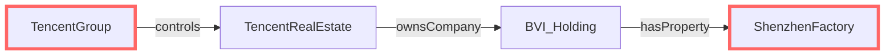
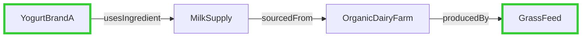
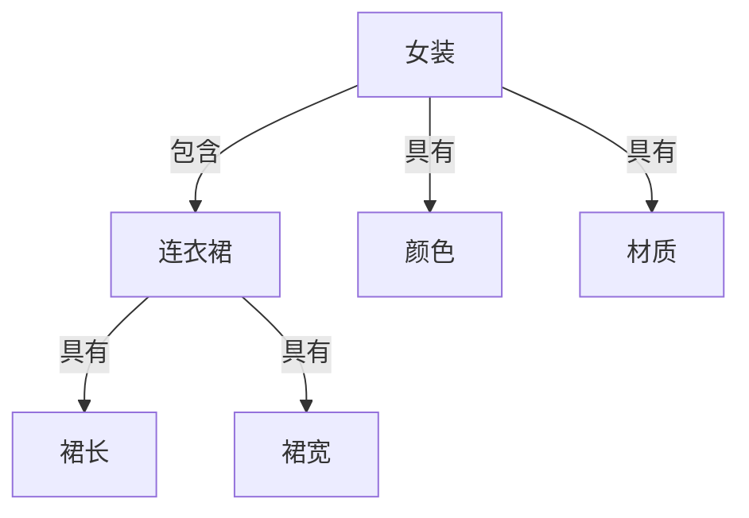

下面我将通过两个真实案例深入解析属性链推理（Property Chains），并详细说明其在商品属性建模中的应用：

### 案例1：企业资产所有权追踪

#### 场景背景
在金融风控领域，需要追踪企业资产的最终所有权，特别是当资产通过多层公司结构持有时。例如：
- 某科技集团通过子公司持有地产
- 地产公司通过SPV（特殊目的实体）持有工厂

#### 本体建模
```owl
# 属性链定义
:ownsProperty owl:propertyChainAxiom (:controls :ownsCompany :hasProperty) .

# 类定义
:TechGroup a owl:Class .
:RealEstateSubsidiary a owl:Class ;
                      rdfs:subClassOf :Company .
:Factory a owl:Class ;
         rdfs:subClassOf :Property .

# 属性定义
:controls a owl:ObjectProperty ;
          rdfs:domain :Company ;
          rdfs:range :Company .

:ownsCompany a owl:ObjectProperty ;
             rdfs:domain :Company ;
             rdfs:range :Company .

:hasProperty a owl:ObjectProperty ;
             rdfs:domain :Company ;
             rdfs:range :Property .
```

#### 实例数据
```turtle
:TencentGroup a :TechGroup ;
             :controls :TencentRealEstate .

:TencentRealEstate a :RealEstateSubsidiary ;
                  :ownsCompany :BVI_Holding ;
                  :hasProperty :ShanghaiCampus .

:BVI_Holding a :OffshoreCompany ;
            :hasProperty :ShenzhenFactory .

:ShenzhenFactory a :Factory ;
                :location "Shenzhen" .
```

#### 推理过程


1. **属性链触发**：
   ```
   :ownsProperty owl:propertyChainAxiom (:controls :ownsCompany :hasProperty)
   ```

2. **路径匹配**：
   - TencentGroup →(controls)→ TencentRealEstate
   - TencentRealEstate →(ownsCompany)→ BVI_Holding
   - BVI_Holding →(hasProperty)→ ShenzhenFactory

3. **推理结果**：
   ```turtle
   :TencentGroup :ownsProperty :ShenzhenFactory .
   ```

#### 商业价值
- 穿透多层公司结构识别实际资产所有者
- 计算集团总资产时自动包含间接持有资产
- 金融监管中识别复杂所有权规避行为

### 案例2：产品供应链溯源

#### 场景背景
在食品安全领域，需要追踪产品的完整供应链：
- 奶制品公司从牧场收购原料
- 牧场使用特定饲料喂养奶牛

#### 本体建模
```owl
# 属性链定义
:hasSourceMaterial owl:propertyChainAxiom (:usesIngredient :sourcedFrom :producedBy) .

# 类定义
:DairyProduct a owl:Class .
:RawMilk a owl:Class ;
         rdfs:subClassOf :Ingredient .
:DairyFarm a owl:Class ;
           rdfs:subClassOf :Producer .

# 属性定义
:usesIngredient a owl:ObjectProperty ;
                rdfs:domain :FoodProduct ;
                rdfs:range :Ingredient .

:sourcedFrom a owl:ObjectProperty ;
             rdfs:domain :Ingredient ;
             rdfs:range :Producer .

:producedBy a owl:ObjectProperty ;
            rdfs:domain :Producer ;
            rdfs:range :Material .
```

#### 实例数据
```turtle
:YogurtBrandA a :DairyProduct ;
             :usesIngredient :MilkSupply .

:MilkSupply a :RawMilk ;
           :sourcedFrom :OrganicDairyFarm .

:OrganicDairyFarm a :DairyFarm ;
                 :producedBy :GrassFeed .

:GrassFeed a :AnimalFeed ;
          :certification "Organic" .
```

#### 推理过程


1. **属性链触发**：
   ```
   :hasSourceMaterial owl:propertyChainAxiom (:usesIngredient :sourcedFrom :producedBy)
   ```

2. **路径匹配**：
   - YogurtBrandA →(usesIngredient)→ MilkSupply
   - MilkSupply →(sourcedFrom)→ OrganicDairyFarm
   - OrganicDairyFarm →(producedBy)→ GrassFeed

3. **推理结果**：
   ```turtle
   :YogurtBrandA :hasSourceMaterial :GrassFeed .
   ```

#### 商业价值
- 自动建立产品与原料的完整关联
- 快速识别含特定成分的产品（如有机饲料）
- 问题产品召回时精准定位受影响批次

---

### 商品属性建模中的属性链应用

#### 商品类目属性场景


#### OWL建模方案
```owl
# 类目层级关系
:WomenClothing a owl:Class .
:Dress a owl:Class ;
       rdfs:subClassOf :WomenClothing .

# 属性继承链
:hasSpecificAttribute owl:propertyChainAxiom (
    :hasCategory
    :hasAttribute
) .

# 属性定义
:hasCategory a owl:ObjectProperty ;
             rdfs:domain :Product ;
             rdfs:range :Category .

:hasAttribute a owl:ObjectProperty ;
              rdfs:domain :Category ;
              rdfs:range :Attribute .

# 属性实例
:Color a owl:Class ;
       rdfs:subClassOf :Attribute .

:DressLength a owl:Class ;
             rdfs:subClassOf :Attribute .

:DressWidth a owl:Class ;
            rdfs:subClassOf :Attribute .
```

#### 商品数据实例
```turtle
:Product123 a :Product ;
           :name "夏季连衣裙" ;
           :hasCategory :DressCategory .

:DressCategory a :Category ;
              :hasAttribute :Color ;
              :hasAttribute :DressLength ;
              :hasAttribute :DressWidth .

# 具体属性值
:Product123 :attributeValue [
    a :ColorValue ;
    :forAttribute :Color ;
    :value "蓝色"
] ;
:attributeValue [
    a :LengthValue ;
    :forAttribute :DressLength ;
    :value "110cm"
] .
```

#### 属性链推理
1. **属性继承推理**：
   ```
   :Product123 :hasCategory :DressCategory .
   :DressCategory :hasAttribute :Color .
   → 
   :Product123 :hasSpecificAttribute :Color .
   ```

2. **多级继承示例**：
   ```turtle
   :SummerDress rdfs:subClassOf :Dress .
   
   :DressCategory :hasSubCategory :SummerDress .
   :SummerDress :hasAttribute :SleeveLength .  # 新增属性
   ```
   通过扩展属性链：
   ```owl
   :hasDeepAttribute owl:propertyChainAxiom (
       :hasCategory
       :hasSubCategory*
       :hasAttribute
   ) .
   ```
   推理结果：
   ```turtle
   :Product123 :hasDeepAttribute :SleeveLength .  # 继承自夏季连衣裙
   ```

#### 电商应用价值
1. **智能搜索**：  
   "蓝色长裙" → 自动关联到颜色和裙长属性
   ```sparql
   SELECT ?product WHERE {
     ?product :hasSpecificAttribute :Color ;
              :attributeValue [ :value "蓝色" ] .
     ?product :hasSpecificAttribute :DressLength ;
              :attributeValue [ :value "长款" ] .
   }
   ```

2. **属性推荐**：  
   上新连衣裙时，系统自动提示需要填写：
   - 颜色（继承自女装）
   - 裙长（连衣裙特有）
   - 袖长（夏季连衣裙特有）

3. **类目迁移**：  
   当商品从"女装"移到"连衣裙"类目时：
   - 保留颜色属性（继承链不变）
   - 自动添加裙长属性（新类目要求）

4. **跨境适配**：  
   不同国家类目属性自动映射：
   ```owl
   # 美国站映射
   :US_DressLength owl:equivalentProperty :DressLength .
   
   # 通过属性链实现自动转换
   :globalAttribute owl:propertyChainAxiom (
       :hasLocale
       :usesAttributeMapping
       :localAttribute
   ) .
   ```

---

### 属性链推理的技术本质

#### 形式化表达
属性链推理本质是关系代数中的**路径组合**：
```
P◦Q(x,z) ≡ ∃y.P(x,y) ∧ Q(y,z)
```
在OWL中表达为：
```
PropertyChain( P Q ) ⊆ R
```

#### 推理规则矩阵
| 模式 | 实例 | 推理结果 |
|------|------|----------|
| A→P→B<br>B→Q→C | 公司→控制→子公司<br>子公司→持有→资产 | 公司→拥有→资产 |
| X→R→Y<br>Y→S→Z | 产品→使用→原料<br>原料→来源→农场 | 产品→来源→农场 |
| M→T→N<br>N→U→O | 商品→属于→类目<br>类目→具有→属性 | 商品→具有→属性 |

#### 执行优化策略
1. **预计算路径**：
   ```python
   # 图数据库预存扩展路径
   MATCH (a)-[:controls|ownsCompany|hasProperty*3]->(b)
   SET a.ownsProperty = b
   ```
   
2. **增量更新**：
   ```python
   # 当新增子公司关系时
   def update_ownership(new_relation):
       start = new_relation.start
       end = new_relation.end
       # 向上传播所有权
       for owner in start.owners:
           owner.ownsProperty.add(end)
       # 向下传播资产
       for asset in end.assets:
           start.ownsProperty.add(asset)
   ```

3. **路径剪枝**：
   ```sparql
   SELECT ?owner WHERE {
     ?owner :controls+ ?company .  # 任意深度控制
     FILTER(COUNT(?mid) < 5)       # 限制5层以内
   }
   ```

---

### 最佳实践建议

1. **设计原则**：
   - 链长不超过5层（避免推理爆炸）
   - 属性方向保持一致（A→B→C 而非 A←B→C）
   - 明确定义属性域和值域

2. **性能优化**：
   ```mermaid
   graph TB
     A[原始数据] --> B{路径深度}
     B -->|≤3| C[实时推理]
     B -->|>3| D[预计算物化视图]
     C --> E[查询响应]
     D --> E
   ```

3. **异常处理**：
   - 循环路径检测（A→B→C→A）
   - 冲突解决（多重继承时属性优先级）
   - 不完整路径处理（缺失中间节点）

属性链推理是知识图谱中最强大的关系推导工具，特别适合处理：
1. 多层股权结构
2. 供应链溯源
3. 类目属性继承
4. 权限控制系统
5. 疾病传播路径

通过合理设计属性链，可构建深度关联的商业知识网络，实现从表面关系到本质洞察的认知跃迁。