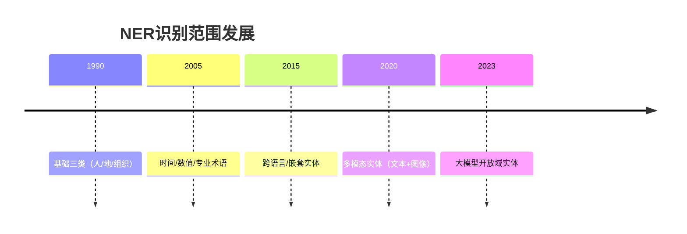

命名实体识别（NER）的目标是从非结构化文本中检测和分类预定义的实体类别。以下是NER系统通常识别的核心内容分类及示例：

---

### **一、基础实体类型（通用领域）**
| 实体类型       | 英文标签 | 示例                          | 特殊挑战                     |
|----------------|----------|-------------------------------|----------------------------|
| **人名**       | PER      | "马云"、"Elon Musk"           | 跨文化姓名（如"金·凯瑞"）、昵称 |
| **地名**       | LOC      | "巴黎"、"黄石国家公园"        | 嵌套地名（"广东省深圳市"）    |
| **组织机构**   | ORG      | "阿里巴巴"、"WHO"             | 缩写解析（"北大"→"北京大学"）|
| **时间表达式** | TIME     | "2024年7月"、"两周后"         | 相对时间计算（"上个月"）      |
| **数字量值**   | NUM      | "100万美元"、"35%"            | 单位换算（"1km"→"1000米"）   |

---

### **二、专业领域扩展类型**
#### 1. **生物医学**
| 类型            | 示例                      |
|-----------------|--------------------------|
| 疾病（DISEASE） | "糖尿病"、"COVID-19"     |
| 药物（DRUG）    | "阿司匹林"、"Keytruda"   |
| 基因（GENE）    | "BRCA1基因"             |
| 蛋白质（PROTEIN）| "血红蛋白"              |

#### 2. **金融法律**
| 类型              | 示例                          |
|-------------------|------------------------------|
| 法律条款（LAW）   | "《民法典》第1079条"         |
| 金融产品（FIN）   | "沪深300指数"、"比特币ETF"    |
| 合同条款（CLAUSE）| "不可抗力条款"               |

#### 3. **科技工程**
| 类型              | 示例                          |
|-------------------|------------------------------|
| 产品型号（PROD）  | "iPhone 15 Pro"、"RTX 4090"  |
| 技术标准（STANDARD）| "5G NR"、"ISO 9001"         |
| 化学式（CHEM）    | "H₂SO₄"、"甲烷(CH₄)"         |

---

### **三、新兴实体类型**
| 类型               | 示例                          | 识别难点                  |
|--------------------|------------------------------|-------------------------|
| **网络实体**       | "抖音号@user123"             | 特殊符号混合             |
| **虚拟资产**       | "NFT#3847"、"比特币地址1A1z" | 哈希值模式识别           |
| **AI生成内容**     | "ChatGPT生成文本"            | 溯源属性判定             |

---

### **四、跨语言/跨文化实体**
1. **混合书写实体**  
   - "吴彦祖（Daniel Wu）"
   - "東京スカイツリー（晴空塔）"

2. **文化特定实体**  
   - 日本年号："令和6年"
   - 印度人名："Priyanka Chopra Jonas"

---

### **五、嵌套与复合实体**
#### 1. **实体嵌套**
- **案例**：  
  "北京大学人民医院"  
  *解析*：  
  - 顶层：组织机构（ORG）  
  - 子层：地名（"北京"）+ 机构类型（"大学"+"医院"）

#### 2. **实体关联**
- **案例**：  
  "《Nature》杂志2023年度人物"  
  *需识别*：  
  - 期刊名（ORG）  
  - 时间（TIME）  
  - 抽象概念（"年度人物"作为EVENT）

---

### **六、特殊文本场景**
#### 1. **非规范文本**
| 场景       | 示例                          | 挑战点                  |
|------------|------------------------------|-----------------------|
| 社交媒体   | "刚在#星巴克喝了超大杯拿铁"   | 话题标签实体提取        |
| 即时通讯   | "转账给@张三 ￥500.00"        | 混合指令识别            |

#### 2. **历史文献**
- "光绪二十四年（1898年）戊戌变法"
  *需识别*：  
  - 历史纪年 → 绝对时间转换  
  - 历史事件标签

---

### **七、实体识别边界案例**
| 文本片段                | 可能解释                     |
|-------------------------|----------------------------|
| "苹果"                  | 水果（非实体） vs 公司（ORG）|
| "华盛顿"                | 人名（PER） vs 地名（LOC）  |
| "Java"                  | 编程语言 vs 印尼岛屿         |

---

### **八、工业应用标准**
1. **ACE 2005标准**：
   - 包含7大类33小类（如"Contact-Info"包含电话号码、邮箱）

2. **ISO 24617-6标准**：
   - 定义时间表达式（TIMEX3）的标注规范

3. **金融领域扩展**：
   - 添加"信用评级"（如"Moody's Aaa"）、"股票代码"（"AAPL"）

---

### **总结：NER的识别范围演进**

实际应用中，NER系统的识别能力取决于：
1. **领域适配**：医疗NER需专业词典支持
2. **上下文理解**：基于篇章级指代消解
3. **动态更新**：处理新兴实体（如元宇宙相关术语）