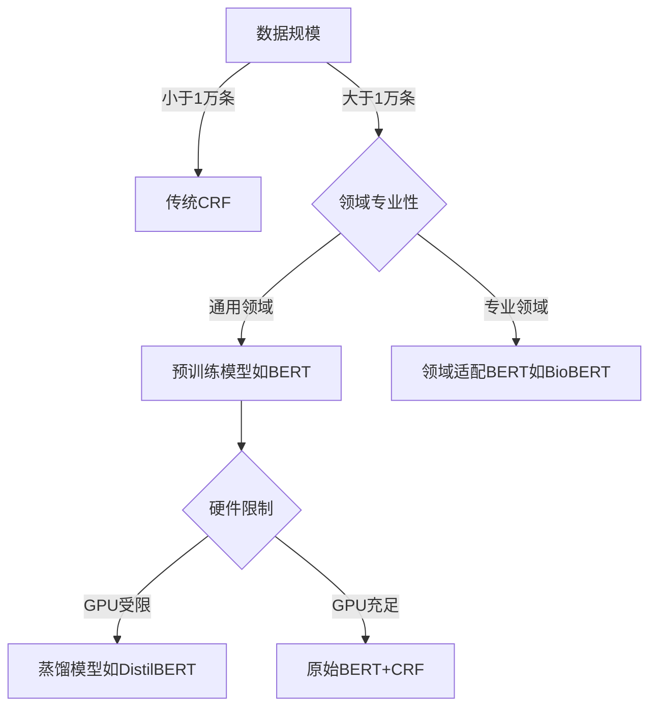

命名实体识别（NER）的实现方法涵盖了从传统机器学习到深度学习的多种技术路线。以下是系统化的分类和说明：

---

### **一、传统机器学习方法**
#### 1. **基于特征工程的方法**
- **核心思想**：人工设计词汇/语法特征 + 统计模型
- **典型模型**：
  - **条件随机场 (CRF)**：最经典的NER模型，处理序列标注问题
  - **隐马尔可夫模型 (HMM)**：早期用于基础实体识别
  - **最大熵马尔可夫模型 (MEMM)**：结合最大熵和马尔可夫性
- **特征示例**：
  ```python
  # 人工特征设计示例
  features = {
      'word': current_word,
      'prefix': word[:3],  # 前缀特征
      'suffix': word[-3:],  # 后缀特征
      'is_capitalized': word[0].isupper(),
      'contains_digit': any(char.isdigit() for char in word),
      'POS_tag': current_pos_tag,  # 词性标注
      'prev_word': previous_word   # 上下文特征
  }
  ```
- **优缺点**：
  - ✅ 可解释性强
  - ❌ 依赖特征工程和领域知识

#### 2. **基于字典的方法**
- **核心思想**：通过实体词典匹配（如地名词典、疾病术语表）
- **增强策略**：
  - 结合模糊匹配（如Levenshtein距离）
  - 使用Trie树加速查找

---

### **二、深度学习方法**
#### 1. **神经网络基础架构**
| 模型类型       | 典型结构                          | 代表论文                     |
|----------------|----------------------------------|----------------------------|
| **BiLSTM-CRF** | 双向LSTM提取特征 + CRF解码        | Huang et al. (2015)        |
| **CNN-CRF**    | 卷积神经网络捕获n-gram特征 + CRF  | Chiu & Nichols (2016)      |
| **Transformer**| 纯注意力机制架构                  | Devlin et al. (2018, BERT) |

#### 2. **预训练语言模型时代**
- **核心突破**：上下文感知的实体识别
- **典型模型**：
  - **BERT**：首个实现SOTA的Transformer模型
  - **RoBERTa**：优化训练策略的BERT变体
  - **ELECTRA**：更高效的预训练方式
  - **领域专用模型**：
    - BioBERT（生物医学）
    - Legal-BERT（法律领域）

#### 3. **多模态NER**
- **应用场景**：处理文本+图像/语音的混合数据
- **典型方法**：
  - 文本特征（BERT） + 图像特征（ResNet）联合训练
  - 注意力机制融合多模态信息

---

### **三、混合方法**
#### 1. **机器学习与深度学习的结合**
- **示例流程**：
  1. 用BiLSTM提取初步特征
  2. 人工设计领域特征（如医学实体后缀"-itis"）
  3. 拼接特征输入CRF层解码

#### 2. **知识增强的NER**
- **技术路线**：
  - 将知识图谱嵌入（如TransE）与文本表征融合
  - 使用实体链接（Entity Linking）辅助识别

---

### **四、小样本/零样本学习**
#### 1. **少样本学习（Few-shot NER）**
- **方法**：
  - 原型网络（Prototypical Networks）
  - 基于提示的学习（Prompt-based Learning）

#### 2. **零样本学习（Zero-shot NER）**
- **实现方式**：
  - 利用LLM的生成能力（如GPT-3）
  - 描述性标签推理（如"寻找类似地名的实体"）

---

### **五、处理特殊场景的技术**
#### 1. **嵌套NER**
- **解决方案**：
  - 层叠式标注（Cascaded Tagging）
  - 超图表示（Hypergraph Representation）

#### 2. **跨语言NER**
- **方法**：
  - 多语言BERT（mBERT）
  - 机器翻译+单语言模型联合

#### 3. **非正式文本NER**
- **挑战**：社交媒体文本中的拼写错误/网络用语
- **对策**：
  - 数据增强（自动生成噪声数据）
  - 对抗训练（Adversarial Training）

---

### **六、典型工具库对比**
| 工具库         | 支持模型                          | 领域适应性       |
|----------------|----------------------------------|----------------|
| **spaCy**      | CNN/Transformer                  | 通用领域        |
| **Stanza**     | BiLSTM-CRF                       | 多语言支持      |
| **Flair**      | 字符级语言模型 + BiLSTM-CRF       | 学术文献        |
| **HuggingFace**| BERT/RoBERTa等Transformer模型     | 工业级部署      |
| **NLTK**       | 基于规则的方法                    | 教学研究        |

---

### **七、最新技术趋势（2023）**
1. **大语言模型（LLM）应用**：
   - ChatGPT等生成式模型用于数据标注
   - 指令微调（Instruction Tuning）实现开放域NER

2. **绿色AI方向**：
   - 知识蒸馏（如DistilBERT）
   - 量化压缩技术

3. **因果推理增强**：
   - 引入因果掩码机制
   - 反事实数据增强

---

### **选择模型的决策树**


实际应用中，工业级系统常采用**BERT-CRF混合架构**，在精度和效率间取得平衡。研究前沿则聚焦于**少样本学习**和**多模态融合**方向。