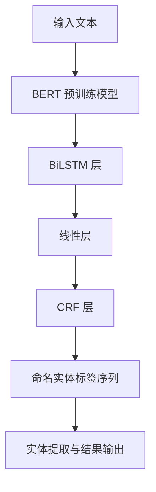
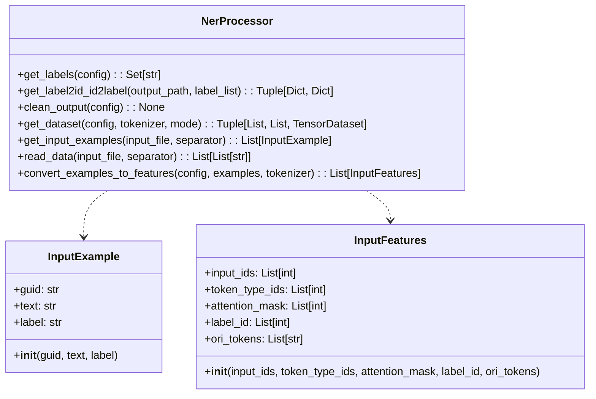
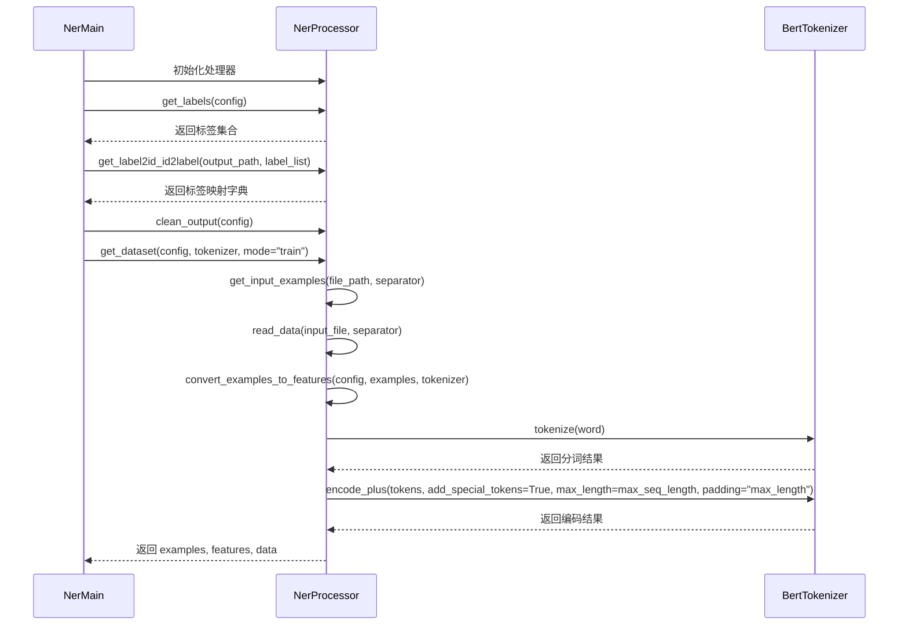
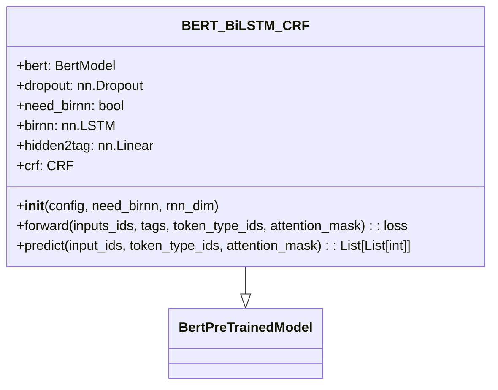
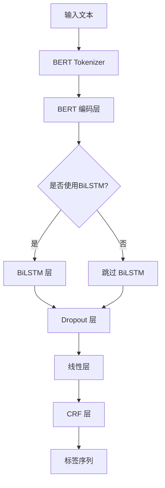
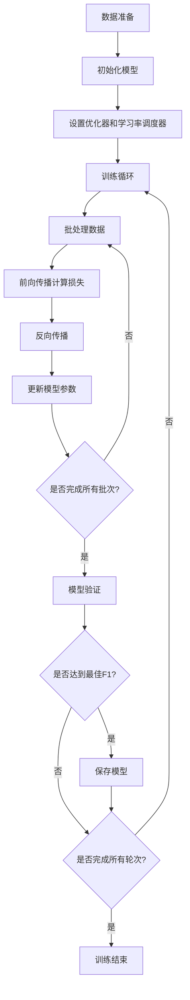
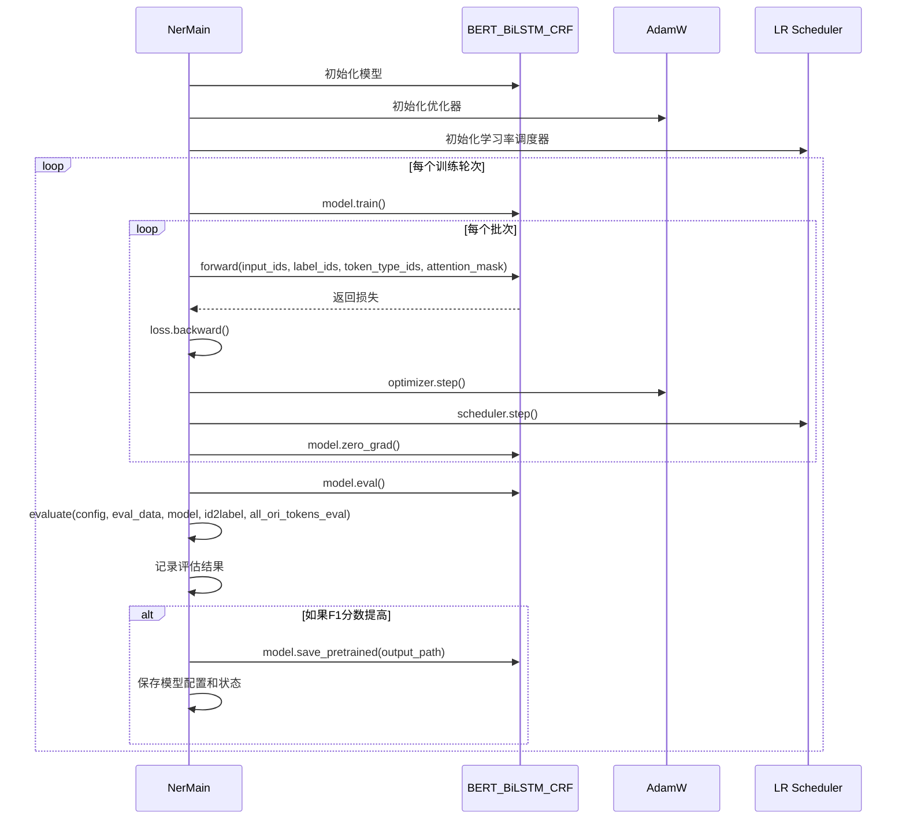
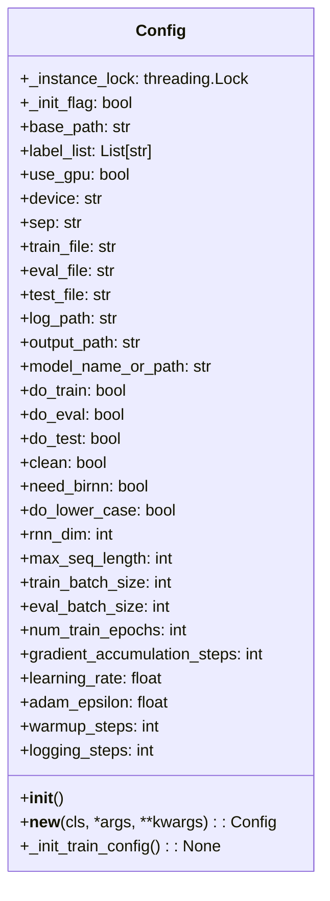
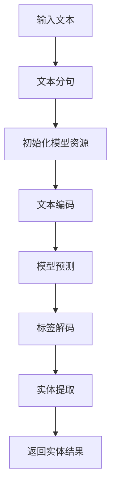

         
# BERT-BiLSTM-CRF 中文命名实体识别系统技术方案文档

## 1. 项目概述

BERT-BiLSTM-CRF 中文命名实体识别系统是一个基于深度学习的自然语言处理系统，用于识别中文文本中的命名实体，如人名、地名、组织机构名等。该系统结合了预训练语言模型 BERT、双向长短期记忆网络 BiLSTM 和条件随机场 CRF，实现了高精度的中文命名实体识别功能。

### 1.1 系统架构



### 1.2 数据流程


## 2. 数据集

### 2.1 CLUENER2020 数据集

- **训练集**：10,748 条样本
- **验证集**：1,343 条样本
- **测试集**：1,345 条样本

### 2.2 标签类别

系统支持识别以下 10 类实体：
- 地址（address）
- 书名（book）
- 公司（company）
- 游戏（game）
- 政府（government）
- 电影（movie）
- 姓名（name）
- 组织机构（organization）
- 职位（position）
- 景点（scene）

### 2.3 数据格式

原始数据为 JSON 格式：

```json
{"text": "行知小学叶琼老师则从另一个另一侧出发到达了，", "label": {"name": {"叶琼": [[9, 10]]}, "company": {"行知小学": [[0, 3]]}}}
```

经过处理后转换为 BIOES 标注格式：

```
行 B-company
知 I-company
小 I-company
学 E-company
叶 B-name
琼 E-name
老 O
师 O
...
```

## 3. 数据处理流程

### 3.1 类图



### 3.2 数据处理流程图



## 4. 模型架构

### 4.1 BERT-BiLSTM-CRF 模型结构



### 4.2 模型流程图



## 5. 训练过程

### 5.1 训练流程图



### 5.2 训练时序图



###  5.3 详细代码

```python
# ner_main.py - 训练核心代码

class NerMain(object):
    def __init__(self):
        self.config = Config()
        self.processor = NerProcessor()

    def train(self):
        """模型训练"""
        # 清理输出目录并初始化
        self.processor.clean_output(self.config)
        os.makedirs(self.config.output_path, exist_ok=True)
        writer = SummaryWriter(logdir=os.path.join(self.config.output_path, "eval"), comment="ner")

        # 设备配置
        use_gpu = torch.cuda.is_available() and self.config.use_gpu
        device = torch.device('cuda' if use_gpu else self.config.device')
        self.config.device = device
        n_gpu = torch.cuda.device_count()
        logger.info(f"available device: {device}，count_gpu: {n_gpu}")

        # 数据预处理
        label_list = self.processor.get_labels(config=self.config)
        self.config.label_list = label_list
        num_labels = len(label_list)
        logger.info(f"加载标签成功! 数量: {num_labels}, 标签列表: {','.join(list(label_list))}")

        # 创建标签映射
        label2id, id2label = self.processor.get_label2id_id2label(self.config.output_path, label_list=label_list)
        logger.info("加载label2id和id2label字典成功!")

        # 模型初始化
        if self.config.do_train:
            tokenizer = BertTokenizer.from_pretrained(
                self.config.bert_model_path or 'bert-base-chinese',
                do_lower_case=self.config.do_lower_case
            )
            bert_config = BertConfig.from_pretrained(
                self.config.bert_model_path or 'bert-base-chinese',
                num_labels=num_labels
            )
            
            # 模型初始化（支持从头训练或继续训练）
            if self.config.continue_train:
                model = BERT_BiLSTM_CRF.from_pretrained(
                    self.config.model_name_or_path,
                    config=bert_config,
                    need_birnn=self.config.need_birnn,
                    rnn_dim=self.config.rnn_dim
                )
            else:
                model = BERT_BiLSTM_CRF(
                    bert_config,
                    need_birnn=self.config.need_birnn,
                    rnn_dim=self.config.rnn_dim
                )
                model.bert = BertModel.from_pretrained('bert-base-chinese')

            model.to(device)
            logger.info("模型初始化成功!")

            # 多GPU支持
            if use_gpu and n_gpu > 1:
                model = torch.nn.DataParallel(model)

            # 数据加载
            train_examples, train_features, train_data = self.processor.get_dataset(self.config, tokenizer, mode="train")
            train_sampler = RandomSampler(train_data)
            train_data_loader = DataLoader(
                train_data,
                sampler=train_sampler,
                batch_size=self.config.train_batch_size,
                num_workers=self.config.num_workers
            )

            # 优化器初始化
            no_decay = ['bias', 'LayerNorm.weight']
            optimizer_grouped_parameters = [
                {'params': [p for n, p in model.named_parameters() if not any(nd in n for nd in no_decay)],
                 'weight_decay': self.config.weight_decay},
                {'params': [p for n, p in model.named_parameters() if any(nd in n for nd in no_decay)],
                 'weight_decay': 0.0}
            ]
            optimizer = AdamW(
                optimizer_grouped_parameters,
                lr=self.config.learning_rate,
                eps=self.config.adam_epsilon
            )

            # 学习率调度器
            t_total = len(train_data_loader) // self.config.gradient_accumulation_steps * self.config.num_train_epochs
            scheduler = get_linear_schedule_with_warmup(
                optimizer,
                num_warmup_steps=self.config.warmup_steps or int(0.1 * t_total),
                num_training_steps=t_total
            )

            # 混合精度训练
            scaler = GradScaler() if self.config.fp16 and use_gpu else None

            # 训练循环
            model.train()
            global_step, tr_loss, best_f1 = 0, 0.0, 0.0
            
            for ep in trange(int(self.config.num_train_epochs), desc="Epoch"):
                logger.info(f"########[Epoch: {ep}/{int(self.config.num_train_epochs)}]########")
                model.train()
                
                for step, batch in enumerate(tqdm(train_data_loader, desc="DataLoader")):
                    batch = tuple(t.to(device) for t in batch)
                    input_ids, token_type_ids, attention_mask, label_ids = batch

                    # 前向计算
                    with autocast(enabled=self.config.fp16):
                        outputs = model(input_ids, label_ids, token_type_ids, attention_mask)
                        loss = outputs

                    if use_gpu and n_gpu > 1:
                        loss = loss.mean()

                    if self.config.gradient_accumulation_steps > 1:
                        loss = loss / self.config.gradient_accumulation_steps

                    # 反向传播
                    if self.config.fp16:
                        scaler.scale(loss).backward()
                    else:
                        loss.backward()

                    tr_loss += loss.item()

                    # 参数更新
                    if (step + 1) % self.config.gradient_accumulation_steps == 0:
                        if self.config.fp16:
                            scaler.step(optimizer)
                            scaler.update()
                        else:
                            optimizer.step()
                        
                        scheduler.step()
                        model.zero_grad()
                        global_step += 1

                # 模型验证
                if self.config.do_eval:
                    logger.info("====================== Running Eval ======================")
                    all_ori_tokens_eval = [f.ori_tokens for f in eval_features]
                    overall, by_type = self.evaluate(self.config, eval_data, model, id2label, all_ori_tokens_eval)

                    # 保存最佳模型
                    f1_score = overall.fscore
                    if f1_score > best_f1:
                        logger.info(f"******** 最佳F1分数更新为 {f1_score}, 保存模型 ********")
                        best_f1 = f1_score
                        model_to_save = model.module if hasattr(model, 'module') else model
                        model_to_save.save_pretrained(self.config.output_path)
                        tokenizer.save_pretrained(self.config.output_path)
                        torch.save(self.config, os.path.join(self.config.output_path, 'training_config.bin'))
                        torch.save(model, os.path.join(self.config.output_path, 'ner_model.ckpt'))
            writer.close()
```

```python
# models.py - BERT-BiLSTM-CRF 模型定义

class BERT_BiLSTM_CRF(BertPreTrainedModel):
    def __init__(self, config, need_birnn=True, rnn_dim=128):
        super(BERT_BiLSTM_CRF, self).__init__(config)
        self.bert = BertModel(config)
        self.dropout = nn.Dropout(config.hidden_dropout_prob)
        self.need_birnn = need_birnn
        if self.need_birnn:
            self.birnn = nn.LSTM(
                input_size=config.hidden_size,
                hidden_size=rnn_dim,
                num_layers=1,
                bidirectional=True,
                batch_first=True
            )
            self.hidden2tag = nn.Linear(rnn_dim * 2, config.num_labels)
        else:
            self.hidden2tag = nn.Linear(config.hidden_size, config.num_labels)
        self.crf = CRF(config.num_labels, batch_first=True)

    def forward(self, input_ids, tags, token_type_ids=None, attention_mask=None):
        outputs = self.bert(
            input_ids,
            token_type_ids=token_type_ids,
            attention_mask=attention_mask
        )
        sequence_output = outputs.last_hidden_state
        sequence_output = self.dropout(sequence_output)

        if self.need_birnn:
            sequence_output, _ = self.birnn(sequence_output)
            sequence_output = self.dropout(sequence_output)

        emissions = self.hidden2tag(sequence_output)
        loss = -self.crf(emissions, tags, mask=attention_mask.byte())
        return loss

    def predict(self, input_ids, token_type_ids=None, attention_mask=None):
        outputs = self.bert(
            input_ids,
            token_type_ids=token_type_ids,
            attention_mask=attention_mask
        )
        sequence_output = outputs.last_hidden_state
        sequence_output = self.dropout(sequence_output)

        if self.need_birnn:
            sequence_output, _ = self.birnn(sequence_output)
            sequence_output = self.dropout(sequence_output)

        emissions = self.hidden2tag(sequence_output)
        return self.crf.decode(emissions, attention_mask.byte())
```


## 6. 模型参数配置

### 6.1 配置类图



### 6.2 主要参数设置

- **模型参数**：
  - `need_birnn`: True (是否使用BiLSTM层)
  - `rnn_dim`: 128 (BiLSTM隐藏层维度)
  - `max_seq_length`: 128 (最大序列长度)

- **训练参数**：
  - `train_batch_size`: 8 (训练批次大小)
  - `eval_batch_size`: 16 (评估批次大小)
  - `num_train_epochs`: 10 (训练轮次)
  - `gradient_accumulation_steps`: 2 (梯度累积步数)
  - `learning_rate`: 3e-5 (学习率)
  - `adam_epsilon`: 1e-8 (Adam优化器epsilon参数)

```python
# config.py - 配置参数

class Config:
    def __init__(self):
        # 数据路径配置
        self.data_dir = "./data/cluener"
        self.train_file = "train.json"
        self.eval_file = "dev.json"
        self.test_file = "test.json"
        self.output_path = "./output"
        
        # 模型配置
        self.need_birnn = True
        self.rnn_dim = 128
        self.max_seq_length = 128
        self.do_lower_case = True
        
        # 训练配置
        self.train_batch_size = 8
        self.eval_batch_size = 16
        self.num_train_epochs = 10
        self.learning_rate = 3e-5
        self.adam_epsilon = 1e-8
        self.weight_decay = 0.01
        self.gradient_accumulation_steps = 2
        self.warmup_steps = 0
        self.logging_steps = 100
        self.early_stopping_patience = 3
        
        # 设备配置
        self.use_gpu = True
        self.fp16 = False
        self.num_workers = 4
        
        # 其他配置
        self.do_train = True
        self.do_eval = True
        self.do_test = False
        self.clean = True
        self.continue_train = False
        self.bert_model_path = None
        self.model_name_or_path = "bert-base-chinese"
```

## 7. 模型存储

训练完成后，系统将以下文件保存到输出目录：

1. `pytorch_model.bin`: BERT预训练模型权重
2. `ner_model.ckpt`: 训练好的NER模型
3. `training_config.bin`: 训练配置参数
4. `vocab.txt`: 词汇表
5. `label2id.pkl`: 标签到ID的映射
6. `token_labels_test.txt`: 测试集的标签预测结果

## 8. 训练监控

### 8.1 日志记录

系统使用Python的logging模块记录训练过程中的关键信息，包括：
- 数据加载和预处理信息
- 每个训练步骤的损失
- 每个训练轮次的评估指标
- 模型保存信息

### 8.2 TensorBoard可视化

系统使用TensorBoard记录以下指标：
- 训练损失 (Train/loss)
- 评估精确率 (Eval/precision)
- 评估召回率 (Eval/recall)
- 评估F1分数 (Eval/f1_score)

可以通过以下命令启动TensorBoard查看训练过程：

```bash
tensorboard --logdir eval
```

## 9. 预测流程

### 9.1 预测流程图



### 9.2 预测代码示例

```python
from torch_ner.source.ner_predict import get_entities_result

# 模型保存路径
model_path = "/path/to/model/output/directory"

# 输入文本
text = "当天晚上，等到孙晓凯和王浩天等5人回到大连，已经是晚上12点。"

# 实体识别
entities = get_entities_result(text, model_path)
print(entities)
```

```python

def get_entities_result(query, model_path):
    """进一步封装识别结果"""
    map_dic = clue_map_dic
    sentence_list, predict_labels = predict(query, model_path)
    if len(predict_labels) == 0:
        print("句子: {0}\t实体识别结果为空".format(query))
        return []
    entities = []
    if len(sentence_list) == len(predict_labels):
        result = _bio_data_handler(sentence_list, predict_labels, map_dic)
        if len(result) != 0:
            end = 0
            prefix_len = 0

            for word, label in result:
                sen = query.lower()[end:]
                begin = sen.find(word) + prefix_len
                end = begin + len(word)
                prefix_len = end
                if begin != -1:
                    ent = dict(value=query[begin:end], type=label, begin=begin, end=end)
                    entities.append(ent)
    return entities
```

```python

def predict(sentence, model_path):
    """模型预测"""
    
    # 一次性获取模型资源
    resources = _initialize_model(model_path)
    tokenizer = resources['tokenizer']
    model = resources['model']
    id2label = resources['id2label']
    
    """模型预测"""
    max_seq_length = 128
    
    # 获取拆分后的句子列表
    sentences = split_sentence(sentence)
    all_tokens = []
    all_labels = []
    
    # 对每个拆分后的句子进行预测
    for sent in sentences:
        # 处理空字符串
        if not sent.strip():
            continue
            
        # 使用encode_plus处理
        result = tokenizer.encode_plus(sent)
        input_ids, token_type_ids, attention_mask = result["input_ids"], result["token_type_ids"], result["attention_mask"]
        sentence_tokens = tokenizer.tokenize(sent)
        
        # 填充到max_seq_length
        while len(input_ids) < max_seq_length:
            input_ids.append(0)
            token_type_ids.append(0)
            attention_mask.append(0)
        
        # 类型转换
        input_ids = torch.tensor(input_ids, dtype=torch.long).to("cpu").unsqueeze(0)
        token_type_ids = torch.tensor(token_type_ids, dtype=torch.long).to("cpu").unsqueeze(0)
        attention_mask = torch.tensor(attention_mask, dtype=torch.long).to("cpu").unsqueeze(0)
        
        # 模型预测
        with torch.no_grad():
            predict_val = model.predict(input_ids, token_type_ids, attention_mask)
        
        # 解析结果
        predict_labels = []
        for i, label in enumerate(predict_val[0]):
            if i != 0 and i != len(predict_val[0]) - 1:  # 排除[CLS]和[SEP]
                predict_labels.append(id2label[label])
        
        # 合并结果
        all_tokens.extend(sentence_tokens)
        all_labels.extend(predict_labels)
    
    return all_tokens, all_labels
```

## 10. 评估方法

系统使用CoNLL评估标准计算以下指标：

- **精确率 (Precision)**: 正确预测的实体数量 / 预测的实体总数
- **召回率 (Recall)**: 正确预测的实体数量 / 实际的实体总数
- **F1分数**: 精确率和召回率的调和平均值

评估过程中，系统会计算每种实体类型的指标，以及所有实体类型的综合指标。

## 11. 系统部署

### 11.1 Web应用部署

系统提供了基于Flask的Web应用接口，可以通过以下方式启动：

```bash
python app.py
```

服务将在 http://0.0.0.0:5006 上运行，提供Web界面和API接口。

### 11.2 图形用户界面

系统还提供了图形用户界面，可以通过运行`NER_GUI.py`启动，提供直观的实体识别交互界面。

## 12. 已知问题与解决方案

### 12.1 HFValidationError问题

在使用`ner_predict.py`进行预测时，可能会遇到以下错误：

```
huggingface_hub.errors.HFValidationError: Repo id must be in the form 'repo_name' or 'namespace/repo_name'.
Received '/Users/.../output/20250603115539'
```

**解决方案**：

在`ner_predict.py`中，已经修改了原来使用`BertTokenizer.from_pretrained(model_path)`的方式，改为直接加载本地词汇表：

```python
# 修改前
# tokenizer = BertTokenizer.from_pretrained(model_path, local_files_only=True)

# 修改后
vocab_file = os.path.join(model_path, "vocab.txt")
tokenizer = BertTokenizer(vocab_file, do_lower_case=True)
```

### 12.2 内存限制问题

对于显存较小的GPU，可以通过以下方式调整配置：

1. 增加梯度累积步数：`gradient_accumulation_steps = 2`
2. 减小训练批次大小：`train_batch_size = 8`

## 13. 总结

BERT-BiLSTM-CRF中文命名实体识别系统结合了预训练语言模型、序列标注和条件随机场，实现了高效准确的中文命名实体识别功能。系统支持多种实体类型的识别，提供了完整的训练、评估和预测流程，以及友好的用户界面，可以满足各种中文命名实体识别的需求。
        