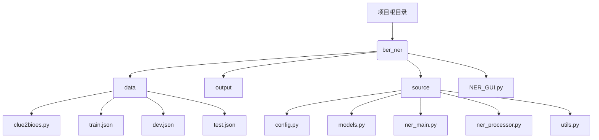
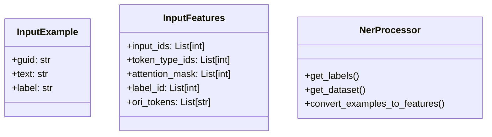
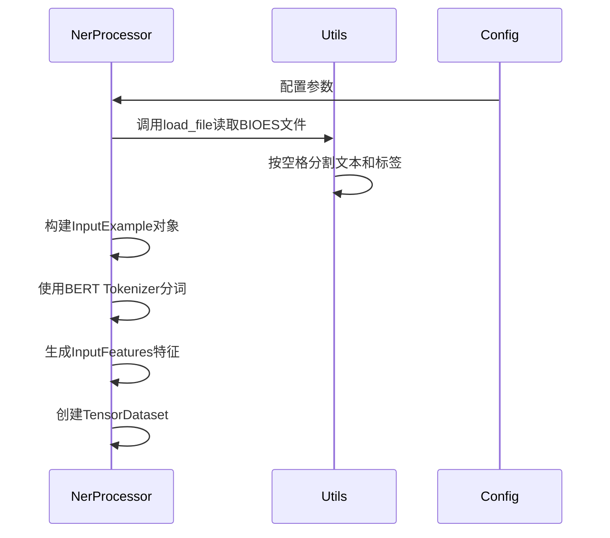
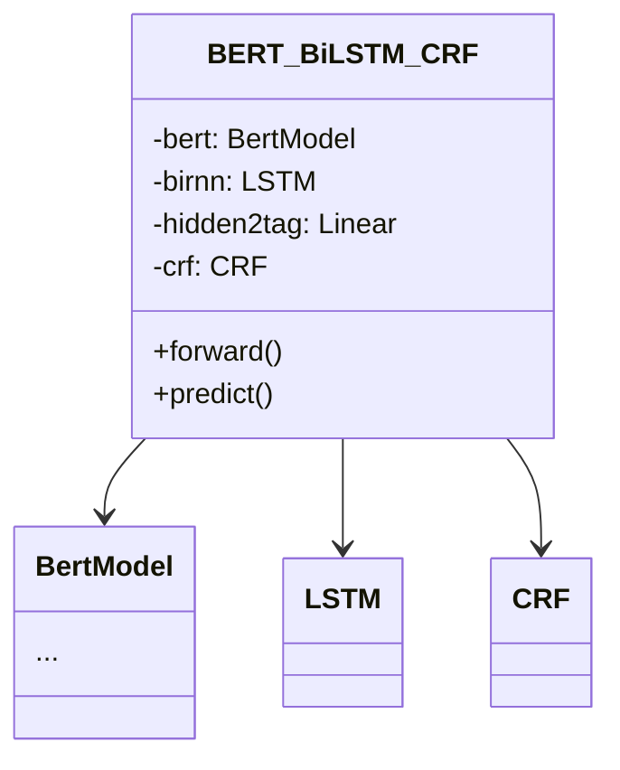
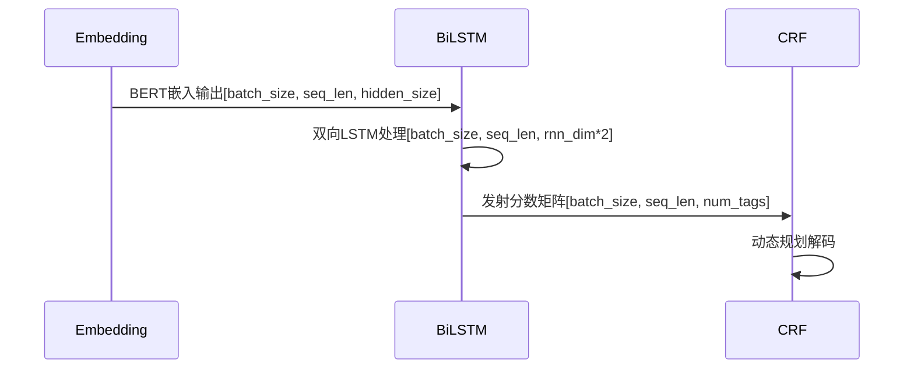
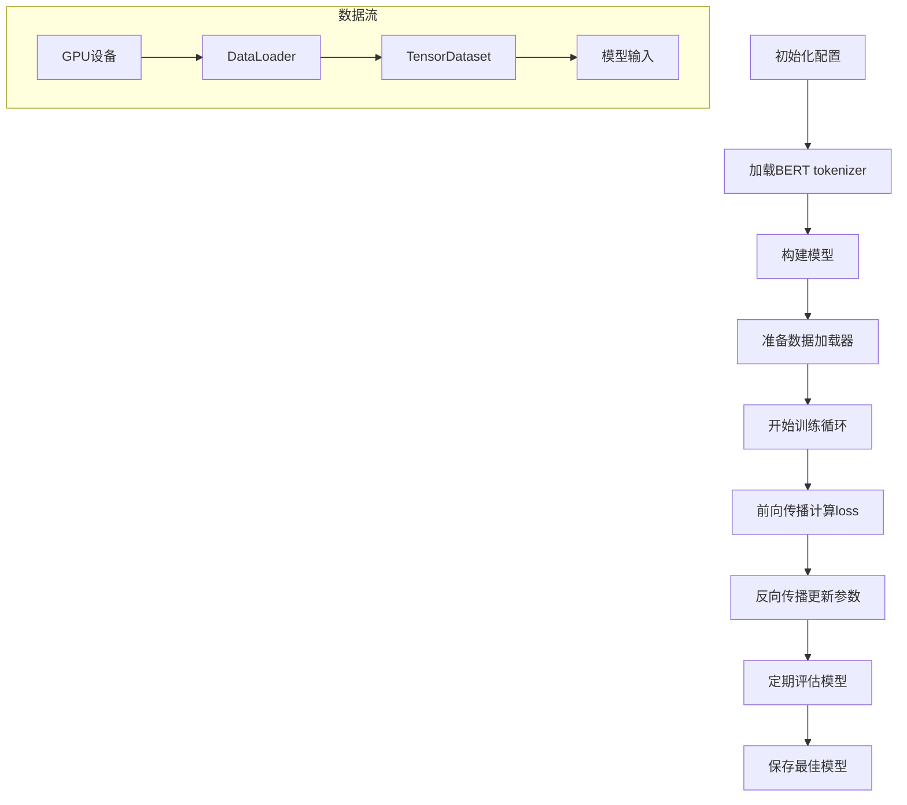
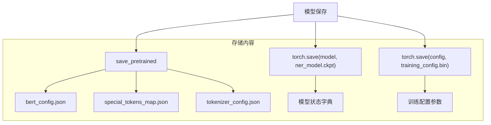
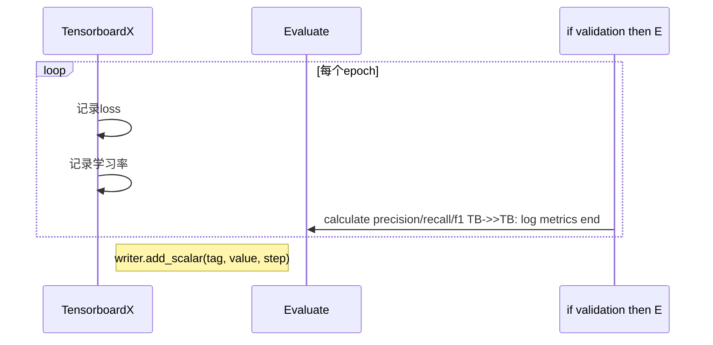

# BERT-BiLSTM-CRF 中文命名实体识别技术方案

## 1. 项目架构


## 2. 数据集处理
### 2.1 数据结构


### 2.2 处理流程


### 2.3 数据转换
```python
# clue2bioes.py核心转换逻辑
def json2bioes(input_path):
    with open(input_path, 'r') as f, open(output_file, 'w') as fout:
        for line in f:
            data = json.loads(line)
            text = data['text']
            labels = ['O']*len(text)
            
            # 将标注信息转换为BIOES格式
            for entity_type, entities in data.get('label', {}).items():
                for entity, positions in entities.items():
                    for start, end in positions:
                        if start == end:
                            labels[start] = f'S-{entity_type}'
                        else:
                            labels[start] = f'B-{entity_type}'
                            labels[start+1:end] = [f'I-{entity_type}']*(end-start-1)
                            labels[end] = f'E-{entity_type}'
```

## 3. 模型架构


### 3.1 模型流程


## 4. 训练流程


### 4.1 核心训练代码
```python
# ner_main.py训练循环
def train():
    model = BERT_BiLSTM_CRF.from_pretrained('bert-base-chinese', config=bert_config)
    no_decay = ['bias', 'LayerNorm.weight']
    optimizer_grouped_parameters = [
        {'params': [p for n, p in model.named_parameters() if not any(nd in n for nd in no_decay)], 'weight_decay': 0.01},
        {'params': [p for n, p in model.named_parameters() if any(nd in n for nd in no_decay)], 'weight_decay': 0.0}
    ]
    optimizer = AdamW(optimizer_grouped_parameters, lr=config.learning_rate)
    scheduler = get_linear_schedule_with_warmup(optimizer, num_warmup_steps=0, num_training_steps=t_total)
    
    for epoch in range(num_train_epochs):
        for step, batch in enumerate(train_dataloader):
            outputs = model(input_ids, label_ids, token_type_ids, attention_mask)
            loss = outputs.mean() if n_gpu > 1 else outputs
            loss.backward()
            if (step + 1) % gradient_accumulation_steps == 0:
                optimizer.step()
                scheduler.step()
                model.zero_grad()
```

## 5. 模型存储


## 6. 监控体系


## 7. 核心参数配置
```python
# config.py关键参数
class Config:
    def _init_train_config(self):
        self.use_gpu = True
        self.max_seq_length = 128
        self.train_batch_size = 8
        self.gradient_accumulation_steps = 2
        self.learning_rate = 3e-5
        self.rnn_dim = 128  # BiLSTM隐藏层维度
        self.need_birnn = True  # 是否启用BiLSTM
        self.num_train_epochs = 10
```

## 8. 训练监控指标
| 指标类型 | 指标名称 | 采集频率 | 说明 |
|---------|----------|----------|------|
| 训练指标 | loss | 每500步 | 记录标量值 |
| 评估指标 | precision | 每个epoch | 计算精确率 |
| 评估指标 | recall | 每个epoch | 计算召回率 |
| 评估指标 | f1_score | 每个epoch | 综合评估指标 |

## 9. 目录结构要求
```
ber_ner/
├── data/
│   ├── result/  # 转换后的BIOES文件
│   └── *.json   # 原始数据
├── output/
│   ├── eval/    # TensorBoard日志
│   └── [时间戳]/ # 模型保存目录
└── source/
    ├── config.py # 配置管理
    ├── models.py # 模型定义
    ├── ner_main.py # 训练主程序
    └── ner_processor.py # 数据处理
```

## 10. 环境依赖
```bash
torch==1.8.0
transformers==4.9.0
pytorch-crf==0.7.2
tensorboardX==2.4
tensorboard==2.8.0
```
