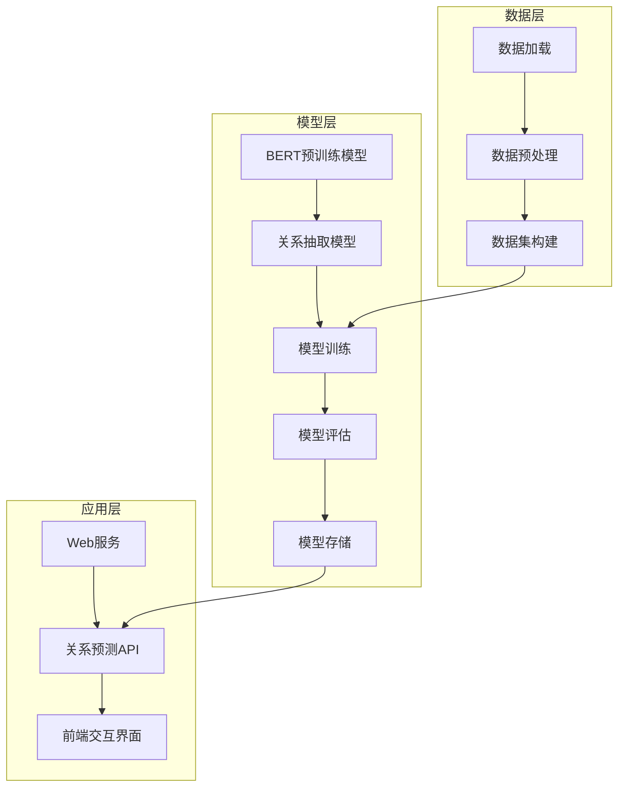
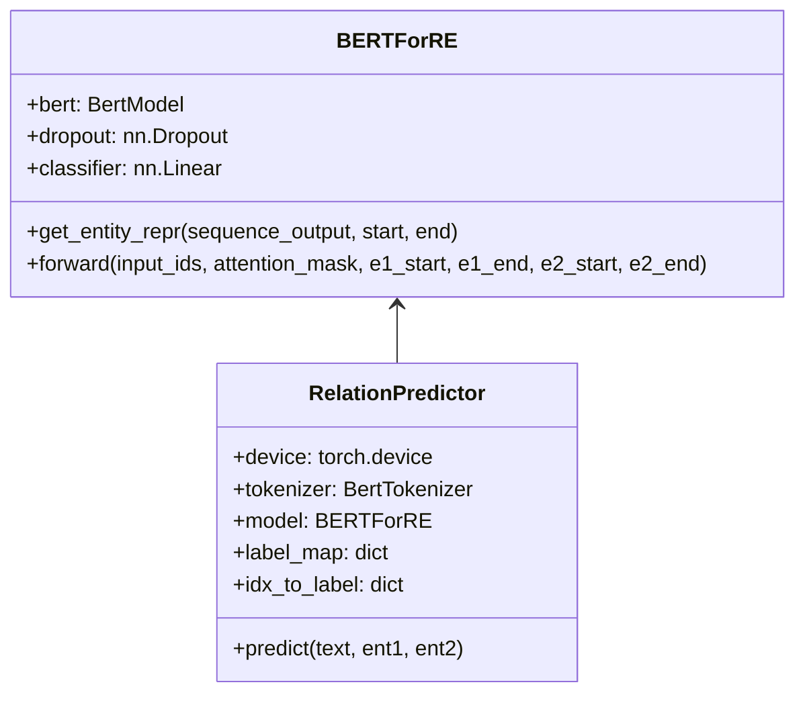
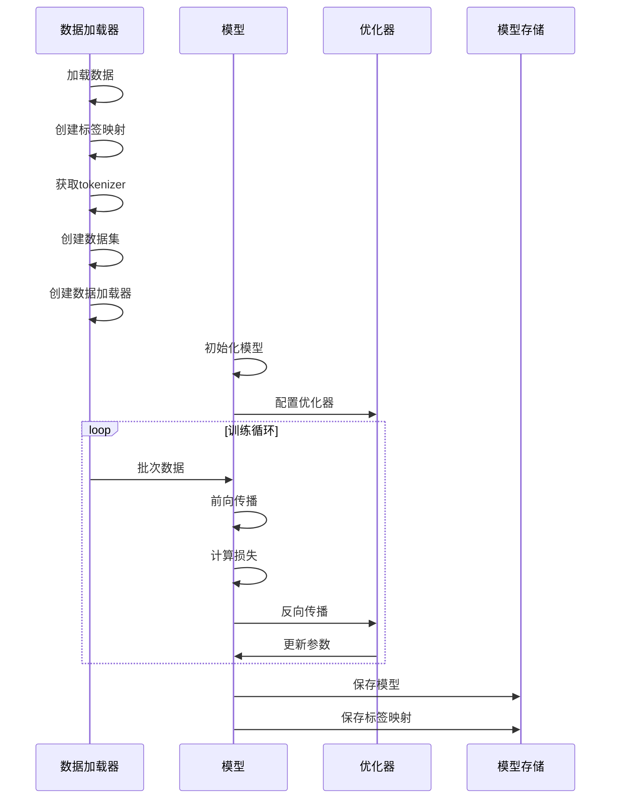
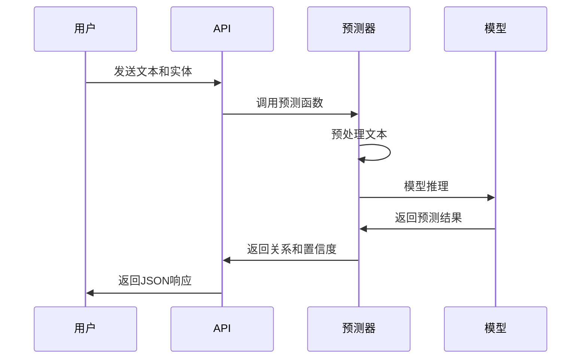
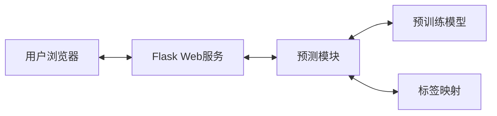
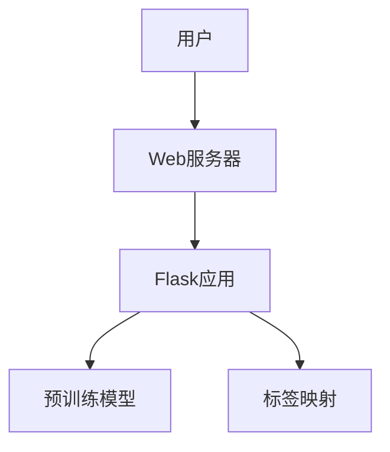

# 知识图谱三元组关系抽取系统技术方案

## 1. 项目概述

本项目旨在构建一个基于深度学习的知识图谱三元组关系抽取系统，能够从自然语言文本中识别实体之间的关系，为知识图谱构建提供支持。系统采用BERT预训练模型作为基础，通过微调实现关系分类任务，并提供Web界面进行交互式关系抽取。

## 2. 系统架构



## 3. 数据处理模块

### 3.1 数据格式

系统使用JSON格式的数据，每条数据包含以下字段：

```json
{
    "text": "姚明曾效力于NBA火箭队",
    "ent1": "姚明",
    "ent2": "火箭队",
    "relation": "效力"
}
```

### 3.2 数据加载

数据加载模块负责从JSON文件中读取训练数据，并将其转换为模型可处理的格式。

```python
# data/loader.py
def load_data(data_path):
    # 这里假设数据是JSON格式，可以根据实际情况修改
    df = pd.read_json(data_path)
    return df['text'].tolist(), df['ent1'].tolist(), \
           df['ent2'].tolist(), df['relation'].tolist()

def create_label_map(relations):
    unique_relations = list(set(relations))
    return {rel: idx for idx, rel in enumerate(unique_relations)}

def get_tokenizer():
    # 加载 tokenizer
    tokenizer = AutoTokenizer.from_pretrained("bert-base-chinese")
    tokenizer.add_special_tokens({'additional_special_tokens': CONFIG['special_tokens']})
    return tokenizer
```

### 3.3 数据预处理

预处理模块负责将原始文本转换为模型输入格式，包括实体标记和分词处理。

```python
# utils/preprocess.py
def preprocess(text, ent1, ent2):
    """插入实体位置标记"""
    text = text.replace(ent1, f"[E1]{ent1}[/E1]", 1)
    text = text.replace(ent2, f"[E2]{ent2}[/E2]", 1)
    return text

def tokenize_with_entities(text, tokenizer):
    # Tokenize the text and get input IDs
    encoding = tokenizer(text, return_tensors="pt", padding=False, truncation=True)
    input_ids = encoding["input_ids"].squeeze(0)
    attention_mask = encoding["attention_mask"].squeeze(0)
    
    # Get special token IDs
    e1_id = tokenizer.convert_tokens_to_ids("[E1]")
    e2_id = tokenizer.convert_tokens_to_ids("[E2]")
    e1_end_id = tokenizer.convert_tokens_to_ids("[/E1]")
    e2_end_id = tokenizer.convert_tokens_to_ids("[/E2]")
    
    # Find positions of entity markers
    e1_start = (input_ids == e1_id).nonzero(as_tuple=True)[0].item() if e1_id in input_ids else -1
    e2_start = (input_ids == e2_id).nonzero(as_tuple=True)[0].item() if e2_id in input_ids else -1
    e1_end = (input_ids == e1_end_id).nonzero(as_tuple=True)[0].item() if e1_end_id in input_ids else -1
    e2_end = (input_ids == e2_end_id).nonzero(as_tuple=True)[0].item() if e2_end_id in input_ids else -1
    
    return {
        "input_ids": input_ids,
        "attention_mask": attention_mask,
        "e1_start": e1_start,
        "e2_start": e2_start,
        "e1_end": e1_end,
        "e2_end": e2_end
    }
```

### 3.4 数据集构建

数据集模块负责将预处理后的数据转换为PyTorch数据集格式，便于模型训练。

```python
# data/dataset.py
class REDataset(Dataset):
    def __init__(self, texts, ent1s, ent2s, relations, tokenizer, label_map):
        self.texts = texts
        self.ent1s = ent1s
        self.ent2s = ent2s
        self.relations = relations
        self.tokenizer = tokenizer
        self.label_map = label_map

    def __len__(self):
        return len(self.texts)

    def __getitem__(self, idx):
        text = preprocess(self.texts[idx], self.ent1s[idx], self.ent2s[idx])
        inputs = tokenize_with_entities(text, self.tokenizer)
        label = torch.tensor(self.label_map[self.relations[idx]])
        return {**inputs, 'labels': label}
```

## 4. 模型设计

### 4.1 模型架构



### 4.2 模型实现

模型基于BERT预训练模型，通过实体位置增强的方式提取关系特征。

```python
# models/bert_re.py
class BERTForRE(nn.Module):
    def __init__(self, num_labels):
        super().__init__()
        self.bert = BertModel.from_pretrained(CONFIG['model_name'])
        # 调整词嵌入大小以适应新增的特殊标记
        self.bert.resize_token_embeddings(self.bert.config.vocab_size + len(CONFIG['special_tokens']))
        self.dropout = nn.Dropout(0.1)
        self.classifier = nn.Linear(self.bert.config.hidden_size * 3, num_labels)

    def get_entity_repr(self, sequence_output, start, end):
        entity_repr = sequence_output[torch.arange(sequence_output.size(0)), start:end+1]
        return torch.mean(entity_repr, dim=1)

    def forward(self, input_ids, attention_mask, e1_start, e1_end, e2_start, e2_end):
        outputs = self.bert(input_ids=input_ids, attention_mask=attention_mask)
        sequence_output = outputs.last_hidden_state
        
        # 获取[CLS]标记表示
        cls_output = sequence_output[:, 0, :]
        
        # 实体位置增强
        e1_rep = sequence_output[torch.arange(sequence_output.size(0)), e1_start]
        e2_rep = sequence_output[torch.arange(sequence_output.size(0)), e2_start]
        
        # Concatenate all representations
        combined = torch.cat([cls_output, e1_rep, e2_rep], dim=1)
        
        logits = self.classifier(combined)
        return logits
```

## 5. 模型训练

### 5.1 训练流程



### 5.2 训练代码实现

```python
# train.py
def train(data_path, num_epochs=5, batch_size=8, learning_rate=1e-5):
    # 加载数据
    texts, ent1s, ent2s, relations = load_data(data_path)
    
    # 创建标签映射
    label_map = create_label_map(relations)
    
    # 获取tokenizer
    tokenizer = get_tokenizer()
    
    # 创建数据集
    dataset = REDataset(texts, ent1s, ent2s, relations, tokenizer, label_map)
    
    # 创建数据加载器
    train_loader = DataLoader(
        dataset=dataset,
        batch_size=batch_size,
        shuffle=True,
        collate_fn=lambda x: custom_collate_fn(x, tokenizer)
    )

    # 初始化模型
    model = BERTForRE(num_labels=len(label_map))
    device = torch.device("cuda" if torch.cuda.is_available() else "cpu")
    model = model.to(device)

    # 优化器和损失函数
    optimizer = Adafactor(
        model.parameters(),
        lr=learning_rate,
        scale_parameter=False,
        relative_step=False
    )
    criterion = nn.CrossEntropyLoss()

    # 训练循环
    for epoch in range(num_epochs):
        model.train()
        total_loss = 0
        
        for batch in train_loader:
            batch = {k: v.to(device) for k, v in batch.items()}
            
            optimizer.zero_grad()
            outputs = model(
                input_ids=batch["input_ids"],
                attention_mask=batch["attention_mask"],
                e1_start=batch["e1_start"],
                e1_end=batch["e1_end"],
                e2_start=batch["e2_start"],
                e2_end=batch["e2_end"]
            )
            
            loss = criterion(outputs, batch["labels"])
            loss.backward()
            optimizer.step()
            
            total_loss += loss.item()
        
        print(f"Epoch {epoch+1} | Loss: {total_loss/len(train_loader):.4f}")

    # 保存模型
    save_model(model)
    
    # 保存label_map
    save_label_map(label_map)
    
    return model, label_map
```

### 5.3 数据批处理

```python
def custom_collate_fn(batch, tokenizer):
    input_ids = torch.nn.utils.rnn.pad_sequence(
        [item['input_ids'] for item in batch],
        batch_first=True,
        padding_value=tokenizer.pad_token_id
    )
    attention_mask = torch.nn.utils.rnn.pad_sequence(
        [item['attention_mask'] for item in batch],
        batch_first=True,
        padding_value=0
    )
    labels = torch.tensor([item['labels'] for item in batch])
    e1_start = torch.tensor([item['e1_start'] for item in batch])
    e2_start = torch.tensor([item['e2_start'] for item in batch])
    e1_end = torch.tensor([item['e1_end'] for item in batch])
    e2_end = torch.tensor([item['e2_end'] for item in batch])

    return {
        'input_ids': input_ids,
        'attention_mask': attention_mask,
        'labels': labels,
        'e1_start': e1_start,
        'e2_start': e2_start,
        'e1_end': e1_end,
        'e2_end': e2_end
    }
```

## 6. 模型存储与加载

### 6.1 模型存储

```python
def save_model(model, save_dir="saved_models"):
    """使用PyTorch原生方法保存模型"""
    os.makedirs(save_dir, exist_ok=True)
    # 保存模型状态字典
    torch.save(model.state_dict(), CONFIG['model_save_path'])
    # 保存BERT配置文件
    model.bert.config.save_pretrained(save_dir)
    print(f"Model saved to {save_dir}")

def save_label_map(label_map, save_dir="saved_models"):
    """保存label_map为JSON文件"""
    os.makedirs(save_dir, exist_ok=True)
    with open(CONFIG['label_map_path'], 'w', encoding='utf-8') as f:
        json.dump(label_map, f, ensure_ascii=False, indent=2)
    print(f"Label map saved to {CONFIG['label_map_path']}")
```

### 6.2 模型加载

```python
def load_model(model_path, num_labels):
    """加载预训练模型"""
    model = BERTForRE(num_labels)
    model.load_state_dict(torch.load(model_path))  # 加载模型权重
    return model
```

## 7. 预测服务

### 7.1 预测流程



### 7.2 预测类实现

```python
# predict.py
class RelationPredictor:
    def __init__(self, model, label_map):
        self.device = torch.device("cuda" if torch.cuda.is_available() else "cpu")
        self.tokenizer = get_tokenizer()
        self.model = model
        self.model.to(self.device)
        self.model.eval()
        self.label_map = label_map
        self.idx_to_label = {v: k for k, v in label_map.items()}

    def predict(self, text, ent1, ent2):
        processed = preprocess(text, ent1, ent2)
        inputs = tokenize_with_entities(processed, self.tokenizer)
        
        # Convert integer values to tensors before unsqueezing
        tensor_inputs = {}
        for k, v in inputs.items():
            if isinstance(v, int):
                tensor_inputs[k] = torch.tensor([v]).to(self.device)
            else:
                tensor_inputs[k] = v.unsqueeze(0).to(self.device)
        
        with torch.no_grad():
            logits = self.model(**tensor_inputs)
        
        probs = torch.softmax(logits, dim=-1)
        pred_idx = torch.argmax(probs).item()
        
        return self.idx_to_label[pred_idx], probs[0][pred_idx].item()
```

## 8. Web服务

### 8.1 服务架构



### 8.2 Flask应用实现

```python
# app.py
from flask import Flask, request, jsonify, render_template
from predict import predict_relation, load_model, RelationPredictor
from data.loader import get_tokenizer
from config import CONFIG
import json

app = Flask(__name__)

# 初始化模型和相关资源
def init_resources():
    """初始化模型、分词器和标签映射"""
    try:
        tokenizer = get_tokenizer()  # 加载预训练分词器
        
        with open(CONFIG["label_map_path"], 'r', encoding='utf-8') as f:
            label_map = json.load(f)  # 加载标签映射
            
        model = load_model(CONFIG['model_save_path'], len(label_map))  # 加载模型
        model.eval()  # 设置为评估模式
        
        return tokenizer, model, label_map
        
    except FileNotFoundError as e:
        print(f"File not found error during initialization: {str(e)}")
        raise
    except json.JSONDecodeError as e:
        print(f"JSON decode error in label map: {str(e)}")
        raise
    except Exception as e:
        print(f"Unexpected error during initialization: {str(e)}")
        raise

# 初始化全局资源
try:
    tokenizer, model, label_map = init_resources()
except Exception as e:
    print(f"Failed to initialize resources: {str(e)}")
    raise

@app.route('/')
def index():
    return render_template('index.html')

@app.route('/predict', methods=['POST'])
def predict():
    """处理预测请求"""
    try:
        # 获取请求数据
        data = request.json
        text = data.get('text')
        ent1 = data.get('ent1')
        ent2 = data.get('ent2')
        
        # 验证必需参数
        if not all([text, ent1, ent2]):
            return jsonify({
                'text': text or '',
                'entity1': ent1 or '',
                'entity2': ent2 or '',
                'relation': '',
                'confidence': 0.0,
                'error': 'Missing required parameters'
            }), 400
            
        # 执行预测
        relation, confidence = predict_relation(
            text, ent1, ent2, model, tokenizer, label_map
        )
        
        # 返回成功响应
        return jsonify({
            'text': text,
            'entity1': ent1,
            'entity2': ent2,
            'relation': relation,
            'confidence': float(confidence),
            'error': ''
        })
        
    except Exception as e:
        # 记录错误详情
        print(f"Error during prediction: {str(e)}")
        
        # 返回带有详细错误信息的响应
        return jsonify({
            'text': text or '',
            'entity1': ent1 or '',
            'entity2': ent2 or '',
            'relation': '',
            'confidence': 0.0,
            'error': str(e)
        }), 500

if __name__ == '__main__':
    app.run(host='0.0.0.0', port=5000, debug=True)
```

## 9. 前端界面

前端界面采用HTML、CSS和JavaScript实现，提供用户友好的交互体验。

```html
<!-- templates/index.html (部分代码) -->
<!DOCTYPE html>
<html>
<head>
    <meta charset="UTF-8">
    <title>中文文本关系提取预训练模型</title>
    <style>
        /* CSS样式 */
    </style>
</head>
<body>
    <div class="chat-container">
        <div id="messages" class="messages"></div>
        
        <div class="input-container">
            <input type="text" id="messageInput" placeholder="输入中文文本..." onkeypress="handleKeyPress(event)">
            <button id="sendButton">发送</button>
        </div>
    </div>

    <script>
        // JavaScript代码
        // 处理用户输入和API调用
    </script>
</body>
</html>
```

## 10. 配置管理

系统配置集中管理，便于调整参数和适应不同环境。

```python
# config.py
import torch

CONFIG = {
    'model_name': 'bert-base-chinese',
    'max_length': 128,
    'batch_size': 32,
    'learning_rate': 2e-5,
    'num_epochs': 10,
    'device': 'cuda' if torch.cuda.is_available() else 'cpu',
    'model_save_path': 'saved_models/pytorch_model.bin',
    'label_map_path':'saved_models/label_map.json',
    'special_tokens': ['[E1]', '[/E1]', '[E2]', '[/E2]']
}
```

## 11. 系统部署

### 11.1 部署架构



### 11.2 部署步骤

1. 准备环境：安装Python、PyTorch、Flask等依赖
2. 训练模型：执行训练脚本生成模型和标签映射
3. 启动服务：运行Flask应用提供Web服务
4. 访问界面：通过浏览器访问Web界面进行交互

## 12. 总结与展望

本技术方案详细描述了基于BERT的知识图谱三元组关系抽取系统的设计与实现，包括数据处理、模型设计、训练流程、预测服务和Web界面等方面。系统采用了实体位置增强的方法提高关系抽取的准确性，并提供了友好的用户交互界面。

未来可以从以下几个方面进行改进：

1. 引入更多预训练模型，如RoBERTa、ERNIE等，提高关系抽取性能
2. 增加实体识别模块，实现端到端的关系抽取
3. 优化模型结构，引入注意力机制和图神经网络
4. 扩展多语言支持，适应不同语言的知识图谱构建
5. 增加批量处理功能，提高处理效率
6. 实现模型在线更新，支持增量学习

通过以上改进，系统将能够更好地支持知识图谱构建和应用，为智能问答、推荐系统等下游任务提供有力支持。
        