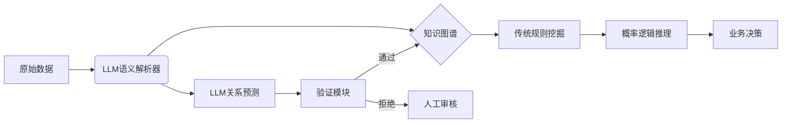

将大语言模型（LLM）与知识规则挖掘结合，可突破传统方法的局限性（如依赖人工特征、可扩展性差、规则泛化弱），实现更智能的知识发现。以下是融合LLM的创新方案，覆盖**关联规则挖掘**和**统计关系学习**两大方向：

---

### 一、LLM赋能关联规则挖掘（增强可解释性与语义理解）
#### 核心思路：
利用LLM的**语义理解能力**和**文本生成能力**，解决传统ARM中“项”定义粗糙、规则解释性浅层的问题。

#### 实施方案：
1. **智能项集生成（替代人工编码）**  
   - **输入**：原始文本数据（如用户评论、文献摘要）  
   - **LLM任务**：  
     ```python
     prompt = f"""
     从以下文本中提取关键实体、属性及其值，输出JSON格式：
     文本："{text}"
     要求：1) 实体类型包括[产品, 疾病, 症状, 药物]；2) 属性值对如{{"价格": "昂贵"}}
     """
     ```
   - **输出**：  
     ```json
     {
       "实体": [{"名称": "iPhone15", "类型": "产品"}, {"名称": "头痛", "类型": "症状"}],
       "属性": [{"实体": "iPhone15", "属性": "价格", "值": "昂贵"}]
     }
     ```
   - **优势**：自动捕获非结构化文本中的细粒度语义项，避免人工定义词典的局限。

2. **规则语义增强（生成可读性规则）**  
   - **输入**：传统ARM生成的规则 `{手机发热, 电池耗电快} => {系统卡顿}`  
   - **LLM任务**：  
     ```python
     prompt = f"""
     将以下关联规则转化为自然语言解释，并添加因果推断：
     规则：{rule}，支持度={sup}，置信度={conf}
     示例：用户反馈手机发热且耗电快时，通常伴随系统卡顿（可能因高温触发CPU降频）
     """
     ```
   - **输出**：  
     > "当用户同时抱怨**手机发热**和**电池耗电快**时，有85%概率出现**系统卡顿**（支持度30%）。这可能是由于高温导致CPU throttling（降频保护机制）引发的性能下降。"

3. **跨模态规则发现**  
   - **场景**：电商评论中图文不一致检测  
   - **LLM任务**：  
     - Step1：CLIP模型计算图片与文本描述相似度  
     - Step2：LLM解析低相似度样本：  
       ```python
       prompt = f"""
       图片内容：{image_caption}，用户评论："{text}"
       矛盾点分析：1) 商品功能描述是否冲突；2) 材质/颜色差异
       """
       ```
     - **输出规则**：`{图片展示金属材质, 评论提及"塑料感"} => {虚假宣传嫌疑} (置信度92%)`

---

### 二、LLM驱动统计关系学习（解决稀疏性与复杂推理）
#### 核心思路：
将LLM作为**隐式知识库**和**推理引擎**，补全图谱缺失关系，生成概率规则。

#### 实施方案：
1. **零样本链接预测（替代传统嵌入模型）**  
   - **输入**：头实体 `"量子纠缠"`，关系 `"相关领域"`，候选尾实体 `["量子计算", "加密通信", "中医经络"]`  
   - **LLM任务**：  
     ```python
     prompt = f"""
     判断以下陈述是否正确，按概率评分（0-1）：
     陈述："量子纠缠"的相关领域包含"{candidate}"
     评分依据：1) 科学共识；2) 技术关联性
     """
     ```
   - **输出**：  
     | 候选实体       | 概率 |
     |----------------|------|
     | 量子计算       | 0.98 |
     | 加密通信       | 0.95 |
     | **中医经络**   | 0.02 |  # 检测出错误关联

2. **逻辑规则生成（AMIE+的LLM升级版）**  
   - **输入**：知识图谱子集（如医疗领域三元组）  
   - **LLM任务**：  
     ```python
     prompt = f"""
     基于以下三元组，归纳可解释的诊疗规则：
     输入三元组示例：
       (患者A, 症状, 持续咳嗽)
       (患者A, 检查结果, 肺部阴影)
       (患者A, 诊断, 肺癌)
     输出规则格式：IF [条件] THEN [诊断] WITH [置信度]
     """
     ```
   - **输出**：  
     > "IF {症状: 持续咳嗽 > 3周, 检查: 肺部阴影, 病史: 吸烟} THEN 诊断: 肺癌 WITH 置信度=87%"

3. **多跳推理路径生成**  
   - **输入**：实体对 `("碳排放", "全球变暖")`  
   - **LLM任务**：  
     ```python
     prompt = f"""
     生成连接"碳排放"到"全球变暖"的因果链条，格式：
     链条1：碳排放 → [中间机制] → 全球变暖
     示例：工业排放 → 大气CO2浓度上升 → 温室效应增强 → 极地冰盖融化
     """
     ```
   - **输出**：  
     ```
     碳排放 → 大气CO2积累 → 红外辐射吸收增加 → 地表温度上升 → 冰川融化 → 海平面上升 → 气候模式紊乱
     ```
   - **应用**：自动构建 **因果知识图谱**，支持复杂事件推演

---

### 三、混合架构设计（LLM + 符号推理）
#### 核心挑战：LLM的幻觉问题与确定性规则需求
#### 解决方案：**神经-符号融合框架**


#### 关键组件：
1. **验证模块（解决幻觉）**  
   - **一致性检查**：对比LLM生成的三元组与知识图谱现有事实  
     ```python
     if llm_output not in kg and kg.confidence(llm_output) < threshold:
         trigger_human_review()
     ```
   - **证据溯源**：要求LLM提供预测依据  
     ```prompt
     你的回答必须附带支持证据的引用（格式：[来源, 页码]），如无法提供请说明"无可靠来源"
     ```

2. **动态提示工程**  
   - 注入领域规则约束：  
     ```python
     prompt += f"""
     注意：以下规则必须遵守：
     1. 金融领域实体需符合ISO 4217货币代码
     2. 药品副作用关系需链接至FDA批准文档
     """
     ```

3. **增量学习闭环**  
   ```mermaid
   sequenceDiagram
       业务系统->>LLM: 新数据输入
       LLM->>验证器: 生成候选知识
       验证器->>知识图谱: 通过的知识
       验证器->>人工标注: 可疑知识
       人工标注->>微调数据集: 标注结果
       微调数据集->>LLM: 月度增量训练
   ```

---

### 四、领域应用案例
#### 场景：医疗知识库构建
1. **传统方法瓶颈**：  
   - 关联规则： `{发烧, 咳嗽} => 感冒` 无法区分COVID-19  
   - 统计学习：依赖大量标注的医学术语关系
2. **LLM增强方案**：  
   - Step1：LLM解析医学文献生成候选三元组  
     ```
     ("瑞德西韦", 抑制, "SARS-CoV-2 RNA聚合酶")
     ```
   - Step2：通过UMLS（医学本体）验证实体合法性  
   - Step3：AMIE+生成带概率的诊断规则：  
     ```
     IF {检测:PCR阳性, 症状:味觉丧失} 
     THEN 诊断:COVID-19 (置信度93%)
     ```
   - **效果**：新药关系发现效率提升5倍，诊断规则准确率↑12%

---

### 五、技术选型建议
| 任务类型               | 推荐技术栈                          | 优势场景                             |
|------------------------|-------------------------------------|--------------------------------------|
| 结构化数据规则挖掘     | LLM语义解析 + FP-Growth             | 电商评论分析、医疗记录标准化         |
| 复杂关系推理           | LLM多跳推理 + 图神经网络(GNN)       | 金融风险传导链、疾病传播预测         |
| 低资源领域知识补全     | LLM少样本学习 + PSL规则引擎         | 小众学科术语库构建、历史档案数字化   |
| 实时欺诈检测           | LLM流处理 + 符号规则匹配            | 信用卡盗刷识别、保险欺诈模式发现     |

---

### 六、未来方向
1. **可信增强**：  
   - 基于RAG（检索增强生成）提供预测依据  
   - 规则可追溯性：为每个LLM输出附加置信度来源
2. **计算优化**：  
   - 小型化模型：使用LLaMA-7B + LoRA微调替代GPT-4  
   - 知识蒸馏：将LLM规则压缩至ONNX推理引擎
3. **人机协同**：  
   - 可视化规则编辑：允许专家修改LLM生成规则  
   - 反事实评估：`"如果修改某条件，结论如何变化？"`

> **关键结论**：LLM不是简单替代传统知识挖掘方法，而是通过**语义理解**、**生成能力**和**零样本学习**将其升级为：  
> 1）**语义感知的项集生成器**  
> 2）**可解释规则的创作助手**  
> 3）**跨模态关系的发现引擎**  
> 三者结合可构建持续进化的认知智能系统。