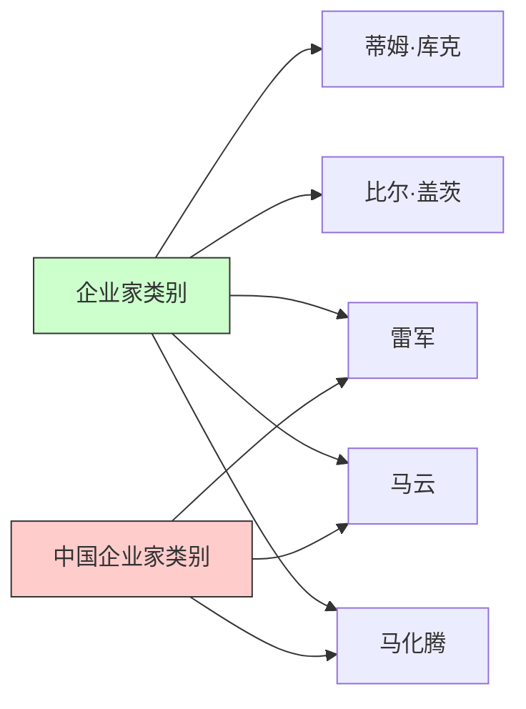

### 1. 关联规则定义
- **规则形式**：`X → Y`
- **X（前项）**："中国企业家"类别
- **Y（后项）**："企业家"类别

### 2. 关键度量指标
| 指标     | 计算公式                          | 计算过程         | 结果值 |
|----------|----------------------------------|------------------|--------|
| **支持度** | (X∩Y的实体数) / 总实体数         | 3个共同实体 / 5个总实体 | 0.6    |
| **置信度** | (X∩Y的实体数) / X的实体数        | 3个共同实体 / 3个X实体 | 1.0    |

### 3. 实体分布说明


### 4. 规则验证结果
当设定阈值（min_sup=0.6, min_conf=0.6）时：
- 支持度（0.6）≥ 阈值（0.6）→ **通过**
- 置信度（1.0）≥ 阈值（0.6）→ **通过**
- **结论**：该规则为强关联规则，证明"中国企业家"是"企业家"的子类

### 5. 知识图谱本体关系
该规则揭示了知识图谱中本体层的概念关系：
```
企业家
└── 子类：中国企业家
    ├── 实例：雷军
    ├── 实例：马云
    └── 实例：马化腾
```

### 规则总结公式：
$$
\begin{align}
\text{Support}(X→Y) &= \frac{|X∩Y|}{|U|} = \frac{3}{5} = 0.6 \\
\text{Confidence}(X→Y) &= \frac{|X∩Y|}{|X|} = \frac{3}{3} = 1.0 \\
\text{强规则判定} &: \begin{cases} 
  0.6 \geq 0.6 \\
  1.0 \geq 0.6 
\end{cases} ⇒ \text{成立}
\end{align}
$$