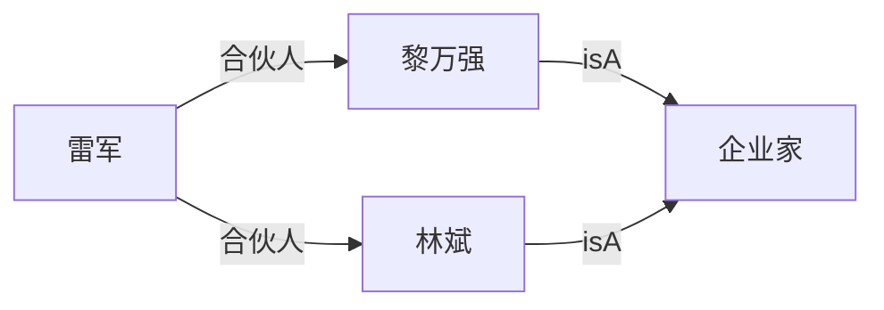
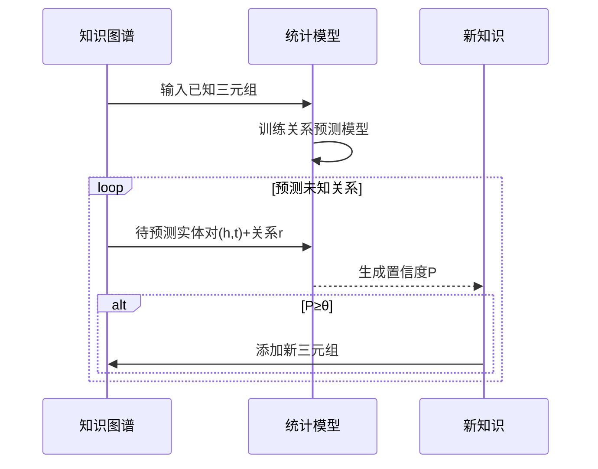

基于统计关系学习的挖掘方法，并进行系统分析：

---

### 一、核心概念抽取
#### 1. **方法定义**
基于统计关系学习的挖掘是利用知识库中**已知三元组**，通过统计学习预测**未知三元组**成立的可能性，用于完善知识图谱。

#### 2. **输入输出**
| 要素 | 说明 |
|------|------|
| **输入** | 实体集合、关系集合、已知三元组集合 |
| **待预测项** | 实体对 + 给定关系 |
| **输出** | 目标三元组成立的置信度（概率值） |

#### 3. **决策规则**
当置信度超过预设阈值时，生成新三元组：
```math
\text{if } P(\text{<头实体, 关系, 尾实体>}) \geq \theta \text{ then 接受新三元组}
```

---

### 二、示例解析（图2-9）
#### 1. 已知知识


#### 2. 预测目标
`(雷军, isA, 企业家)` 是否成立？

#### 3. 推理过程
1. **路径发现**：
   - 路径1：雷军 →合伙人→ 黎万强 →isA→ 企业家
   - 路径2：雷军 →合伙人→ 林斌 →isA→ 企业家

2. **权重分配**：
   - 合伙人关系权重：$w_1$
   - isA关系权重：$w_2$

3. **置信度计算**：
   $$
   P = \alpha \cdot (w_1 \times w_2)_{\text{路径1}} + \beta \cdot (w_1 \times w_2)_{\text{路径2}}
   $$
   其中 $\alpha+\beta=1$ 为路径权重系数

#### 4. 决策阈值
若 $P \geq \theta$ (e.g. $\theta=0.8$)，则接受新三元组：
```turtle
<雷军, isA, 企业家>
```

---

### 三、技术本质分析
#### 1. 核心思想
**关系传导性**：通过实体间的多跳关系路径，推断隐含关系（如：合伙人是企业家 → 创始人也是企业家）

#### 2. 典型方法
1. **路径排序算法(PRA)**：
   - 枚举连接头尾实体的路径
   - 训练逻辑回归分类器预测关系
   ```python
   # 伪代码示例
   paths = find_paths(head, tail, max_length=3)
   features = [1 if path.exists else 0 for path in template_paths]
   confidence = logistic_regression.predict(features)
   ```

2. **图神经网络(GNN)**：
   - 通过消息传递聚合邻域信息
   - 计算关系存在概率：
   $$
   P(r|h,t) = \sigma(\text{GNN}(h,t;\Theta))
   $$

#### 3. 与传统关联规则对比
| 特性 | 关联规则挖掘 | 统计关系学习 |
|------|-------------|-------------|
| 处理对象 | 类别间关联 | 实体间关系 |
| 输出形式 | X→Y规则 | (h,r,t)三元组 |
| 推理能力 | 无 | 多跳推理 |
| 典型应用 | 概念层级构建 | 知识图谱补全 |

---

### 四、实施流程


---

### 五、典型应用场景
1. **类型推理**（如示例）
   - 已知：`(员工, 就职于, 科技公司)`
   - 预测：`(科技公司, 类型, 企业)`

2. **关系补全**
   - 已知：`(A, 父亲, B)`, `(B, 父亲, C)`
   - 预测：`(A, 祖父, C)`

3. **冲突检测**
   - 当 $P(\text{<X, 首都, Y>}) < 0.01$ 但知识库存在该三元组时
   - 触发人工审核

---

### 六、技术挑战与解决方案
| 挑战 | 解决方案 |
|------|---------|
| 路径爆炸 | 随机游走采样 + 路径剪枝 |
| 权重设定 | 基于TransE的关系嵌入初始化 |
| 长程依赖 | 带门控机制的图神经网络 |
| 稀疏关系 | 元学习(Meta-Learning) |

> **关键结论**：该方法通过**关系路径的统计建模**，实现了知识图谱的自动化补全与纠错，是构建高质量知识库的核心技术之一。