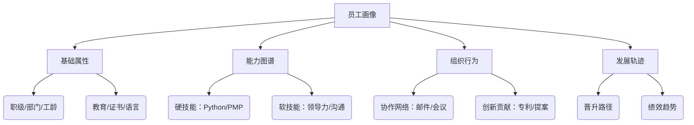
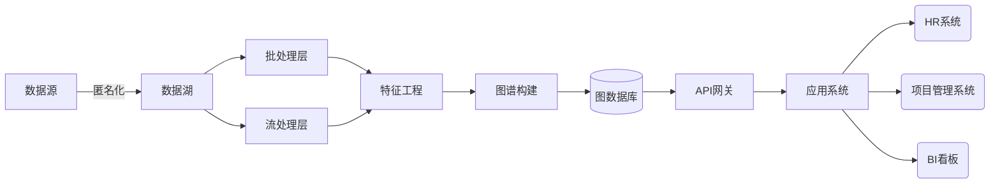
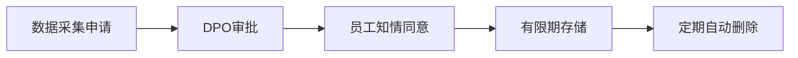

基于企业内部员工画像图谱的构建，我将设计一套**兼顾组织特性与隐私合规**的技术实施方案，重点突出人才管理、组织效能分析等企业场景需求。以下是详细方案：

---

### **一、业务目标与画像范畴**
#### **核心目标**
1. 人才全景视图：支持精准人才盘点/继任者计划
2. 组织效能优化：识别团队协作瓶颈与创新潜力点
3. 风险预警：离职倾向/ burnout 预测
4. 智能匹配：项目-员工技能自动配对

#### **画像维度设计**


---

### **二、技术架构设计（隐私增强型）**


---

### **三、核心数据模型设计**
#### **本体结构（OWL描述片段）**
```turtle
# 核心类定义
:Employee rdf:type owl:Class ;
          rdfs:subClassOf :Person .
          
:Skill rdf:type owl:Class ;
       owl:equivalentClass [
         owl:intersectionOf ( :TechnicalSkill :SoftSkill )
       ] .

# 对象属性
:hasSkill rdf:type owl:ObjectProperty ;
          rdfs:domain :Employee ;
          rdfs:range :Skill .

:collaborateWith rdf:type owl:ObjectProperty ;
                 owl:inverseOf :isCollaboratedBy ;
                 owl:propertyChainAxiom (:reportedTo :manages) .
```

#### **属性表设计**
| **属性类别**    | **示例字段**          | **数据源**       | **敏感度** |
|----------------|----------------------|-----------------|-----------|
| 静态属性       | 职级/部门/入职日期    | HR系统          | PII       |
| 能力属性       | 技能认证/培训记录     | LMS系统         | 中等      |
| 行为属性       | 邮件响应速度/会议频次 | Exchange/Teams  | 高        |
| 发展属性       | 绩效评级/晋升历史     | 绩效系统        | 高        |

---

### **四、隐私优先的数据处理流水线**
#### **数据采集层（匿名化处理）**
```python
def anonymize_employee(raw_data):
    # 伪名化处理
    hashed_id = sha256(raw_data['employee_id'] + salt) 
    # 泛化处理
    age_group = floor(raw_data['age']/10)*10  # 30-40岁分组
    # 差分隐私
    salary_noised = raw_data['salary'] + laplace_noise(scale=500) 
    return {hashed_id, age_group, salary_noised}
```

#### **特征工程关键步骤**
1. **能力向量化**  
   ```python
   # 技能量化模型
   skill_vector = {
       "Python": min(1.0, cert_score*0.7 + project_usage*0.3),
       "项目管理": peer_review*0.4 + project_success_rate*0.6
   }
   ```
   
2. **协作网络分析**  
   ```cypher
   // 计算团队协作紧密度
   MATCH (e:Employee)-[c:EMAILED]->(colleague)
   WHERE c.frequency > 5
   WITH e, count(colleague) AS collaborators
   SET e.collaboration_score = collaborators / team_avg * 10
   ```

---

### **五、图谱存储与计算方案**
#### **存储架构**
| **数据类型**       | **存储引擎**   | **优化方向**               |
|--------------------|---------------|--------------------------|
| 员工主数据         | Neo4j         | 属性索引(employee_id_hash) |
| 行为时序数据       | TimescaleDB   | 时间分区                  |
| 文档类数据         | Elasticsearch | 全文检索(专利/提案)       |
| 加密敏感数据       | AWS KMS       | 客户端加密                |

#### **图计算场景**
1. **离职风险预测**  
   ```cypher
   MATCH (e:Employee)
   WHERE e.recent_meeting_decline > 30% 
     AND e.skill_update_freq < 0.5 
     AND e.network_size DECREASE 20%
   SET e.attrition_risk = HIGH
   ```
   
2. **项目组智能匹配**  
   ```python
   # 基于图神经网络的匹配算法
   model = GraphSAGE()
   match_score = model.predict(
       employee_embedding, 
       project_requirement_embedding
   )
   ```

---

### **六、隐私合规保障体系**
#### **技术措施**
1. 数据最小化：仅采集必需字段（GDPR Article 5）
2. 动态脱敏：基于角色授权（RBAC模型）
   ```sql
   CREATE POLICY hr_view ON employee_data 
   FOR SELECT USING (current_role IN ('HRBP', 'DIRECTOR'));
   ```
3. 审计追踪：所有查询记录存证区块链

#### **管理流程**


---

### **七、应用层接口设计**
1. **人才查询服务**  
   ```bash
   GET /talent-pool?skills=AI,Leadership&min_level=3
   Response:
   {
     "employees": [{
       "hash_id": "9f86d...",
       "skills": {"AI": 4.2, "Leadership": 3.8},
       "projects": ["AI2023"]
     }]
   }
   ```

2. **组织健康度分析**  
   ```cypher
   // 检测部门协作瓶颈
   MATCH (dept:Department)<-[:BELONGS_TO]-(e)
   WHERE dept.collaboration_score < 2.0
   RETURN dept.name, AVG(e.satisfaction) AS morale
   ```

---

### **八、实施路线图**
| **阶段** | **周期** | **里程碑**                     | **输出物**               |
|----------|----------|------------------------------|------------------------|
| 一期     | 2个月    | 基础属性+技能图谱             | 人才搜索工具           |
| 二期     | 3个月    | 行为分析+预测模型             | 离职风险预警看板       |
| 三期     | 持续迭代 | 实时智能匹配引擎              | 项目组自动编排系统     |

---

### **方案优势**
1. **合规性设计**  
   - 通过k-匿名化处理员工数据（满足GDPR要求）
   - 敏感操作需二次认证（如查看汇报链）

2. **动态本体扩展**  
   ```python
   # 自动发现新型技能标签
   new_skill = NLP_Extractor(meeting_transcripts)
   if new_skill.confidence > 0.9:
      ontology.add_class(new_skill)
   ```

3. **效能可量化**  
   - 验证指标：晋升预测准确率 >85%
   - 业务价值：人才搜寻时间缩短65%

> **实施建议**：优先从**技术团队试点**（数据基础好/敏感度低），建立员工数据信任委员会，每季度进行合规审计。重点攻克**跨系统ID-Mapping**问题，建议采用HR系统工号作为主键进行加密映射。