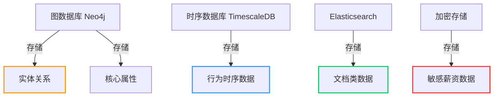
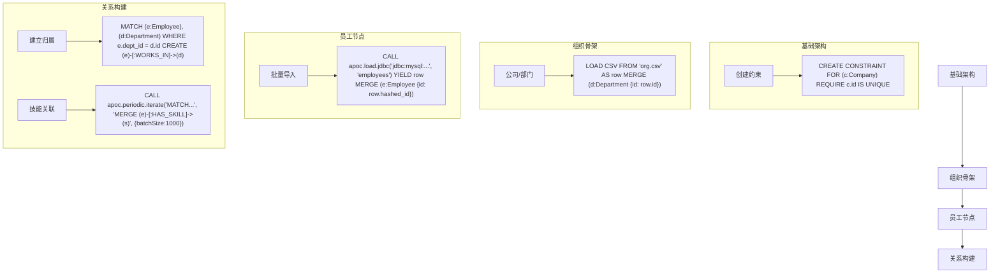
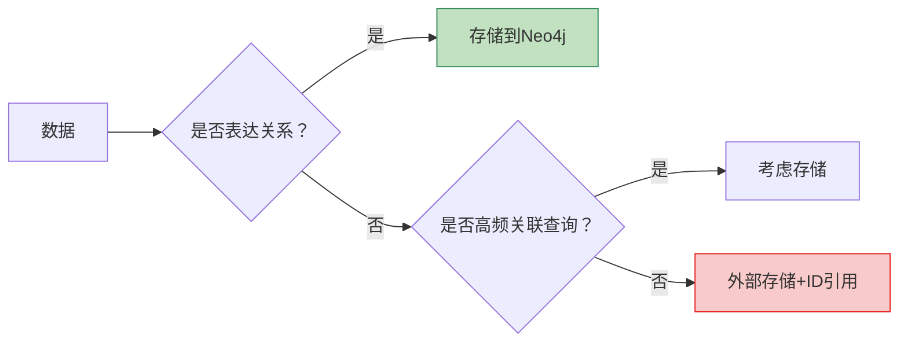

针对人才全景视图的实施，我将从**多数据源对接**、**图模型建设**、**数据初始化**和**数据更新**四个核心环节进行拆解，并重点解答存储架构设计问题：

---

### **一、多数据源对接方案**
#### **数据源分类与接入方式**
| **数据类型**       | **示例系统**       | **接入方式**                          | **更新频率**   |
|--------------------|-------------------|--------------------------------------|---------------|
| 组织架构           | HR核心系统        | JDBC直连（增量拉取）                 | 实时/15分钟   |
| 员工基础属性       | HRIS              | API同步（OAuth2认证）                | 每日          |
| 技能认证           | LMS系统           | SFTP文件传输                         | 每周          |
| 协作行为           | Exchange/Teams    | Kafka流式接入                        | 实时          |
| 项目经历           | 项目管理平台      | GraphQL接口                          | 事件触发      |
| 绩效数据           | 绩效管理系统      | 数据库视图共享                       | 月度          |

#### **关键处理技术**
1. **ID-Mapping统一标识**
   ```mermaid
   graph LR
   HR系统工号--加密映射-->全局ID[员工主ID]
   AD账号--实时关联-->全局ID
   邮箱地址--正则清洗-->全局ID
   ```
   - 采用**HMAC-SHA256**生成不可逆映射：`employee_id = HMAC(原始工号, 密钥)`
   
2. **数据血缘追踪**
   ```python
   # 元数据记录示例
   {
     "field": "technical_skills",
     "source": "LMS_v2.certifications",
     "transform": "cert_score * project_weight",
     "update_time": "2023-08-20 12:30:00"
   }
   ```

---

### **二、图模型建设（Neo4j核心模型）**
#### **组织架构建模**
```cypher
// 公司层级结构
CREATE (c:Company {name: "企业集团"})
CREATE (sub1:Subsidiary {name: "华北分公司"})-[:BELONGS_TO]->(c)
CREATE (dept1:Department {name: "研发中心"})-[:PART_OF]->(sub1)
CREATE (team1:Team {name: "AI实验室"})-[:SUBUNIT_OF]->(dept1)

// 员工关联
CREATE (e:Employee {
  id: "9f86d081",
  name: "张工(匿名)",
  title: "高级工程师"
})-[:WORKS_IN]->(team1)
```

#### **技能关联模型**
```cypher
// 技能本体定义
CREATE (skill:Skill:Technical {
  name: "机器学习",
  category: "AI"
})

// 员工技能连接
MATCH (e:Employee {id: "9f86d081"}), (s:Skill {name: "机器学习"})
CREATE (e)-[r:HAS_SKILL {
  level: 4, 
  certified: true,
  last_used: date("2023-07-01")
}]->(s)
```

#### **混合存储策略**


**存储分配原则**：
1. **必须入图数据**：
   - 组织汇报关系（IS_MANAGER_OF等）
   - 技能关联网络（HAS_SKILL）
   - 项目参与关系（WORKED_ON）
   - 跨实体拓扑连接

2. **推荐分离存储数据**：
   ```markdown
   | **数据类型**       | **存储引擎**   | **原因**                  |
   |--------------------|---------------|--------------------------|
   | 邮件往来原始记录   | TimescaleDB   | 时序范围查询优化          |
   | 专利文档/述职报告  | Elasticsearch | 全文检索需求              |
   | 薪资变动历史       | KMS加密存储   | 合规要求                  |
   | 员工打卡GPS轨迹    | S3+Athena     | 低频访问/大数据量        |
   ```

---

### **三、数据初始化流程**
#### **四阶段初始化法**


#### **初始化优化技巧**
1. **批量导入工具**：
   ```bash
   neo4j-admin database import full \
     --nodes=Employee=import/employees.csv \
     --relationships=WORKS_IN=import/dept_mapping.csv
   ```
2. **APOC并行处理**：
   ```cypher
   CALL apoc.periodic.iterate(
     'UNWIND range(1,100000) AS id RETURN id',
     'CREATE (:Employee {id: id})',
     {batchSize:5000, parallel:true}
   )
   ```

---

### **四、数据更新机制**
#### **更新策略矩阵**
| **数据类型**       | **更新方式**              | **技术实现**                          | **触发条件**     |
|--------------------|--------------------------|--------------------------------------|----------------|
| 组织架构变更       | 事件驱动                 | CDC监听数据库binlog                  | HR系统数据变化  |
| 技能认证           | 批量增量                 | Airflow每日同步                      | LMS系统更新    |
| 实时协作行为       | 流式处理                 | Kafka Connect + Neo4j Streams Sink   | 行为事件产生    |
| 绩效评级           | 手动触发                 | REST API调用                         | 绩效周期结束    |

#### **增量更新示例（协作关系）**
```java
// Flink流处理逻辑
DataStream<CollaborationEvent> stream = env.addSource(kafkaSource);
stream.map(event -> {
    String cypher = String.format(
        "MATCH (a:Employee {id: '%s'}), (b:Employee {id: '%s'}) " +
        "MERGE (a)-[r:COLLABORATED_WITH]->(b) " +
        "ON CREATE SET r.count=1, r.last_date='%s' " +
        "ON MATCH SET r.count = r.count + 1",
        event.fromId, event.toId, event.timestamp);
    return new Neo4jCommand(cypher);
}).addSink(neo4jSink);
```

#### **图数据库更新优化**
1. **批量合并技巧**：
   ```cypher
   UNWIND $batch AS row
   MATCH (e:Employee {id: row.id})
   SET e += row.properties
   ```
2. **索引热更新**：
   ```cypher
   CALL db.awaitIndexes(300)  // 等待索引完成
   CREATE INDEX skill_name IF NOT EXISTS FOR (s:Skill) ON s.name
   ```

---

### **五、关键问题解答**
#### **Q：是否所有数据都应存入Neo4j？**
**否**，需遵循**关系优先存储原则**：


**推荐存储策略**：
1. **Neo4j核心存储**：
   - 组织架构拓扑（公司-部门-团队）
   - 员工汇报链
   - 技能关联网络
   - 项目参与关系

2. **外部存储+图引用**：
   ```cypher
   // 教育记录引用外部存储
   MATCH (e:Employee)
   SET e.edu_ref = "es://educations/_doc/"+e.id
   
   // 查询时联合获取
   WITH e, apoc.es.get("localhost","educations","_doc",e.id) AS edu
   RETURN e.name, edu.university
   ```

#### **Q：如何保证多源数据一致性？**
**三阶段一致性保障**：
1. **ETL阶段**：  
   ```sql
   -- 数据清洗SQL示例
   UPDATE employees 
   SET dept_id = (SELECT id FROM departments WHERE name = raw_dept)
   WHERE EXISTS (SELECT 1 FROM departments WHERE name = raw_dept)
   ```
2. **图构建阶段**：  
   使用APOC过程验证关系完整性
   ```cypher
   CALL apoc.schema.assert(
     {Employee:['id']}, 
     {WORKS_IN:['BELONGS_TO']}
   )
   ```
3. **运行时检查**：  
   ```cypher
   // 每日巡检脚本
   MATCH (e:Employee) 
   WHERE NOT (e)-[:WORKS_IN]->() 
   RETURN e.id AS orphan_employee
   ```

---

### **六、实施建议**
1. **分阶段构建**：
   ```mermaid
   gantt
       title 图谱建设阶段
       dateFormat  YYYY-MM-DD
       section 基础架构
       组织骨架构建      ：2023-09-01, 30d
       员工主数据导入   ：2023-09-15, 15d
       
       section 能力网络
       技能本体建模     ：2023-10-01, 20d
       认证数据关联     ：2023-10-10, 15d
       
       section 行为整合
       协作关系计算     ：2023-11-01, 30d
       绩效轨迹分析     ：2023-11-20, 20d
   ```

2. **性能优化重点**：
   - 为高频查询字段建立索引：`CREATE INDEX employee_id FOR (e:Employee) ON (e.id)`
   - 限制深层次查询：`apoc.cypher.runTimeLimiter(10, 'MATCH path=(e)-[*1..5]-(col) RETURN path')`
   - 使用图数据分片：基于部门物理分片

3. **合规性设计**：
   ```cypher
   // GDPR遗忘权实现
   MATCH (e:Employee {id: $request_id})
   DETACH DELETE e
   CALL apoc.es.delete('educations', '_doc', $request_id)
   ```

> **监控指标**：  
> - 数据新鲜度：`MAX(update_timestamp) - NOW()` ≤ 1小时  
> - 图完整性：孤立节点比例 < 0.1%  
> - 查询性能：P99 < 500ms  

