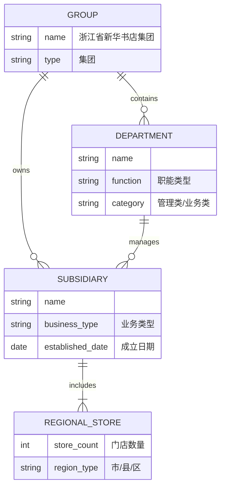

### 浙江省新华书店组织架构图模型构建方案 (Neo4j实现)

#### 一、模型设计原则
1. **三层级结构**：集团 → 职能部门/事业部 → 子公司
2. **双线管理**：职能管理线(虚线) + 业务汇报线(实线)
3. **动态扩展**：预留子公司地域属性，支持65家市县书店挂载

#### 二、节点类型与属性设计


#### 三、完整Cypher构建脚本
```cypher
// 1. 创建集团节点
CREATE (group:Group {
  id: 'zhejiang_xinhua',
  name: '浙江省新华书店集团',
  type: '集团',
  established: 1949
});

// 2. 创建职能部门节点（管理类）
WITH ['党委办公室', '综合管理部', '人力资源部', '财务部', '纪检监察部', '审计部', '产业发展部', '资产与项目管理部'] AS deptNames
UNWIND deptNames AS deptName
CREATE (d:Department {
  id: toLower(apoc.text.slug(deptName)),
  name: deptName,
  function: CASE deptName
    WHEN '党委办公室' THEN '党务管理'
    WHEN '综合管理部' THEN '行政管理'
    WHEN '人力资源部' THEN '人事管理'
    WHEN '财务部' THEN '财务管理'
    WHEN '纪检监察部' THEN '监督管理'
    WHEN '审计部' THEN '审计监督'
    WHEN '产业发展部' THEN '战略规划'
    ELSE '资产管理'
  END,
  category: '管理类'
})
WITH d, deptName
MATCH (g:Group {id: 'zhejiang_xinhua'})
CREATE (d)-[:BELONGS_TO]->(g);

// 3. 创建业务部门节点（业务类）
WITH ['教育服务事业部', '电商事业部', '图书采供中心', '创新业务事业部', '阅读服务事业部', '馆藏事业部'] AS bizNames
UNWIND bizNames AS bizName
CREATE (b:Department {
  id: toLower(apoc.text.slug(bizName)),
  name: bizName,
  function: CASE bizName
    WHEN '教育服务事业部' THEN '教育服务'
    WHEN '电商事业部' THEN '电子商务'
    WHEN '图书采供中心' THEN '图书采购'
    WHEN '创新业务事业部' THEN '业务创新'
    WHEN '阅读服务事业部' THEN '阅读推广'
    ELSE '馆藏服务'
  END,
  category: '业务类'
})
WITH b, bizName
MATCH (g:Group {id: 'zhejiang_xinhua'})
CREATE (b)-[:BELONGS_TO]->(g);

// 4. 创建本级子公司节点
WITH [
  {name: '浙江省新华书店集团信息技术有限公司', type: 'IT服务', year: 2005},
  {name: '浙江省新华书店集团电子商务物流有限公司', type: '物流配送', year: 2012},
  {name: '浙江省新华书店集团馆藏图书有限公司', type: '馆藏服务', year: 2010},
  {name: '浙江新空间研学文化发展有限公司', type: '研学服务', year: 2018},
  {name: '浙江华硕国际贸易有限责任公司', type: '国际贸易', year: 2008},
  {name: '浙江省外文书店有限责任公司', type: '外文书籍', year: 1993},
  {name: '博库书城有限公司', type: '图书零售', year: 2003},
  {name: '博库书城上海有限公司', type: '跨区域零售', year: 2007},
  {name: '浙江文华大酒店有限公司', type: '酒店服务', year: 2001},
  {name: '浙江文源宾馆有限公司', type: '酒店服务', year: 2000}
] AS subsidiaries
UNWIND subsidiaries AS sub
CREATE (s:Subsidiary {
  id: toLower(apoc.text.slug(sub.name)),
  name: sub.name,
  business_type: sub.type,
  established_date: date({year: sub.year})
})
WITH s
MATCH (g:Group {id: 'zhejiang_xinhua'})
CREATE (s)-[:OWNED_BY]->(g);

// 5. 创建市县子公司节点
CREATE (regional:RegionalStore {
  id: 'regional_stores',
  name: '市、县（市、区）新华书店子公司',
  store_count: 65,
  region_type: '市县区'
})
WITH regional
MATCH (g:Group {id: 'zhejiang_xinhua'})
CREATE (regional)-[:PART_OF]->(g);

// 6. 建立业务管理关系
// 教育服务事业部 → 信息技术公司
MATCH (edu:Department {name: '教育服务事业部'})
MATCH (it:Subsidiary {name: '浙江省新华书店集团信息技术有限公司'})
CREATE (edu)-[:MANAGES]->(it);

// 馆藏事业部 → 馆藏图书公司
MATCH (lib:Department {name: '馆藏事业部'})
MATCH (libCo:Subsidiary {name: '浙江省新华书店集团馆藏图书有限公司'})
CREATE (lib)-[:MANAGES]->(libCo);

// 教育服务事业部 → 新空间研学
MATCH (edu:Department {name: '教育服务事业部'})
MATCH (study:Subsidiary {name: '浙江新空间研学文化发展有限公司'})
CREATE (edu)-[:MANAGES]->(study);

// 阅读服务事业部 → 博库书城
MATCH (retail:Department {name: '阅读服务事业部'})
MATCH (bookcity:Subsidiary {name: '博库书城有限公司'})
CREATE (retail)-[:MANAGES]->(bookcity);

// 7. 建立职能管理关系
// 人力资源部管理范围
MATCH (hr:Department {name: '人力资源部'})
MATCH (subs:Subsidiary)
WHERE subs.name IN [
  '浙江省新华书店集团信息技术有限公司',
  '浙江省新华书店集团电子商务物流有限公司',
  '浙江文华大酒店有限公司'
]
CREATE (hr)-[:SUPERVISES {relation: '虚线管理'}]->(subs);

// 财务部管理范围
MATCH (finance:Department {name: '财务部'})
MATCH (subs:Subsidiary)
WHERE NOT subs.name IN ['浙江新空间研学文化发展有限公司']
CREATE (finance)-[:SUPERVISES {relation: '虚线管理'}]->(subs);

// 8. 建立同级关联关系
// 物流 → 书城
MATCH (logistics:Subsidiary {name: '浙江省新华书店集团电子商务物流有限公司'})
MATCH (bookcity:Subsidiary {name: '博库书城有限公司'})
CREATE (logistics)-[:COOPERATES_WITH {type: '物流支持'}]->(bookcity);

// IT公司 → 电商事业部
MATCH (it:Subsidiary {name: '浙江省新华书店集团信息技术有限公司'})
MATCH (ecom:Department {name: '电商事业部'})
CREATE (it)-[:SUPPORTS]->(ecom);

// 9. 建立索引
CREATE INDEX group_index FOR (g:Group) ON (g.id);
CREATE INDEX dept_index FOR (d:Department) ON (d.id);
CREATE INDEX sub_index FOR (s:Subsidiary) ON (s.id);
CREATE INDEX regional_index FOR (r:RegionalStore) ON (r.id);

// 财务部员工
MATCH (dept:Department {name: '财务部'})
WITH dept, range(1,5) AS idx
UNWIND idx AS i

// 提前生成随机数和时间戳
WITH dept, i,
     rand() AS r,
     apoc.date.parse('2018-01-01', 's', 'yyyy-MM-dd') AS baseTimeSeconds

// 计算 hire_date
WITH dept, i, r,
     date(
       apoc.date.format(
         baseTimeSeconds + toInteger(rand() * 800) * 86400, // 秒级时间戳 + 天数转秒
         's',
         'yyyy-MM-dd'
       )
     ) AS hire_date,

     // 教育背景
     CASE 
       WHEN i < 3 THEN '本科'
       ELSE '专科'
     END AS education,

     // 姓名生成
     apoc.text.random(3, '李王张刘陈杨赵黄周吴') + 
     CASE 
       WHEN r < 0.3 THEN '伟'
       WHEN r < 0.6 THEN '芳'
       ELSE '敏'
     END AS name,

     // 职位分配
     CASE i
       WHEN 1 THEN '财务主管'
       WHEN 2 THEN '会计主管'
       ELSE '会计'
     END AS position,

     // 工资与职级
     'P' + toString(toInteger(r * 3 + 3)) AS work_level,
     12000.00 + toInteger(rand() * 8000) AS base_salary

// 创建员工节点
CREATE (emp:Employee {
  employee_id: 'F' + toString(1000 + i),
  name: name,
  position: position,
  hire_date: hire_date,
  education: education,
  work_level: work_level,
  base_salary: base_salary
})
CREATE (emp)-[:BELONGS_TO]->(dept)
WITH emp, dept

// 关联汇报关系
MATCH (manager:Employee {position: '财务总监'})
WHERE (manager)-[:BELONGS_TO]->(dept)
CREATE (emp)-[:REPORTS_TO]->(manager);

// 其他部门员工（示例：教育服务事业部）
MATCH (dept:Department {name: '教育服务事业部'})
WITH dept, range(1,8) AS idx
UNWIND idx AS i

// 提前生成随机数和基础时间戳
WITH dept, i,
     rand() AS r,
     apoc.date.parse('2015-01-01', 's', 'yyyy-MM-dd') AS baseTimeSeconds

// 计算 hire_date、姓名、职位、学历、职级、薪资等属性
WITH dept, i, r,
     date(apoc.date.format(
       baseTimeSeconds + toInteger(rand() * 1500) * 86400, // 随机天数转秒
       's',
       'yyyy-MM-dd'
     )) AS hire_date,

     // 教育背景
     CASE 
       WHEN i < 3 THEN '本科'
       ELSE '专科'
     END AS education,

     // 姓名生成
     apoc.text.random(3, '徐朱马胡郭林郑罗梁') +
     CASE 
       WHEN r < 0.4 THEN '婷'
       WHEN r < 0.7 THEN '杰'
       ELSE '浩'
     END AS name,

     // 职位分配
     CASE 
       WHEN i = 1 THEN '运营总监'
       WHEN i = 2 THEN '市场经理'
       ELSE '客户经理'
     END AS position,

     // 工资与职级
     'P' + toString(toInteger(r * 4 + 2)) AS work_level,
     10000.00 + toInteger(rand() * 10000) AS base_salary

// 创建员工节点
CREATE (emp:Employee {
  employee_id: 'E' + toString(2000 + i),
  name: name,
  position: position,
  hire_date: hire_date,
  education: education,
  work_level: work_level,
  base_salary: base_salary
})
CREATE (emp)-[:BELONGS_TO]->(dept)
WITH emp, dept

// 关联汇报关系
MATCH (manager:Employee {position: '事业部总经理'})
WHERE (manager)-[:BELONGS_TO]->(dept)
CREATE (emp)-[:REPORTS_TO]->(manager);

// ===== 4. 技能模型初始化 =====
CREATE (skill1:Skill {
  skill_id: 'SK001',
  name: '财务管理',
  category: '专业能力',
  proficiency: 5
});

CREATE (skill2:Skill {
  skill_id: 'SK002',
  name: '供应链管理',
  category: '业务能力',
  proficiency: 4
});

CREATE (skill3:Skill {
  skill_id: 'SK003',
  name: 'Python编程',
  category: '技术能力',
  proficiency: 3
});

// 员工技能关联
MATCH (cfo:Employee {position: 'CFO'})
MATCH (skill:Skill {name: '财务管理'})
CREATE (cfo)-[:HAS_SKILL {
  level: 5,
  certified: true,
  cert_date: date('2020-05-15')
}]->(skill);

MATCH (emp:Employee)
WHERE emp.position IN ['会计', '财务主管']
MATCH (skill:Skill {name: '财务管理'})
CREATE (emp)-[:HAS_SKILL {
  level: toInteger(rand()*2+3),
  certified: true
}]->(skill);

// ===== 5. 培训模型初始化 =====
CREATE (training1:Training {
  training_id: 'TR001',
  name: '新会计准则培训',
  training_date: date('2023-03-10'),
  duration: 16.0,
  provider: '财政部培训中心'
});

CREATE (training2:Training {
  training_id: 'TR002',
  name: '领导力提升训练营',
  training_date: date('2023-05-20'),
  duration: 24.0,
  provider: '中欧商学院'
});

// 培训参与关系
MATCH (training:Training {name: '新会计准则培训'})
MATCH (emp:Employee)
WHERE emp.position IN ['CFO', '财务总监', '会计主管', '会计']
CREATE (emp)-[:ATTENDED_TRAINING {
  score: toInteger(rand()*20+80),
  certificate: true
}]->(training);

MATCH (training:Training {name: '领导力提升训练营'})
MATCH (emp:Employee)
WHERE emp:Manager OR emp:Executive
CREATE (emp)-[:ATTENDED_TRAINING {
  score: toInteger(rand()*15+85),
  certificate: true
}]->(training);

// ===== 6. 项目模型初始化 =====
CREATE (project1:Project {
  project_id: 'PJ001',
  name: '全省教育装备数字化平台',
  start_date: date('2023-01-01'),
  end_date: date('2023-12-31'),
  budget: 5000000.00,
  status: '进行中'
});

CREATE (project2:Project {
  project_id: 'PJ002',
  name: '智慧物流系统升级',
  start_date: date('2022-07-01'),
  end_date: date('2023-06-30'),
  budget: 3200000.00,
  status: '已完成'
});

// 项目参与关系
MATCH (project:Project {name: '全省教育装备数字化平台'})
MATCH (eduDept:Department {name: '教育服务事业部'})
MATCH (emp:Employee)-[:BELONGS_TO]->(eduDept)
WITH project, emp LIMIT 5
CREATE (emp)-[:PARTICIPATES_IN {
  role: CASE rand()
    WHEN <0.2 THEN '项目经理'
    WHEN <0.5 THEN '核心成员'
    ELSE '项目成员'
  END,
  allocation: 0.5 + rand()*0.5
}]->(project);

MATCH (project:Project {name: '智慧物流系统升级'})
MATCH (it:Subsidiary {name: '浙江省新华书店集团信息技术有限公司'})
MATCH (logistics:Subsidiary {name: '浙江省新华书店集团电子商务物流有限公司'})
MATCH (emp:Employee)-[:WORKS_AT]->(it)
WITH project, emp LIMIT 3
CREATE (emp)-[:PARTICIPATES_IN {
  role: '技术开发',
  allocation: 0.7
}]->(project);

MATCH (project:Project {name: '智慧物流系统升级'})
MATCH (emp:Employee)-[:WORKS_AT]->(logistics)
WITH project, emp LIMIT 4
CREATE (emp)-[:PARTICIPATES_IN {
  role: '业务分析师',
  allocation: 0.6
}]->(project);

// ===== 7. 绩效评级模型初始化 =====
// 生成2022年绩效数据
MATCH (emp:Employee)
WITH emp
CREATE (review:PerformanceReview {
  review_id: 'RV' + emp.employee_id + '-2022',
  year: 2022,
  quarter: 4,
  rating: CASE 
    WHEN emp:Executive THEN 'A'
    WHEN rand() < 0.2 THEN 'A'
    WHEN rand() < 0.5 THEN 'B'
    ELSE 'C'
  END,
  comments: '年度综合评价'
})
CREATE (emp)-[:HAS_REVIEW]->(review);

// 生成2023年Q1绩效数据
MATCH (emp:Employee)
WHERE rand() < 0.8  // 80%员工有Q1数据
WITH emp
CREATE (review:PerformanceReview {
  review_id: 'RV' + emp.employee_id + '-2023Q1',
  year: 2023,
  quarter: 1,
  rating: CASE 
    WHEN emp:Executive THEN 'A'
    WHEN rand() < 0.15 THEN 'A'
    WHEN rand() < 0.45 THEN 'B'
    WHEN rand() < 0.8 THEN 'C'
    ELSE 'D'
  END,
  comments: '第一季度工作评价'
})
CREATE (emp)-[:HAS_REVIEW]->(review);

// ===== 8. 创建索引 =====
CREATE INDEX group_idx FOR (g:Group) ON (g.id);
CREATE INDEX dept_idx FOR (d:Department) ON (d.id);
CREATE INDEX emp_idx FOR (e:Employee) ON (e.employee_id);
CREATE INDEX skill_idx FOR (s:Skill) ON (s.skill_id);
CREATE INDEX project_idx FOR (p:Project) ON (p.project_id);


```

#### 四、关键关系说明
| **关系类型** | **Cypher模式** | **业务含义** |
|-------------|----------------|-------------|
| 隶属关系 | `(:Department)-[:BELONGS_TO]->(:Group)` | 部门直属于集团 |
| 所有权关系 | `(:Subsidiary)-[:OWNED_BY]->(:Group)` | 集团全资控股子公司 |
| 业务管理 | `(:Department)-[:MANAGES]->(:Subsidiary)` | 事业部对子公司的实线管理 |
| 职能监管 | `(:Department)-[:SUPERVISES]->(:Subsidiary)` | 职能部门对子公司的虚线管理 |
| 区域包含 | `(:RegionalStore)-[:PART_OF]->(:Group)` | 市县子公司属于集团 |
| 业务协同 | `(:Subsidiary)-[:COOPERATES_WITH]->(:Subsidiary)` | 子公司间协作关系 |
| 技术支持 | `(:Subsidiary)-[:SUPPORTS]->(:Department)` | IT公司支持业务部门 |

#### 五、验证查询示例
1. **查看集团完整架构树**:
```cypher
MATCH path = (g:Group)<-[:BELONGS_TO|OWNED_BY|PART_OF*]-(entity)
RETURN path
```

2. **查询业务事业部管理的子公司**:
```cypher
MATCH (dept:Department {category:'业务类'})-[r:MANAGES]->(sub:Subsidiary)
RETURN dept.name AS 事业部, sub.name AS 子公司, r.type AS 管理类型
```

3. **查看人力资源部监管范围**:
```cypher
MATCH (hr:Department {name:'人力资源部'})-[:SUPERVISES]->(sub:Subsidiary)
RETURN sub.name AS 子公司, sub.business_type AS 业务类型
```

4. **物流公司合作关系查询**:
```cypher
MATCH (logistics:Subsidiary {name:'浙江省新华书店集团电子商务物流有限公司'})-[r:COOPERATES_WITH]->(partner)
RETURN partner.name AS 合作伙伴, r.type AS 合作类型
```

#### 六、执行建议
1. **分批执行**：将脚本拆分为3部分执行，避免超时：
   - 步骤1-3：创建集团和部门
   - 步骤4-5：创建子公司
   - 步骤6-9：建立关系和索引

2. **数据增强**：添加更多属性提升分析价值
```cypher
// 添加员工规模属性
MATCH (s:Subsidiary)
SET s.employee_count = CASE s.name
  WHEN '浙江省新华书店集团信息技术有限公司' THEN 120
  WHEN '博库书城有限公司' THEN 350
  ...
END

// 添加财务关联
MATCH (finance:Department {name:'财务部'})
MATCH (s:Subsidiary)
CREATE (s)-[:FINANCE_REPORT_TO]->(finance)
```

3. **动态扩展市县节点**（当获取具体数据后）：
```cypher
// 示例：添加杭州市新华书店
CREATE (hz:RegionalStore {
  id: 'hangzhou_store',
  name: '杭州市新华书店',
  region_type: '市级',
  store_count: 8
})
CREATE (hz)-[:PART_OF]->(:RegionalStore {name:'市、县（市、区）新华书店子公司'})
```

> **实施提示**：  
> - 使用`apoc.periodic.iterate`批量处理大型关系  
> - 部署Neo4j 5.x+版本支持多数据库特性隔离生产/测试环境  
> - 配合Bloom工具实现可视化组织架构探索  
> - 每日备份：`neo4j-admin backup --database=neostore --backup-dir=/backups`