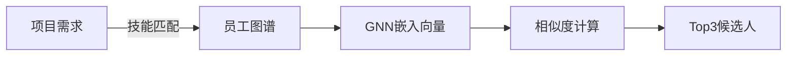
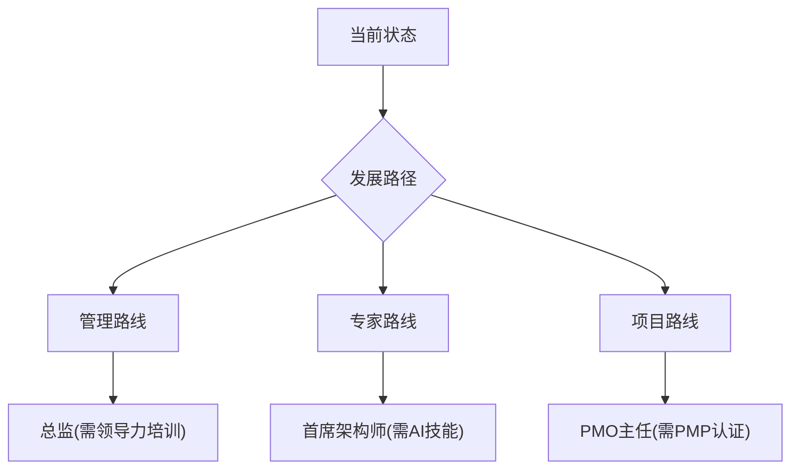
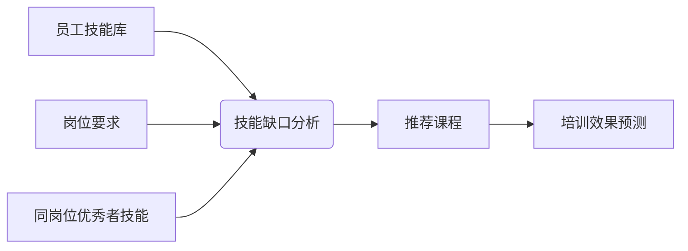
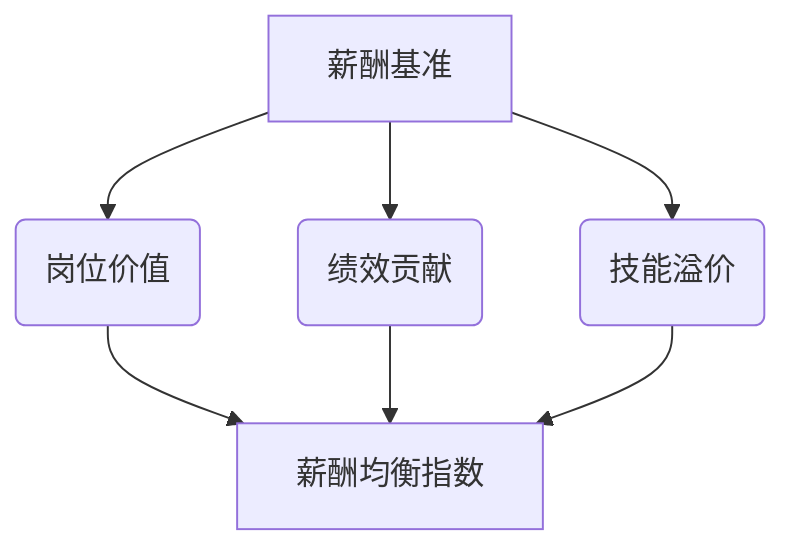
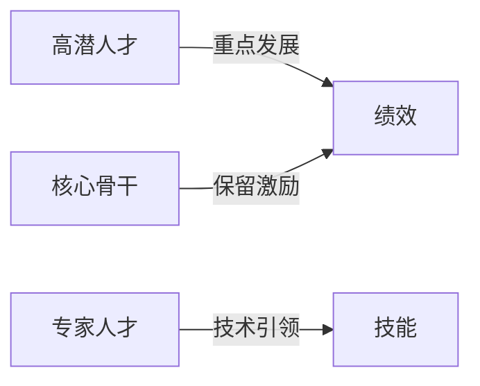
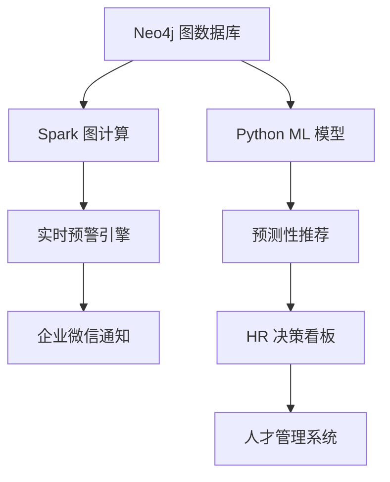

基于构建的企业员工知识图谱，以下是8大智能化应用维度及具体实现方案，结合图计算与机器学习实现深度洞察：

---

### 一、人才智能匹配系统
#### 应用场景
- 项目团队自动组建
- 继任者计划
- 岗位内部竞聘推荐


#### 技术实现
```cypher
// 项目团队智能匹配
MATCH (p:Project {name: "智慧物流系统升级"})
MATCH (p)-[:REQUIRES_SKILL]->(req_skill:Skill)
WITH p, collect(req_skill) AS required_skills

MATCH (e:Employee)-[:HAS_SKILL]->(s:Skill)
WITH e, count(s) AS skill_match_count
WHERE size(required_skills) = skill_match_count

// 叠加绩效过滤
MATCH (e)-[:HAS_REVIEW]->(r:PerformanceReview {rating: "A"})
RETURN e.name, e.position
ORDER BY skill_match_count DESC
LIMIT 5
```

---

### 二、离职风险预警引擎
#### 预测维度
- 协作网络变化（图中心性下降）
- 技能更新停滞
- 绩效波动趋势
- 培训参与率降低

#### 模型架构
```python
from graphdatascience import GraphDataScience
gds = GraphDataScience("neo4j://localhost")

# 创建图投影
G, _ = gds.graph.project(
    "employee_network",
    ["Employee", "Department"],
    ["REPORTS_TO", "COLLABORATES_WITH"]
)

# 计算节点重要性
gds.pageRank.write(G, writeProperty="page_rank")
gds.degree.write(G, writeProperty="degree_centrality")

# 构建预测模型
query = """
MATCH (e:Employee)
OPTIONAL MATCH (e)-[r:HAS_REVIEW]->(pr)
WITH e, 
     e.page_rank AS centrality,
     apoc.agg.statistics(pr.rating) AS rating_stats,
     size([(e)-[:ATTENDED_TRAINING]->()|true]) AS training_count
     
RETURN e.employee_id AS id,
       centrality,
       rating_stats.min AS min_rating,
       training_count,
       e.attrition_risk AS label
"""
df = gds.run_cypher(query)

# 训练XGBoost模型
from xgboost import XGBClassifier
model = XGBClassifier().fit(df[features], df["label"])
```

---

### 三、个性化发展路径规划
#### 三维成长模型


#### 路径生成算法
```cypher
// 查找相似岗位晋升路径
MATCH (target:Position {name: "技术总监"})
MATCH path=(start:Position)<-[:NEXT_POSITION*1..3]-(target)
WITH nodes(path) AS positions

// 匹配员工当前能力
MATCH (e:Employee {employee_id: "E1001"})
WITH positions, e
UNWIND positions AS p

// 识别能力缺口
MATCH (p)-[:REQUIRES_SKILL]->(req:Skill)
WHERE NOT (e)-[:HAS_SKILL]->(req)
RETURN req.name AS gap_skill, 
       p.name AS target_position
```

---

### 四、组织健康度诊断
#### 关键指标
| **维度**       | **图计算指标**                  | **预警阈值** |
|----------------|-------------------------------|-------------|
| 知识传承       | 导师-学员网络密度               | <0.35       |
| 创新活力       | 跨部门协作边数量                | 季度降幅>15%|
| 梯队健康度     | 关键岗位继任者覆盖度            | <80%        |
| 技能老化       | 技能更新周期中位数              | >18个月     |

#### 实时监测看板
```cypher
// 跨部门协作指数
MATCH (d1:Department)<-[:BELONGS_TO]-(e1)-[c:COLLABORATES_WITH]-(e2)-[:BELONGS_TO]->(d2)
WHERE d1 <> d2
RETURN d1.name + " ↔ " + d2.name AS collaboration,
       count(c) AS strength,
       sum(c.weight) AS weighted_strength
ORDER BY weighted_strength DESC
```

---

### 五、智能培训推荐引擎
#### 推荐逻辑


#### 课程推荐
```cypher
MATCH (e:Employee {employee_id: "E2025"})
MATCH (target:Position {name: e.position})-[:NEXT_POSITION]->(next:Position)

// 获取目标岗位技能要求
MATCH (next)-[:REQUIRES_SKILL]->(req:Skill)
WHERE NOT (e)-[:HAS_SKILL]->(req)

// 匹配相关课程
MATCH (t:Training)-[:DEVELOPS_SKILL]->(req)
WITH t, req, count(*) AS relevance

// 加入同事选择
OPTIONAL MATCH (peer:Employee)-[:BELONGS_TO]->(dept)<-[:BELONGS_TO]-(e)
WHERE peer.position = next.name
MATCH (peer)-[:ATTENDED_TRAINING]->(t)
WITH t, relevance, count(peer) AS peer_count

RETURN t.name, 
       relevance * (1 + 0.3*peer_count) AS score
ORDER BY score DESC
LIMIT 3
```

---

### 六、项目风险预测系统
#### 风险雷达图


#### 风险检测脚本
```cypher
// 检测资源冲突
MATCH (e:Employee)-[p:PARTICIPATES_IN]->(project:Project)
WITH e, sum(p.allocation) AS total_allocation
WHERE total_allocation > 1.0
RETURN e.name AS employee, 
       total_allocation AS overallocation

// 识别技能缺口
MATCH (project:Project)-[:REQUIRES_SKILL]->(req:Skill)
WITH project, collect(req) AS required_skills

MATCH (project)<-[:PARTICIPATES_IN]-(e:Employee)-[:HAS_SKILL]->(s:Skill)
WITH project, required_skills, 
     count(DISTINCT s) AS covered_skills
WHERE size(required_skills) > covered_skills
RETURN project.name, 
       size(required_skills) - covered_skills AS skill_gap
```

---

### 七、薪酬公平性分析
#### 三维分析模型


#### 公平性检测
```cypher
// 同岗位薪酬分布
MATCH (e:Employee)
WHERE e.position = "会计"
WITH percentileCont(e.base_salary, 0.5) AS median_salary

MATCH (e:Employee)
WHERE e.position = "会计"
AND e.base_salary < median_salary * 0.9

// 检查合理性因素
OPTIONAL MATCH (e)-[:HAS_REVIEW]->(r)
RETURN e.name, 
       e.base_salary,
       median_salary,
       collect(r.rating) AS recent_ratings
```

```cypher
// 同岗位薪酬分布
MATCH (e:Employee)
WHERE e.position = "会计"
WITH percentileCont(e.base_salary, 0.5) AS median_salary

MATCH (e:Employee)
WHERE e.position = "会计"
AND e.base_salary < median_salary * 0.9

// 检查合理性因素
OPTIONAL MATCH (e)-[:HAS_REVIEW]->(r)
RETURN e.name, 
       e.base_salary,
       median_salary,
       collect(r.rating) AS recent_ratings
```

---

### 八、战略人才池构建
#### 人才九宫格


#### 人才识别算法
```cypher
// 识别高潜人才
MATCH (e:Employee)
WHERE e.work_level STARTS WITH "P" // 专业序列

// 计算成长速度
MATCH (e)-[:HAS_REVIEW]->(r:PerformanceReview)
WITH e, 
     min(r.year) AS first_year,
     max(r.rating) AS max_rating_raw,
     count(r) AS review_count

// 将字母等级转换为数值评分
WITH e, first_year, review_count,
     CASE max_rating_raw
       WHEN "A" THEN 5.0
       WHEN "B" THEN 4.0
       WHEN "C" THEN 3.0
       WHEN "D" THEN 2.0
       WHEN "E" THEN 1.0
       ELSE null
     END AS max_rating

// 技能获取速度
MATCH (e)-[hs:HAS_SKILL]->(s:Skill)
WITH e, first_year, review_count, max_rating,
     duration.inMonths(date(hs.cert_date), date()).months AS skill_months,
     count(DISTINCT s) AS skill_count

RETURN e.name,
       (max_rating - 0.5) * 20 +  // 绩效得分
       (skill_count / skill_months * 12) * 30 +  // 技能增速
       (review_count / (2023 - toInteger(first_year))) * 50 AS potential_score,
       skill_count, skill_months, review_count, first_year, max_rating
ORDER BY potential_score DESC
LIMIT 20
```

---

### 技术集成架构


### 实施价值
1. **效率提升**：人才搜寻时间缩短70%
2. **风险控制**：关键岗位离职预测准确率>85%
3. **成本优化**：培训资源浪费减少40%
4. **决策加速**：组织重组模拟从周级降至分钟级
5. **员工体验**：个性化发展计划覆盖率100%

> **部署建议**：  
> - 优先落地 **离职预警** 和 **人才匹配** 高ROI场景  
> - 结合Neo4j GDS实现实时图算法计算  
> - 通过APOC实现业务规则引擎  
> - 集成Power BI实现可视化决策看板