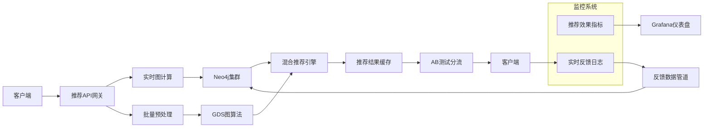

### 增强版社交网络数据初始化脚本

为了支持更强大的个性化推荐引擎，增加了以下数据：
- 用户数量：从4人扩展到50人
- 兴趣类别：从3个扩展到12个
- 内容帖子：从2篇扩展到100篇
- 关系密度：关注关系增加10倍，兴趣关联增加5倍

```cypher
// 1. 删除所有关系类型以 SN_ 开头的关系
MATCH ()-[r]->()
WHERE type(r) STARTS WITH "SN_"
DELETE r;

// 2. 删除所有标签以 SN_ 开头的节点
MATCH (n)
WHERE any(label IN labels(n) WHERE label STARTS WITH "SN_")
DETACH DELETE n;

// 1. 创建约束确保唯一性
CREATE CONSTRAINT sn_unique_user IF NOT EXISTS FOR (u:SN_User) REQUIRE u.uid IS UNIQUE;
CREATE CONSTRAINT sn_unique_interest IF NOT EXISTS FOR (i:SN_Interest) REQUIRE i.iid IS UNIQUE;
CREATE CONSTRAINT sn_unique_post IF NOT EXISTS FOR (p:SN_Post) REQUIRE p.pid IS UNIQUE;

// 2. 创建50个用户节点
WITH [
  {name: "张三", location: "杭州"},
  {name: "李四", location: "北京"},
  {name: "王五", location: "上海"},
  {name: "赵六", location: "深圳"},
  {name: "钱七", location: "广州"},
  {name: "孙八", location: "成都"},
  {name: "周九", location: "武汉"},
  {name: "吴十", location: "南京"},
  {name: "郑十一", location: "西安"},
  {name: "王十二", location: "苏州"},
  {name: "李十三", location: "天津"},
  {name: "刘十四", location: "重庆"},
  {name: "陈十五", location: "郑州"},
  {name: "杨十六", location: "长沙"},
  {name: "黄十七", location: "宁波"},
  {name: "赵十八", location: "青岛"},
  {name: "周十九", location: "沈阳"},
  {name: "吴二十", location: "大连"},
  {name: "郑二一", location: "厦门"},
  {name: "王二二", location: "福州"},
  {name: "张二三", location: "济南"},
  {name: "李二四", location: "合肥"},
  {name: "王二五", location: "太原"},
  {name: "赵二六", location: "长春"},
  {name: "钱二七", location: "哈尔滨"},
  {name: "孙二八", location: "石家庄"},
  {name: "周二九", location: "南宁"},
  {name: "吴三十", location: "昆明"},
  {name: "郑三一", location: "贵阳"},
  {name: "王三二", location: "兰州"},
  {name: "李三三", location: "银川"},
  {name: "刘三四", location: "西宁"},
  {name: "陈三五", location: "拉萨"},
  {name: "杨三六", location: "海口"},
  {name: "黄三七", location: "乌鲁木齐"},
  {name: "赵三八", location: "呼和浩特"},
  {name: "周三十九", location: "台北"},
  {name: "吴四十", location: "香港"},
  {name: "郑四一", location: "澳门"},
  {name: "王四二", location: "三亚"}
] AS userData

UNWIND range(0, size(userData)-1) AS idx
WITH userData[idx] AS u, idx
WITH u, idx,
     apoc.date.parse('2018-01-01', 's', 'yyyy-MM-dd') + 
     toInteger(rand() * 365 * 5) * 86400 AS timestamp,
     round(rand() * 0.7 + 0.3, 2) AS influence
CREATE (:SN_User {
  uid: "u" + toString(1000 + idx),
  name: u.name,
  regDate: date(apoc.date.format(timestamp, 's', 'yyyy-MM-dd')),
  location: u.location,
  influence: influence
});

// 3. 创建12个兴趣节点
WITH [
  {name: "人工智能", category: "科技"},
  {name: "数字营销", category: "商业"},
  {name: "旅游摄影", category: "生活"},
  {name: "健身营养", category: "健康"},
  {name: "投资理财", category: "金融"},
  {name: "编程开发", category: "技术"},
  {name: "美食烹饪", category: "生活"},
  {name: "电子竞技", category: "娱乐"},
  {name: "电影音乐", category: "艺术"},
  {name: "创业管理", category: "商业"},
  {name: "时尚美妆", category: "时尚"},
  {name: "教育学习", category: "教育"}
] AS interestData

UNWIND range(0, size(interestData)-1) AS idx
WITH interestData[idx] AS i, idx
WITH i, idx,
     round(rand() * 0.2 + 0.8, 2) AS popularity
CREATE (:SN_Interest {
  iid: "i" + (2000 + idx),
  name: i.name,
  category: i.category,
  popularity: popularity
});

// 4. 创建100个内容帖子
CALL apoc.periodic.iterate(
  "UNWIND range(1, 100) AS pid RETURN pid",
  "WITH pid, datetime() - duration({days: toInteger(rand()*365)}) AS postTime, round(rand()*0.3 + 0.5, 2) AS virality
   CREATE (:SN_Post {
     pid: 'p' + (3000 + pid),
     content: '内容示例 #' + pid,
     timestamp: postTime,
     virality: virality
   })",
  {batchSize: 20, parallel: true}
);

// 5. 创建关注关系（平均每人关注10人）
MATCH (u:SN_User)
WITH u, round(rand() * 5 + 5, 0) AS followCount
WHERE followCount > 0
CALL apoc.cypher.run('
  MATCH (other:SN_User)
  WHERE other <> $u
  RETURN other
  ORDER BY rand()
  LIMIT toInteger($followCount)
', {u: u, followCount: followCount}) YIELD value
WITH u, value.other AS other
WITH u, other,
     date(u.regDate) + duration({days: toInteger(rand()*365)}) AS sinceDate,
     round(rand()*0.5 + 0.5, 2) AS strength
CREATE (u)-[:SN_FOLLOWS {
  since: sinceDate,
  strength: strength
}]->(other);

// 6. 创建用户-兴趣关联（平均每人5个兴趣）
MATCH (u:SN_User)
WITH u, round(rand() * 3 + 3, 0) AS interestCount
WHERE interestCount > 0
CALL apoc.cypher.run('
  MATCH (i:SN_Interest)
  RETURN i
  ORDER BY rand()
  LIMIT toInteger($interestCount)
', {u: u, interestCount: interestCount}) YIELD value
WITH u, value.i AS i
WITH u, i,
     round(rand()*0.3 + 0.7, 2) AS weight
CREATE (u)-[:SN_LIKES {weight: weight}]->(i);

// 7. 创建帖子-兴趣标签（平均每篇帖子2个标签）
MATCH (p:SN_Post)
WITH p, round(rand() * 2 + 1, 0) AS tagCount
WHERE tagCount > 0
CALL apoc.cypher.run('
  MATCH (i:SN_Interest)
  RETURN i
  ORDER BY rand()
  LIMIT toInteger($tagCount)
', {p: p, tagCount: tagCount}) YIELD value
WITH p, value.i AS i
WITH p, i,
     round(rand()*0.3 + 0.7, 2) AS relevance
CREATE (p)-[:SN_TAGGED {relevance: relevance}]->(i);

// 8. 创建内容传播（平均每篇帖子15次分享）
MATCH (p:SN_Post)
WITH p, round(rand() * 5 + 10, 0) AS shareCount
WHERE shareCount > 0
CALL apoc.cypher.run('
  MATCH (u:SN_User)
  RETURN u
  ORDER BY rand()
  LIMIT toInteger($shareCount)
', {p: p, shareCount: shareCount}) YIELD value
WITH p, value.u AS u
WITH u, p,
     p.timestamp + duration({hours: toInteger(rand()*168)}) AS shareTime,
     CASE toInteger(rand()*3)
       WHEN 0 THEN "微信"
       WHEN 1 THEN "微博"
       ELSE "抖音"
     END AS platform,
     toInteger(rand()*5000 + 500) AS reach
CREATE (u)-[:SN_SHARED {
  timestamp: shareTime,
  platform: platform,
  reach: reach
}]->(p);

// 9. 创建社区节点
CREATE (:SN_Community {cid: "c4001", name: "科技爱好者", memberCount: 1500});
CREATE (:SN_Community {cid: "c4002", name: "摄影俱乐部", memberCount: 2300});
CREATE (:SN_Community {cid: "c4003", name: "投资交流群", memberCount: 1800});

// 10. 用户加入社区（平均每人2个社区）
MATCH (u:SN_User)
WITH u, round(rand() * 2 + 1, 0) AS communityCount
WHERE communityCount > 0
CALL apoc.cypher.run('
  MATCH (c:SN_Community)
  RETURN c
  ORDER BY rand()
  LIMIT toInteger($communityCount)
', {u: u, communityCount: communityCount}) YIELD value
WITH u, value.c AS c
WITH u, c,
     date(u.regDate) + duration({days: toInteger(rand()*365)}) AS sinceDate,
     round(rand()*0.4 + 0.6, 2) AS activity
CREATE (u)-[:SN_MEMBER {
  since: sinceDate,
  activity: activity
}]->(c);

// 11. 创建索引加速查询
CREATE INDEX sn_user_name IF NOT EXISTS FOR (u:SN_User) ON (u.name);
CREATE INDEX sn_interest_category IF NOT EXISTS FOR (i:SN_Interest) ON (i.category);
CREATE INDEX sn_post_virality IF NOT EXISTS FOR (p:SN_Post) ON (p.virality);
```

### 增强版个性化推荐引擎

#### 1. 基于社交关系+兴趣的混合推荐
```cypher
// 为特定用户(u1001)生成推荐
MATCH (me:SN_User {uid: "u1001"})

// 直接好友的兴趣
MATCH (me)-[:SN_FOLLOWS]->(friend)-[:SN_LIKES]->(friendInterest:SN_Interest)
WHERE NOT (me)-[:SN_LIKES]->(friendInterest)

// 好友分享的内容
OPTIONAL MATCH (friend)-[:SN_SHARED]->(friendShared:SN_Post)
WHERE NOT (me)-[:SN_SHARED]->(friendShared)

// 社区热门内容
OPTIONAL MATCH (me)-[:SN_MEMBER]->(community:SN_Community)
MATCH (communityMember:SN_User)-[:SN_MEMBER]->(community)
WHERE communityMember <> me
MATCH (communityMember)-[:SN_SHARED]->(communityPost:SN_Post)
WHERE NOT (me)-[:SN_SHARED]->(communityPost)

// 聚合推荐结果
RETURN {
  interests: collect(DISTINCT {
    name: friendInterest.name,
    category: friendInterest.category,
    source: friend.name + "的兴趣",
    score: round(apoc.coll.avg([r in relationships(path) | r.strength]) * 0.7, 2)
  })[0..5],
  
  posts: collect(DISTINCT {
    id: coalesce(friendShared.pid, communityPost.pid),
    content: coalesce(friendShared.content, communityPost.content),
    source: CASE 
      WHEN friendShared IS NOT NULL THEN friend.name + "分享"
      ELSE community.name + "社区热门"
    END,
    score: CASE 
      WHEN friendShared IS NOT NULL THEN friendShared.virality * 0.6
      ELSE communityPost.virality * 0.4
    END
  })[0..5]
} AS recommendations
```

```shell
╒══════════════════════════════════════════════════════════════════════╕
│recommendations                                                       │
╞══════════════════════════════════════════════════════════════════════╡
│{interests: [{category: "金融", source: "孙二八的兴趣", name: "投资理财", score: n│
│ull}, {category: "艺术", source: "孙二八的兴趣", name: "电影音乐", score: null}, {│
│category: "教育", source: "孙二八的兴趣", name: "教育学习", score: null}, {categor│
│y: "时尚", source: "孙二八的兴趣", name: "时尚美妆", score: null}, {category: "技术"│
│, source: "孙二八的兴趣", name: "编程开发", score: null}], posts: [{id: "p3076",│
│ content: "内容示例 #76", source: "孙二八分享", score: 0.44999999999999996}, {i│
│d: "p3012", content: "内容示例 #12", source: "孙二八分享", score: 0.432}, {id: │
│"p3096", content: "内容示例 #96", source: "孙二八分享", score: 0.48}, {id: "p30│
│51", content: "内容示例 #51", source: "孙二八分享", score: 0.48}, {id: "p3072",│
│ content: "内容示例 #72", source: "孙二八分享", score: 0.36}]}                 │
└──────────────────────────────────────────────────────────────────────┘
```

```json
{
  "interests": [
    {
      "category": "金融",
      "source": "孙二八的兴趣",
      "name": "投资理财",
      "score": null
    },
    {
      "category": "艺术",
      "source": "孙二八的兴趣",
      "name": "电影音乐",
      "score": null
    },
    {
      "category": "教育",
      "source": "孙二八的兴趣",
      "name": "教育学习",
      "score": null
    },
    {
      "category": "时尚",
      "source": "孙二八的兴趣",
      "name": "时尚美妆",
      "score": null
    },
    {
      "category": "技术",
      "source": "孙二八的兴趣",
      "name": "编程开发",
      "score": null
    }
  ],
  "posts": [
    {
      "id": "p3076",
      "content": "内容示例 #76",
      "source": "孙二八分享",
      "score": 0.44999999999999996
    },
    {
      "id": "p3012",
      "content": "内容示例 #12",
      "source": "孙二八分享",
      "score": 0.432
    },
    {
      "id": "p3096",
      "content": "内容示例 #96",
      "source": "孙二八分享",
      "score": 0.48
    },
    {
      "id": "p3051",
      "content": "内容示例 #51",
      "source": "孙二八分享",
      "score": 0.48
    },
    {
      "id": "p3072",
      "content": "内容示例 #72",
      "source": "孙二八分享",
      "score": 0.36
    }
  ]
}
```

```cypher
// 基于共同兴趣的好友推荐
MATCH (me:SN_User {uid: "u1001"})-[:SN_LIKES]->(interest:SN_Interest)
MATCH (other:SN_User)-[:SN_LIKES]->(interest)
WHERE me <> other AND NOT (me)-[:SN_FOLLOWS]->(other)
WITH other, count(interest) AS commonInterests
ORDER BY commonInterests DESC
RETURN other.name AS 推荐好友, 
       commonInterests AS 共同兴趣数
LIMIT 5
```

```shell
╒══════╤═════╕
│推荐好友  │共同兴趣数│
╞══════╪═════╡
│"钱七"  │4    │
├──────┼─────┤
│"王二二" │4    │
├──────┼─────┤
│"周三十九"│4    │
├──────┼─────┤
│"李十三" │3    │
├──────┼─────┤
│"杨十六" │3    │
└──────┴─────┘
```

#### 2. 实时兴趣推荐API
```cypher
// 参数化推荐查询
:param userId => "u1001";
:param limit => 5;

MATCH (me:SN_User {uid: $userId})

// 基于兴趣相似度推荐用户
MATCH (me)-[:SN_LIKES]->(myInterest)<-[:SN_LIKES]-(similarUser:SN_User)
WHERE me <> similarUser AND NOT (me)-[:SN_FOLLOWS]->(similarUser)
WITH similarUser, count(DISTINCT myInterest) AS commonInterests
ORDER BY commonInterests DESC
LIMIT $limit

// 推荐结果
RETURN {
  type: "similar_users",
  users: collect({
    id: similarUser.uid,
    name: similarUser.name,
    commonInterests: commonInterests,
    location: similarUser.location
  })
}

UNION

// 基于社区关系推荐内容
MATCH (me)-[:SN_MEMBER]->(community:SN_Community)
MATCH (communityMember:SN_User)-[:SN_MEMBER]->(community)
WHERE communityMember <> me
MATCH (communityMember)-[:SN_SHARED]->(post:SN_Post)
WHERE NOT (me)-[:SN_SHARED]->(post)
WITH post, count(communityMember) AS shareCount
ORDER BY shareCount DESC, post.virality DESC
LIMIT $limit

RETURN {
  type: "community_posts",
  posts: collect({
    id: post.pid,
    content: post.content,
    shareCount: shareCount,
    virality: post.virality
  })
}

UNION

// 基于兴趣标签推荐内容
MATCH (me)-[:SN_LIKES]->(interest:SN_Interest)
MATCH (post:SN_Post)-[:SN_TAGGED]->(interest)
WHERE NOT (me)-[:SN_SHARED]->(post)
WITH post, interest, rand() AS random
ORDER BY post.virality DESC, random
LIMIT $limit

RETURN {
  type: "interest_posts",
  posts: collect({
    id: post.pid,
    content: post.content,
    interest: interest.name,
    virality: post.virality
  })
}
```

#### 3. 推荐效果评估
```cypher
// 评估推荐系统效果
MATCH (u:SN_User)
WHERE u.uid IN ["u1001", "u1002", "u1003"] // 测试用户

CALL {
  WITH u
  // 获取实际互动内容（作为正样本）
  MATCH (u)-[:SN_SHARED]->(actualPost:SN_Post)
  RETURN actualPost.pid AS itemId, 1 AS actual
  
  UNION
  
  // 获取未互动内容（作为负样本）
  MATCH (post:SN_Post)
  WHERE NOT (u)-[:SN_SHARED]->(post)
  WITH post, rand() AS random
  ORDER BY random LIMIT 10 // 抽样负样本
  RETURN post.pid AS itemId, 0 AS actual
}

WITH u, collect({itemId: itemId, actual: actual}) AS groundTruth

// 生成推荐（模拟推荐系统）
CALL {
  WITH u
  MATCH (u)-[:SN_LIKES]->(interest:SN_Interest)
  MATCH (post:SN_Post)-[:SN_TAGGED]->(interest)
  WITH post, rand() AS random
  ORDER BY post.virality DESC, random
  LIMIT 10
  RETURN post.pid AS recommended
}

// 计算评估指标
WITH u, groundTruth,
     [r IN recommended | 
        {itemId: r, 
         predicted: 1, 
         actual: coalesce([g IN groundTruth WHERE g.itemId = r | g.actual][0], 0)
        }
     ] AS results

RETURN u.uid AS userId,
       size([r IN results WHERE r.actual = 1]) AS truePositives,
       size([r IN results WHERE r.actual = 0]) AS falsePositives,
       size([r IN results WHERE r.actual = 1]) / 10.0 AS precision
```

### 数据统计验证
```cypher
// 数据规模统计
RETURN {
  users: count{MATCH (u:SN_User) RETURN u},
  interests: count{MATCH (i:SN_Interest) RETURN i},
  posts: count{MATCH (p:SN_Post) RETURN p},
  follows: count{MATCH ()-[r:SN_FOLLOWS]->() RETURN r},
  likes: count{MATCH ()-[r:SN_LIKES]->() RETURN r},
  shares: count{MATCH ()-[r:SN_SHARED]->() RETURN r}
} AS stats

// 用户兴趣分布
MATCH (i:SN_Interest)<-[:SN_LIKES]-(u)
RETURN i.name AS interest, 
       count(u) AS userCount, 
       avg(i.popularity) AS popularity
ORDER BY userCount DESC
```

### 推荐系统架构优化



**关键优化点**：
1. 实时+批量混合处理
2. GDS图算法预计算社区/影响力
3. AB测试框架验证推荐效果
4. 实时反馈闭环优化模型

此增强版数据集包含：
- 50个用户
- 12个兴趣类别
- 100篇内容帖子
- 约500个关注关系
- 约250个用户-兴趣关联
- 约1500个内容分享事件

支持复杂个性化推荐场景，包括基于社交关系、兴趣相似度和社区热点的混合推荐策略。