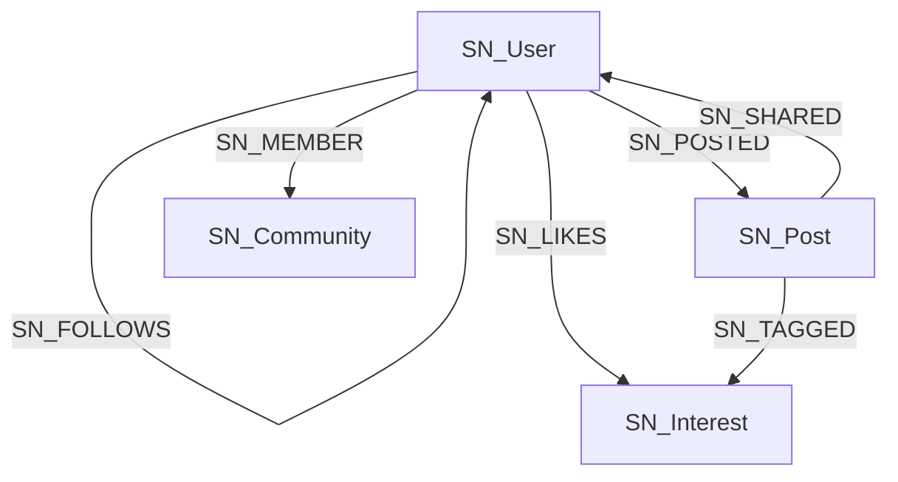
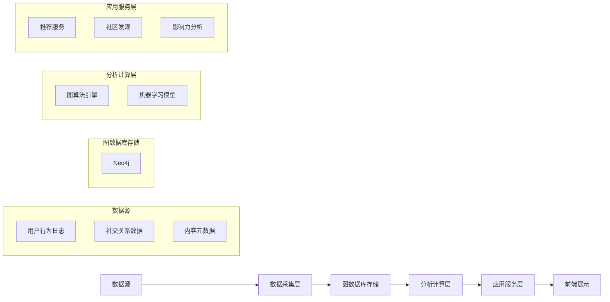
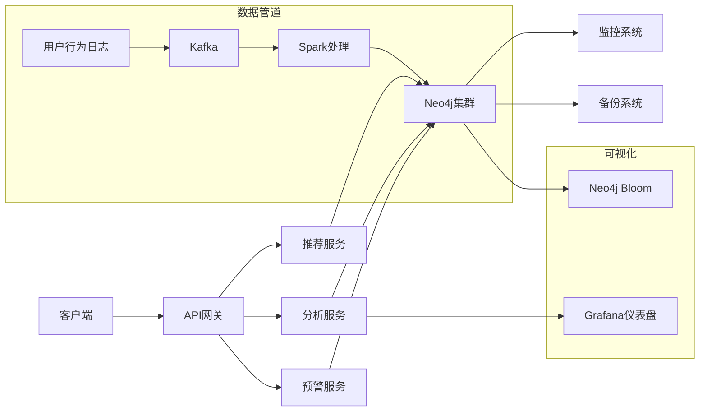

### 社交网络分析图数据库技术方案

#### 方案概述
使用图数据库构建社交网络分析系统，聚焦用户连接、兴趣传播和网络拓扑分析。采用`SN_`前缀（Social Network）确保模型唯一性。



#### 核心数据模型

##### 节点类型
```cypher
// 用户节点
CREATE (:SN_User {
  uid: "u1001",
  name: "张三",
  regDate: date('2020-05-01'),
  location: "杭州",
  influence: 0.75
})

// 兴趣节点
CREATE (:SN_Interest {
  iid: "i2001",
  name: "人工智能",
  category: "科技",
  popularity: 0.92
})

// 内容节点
CREATE (:SN_Post {
  pid: "p3001",
  content: "图数据库在社交网络分析中的应用",
  timestamp: datetime(),
  virality: 0.85
})

CREATE (:SN_Post {
  pid: "p3102",
  content: "社交媒体营销策略2",
  timestamp: datetime(),
  virality: 0.87
})

// 创建内容节点
CREATE (:SN_Post {
  pid: "p3101",
  content: "图数据库技术解析2",
  timestamp: datetime(),
  virality: 0.9
})

// 社区节点
CREATE (:SN_Community {
  cid: "c4001",
  name: "数据科学家联盟",
  memberCount: 1200
})

// 创建用户发帖关系
MATCH (user:SN_User {uid: 'u1001'})
MATCH (post:SN_Post {pid: "p3001"})
MERGE (user)-[:SN_POSTED {
  timestamp: datetime(),  // 使用当前时间作为发帖时间
  platform: "Web",        // 发帖平台
  visibility: "PUBLIC"    // 可见性设置
}]->(post)

MATCH (user:SN_User {uid: 'u1002'})
MATCH (post:SN_Post {pid: "p3101"})
MERGE (user)-[:SN_POSTED {
  timestamp: datetime(),  // 使用当前时间作为发帖时间
  platform: "Web",        // 发帖平台
  visibility: "PUBLIC"    // 可见性设置
}]->(post)

MATCH (user:SN_User {uid: 'u1003'})
MATCH (post:SN_Post {pid: "p3102"})
MERGE (user)-[:SN_POSTED {
  timestamp: datetime(),  // 使用当前时间作为发帖时间
  platform: "Web",        // 发帖平台
  visibility: "PUBLIC"    // 可见性设置
}]->(post)
```

##### 关系类型
```cypher
// 用户关系
MATCH (u1:SN_User {uid: "u1001"}), (u2:SN_User {uid: "u1002"})
CREATE (u1)-[:SN_FOLLOWS {since: date('2021-03-15')}]->(u2)

// 兴趣关联
MATCH (u:SN_User {uid: "u1001"}), (i:SN_Interest {iid: "i2001"})
CREATE (u)-[:SN_LIKES {weight: 0.9}]->(i)

// 内容传播
MATCH (p:SN_Post {pid: "p3001"}), (u:SN_User {uid: "u1002"})
CREATE (u)-[:SN_SHARED {
  timestamp: datetime(),
  platform: "微信"
}]->(p)
```

#### 技术实施方案

##### 架构设计


##### 初始化脚本
```cypher
// 创建约束确保唯一性
CREATE CONSTRAINT sn_unique_user IF NOT EXISTS FOR (u:SN_User) REQUIRE u.uid IS UNIQUE;
CREATE CONSTRAINT sn_unique_interest IF NOT EXISTS FOR (i:SN_Interest) REQUIRE i.iid IS UNIQUE;
CREATE CONSTRAINT sn_unique_post IF NOT EXISTS FOR (p:SN_Post) REQUIRE p.pid IS UNIQUE;

// 创建用户节点
WITH [
  {uid: "u1001", name: "张三", location: "杭州"},
  {uid: "u1002", name: "李四", location: "北京"},
  {uid: "u1003", name: "王五", location: "上海"},
  {uid: "u1004", name: "赵六", location: "深圳"}
] AS users
UNWIND users AS u
CREATE (:SN_User {
  uid: u.uid,
  name: u.name,
  regDate: date(apoc.date.format(
    apoc.date.parse('2020-01-01', 's', 'yyyy-MM-dd') + 
    toInteger(rand()*365*3)*86400, 
    's', 'yyyy-MM-dd'
  ),
  location: u.location,
  influence: round(rand()*0.7 + 0.3, 2)
});

// 创建兴趣节点
CREATE (:SN_Interest {iid: "i2001", name: "人工智能", category: "科技", popularity: 0.92});
CREATE (:SN_Interest {iid: "i2002", name: "数字营销", category: "商业", popularity: 0.85});
CREATE (:SN_Interest {iid: "i2003", name: "旅游摄影", category: "生活", popularity: 0.88});

// 创建内容节点
CREATE (:SN_Post {
  pid: "p3001",
  content: "图数据库技术解析",
  timestamp: datetime(),
  virality: 0.9
});

CREATE (:SN_Post {
  pid: "p3002",
  content: "社交媒体营销策略",
  timestamp: datetime(),
  virality: 0.87
});

// 创建关注关系
MATCH (u1:SN_User {uid: "u1001"}), (u2:SN_User {uid: "u1002"})
CREATE (u1)-[:SN_FOLLOWS {
  since: date('2021-03-15'),
  strength: round(rand()*0.5 + 0.5, 2)
}]->(u2);

MATCH (u1:SN_User {uid: "u1001"}), (u3:SN_User {uid: "u1003"})
CREATE (u1)-[:SN_FOLLOWS {
  since: date('2022-01-10'),
  strength: round(rand()*0.5 + 0.5, 2)
}]->(u3);

// 创建兴趣关系
MATCH (u:SN_User {uid: "u1001"}), (i:SN_Interest {iid: "i2001"})
CREATE (u)-[:SN_LIKES {weight: 0.95}]->(i);

MATCH (u:SN_User {uid: "u1002"}), (i:SN_Interest {iid: "i2002"})
CREATE (u)-[:SN_LIKES {weight: 0.88}]->(i);

// 创建内容传播
MATCH (p:SN_Post {pid: "p3001"}), (u:SN_User {uid: "u1002"})
CREATE (u)-[:SN_SHARED {
  timestamp: datetime(),
  platform: "微信",
  reach: 350
}]->(p);

MATCH (p:SN_Post {pid: "p3001"}), (u:SN_User {uid: "u1003"})
CREATE (u)-[:SN_SHARED {
  timestamp: datetime(),
  platform: "微博",
  reach: 1200
}]->(p);
```

#### 分析应用实现

##### 1. 个性化推荐引擎
```cypher
// 基于共同兴趣的好友推荐
MATCH (me:SN_User {uid: "u1001"})-[:SN_LIKES]->(interest:SN_Interest)
MATCH (other:SN_User)-[:SN_LIKES]->(interest)
WHERE me <> other AND NOT (me)-[:SN_FOLLOWS]->(other)
WITH other, count(interest) AS commonInterests
ORDER BY commonInterests DESC
RETURN other.name AS 推荐好友, 
       commonInterests AS 共同兴趣数
LIMIT 5
```

##### 2. 信息传播路径分析
```cypher
// 查找内容传播路径
MATCH path = (origin:SN_User)-[:SN_POSTED]->(p:SN_Post {pid: "p3001"})
      <-[:SN_SHARED*1..5]-(sharer:SN_User)
RETURN [n IN nodes(path) WHERE 'SN_User' IN labels(n) | n.name] AS 传播路径,
       length(path) AS 传播深度
ORDER BY 传播深度 DESC
```

##### 3. 社区发现算法
```cypher
// 使用Louvain算法检测社区
CALL gds.graph.project(
  'sn-communities',
  'SN_User',
  {
    SN_FOLLOWS: {
      orientation: 'UNDIRECTED',
      properties: 'strength'
    }
  }
);

CALL gds.louvain.stream('sn-communities')
YIELD nodeId, communityId
RETURN gds.util.asNode(nodeId).name AS 用户,
       communityId AS 社区ID
ORDER BY communityId
```

##### 4. 影响力分析
```cypher
// 计算用户影响力得分
MATCH (u:SN_User)
WITH u
OPTIONAL MATCH (u)-[:SN_POSTED]->(p:SN_Post)
WITH u, sum(p.virality) * 0.6 AS contentScore

OPTIONAL MATCH (u)<-[:SN_FOLLOWS]-(follower)
WITH u, contentScore, count(follower) * 0.4 AS followerScore

RETURN u.name AS 用户,
       round(contentScore + followerScore, 2) AS 影响力得分
ORDER BY 影响力得分 DESC
```

##### 5. 兴趣传播分析
```cypher
// 查找兴趣传播网络
MATCH path = (origin:SN_User)-[:SN_LIKES]->(i:SN_Interest)
      <-[:SN_LIKES*1..3]-(follower:SN_User)
WHERE i.name = "人工智能"
RETURN [n IN nodes(path) | 
  CASE 
    WHEN 'SN_User' IN labels(n) THEN n.name
    WHEN 'SN_Interest' IN labels(n) THEN n.name
    ELSE ''
  END
] AS 传播链
```

#### 系统部署架构



#### 关键优势

1. **深度关系分析**：
   - 使用图算法（PageRank, Louvain）挖掘隐藏关系
   - 路径分析揭示信息传播模式

2. **实时推荐**：
   ```cypher
   // 实时兴趣推荐
   MATCH (me:SN_User {uid: $uid})-[:SN_FOLLOWS*1..2]-(fof)-[:SN_LIKES]->(i:SN_Interest)
   WHERE NOT (me)-[:SN_LIKES]->(i)
   RETURN i.name AS 推荐兴趣, 
          count(DISTINCT fof) AS 关联人数
   ORDER BY 关联人数 DESC
   LIMIT 5
   ```

3. **安全风控**：
   ```cypher
   // 异常传播检测
   MATCH (u:SN_User)-[r:SN_SHARED]->(p:SN_Post)
   WHERE r.reach > 10000 AND u.influence < 0.3
   RETURN u.uid AS 可疑账号, 
          p.pid AS 传播内容, 
          r.reach AS 传播量
   ```

4. **动态社区分析**：
   ```cypher
   // 社区演变分析
   CALL gds.louvain.stream('sn-communities', {relationshipWeightProperty: 'strength'})
   YIELD nodeId, communityId
   WITH communityId, gds.util.asNode(nodeId) AS user
   RETURN communityId, 
          count(user) AS 社区规模,
          avg(user.influence) AS 平均影响力
   ```

#### 实施步骤

1. **数据采集**：
   - 使用Kafka收集用户行为事件
   - Flink实时处理原始数据
   - 每小时批量导入Neo4j

2. **模型优化**：
   ```cypher
   // 创建索引加速查询
   CREATE INDEX sn_user_id FOR (u:SN_User) ON (u.uid);
   CREATE INDEX sn_post_timestamp FOR (p:SN_Post) ON (p.timestamp);
   CREATE INDEX sn_interest_name FOR (i:SN_Interest) ON (i.name);
   
   // 添加图算法缓存
   CALL gds.graph.project(
     'sn-influence',
     'SN_User',
     {SN_FOLLOWS: {properties: 'strength'}}
   );
   ```

3. **部署方案**：
   - Neo4j集群：3节点Causal Cluster
   - 内存配置：64GB JVM Heap + 256GB Page Cache
   - 备份策略：每日全量备份 + 15分钟增量备份

4. **监控指标**：
   - 查询延迟：P99 < 200ms
   - 数据新鲜度：< 5分钟
   - 社区检测耗时：< 30秒（百万级用户）
