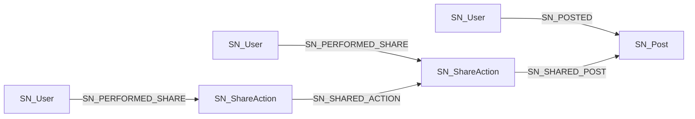

### 问题深度分析

一个关键问题：当前模型无法捕获多级传播结构。在现有模型中：
```cypher
(SN_User)-[:SN_POSTED]->(SN_Post)
(SN_User)-[:SN_SHARED]->(SN_Post)
```

这种建模方式存在以下根本性限制：
1. **层级信息丢失**：所有分享都直接指向原始帖子，无法区分是直接分享还是分享他人的分享
2. **传播路径不可追溯**：无法重建完整的传播树（谁分享了谁的分享）
3. **影响力分析失真**：无法识别传播链中的关键节点（放大器）
4. **病毒式传播分析受限**：无法计算传播深度和分支因子

### 解决方案：重构传播模型

#### 核心思想：引入"分享动作"节点


#### 完整数据模型设计

```cypher
// 1. 创建分享动作节点类型
CREATE (:SN_ShareAction {
  said: "sa001", // Share Action ID
  timestamp: datetime(),
  platform: "微信",
  reach: 500
});

// 2. 重构关系类型
CREATE (user:SN_User)-[:SN_PERFORMED_SHARE]->(action:SN_ShareAction)
CREATE (action:SN_ShareAction)-[:SN_SHARED_POST]->(post:SN_Post) // 直接分享原帖
CREATE (action:SN_ShareAction)-[:SN_SHARED_ACTION]->(parent:SN_ShareAction) // 分享他人的分享
```

### 模型迁移方案

#### 步骤1: 迁移现有数据
```cypher
// 迁移现有分享关系
MATCH (u:SN_User)-[r:SN_SHARED]->(p:SN_Post)
WITH u, r, p
CREATE (sa:SN_ShareAction {
  said: "mig_" + apoc.create.uuid(),
  timestamp: r.timestamp,
  platform: r.platform,
  reach: r.reach
})
CREATE (u)-[:SN_PERFORMED_SHARE]->(sa)
CREATE (sa)-[:SN_SHARED_POST]->(p)

// 删除旧关系
MATCH ()-[r:SN_SHARED]->() DELETE r
```

#### 步骤2: 创建新分享（含层级）
```cypher
// 用户直接分享原始帖子
MATCH (u:SN_User {uid: "u1002"})
MATCH (p:SN_Post {pid: "p3001"})
CREATE (sa:SN_ShareAction {
  said: "sa_" + apoc.create.uuid(),
  timestamp: datetime(),
  platform: "微博",
  reach: 1200
})
CREATE (u)-[:SN_PERFORMED_SHARE]->(sa)
CREATE (sa)-[:SN_SHARED_POST]->(p)

// 用户分享他人的分享
MATCH (parentSA:SN_ShareAction {said: "sa001"})
MATCH (u:SN_User {uid: "u1003"})
CREATE (sa:SN_ShareAction {
  said: "sa_" + apoc.create.uuid(),
  timestamp: datetime(),
  platform: "抖音",
  reach: 3500
})
CREATE (u)-[:SN_PERFORMED_SHARE]->(sa)
CREATE (sa)-[:SN_SHARED_ACTION]->(parentSA)
```

### 传播分析查询示例

#### 1. 完整传播树重建
```cypher
// 获取帖子的完整传播树
MATCH (p:SN_Post {pid: "p3001"})
CALL apoc.path.expandConfig(p, {
  relationshipFilter: "<SN_SHARED_POST|SN_SHARED_ACTION",
  labelFilter: "SN_ShareAction",
  minLevel: 1,
  maxLevel: 5,
  bfs: false
}) YIELD path
RETURN [n in nodes(path) | 
  CASE 
    WHEN "SN_ShareAction" IN labels(n) THEN "分享动作:" + n.said
    WHEN "SN_User" IN labels(n) THEN "用户:" + n.name
    ELSE "帖子:" + p.pid
  END
] AS 传播路径,
       length(path) AS 深度
```

#### 2. 关键传播节点识别
```cypher
// 识别传播放大器（触发多次再分享的节点）
MATCH (sa:SN_ShareAction)-[:SN_SHARED_POST|SN_SHARED_ACTION*]->(p:SN_Post {pid: "p3001"})
WITH sa, size([(:SN_ShareAction)-[:SN_SHARED_ACTION]->(sa) | 1]) AS inDegree
WHERE inDegree > 0
RETURN sa.said AS 分享ID,
       inDegree AS 直接引发分享数,
       [(u:SN_User)-[:SN_PERFORMED_SHARE]->(sa) | u.name][0] AS 分享用户,
       sa.reach AS 传播量
ORDER BY inDegree DESC
```

#### 3. 传播网络特征分析
```cypher
// 计算传播网络特征
MATCH (p:SN_Post {pid: "p3001"})
OPTIONAL MATCH (rootSA:SN_ShareAction)-[:SN_SHARED_POST]->(p)
WITH p, collect(rootSA) AS roots

// 计算传播深度
OPTIONAL MATCH longestPath = (p)<-[:SN_SHARED_POST|SN_SHARED_ACTION*]-(leafSA)
RETURN p.pid AS 帖子ID,
       size(roots) AS 首次分享数,
       max(length(longestPath)) AS 最大传播深度,
       apoc.coll.avg([r in roots | size([(:SN_ShareAction)-[:SN_SHARED_ACTION*]->(r) | 1])]) AS 平均分支因子,
       sum(last(nodes(longestPath)).reach) AS 总传播量
```

### 模型优势分析

1. **传播路径完整保留**：
   - 精确记录分享层级（谁分享了谁的分享）
   - 保留原始分享和转发的区别

2. **高级分析支持**：
   ```cypher
   // 计算病毒传播系数
   MATCH (sa:SN_ShareAction)
   WHERE exists((sa)-[:SN_SHARED_ACTION]->())
   WITH sa, size([(:SN_ShareAction)-[:SN_SHARED_ACTION]->(sa)]) AS childCount
   RETURN avg(childCount) AS 病毒系数
   ```

3. **跨平台传播跟踪**：
   ```cypher
   // 分析跨平台传播路径
   MATCH path = (sa:SN_ShareAction)-[:SN_SHARED_ACTION*]->(rootSA)
   WHERE rootSA.platform <> last(nodes(path)).platform
   RETURN [n in nodes(path) | n.platform] AS 平台传播路径,
          length(path) AS 跨平台深度
   ```

4. **时间序列传播分析**：
   ```cypher
   // 传播速度分析
   MATCH (p:SN_Post {pid: "p3001"})<-[:SN_SHARED_POST|SN_SHARED_ACTION*]-(sa)
   WITH sa, length(shortestPath((sa)-[:SN_SHARED_ACTION*]->(:SN_ShareAction)-[:SN_SHARED_POST]->(p))) AS depth
   RETURN depth AS 传播层级,
          min(sa.timestamp) AS 最早时间,
          max(sa.timestamp) AS 最晚时间,
          duration.between(min(sa.timestamp), max(sa.timestamp)).hours AS 传播时长
   GROUP BY depth
   ```

### 实施路线图

1. **数据迁移阶段**：
   - 执行现有数据迁移脚本
   - 验证数据完整性：
     ```cypher
     MATCH (u:SN_User)-[:SN_PERFORMED_SHARE]->(sa)
     RETURN count(sa) AS 分享动作数
     ```

2. **应用改造阶段**：
   - 修改分享功能API，创建分享动作节点
   - 更新客户端SDK，捕获分享来源信息

3. **分析系统升级**：
   - 重构传播分析仪表板
   - 实现传播树可视化组件

4. **监控与优化**：
   ```cypher
   // 性能监控查询
   PROFILE MATCH (p:SN_Post)<-[:SN_SHARED_POST*1..5]-(sa)
   RETURN count(sa)
   ```

### 性能优化策略

1. **索引优化**：
   ```cypher
   CREATE INDEX sa_timestamp FOR (sa:SN_ShareAction) ON (sa.timestamp);
   CREATE INDEX sa_platform FOR (sa:SN_ShareAction) ON (sa.platform);
   ```

2. **图投影优化**：
   ```cypher
   CALL gds.graph.project(
     'propagation_network',
     ['SN_User', 'SN_ShareAction'],
     {
       PERFORMED_SHARE: {orientation: 'NATURAL'},
       SHARED_ACTION: {orientation: 'REVERSE'}
     }
   )
   ```

3. **查询优化技巧**：
   ```cypher
   // 使用APOC路径展开替代可变长模式
   CALL apoc.path.spanningTree(p, {
     relationshipFilter: '<SN_SHARED_POST|<SN_SHARED_ACTION',
     labelFilter: 'SN_ShareAction',
     maxLevel: 10
   })
   ```

此模型重构解决了传播层级丢失的核心问题，通过引入"分享动作"节点，完整保留了传播路径信息，支持深度传播分析和关键节点识别，为病毒式传播研究和影响力分析提供了坚实基础。