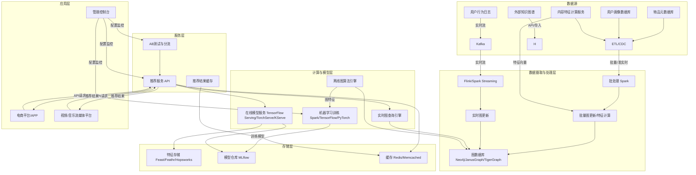

好的，针对电子商务和娱乐行业利用图数据库引擎构建推荐系统的需求，下面是一个细化的技术实施方案，涵盖核心数据模型和技术架构。

**核心理念：** 将用户、物品（商品/内容）、行为及其之间的复杂关系建模为图结构，利用图数据库的高效遍历和关系查询能力，挖掘深层次的关联，实现精准个性化推荐。

## 一、 核心数据模型 (图模型设计)

数据模型是图推荐系统的基石，需要清晰地定义节点和关系。

1.  **节点类型 (Node Types):**
    *   **用户 (User):**
        *   **属性:** `用户ID (主键)`, `用户名`, `注册时间`, `人口统计信息 (可选，如年龄范围、性别、地域)`, `兴趣标签 (可动态更新，如 ["科技", "运动", "美妆"])`。
    *   **物品 (Item):**
        *   **电商:** `商品ID (主键)`, `商品名称`, `品类 (多级，如 "电子产品>手机>智能手机")`, `品牌`, `价格`, `关键属性 (如 "颜色", "尺寸", "CPU型号")`, `上架时间`。
        *   **娱乐:** `内容ID (主键)`, `内容标题`, `类型 (如 "电影", "电视剧", "音乐", "短视频")`, `类别/标签 (如 "动作", "喜剧", "科幻", "流行")`, `演员/导演/创作者`, `发布时间`, `时长`。
    *   **内容特征 (Content Feature - 可选，用于增强):**
        *   **节点:** `特征ID` (例如，代表一个特定的关键词、主题、视觉风格嵌入向量的ID)。
        *   **属性:** `特征类型 (如 "关键词", "主题", "视觉嵌入")`, `特征值/向量`。
    *   **实体 (Entity - 可选，用于知识图谱融合):**
        *   **节点:** `实体ID` (如 "演员：小李子", "导演：诺兰", "品牌：苹果", "地点：巴黎")。
        *   **属性:** `实体名称`, `实体类型`。

2.  **关系类型 (Relationship Types):**
    *   **用户 -> 物品 (User-Item Interactions):**
        *   **类型:** `行为类型` (核心关系！)
        *   **属性:** `行为类型 (如 "浏览", "点击", "加入购物车", "购买", "收藏", "评分(值)", "评论", "观看", "点赞", "分享", "播放时长")`, `时间戳`, `上下文信息 (如 设备类型, 地理位置)`。
        *   **示例:** `(UserA) -[BROWSED {time: 2023-10-27T14:30:00, device: 'mobile'}]-> (ProductX)`
    *   **物品 -> 物品 (Item-Item Relationships):**
        *   **类型:**
            *   `相似于 (SIMILAR_TO)`：基于内容特征（文本、图像嵌入）计算的相似度。
            *   `同属于 (BELONGS_TO_CATEGORY)`：物品属于某个品类/标签节点 (如果品类也建模为节点)。
            *   `搭配购买/经常一起 (BOUGHT_TOGETHER / CO_VIEWED)`：基于历史行为共现统计。
            *   `由...创作 (CREATED_BY)` / `主演... (STARRED_BY)`：连接物品与创作者/演员实体节点。
            *   `续集/前传 (SEQUEL_OF / PREQUEL_OF)`：特定于内容的关系。
        *   **属性:** `权重` (表示相似度、共现频率等的数值), `关系来源` (如 "内容相似", "协同过滤", "知识图谱")。
        *   **示例:** `(MovieA) -[SIMILAR_TO {weight: 0.85, source: 'content'}]-> (MovieB)`
    *   **用户 -> 用户 (User-User Relationships - 可选):**
        *   **类型:** `关注 (FOLLOWS)`, `好友 (FRIEND_WITH)`, `相似用户 (SIMILAR_USER)` (基于行为或画像相似度)。
        *   **属性:** `关系强度`, `建立时间`。
    *   **物品 -> 特征/实体 (Item-Feature/Entity):**
        *   **类型:** `具有特征 (HAS_FEATURE)`, `描述为 (DESCRIBED_BY)`, `关联实体 (RELATED_TO_ENTITY)`。
        *   **属性:** `权重` (特征的重要性或关联强度)。
    *   **用户 -> 特征 (User-Feature - 可选):**
        *   **类型:** `对...感兴趣 (INTERESTED_IN)` (基于行为隐式或显式标签)。
        *   **属性:** `兴趣度` (可动态计算)。

**数据模型关键点：**
*   **行为关系是核心：** `用户-物品` 的互动关系及其类型、强度、时间是最重要的信息源。
*   **丰富物品关联：** `物品-物品` 关系是实现“相似推荐”、“搭配推荐”、“基于内容的推荐”的关键。
*   **融入内容特征：** 连接物品到特征节点，允许进行基于内容的相似度计算和混合推荐。
*   **利用外部知识：** 引入实体节点，可以构建轻量级知识图谱，提升推荐的可解释性和发现性 (如推荐同一导演的电影)。
*   **属性承载细节：** 关系上的属性（时间戳、权重、行为类型）对推荐算法至关重要。
*   **动态性：** 用户兴趣标签、物品特征权重、用户-用户相似度等需要设计更新机制。

## 二、 技术架构

这是一个典型的分层架构，结合了流批处理、图计算、机器学习和微服务。

1.  **数据源 (Data Sources):**
    *   **用户行为日志:** 点击流、购买记录、播放记录、搜索记录、评分评论等（实时性要求高）。
    *   **物品元数据:** 商品/内容的基本信息、属性、分类标签（来自业务数据库）。
    *   **用户画像:** 用户注册信息、显式偏好设置、部分人口统计信息（来自用户中心）。
    *   **内容特征:** 由NLP、CV服务计算出的文本描述嵌入向量、图像/视频嵌入向量、音频特征向量。
    *   **外部知识:** 行业知识图谱、IMDb等外部数据源（通过API或定期导入）。

2.  **数据摄取与处理层 (Data Ingestion & Processing):**
    *   **实时流处理 (Kafka + Flink/Spark Streaming):**
        *   消费Kafka中的实时用户行为事件。
        *   进行初步清洗、格式化、会话划分。
        *   实时写入图数据库（更新`用户-物品`关系）。
        *   可能触发简单的实时推荐逻辑（如基于最新行为的即时更新）。
    *   **批处理/准实时处理 (Spark):**
        *   定期（如每小时/天）从业务数据库同步用户画像、物品元数据。
        *   运行ETL/CDC任务更新图数据库中的节点和静态关系（如物品分类、属性）。
        *   计算物品相似度 (`物品-物品`关系，基于内容特征或历史共现)。
        *   计算用户隐式兴趣标签 (`用户-特征`关系)。
        *   计算用户相似度 (`用户-用户`关系)。
        *   执行复杂的图算法（如PageRank, Community Detection）为节点生成额外特征。
        *   将图结构特征（如节点的PageRank值、社区ID、邻居统计信息）导出到特征存储，供机器学习模型使用。
    *   **图数据库更新:** 实时流和批处理的结果最终持久化到图数据库。

3.  **存储层 (Storage Layer):**
    *   **核心图数据库 (Neo4j / JanusGraph / TigerGraph / Amazon Neptune):**
        *   **Neo4j:** 成熟易用，Cypher语言强大，社区和工具丰富，适合中小到大型场景。企业版支持集群和因果一致性。
        *   **JanusGraph:** 开源，分布式，可扩展性强，依赖后端存储（Cassandra/HBase/Bigtable）和索引（Elasticsearch/Solr）。适合超大规模数据。
        *   **TigerGraph:** 原生分布式图数据库，性能强劲，支持GSQL，内置高级图算法库。适合对性能和复杂分析要求极高的场景。
        *   **选择考量:** 数据规模、性能要求（QPS，遍历深度）、成本、团队熟悉度、云服务集成。
    *   **特征存储 (Feast / Feathr / Hopsworks / Tecton):** 集中管理、版本控制、高效服务于在线和离线的特征（包括从图数据库计算导出的图特征）。
    *   **模型仓库 (MLflow / Kubeflow):** 存储、版本管理、部署训练好的推荐模型（特别是深度学习模型）。
    *   **缓存 (Redis / Memcached):** 缓存热门物品信息、用户画像片段、高频查询的推荐结果（尤其是实时性要求高的场景），极大减轻数据库压力。

4.  **计算与模型层 (Computation & Model Layer):**
    *   **实时图查询引擎:**
        *   图数据库自身提供的查询能力（Cypher, Gremlin, GSQL）。
        *   用于执行低延迟的基于图的推荐查询：
            *   **基于邻域的协同过滤:** 找到用户A交互过的物品，再找到与这些物品相似的其他物品（`(A)-[:PURCHASED]->(Item1)<-[:SIMILAR_TO]-(Item2)`）。
            *   **二度人脉推荐:** 找到用户A的好友喜欢的物品（`(A)-[:FRIEND]->(Friend)-[:LIKED]->(Item)`）。
            *   **基于路径的推荐:** 寻找特定模式的路径（如“看过A电影的用户也喜欢B导演的C电影”）。
    *   **离线图算法引擎:**
        *   图数据库内置算法（如Neo4j Graph Data Science Library, TigerGraph内置算法）。
        *   Spark GraphX / GraphFrames。
        *   执行计算密集型、全局性的图算法，为节点生成特征或发现模式：
            *   **节点重要性:** PageRank, ArticleRank。
            *   **社区发现:** Louvain, Label Propagation。
            *   **链路预测:** Adamic-Adar, Common Neighbors (用于预测潜在的`用户-物品`关系)。
            *   **图嵌入:** Node2Vec, DeepWalk, GraphSAGE (将节点映射到低维向量空间，捕获结构和语义信息)。
    *   **机器学习模型训练:**
        *   使用Spark MLlib, TensorFlow, PyTorch等框架。
        *   输入：用户画像特征、物品特征、丰富的图特征（来自特征存储）、历史行为标签。
        *   模型：
            *   **传统模型:** Logistic Regression, Gradient Boosting Trees (XGBoost, LightGBM) - 用于点击率/转化率预估。
            *   **深度学习模型:**
                *   **特征交叉:** Wide & Deep, DeepFM, DCN。
                *   **序列建模:** GRU4Rec, SASRec, Bert4Rec - 利用用户行为序列。
                *   **图神经网络 (GNN):** PinSage, GraphSAGE (用于推荐场景), NGCF, LightGCN - 直接在图结构上学习节点表示，天然适合图数据库数据，能捕获高阶邻域信息，是当前最前沿且强大的推荐方法之一。
    *   **在线模型服务:**
        *   使用TensorFlow Serving, TorchServe, KServe, 或云服务（SageMaker, Vertex AI）部署训练好的模型（特别是深度学习/GNN模型）。
        *   接收推荐服务的请求，输入用户和候选物品特征（从特征存储实时获取），进行模型推理打分/排序。

5.  **服务层 (Service Layer):**
    *   **推荐服务 (API Gateway + Microservices):**
        *   核心后端服务，接收前端（APP/Web）的推荐请求（包含`用户ID`、`场景上下文`等）。
        *   **策略调度:** 根据场景（首页Feed、商品详情页“看了又看”、“猜你喜欢”、购物车“搭配推荐”）选择合适的推荐策略组合。
        *   **召回 (Retrieval):**
            *   调用**实时图查询引擎**执行快速图遍历，召回候选集（如基于邻域、相似物品）。
            *   可能结合基于向量的近似最近邻搜索（ANN，如Faiss, HNSW）召回图嵌入或内容嵌入相似的物品。
            *   应用简单的业务规则过滤（如库存、地域限制）。
        *   **排序 (Ranking):**
            *   将召回的大量候选物品（数百到数千）输入**在线模型服务**进行精排打分。
            *   模型综合考虑用户画像、物品属性、上下文、以及最重要的**图特征**（用户节点的嵌入向量、物品节点的嵌入向量、用户与物品在图上的距离/路径信息等）。
        *   **重排 (Re-ranking):** 应用多样性控制、新鲜度、商业规则（如提升新品、促销品）、去重等最终调整结果列表顺序。
        *   **结果组装与返回:** 将最终排序后的物品ID列表及必要信息（标题、图片、价格等）返回给前端。
        *   **缓存:** 利用缓存存储高频请求或相对稳定的推荐结果（如热门推荐）。
    *   **AB测试与分流 (AB Testing & Traffic Routing):** 集成AB测试框架（如Statsig, Optimizely, 自研），将用户流量分配到不同的推荐算法策略或模型版本上，持续评估效果（CTR, CVR, GMV, 观看时长, 留存率等）。
    *   **推荐结果缓存:** 对最终输出结果进行适当缓存，尤其适合个性化程度不高或更新频率低的场景。

6.  **应用层 (Application Layer):**
    *   **电商平台/APP:** 集成推荐服务API，在首页、搜索页、商品详情页、购物车页、支付成功页等关键位置展示个性化推荐。
    *   **视频/音乐流媒体平台:** 集成推荐服务API，在首页Feed、播放页“相关推荐”、用户个人中心“为你推荐”等位置展示内容推荐。
    *   **管理控制台:** 供算法工程师和运营人员配置推荐策略、查看AB测试报表、监控系统状态、管理特征和模型。

## 三、 关键技术选型考量

1.  **图数据库选型:**
    *   **数据规模与增长:** JanusGraph/TigerGraph/Neptune 更适合超大规模（数十亿节点/边）。
    *   **查询性能与复杂度:** TigerGraph 在复杂深度遍历上性能突出；Neo4j Cypher 易用性高。
    *   **实时性要求:** 所有主流图库都支持实时写入和查询，但集群配置影响一致性。
    *   **运维成本:** Neo4j 社区版免费但集群需企业版；JanusGraph 开源但需要管理后端存储和索引；云服务 (Neptune) 运维简单但可能有供应商锁定。
    *   **生态系统与工具:** Neo4j 生态最成熟；TigerGraph GSQL 功能强大；JanusGraph 兼容Gremlin生态。

2.  **图算法与GNN:**
    *   **简单规则/协同过滤:** 直接使用图数据库查询或轻量级算法。
    *   **复杂模式发现/全局特征:** 使用图数据库内置算法或Spark GraphX。
    *   **最先进效果:** **图神经网络 (GNN)** 是首选，能端到端地学习图结构和节点特征。需要与深度学习框架（TF/PyTorch）和在线服务框架集成。PinSage (Pinterest), GraphSAGE 是经典工业应用代表。

3.  **特征工程:** 图特征（邻居统计、嵌入向量、社区ID、中心性度量）是提升模型效果的关键。特征存储是管理这些特征的核心组件。

4.  **实时 vs 离线:**
    *   **实时:** 处理最新行为（秒/分钟级），更新用户状态，驱动即时推荐（如“刚刚浏览过这个的人还看了”）。依赖流处理和图数据库实时更新。
    *   **离线:** 处理全量数据（小时/天级），计算物品/用户相似度、图嵌入、训练复杂模型、执行全局图算法。保证推荐的全面性和深度。

5.  **缓存策略:** 针对不同层次（原始数据、召回结果、最终推荐结果）设计合理的缓存策略和失效机制，是保障高性能和高可用的关键。

## 四、 实施路径建议

1.  **需求分析与场景定义:** 明确具体业务场景（哪些页面需要推荐？目标是什么？）和核心KPI。
2.  **数据摸底与模型设计:** 梳理可用数据源，设计初始图数据模型（节点、关系、关键属性）。
3.  **技术选型与POC:** 根据数据量和复杂度，选择图数据库并进行小规模概念验证（POC），测试关键查询性能。
4.  **数据管道建设:** 搭建实时（Kafka+Flink）和离线（Spark）数据管道，完成数据清洗、转换并灌入图数据库。建立特征存储管道。
5.  **基础推荐实现:**
    *   实现基于图查询的简单推荐（如基于邻域的协同过滤、相似物品推荐）。
    *   实现基于传统机器学习模型（如LR, GBDT）的排序。
6.  **引入高级能力:**
    *   实现离线图算法（如Node2Vec, PageRank）生成图特征。
    *   训练并上线深度学习模型（Wide&Deep, DCN）或图神经网络模型（LightGCN, PinSage）。
    *   集成AB测试框架。
7.  **优化与迭代:**
    *   持续监控效果指标和系统性能。
    *   根据AB测试结果和业务反馈优化模型、特征、策略。
    *   探索更复杂的GNN模型和图算法。
    *   优化缓存策略和系统架构。

## 五、 优势与挑战

*   **优势:**
    *   **关系表达能力强:** 天然建模复杂关系网络。
    *   **高效关系查询:** 快速遍历多跳关系，发现隐藏模式。
    *   **可解释性 (部分):** 基于路径的推荐结果相对容易解释（如“因为您看过A，而A和B相似”）。
    *   **灵活性:** 易于添加新的节点类型和关系类型。
    *   **支持GNN:** 为最先进的图学习算法提供原生数据支持。

*   **挑战:**
    *   **技术栈复杂度:** 引入了新的数据库类型和计算范式（图计算、GNN）。
    *   **数据建模难度:** 设计一个高效、合理的图模型需要经验和迭代。
    *   **分布式图数据库运维:** 大规模图数据库的运维挑战（JanusGraph, TigerGraph集群）。
    *   **GNN训练与部署成本:** 训练大规模GNN需要大量计算资源，在线服务延迟需要优化。
    *   **实时性与一致性平衡:** 在高并发写入和复杂查询下，保证数据一致性和低延迟需要精细设计。

通过精心设计图数据模型和采用分层技术架构，结合流批处理、图计算、机器学习和微服务，可以构建出强大、灵活且高效的基于图数据库的推荐系统，有效提升电子商务和娱乐平台的用户体验与商业价值。持续迭代和拥抱图神经网络等先进技术是保持竞争力的关键。