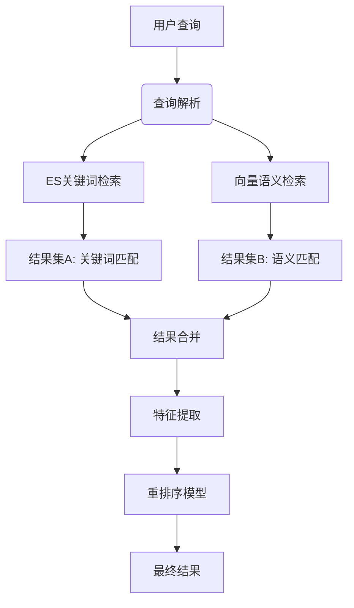
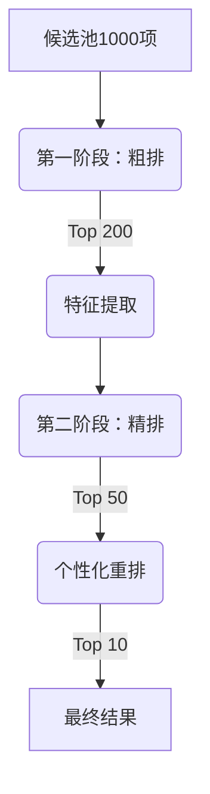

# ES与向量检索结果处理：合并与重排序的深度实践指南

## 一、结果处理全流程分析

### 典型工作流程示例（用户查询："望京适合带孩子吃的川菜馆"）



### 1. ES检索处理步骤
```python
def es_search(query: str, location: dict):
    """ES检索处理流程"""
    # 1. 构建DSL查询
    dsl = {
        "query": {
            "bool": {
                "must": [
                    {"match": {"cuisine": "川菜"}},
                    {"match": {"tags": "儿童友好"}}
                ],
                "filter": [
                    {"geo_distance": {"distance": "3km", "location": location}},
                    {"term": {"status": "营业中"}}
                ]
            }
        },
        "sort": [
            {"_geo_distance": {"location": location, "order": "asc"}},
            {"rating": {"order": "desc"}}
        ],
        "size": 50
    }
    
    # 2. 执行搜索
    results = es.search(index="restaurants", body=dsl)
    
    # 3. 结果格式化
    formatted = []
    for hit in results['hits']['hits']:
        formatted.append({
            "id": hit["_id"],
            "score": hit["_score"],
            "source": hit["_source"],
            "distance": calculate_geo_distance(
                location, 
                hit["_source"]["location"]
            )
        })
    return formatted
```

### 2. 向量检索处理步骤
```python
def vector_search(query: str, location: dict, top_k=50):
    """向量检索处理流程"""
    # 1. 查询向量化
    query_vec = model.encode(query)
    
    # 2. ANN搜索
    vector_results = vector_db.search(
        vector=query_vec,
        top_k=top_k,
        filters={"status": "营业中"},  # 元数据过滤
        params={"ef": 64}  # HNSW参数
    )
    
    # 3. 地理位置过滤
    filtered = []
    for item in vector_results:
        dist = calculate_geo_distance(location, item.metadata["location"])
        if dist <= 3000:  # 3km范围内
            filtered.append({
                "id": item.id,
                "similarity": item.similarity,
                "source": item.metadata,
                "distance": dist
            })
    
    return filtered
```

## 二、结果合并策略对比

### 合并策略决策矩阵
| 策略 | 适用场景 | 优点 | 缺点 | 实现复杂度 |
|------|----------|------|------|------------|
| **简单并集** | 结果重叠度高 | 实现简单，保留多样性 | 可能包含低质量结果 | ⭐ |
| **加权融合** | 结果质量差异大 | 平衡两种检索优势 | 权重设置需调优 | ⭐⭐ |
| **RRF融合** | 需要公平排序 | 无需分数归一化 | 忽略绝对分数差异 | ⭐⭐ |
| **候选池混合** | 复杂场景 | 最大化召回率 | 需二次处理 | ⭐⭐⭐ |
| **级联过滤** | 性能敏感场景 | 减少计算量 | 可能丢失优质结果 | ⭐⭐ |

### 1. 简单并集合并（适合结果重叠度高）
```python
def simple_union(es_results, vector_results):
    """基础并集去重合并"""
    candidate_pool = {}
    
    # 添加ES结果
    for item in es_results:
        candidate_pool[item["id"]] = {
            "es_score": item["score"],
            "vector_score": 0,
            **item
        }
    
    # 添加向量结果（去重）
    for item in vector_results:
        if item["id"] in candidate_pool:
            # 合并分数
            candidate_pool[item["id"]]["vector_score"] = item["similarity"]
        else:
            candidate_pool[item["id"]] = {
                "es_score": 0,
                "vector_score": item["similarity"],
                **item
            }
    
    return list(candidate_pool.values())
```

### 2. RRF融合排序（Reciprocal Rank Fusion）
```python
def rrf_fusion(es_results, vector_results, k=60):
    """RRF融合算法"""
    # 创建排名字典
    rankings = {}
    
    # 处理ES结果排名
    for rank, item in enumerate(es_results, 1):
        doc_id = item["id"]
        rankings.setdefault(doc_id, {"es_rank": rank, "vector_rank": float('inf')})
        rankings[doc_id]["es_rank"] = rank
    
    # 处理向量结果排名
    for rank, item in enumerate(vector_results, 1):
        doc_id = item["id"]
        rankings.setdefault(doc_id, {"es_rank": float('inf'), "vector_rank": rank})
        rankings[doc_id]["vector_rank"] = rank
    
    # 计算RRF分数
    rrf_scores = []
    for doc_id, ranks in rankings.items():
        rrf_score = (1 / (k + ranks["es_rank"])) + (1 / (k + ranks["vector_rank"]))
        rrf_scores.append({
            "id": doc_id,
            "rrf_score": rrf_score,
            "es_rank": ranks["es_rank"],
            "vector_rank": ranks["vector_rank"]
        })
    
    # 按RRF分数排序
    return sorted(rrf_scores, key=lambda x: x["rrf_score"], reverse=True)
```

### 3. 候选池混合策略（推荐）
```python
def hybrid_candidate_pool(es_results, vector_results, pool_size=100):
    """混合候选池策略"""
    # 创建分数归一化的候选池
    candidate_pool = {}
    
    # ES结果归一化 (min-max)
    es_scores = [item["score"] for item in es_results]
    min_es, max_es = min(es_scores), max(es_scores)
    
    for item in es_results:
        norm_score = (item["score"] - min_es) / (max_es - min_es) if max_es > min_es else 0.5
        candidate_pool[item["id"]] = {
            "es_score": norm_score,
            "vector_score": 0,
            "source": item["source"],
            "features": extract_features(item)  # 提取距离、评分等特征
        }
    
    # 向量结果归一化
    vector_scores = [item["similarity"] for item in vector_results]
    min_vec, max_vec = min(vector_scores), max(vector_scores)
    
    for item in vector_results:
        norm_score = (item["similarity"] - min_vec) / (max_vec - min_vec) if max_vec > min_vec else 0.5
        
        if item["id"] in candidate_pool:
            # 合并分数
            candidate_pool[item["id"]]["vector_score"] = norm_score
        else:
            candidate_pool[item["id"]] = {
                "es_score": 0,
                "vector_score": norm_score,
                "source": item["source"],
                "features": extract_features(item)
            }
    
    # 按混合分数初步排序
    sorted_pool = sorted(
        candidate_pool.values(), 
        key=lambda x: (0.6 * x["es_score"] + 0.4 * x["vector_score"]), 
        reverse=True
    )
    
    return sorted_pool[:pool_size]
```

## 三、重排序关键技术与实践

### 1. 特征工程示例
```python
def extract_features(item):
    """提取重排序特征"""
    source = item["source"]
    features = {
        # 检索相关特征
        "es_score": item.get("es_score", 0),
        "vector_score": item.get("vector_score", 0),
        
        # 商户质量特征
        "rating": source["rating"],
        "review_count": source["review_count"],
        "month_sales": source["month_sales"],
        "price_level": source.get("price_level", 2),
        
        # 距离特征
        "distance": item["distance"],
        "distance_reciprocal": 1 / (item["distance"] + 0.001),  # 避免除零
        
        # 时间特征
        "is_open": 1 if check_open_now(source["open_hours"]) else 0,
        "peak_hour_multiplier": peak_hour_boost(),
        
        # 个性化特征
        "user_preference_match": calculate_user_preference(source["tags"]),
        "history_ordered": 1 if item["id"] in user_order_history else 0
    }
    
    # 特征组合
    features["quality_distance_ratio"] = features["rating"] * features["distance_reciprocal"]
    
    return features
```

### 2. 重排序模型实现

#### (1) 基于规则的加权排序
```python
def rule_based_rerank(candidates):
    """基于业务规则的加权排序"""
    for item in candidates:
        features = item["features"]
        
        # 基础权重
        base_score = 0.5 * features["es_score"] + 0.3 * features["vector_score"]
        
        # 质量加成
        quality_boost = 0.2 * features["rating"] + 0.1 * math.log(features["review_count"] + 1)
        
        # 距离惩罚
        distance_penalty = 0.3 * (1 - features["distance_reciprocal"])
        
        # 个性化加成
        personal_boost = 0.4 * features["user_preference_match"] + 0.2 * features["history_ordered"]
        
        # 营业时间加成
        open_boost = 0.15 * features["is_open"]
        
        # 综合得分
        item["final_score"] = (
            base_score 
            + quality_boost 
            - distance_penalty 
            + personal_boost 
            + open_boost
        )
    
    return sorted(candidates, key=lambda x: x["final_score"], reverse=True)
```

#### (2) 机器学习模型排序 (LTR)
```python
def ml_rerank(candidates, model_path="ltr_model.pkl"):
    """机器学习模型重排序"""
    # 加载预训练模型
    model = joblib.load(model_path)
    
    # 准备特征矩阵
    X = []
    for item in candidates:
        features = item["features"]
        X.append([
            features["es_score"],
            features["vector_score"],
            features["rating"],
            features["distance_reciprocal"],
            features["user_preference_match"],
            features["is_open"]
        ])
    
    # 预测排序分数
    scores = model.predict(X)
    
    # 关联分数并排序
    for i, item in enumerate(candidates):
        item["ml_score"] = scores[i]
    
    return sorted(candidates, key=lambda x: x["ml_score"], reverse=True)
```

### 3. 上下文感知重排序
```python
def context_aware_rerank(candidates, user_context):
    """考虑用户上下文的智能重排序"""
    # 1. 用户特征分析
    if user_context["with_children"]:
        # 提升儿童友好型餐厅
        for item in candidates:
            if "儿童友好" in item["source"]["tags"]:
                item["features"]["final_score"] *= 1.3
    
    # 2. 时间上下文
    current_hour = datetime.now().hour
    if 11 <= current_hour <= 13:
        # 午餐时段提升快餐类
        for item in candidates:
            if "快餐" in item["source"]["categories"]:
                item["features"]["final_score"] *= 1.2
    
    # 3. 天气上下文
    if weather_api.is_raining():
        # 雨天提升配送服务好的餐厅
        for item in candidates:
            if item["source"]["delivery_quality"] > 4:
                item["features"]["final_score"] *= 1.15
    
    # 4. 个性化历史
    if user_context["last_ordered"]:
        # 提升上次点过的同品类餐厅
        last_category = user_context["last_ordered"]["category"]
        for item in candidates:
            if last_category in item["source"]["categories"]:
                item["features"]["final_score"] *= 1.1
    
    return sorted(candidates, key=lambda x: x["features"]["final_score"], reverse=True)
```

## 四、实战案例：川菜馆搜索

### 原始结果对比
| 餐厅 | ES排名 | 向量排名 | 实际适合度 |
|------|--------|----------|------------|
| 蜀乡人家 | 1 | 3 | ⭐⭐⭐⭐ |
| 川渝食府 | 2 | 5 | ⭐⭐ |
| 麻麻鱼 | 3 | 1 | ⭐⭐⭐⭐⭐ |
| 小四川 | 4 | 未出现 | ⭐ |
| 巷子川菜 | 未出现 | 2 | ⭐⭐⭐⭐ |

### 合并与重排序过程
1. **创建候选池**：合并ES前50 + 向量前50 → 去重后65家餐厅
2. **特征提取**：
   - 蜀乡人家：ES分0.92, 向量分0.85, 评分4.7, 距离1.2km
   - 麻麻鱼：ES分0.78, 向量分0.96, 评分4.9, 距离0.8km
   - 巷子川菜：ES分0, 向量分0.93, 评分4.6, 距离1.5km
3. **重排序计算**：
   ```python
   # 麻麻鱼：ES分0.78(权重0.5) + 向量分0.96(权重0.4) = 0.854
   # + 距离加成(0.8km→1.25倍) + 儿童设施加成(1.2倍) = 0.854*1.25*1.2 = 1.281
   
   # 蜀乡人家：0.92*0.5 + 0.85*0.4 = 0.78 → 0.78*1.0*1.0 = 0.78
   
   # 巷子川菜：0.0*0.5 + 0.93*0.4 = 0.372 → 0.372*0.67*1.2 = 0.299
   ```
4. **最终排序**：
   1. 麻麻鱼（1.281）→ 实际最佳选择
   2. 蜀乡人家（0.78）
   3. 巷子川菜（0.299）

## 五、性能优化策略

### 1. 分层处理架构


### 2. 缓存策略
```python
# 向量缓存装饰器
@cachetools.cached(cache=cachetools.TTLCache(maxsize=1024, ttl=300))
def get_cached_vector(text: str) -> list:
    return model.encode(text)

# 结果缓存
def search_with_cache(query: str, location: dict, user_id: str):
    cache_key = f"{user_id}:{query}:{location}"
    if cached := cache.get(cache_key):
        return cached
    
    # 实际搜索逻辑
    results = hybrid_search(query, location, user_id)
    cache.set(cache_key, results, timeout=60)
    return results
```

### 3. 实时性优化
```python
def incremental_rerank(initial_results, new_data):
    """基于新数据的增量重排序"""
    # 监控实时变化：如餐厅突然打烊
    for item in initial_results:
        if not check_open_now(item["id"]):
            item["features"]["is_open"] = 0
            item["final_score"] *= 0.3  # 大幅降权
    
    # 用户实时行为：如收藏某餐厅
    if user_favorited:
        for item in initial_results:
            if item["id"] == user_favorited:
                item["final_score"] *= 1.5
    
    return sorted(initial_results, key=lambda x: x["final_score"], reverse=True)
```

## 六、决策指南：何时需要重排序

| 场景 | 是否需要重排序 | 推荐策略 |
|------|----------------|----------|
| 结果重叠度>80% | ❌ 简单合并即可 | 并集去重 |
| 结果重叠度30-80% | ✅ 中度需要 | 加权融合+规则重排 |
| 结果重叠度<30% | ✅ 高度需要 | 候选池混合+ML重排 |
| 个性化需求强 | ✅ 必需 | 上下文感知重排 |
| 实时因素重要 | ✅ 必需 | 增量重排序 |
| 性能敏感场景 | ⚠️ 谨慎使用 | 分层处理 |

## 结论与最佳实践

1. **必须合并与重排序的场景**：
   - 当ES和向量检索结果差异显著时（重叠度<60%）
   - 需要综合考虑多种因素（距离、评分、个性化）
   - 存在实时动态因素（营业状态、用户行为）

2. **推荐技术方案**：
   ```mermaid
   graph LR
       A[原始查询] --> B{查询分析}
       B -->|简单查询| C[仅ES检索]
       B -->|复杂查询| D[并行检索]
       D --> E[ES关键词检索]
       D --> F[向量语义检索]
       E --> G[混合候选池]
       F --> G
       G --> H[特征提取]
       H --> I[基于规则粗排]
       I --> J[ML模型精排]
       J --> K[上下文感知重排]
       K --> L[最终结果]
   ```

3. **实施建议**：
   - 第一阶段：实现加权融合+规则重排（快速见效）
   - 第二阶段：增加机器学习重排（持续优化）
   - 第三阶段：引入实时上下文感知（高级优化）
   - 始终监控：重排序效果（A/B测试）、系统性能

通过科学的结果合并与智能重排序，系统可平衡ES的精准匹配与向量检索的语义理解优势，在"望京适合带孩子吃的川菜馆"这类复杂查询中，将优质但关键词匹配度低的餐厅（如用户评价中多次提及"适合带孩子"的餐厅）提升到合理位置，显著改善用户体验。