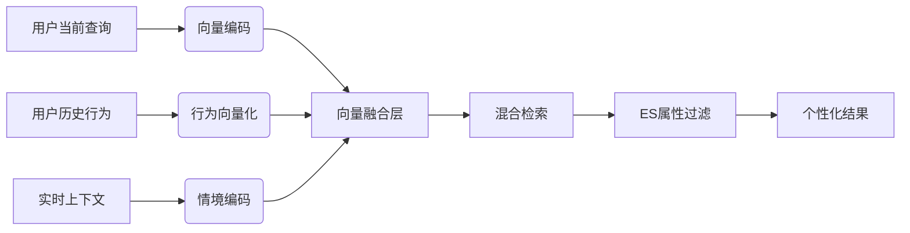
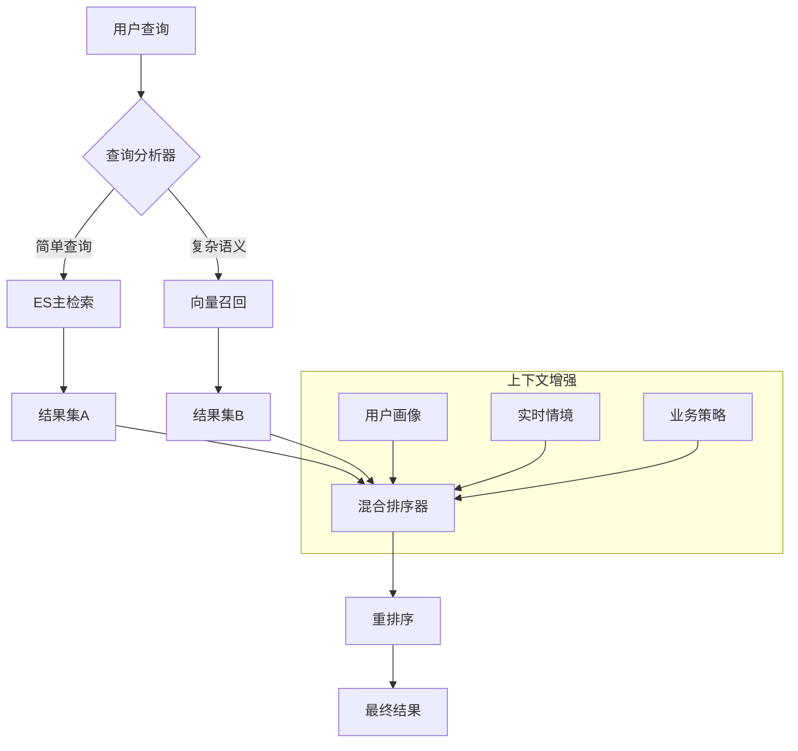
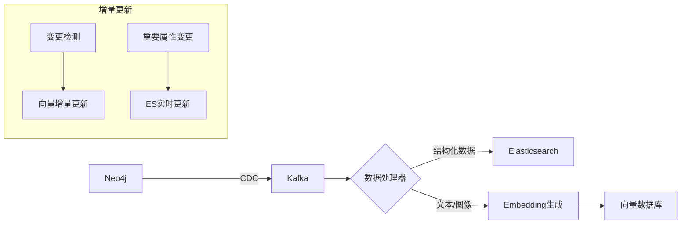
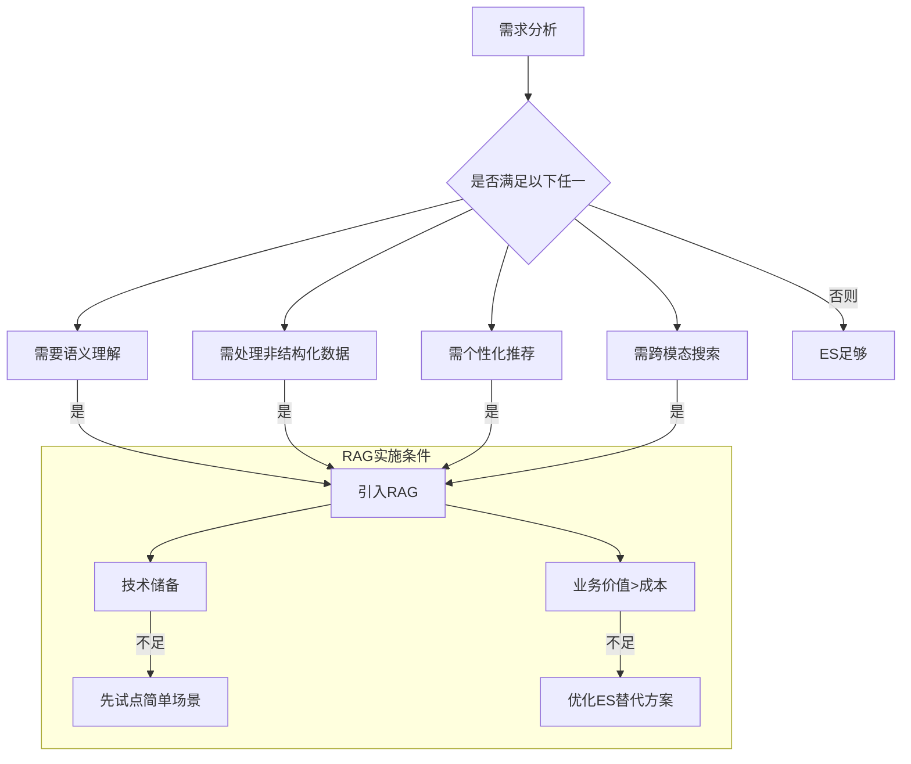
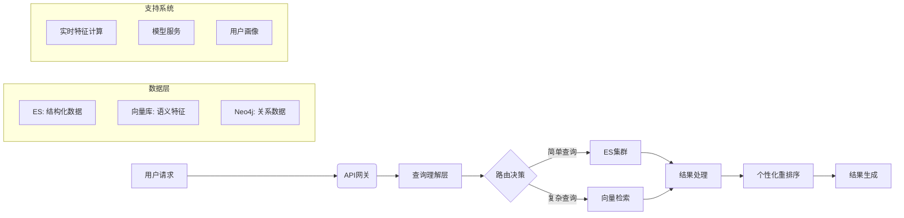

# ES与RAG+向量数据库的深度集成分析：互补而非替代

## 一、ES与RAG+向量库的能力对比

| 能力维度 | Elasticsearch | RAG+向量数据库 | 互补性分析 |
|----------|---------------|----------------|------------|
| **关键词检索** | ⭐⭐⭐⭐⭐ | ⭐⭐☆ | ES核心优势，向量库需额外处理 |
| **语义相似度** | ⭐⭐☆(需dense_vector) | ⭐⭐⭐⭐⭐ | 向量库原生优势 |
| **多模态支持** | ⭐☆☆ | ⭐⭐⭐⭐ | 向量库支持图文跨模态 |
| **地理位置过滤** | ⭐⭐⭐⭐⭐ | ⭐☆☆ | ES地理计算优势 |
| **实时更新** | ⭐⭐⭐⭐ | ⭐⭐☆ | ES写入性能更佳 |
| **关联查询** | ⭐⭐☆(nested有限) | ⭐⭐⭐ | 图增强RAG更优 |
| **上下文理解** | ⭐☆☆ | ⭐⭐⭐⭐⭐ | RAG核心价值 |
| **长尾查询** | ⭐⭐☆ | ⭐⭐⭐⭐ | 向量泛化能力更强 |
| **计算成本** | 中 | 高 | ES更经济 |

## 二、为什么需要引入RAG+向量数据库？

### 1. 解决ES的语义鸿沟问题
**案例**：用户搜索"适合带孩子吃的健康餐厅"  
- ES：依赖关键词匹配（孩子/健康/餐厅），可能错过"亲子友好餐厅"  
- RAG：通过向量相似度捕获语义关联：
  ```python
  query_vec = model.encode("适合带孩子吃的健康餐厅")
  # 匹配相关概念
  related_concepts = ["儿童餐", "无添加剂", "亲子区", "营养均衡"]
  ```

### 2. 处理复杂意图理解
**用户查询**："找一家像上次在朝阳大悦城吃的那家川菜"  
- ES局限：无法关联用户历史和行为
- RAG解决方案：
  ```python
  # 步骤1：检索用户历史
  user_history = get_last_orders(user_id)
  
  # 步骤2：向量相似匹配
  history_vec = model.encode(user_history[0].restaurant.description)
  candidates = vector_db.similarity_search(history_vec)
  
  # 步骤3：地理位置过滤
  results = es.geo_filter(candidates, "朝阳大悦城", "1km")
  ```

### 3. 突破关键词匹配局限
| 查询类型 | ES表现 | RAG+向量表现 |
|----------|--------|--------------|
| 模糊描述 | 差 ("氛围好的约会餐厅") | 优 |
| 概念抽象 | 中 ("有格调的用餐体验") | 优 |
| 错别字容错 | 依赖fuzziness | 语义自动纠错 |
| 多语言混合 | 需配置分析器 | 原生跨语言支持 |

### 4. 实现真正的个性化推荐
**ES局限**：  
- 基于历史行为的协同过滤需额外开发
- 难以融合实时上下文

**RAG增强方案**：


## 三、最佳实践：分层检索架构

### 1. 混合检索工作流


### 2. 各层具体实现

#### (1) 查询分析层
```python
def query_router(query: str, user_context: dict) -> str:
    """智能路由查询类型"""
    # 规则引擎判断
    if contains_geo_keywords(query):
        return "ES"  # 含明确地理位置
    
    # ML模型判断
    features = extract_features(query)
    if model.predict(features) == "SEMANTIC":
        return "VECTOR"
    
    # 默认ES处理
    return "ES"
```

#### (2) 向量召回层
```python
def vector_retrieval(query: str, top_k=100) -> list:
    """向量召回核心逻辑"""
    # 查询扩展
    expanded_query = query_expander.expand(query)
    
    # 多向量融合
    query_vec = semantic_model.encode(expanded_query)
    context_vec = user_model.encode(user_context)
    fused_vec = 0.7 * query_vec + 0.3 * context_vec
    
    # ANN搜索
    candidates = vector_db.search(
        vector=fused_vec,
        top_k=top_k,
        filters={"status": "open"}  # 元数据过滤
    )
    return [item.id for item in candidates]
```

#### (3) 混合排序层
```python
def hybrid_ranker(es_results, vector_results, user_id):
    """融合排序算法"""
    # 基础分数归一化
    es_scores = normalize([item.score for item in es_results])
    vec_scores = normalize([item.similarity for item in vector_results])
    
    # 构建候选池
    candidate_pool = {}
    for i, item in enumerate(es_results):
        candidate_pool[item.id] = {
            "score": 0.6 * es_scores[i] + 0.4 * get_personal_bonus(user_id, item.id),
            "source": "es"
        }
    
    for i, item in enumerate(vector_results):
        if item.id in candidate_pool:
            candidate_pool[item.id]["score"] += 0.4 * vec_scores[i]
        else:
            candidate_pool[item.id] = {
                "score": 0.5 * vec_scores[i] + 0.5 * get_personal_bonus(user_id, item.id),
                "source": "vector"
            }
    
    # 业务规则调整
    for id in candidate_pool:
        if is_promoted(id):
            candidate_pool[id]["score"] *= 1.2
    
    # 返回排序结果
    return sorted(candidate_pool.items(), key=lambda x: x[1]["score"], reverse=True)
```

### 3. 数据同步方案


## 四、场景化收益分析

### 1. 餐饮推荐场景
**用户查询**："适合商务宴请的江浙菜"  
- ES依赖：菜系标签、人均价格
- RAG增强：
  ```python
  # 语义理解
  concepts = ["高端", "包间私密", "服务专业", "经典本帮菜"]
  
  # 向量相似度匹配
  vec = model.encode(concepts)
  matches = vector_db.similar_search(vec, filters={"region": "上海"})
  ```

### 2. 菜品发现场景
**用户拍照上传菜品图片**  
- ES无法处理
- RAG多模态方案：
  ```python
  # 图像特征提取
  img_vec = clip_model.encode_image(uploaded_img)
  
  # 跨模态检索
  dish_ids = vector_db.search(img_vec, index="dish_embeddings")
  
  # 关联餐厅查询
  restaurants = neo4j.query("""
  MATCH (d:Dish)-[:SERVED_BY]->(r:Restaurant)
  WHERE d.id IN $dish_ids
  RETURN r
  """, dish_ids=dish_ids)
  ```

### 3. 个性化营养分析
**用户查询**："帮我找低卡路里的午餐选择"  
- ES基础：菜品热量标签
- RAG增强：
  ```python
  # 结合用户健康数据
  user_profile = get_user_health_data(user_id)
  
  # 构建个性化查询向量
  base_vec = model.encode("低卡路里 午餐")
  health_vec = model.encode(f"血糖指数<{user_profile['max_gi']}")
  fused_vec = 0.6*base_vec + 0.4*health_vec
  
  # 向量检索
  results = vector_db.search(fused_vec)
  ```

## 五、实施成本与优化策略

### 1. 成本控制方案
| 成本类型 | 优化策略 | 预期效果 |
|----------|----------|----------|
| 计算成本 | 分层检索(先ES粗筛) | 减少80%向量计算 |
| 存储成本 | 增量向量化(仅变更新增) | 降低60%存储 |
| 开发成本 | 使用托管向量库(Pinecone等) | 减少50%运维 |
| 模型成本 | 小型化模型(DistilBERT) | 提速3x，精度降<2% |

### 2. 性能优化技巧
```python
# 向量缓存机制
@cache(ttl=300, key_builder=lambda f, *args, **kwargs: f"vec:{hash(args[0])}")
def get_cached_vector(text: str) -> np.array:
    return model.encode(text)

# 批量向量化
def batch_vectorize(texts: list[str]) -> list[np.array]:
    return model.encode(texts, batch_size=128)

# 近似搜索优化
vector_db.configure(
    index_params={
        "metric_type": "IP", 
        "index_type": "IVF_PQ",
        "params": {"nlist": 2048}
    }
)
```

## 六、决策框架：何时需要引入RAG



## 七、结论：ES与RAG的共生关系

### 1. **必须引入RAG+向量库的场景**
- 需要深度语义理解的查询（如"有浪漫氛围的餐厅"）
- 多模态搜索需求（图搜菜、视频找店）
- 强个性化推荐系统
- 知识密集型QA（如"这道菜的历史起源"）
- 处理模糊/抽象的用户需求

### 2. **ES足够胜任的场景**
- 精确地理位置搜索（"望京3km内"）
- 基于明确标签的过滤（"川菜+24小时营业"）
- 高频简单查询（店名/地址搜索）
- 实时性要求极高的场景（<50ms响应）

### 3. 推荐架构：混合检索引擎


**实施建议**：
1. **渐进式引入**：从核心场景开始（如智能推荐）
2. **AB测试验证**：对比纯ES与混合方案效果
3. **成本监控**：关注向量计算的资源消耗
4. **统一数据管道**：建立ES-向量库数据同步机制
5. **缓存策略**：对频繁查询结果进行缓存

通过ES处理"确定性需求"，RAG处理"探索性需求"，两者结合可构建既能应对精准过滤，又能理解复杂意图的新一代餐饮搜索系统，在保持ES高性能优势的同时，获得AI驱动的智能搜索能力。