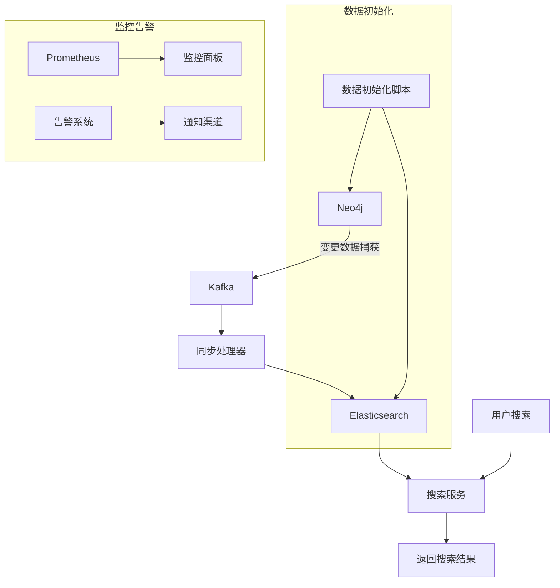
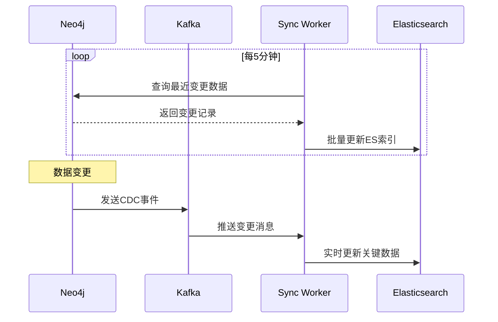
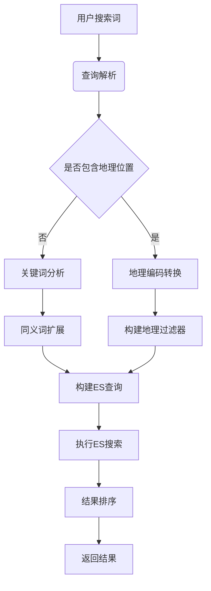
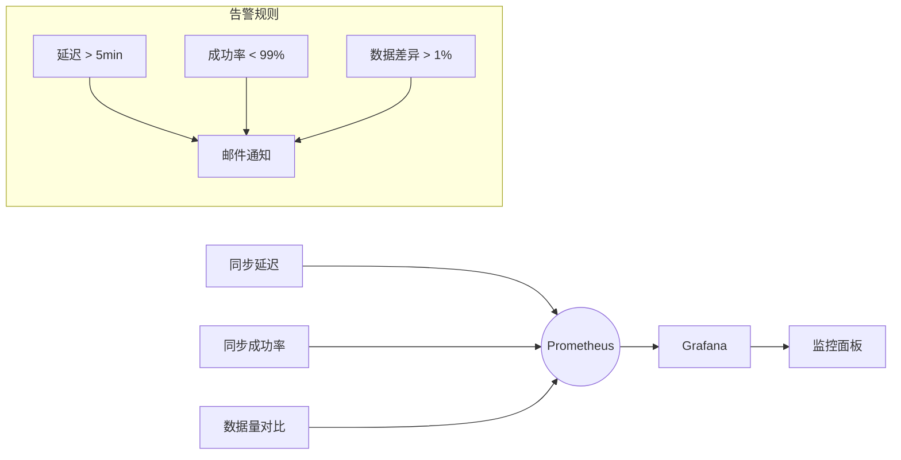
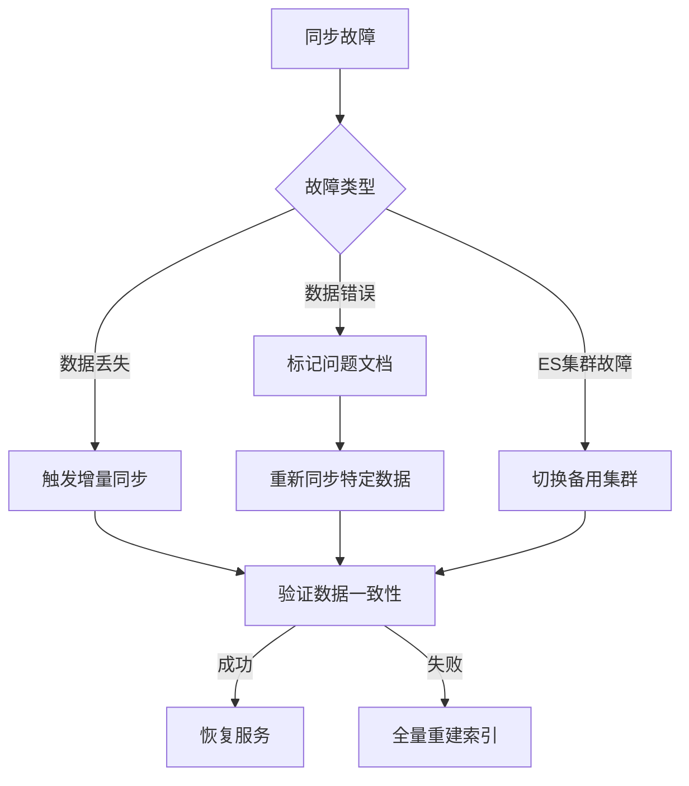

# Neo4j到Elasticsearch数据同步方案设计与实现

## 一、整体同步架构设计



## 二、同步核心方案设计

### 1. 数据同步方式对比

| 同步方式 | 实时性 | 复杂性 | 资源消耗 | 适用场景 |
|---------|--------|--------|----------|----------|
| 全量同步 | 低 | 低 | 高 | 初始化或重建索引 |
| 增量同步 | 高 | 中 | 中 | 日常变更同步 |
| CDC同步 | 极高 | 高 | 低 | 生产环境实时同步 |
| 双写机制 | 极高 | 高 | 高 | 强一致性要求场景 |

### 2. 推荐方案：CDC + 增量批处理

结合变更数据捕获（CDC）和定时增量同步，平衡实时性和系统复杂度：



## 三、详细实现方案

### 1. 数据模型映射设计

**Neo4j节点与ES文档映射关系**

| Neo4j节点 | ES索引 | 关键字段映射 | 特殊处理 |
|-----------|--------|--------------|----------|
| Restaurant | restaurants | name, address, location(geo_point), tags | 聚合分类、标签、菜品数据 |
| FoodItem | food_items | name, price, category, tags | 关联餐厅信息 |
| Category | categories | name, type | 建立父子分类关系 |
| User | users | username, search_history | 敏感信息脱敏 |
| Address | 不单独索引 | 嵌入user文档 | 地理编码转换 |

### 2. 同步处理器核心逻辑

```python
class Neo4jToESSync:
    def __init__(self, neo4j_driver, es_client):
        self.driver = neo4j_driver
        self.es = es_client
        self.batch_size = 200
    
    def sync_restaurant(self, restaurant_id):
        """同步单个餐厅数据"""
        query = """
        MATCH (r:Restaurant {id: $id})
        OPTIONAL MATCH (r)-[:BELONGS_TO]->(c:Category)
        OPTIONAL MATCH (r)-[:TAGGED_WITH]->(t:Tag)
        OPTIONAL MATCH (r)-[:HAS_MENU]->(f:FoodItem)
        RETURN r, 
               COLLECT(DISTINCT c.name) AS categories,
               COLLECT(DISTINCT t.name) AS tags,
               COLLECT(f.id) AS food_ids
        """
        with self.driver.session() as session:
            result = session.run(query, id=restaurant_id)
            record = result.single()
            
            if record:
                restaurant = record['r']
                doc = {
                    'id': restaurant['id'],
                    'name': restaurant['name'],
                    'address': restaurant['address'],
                    'location': {
                        'lat': restaurant['latitude'],
                        'lon': restaurant['longitude']
                    },
                    'rating': restaurant['rating'],
                    'categories': record['categories'],
                    'tags': record['tags'],
                    'food_ids': record['food_ids'],
                    'last_updated': datetime.now().isoformat()
                }
                self.es.index(index='restaurants', id=restaurant_id, body=doc)
    
    def process_kafka_event(self, event):
        """处理Kafka CDC事件"""
        if event['entity_type'] == 'Restaurant':
            self.sync_restaurant(event['entity_id'])
        elif event['entity_type'] == 'FoodItem':
            # 查找关联餐厅并同步
            self.sync_restaurant_by_food(event['entity_id'])
    
    def incremental_sync(self, last_sync_time):
        """增量同步最近变更的数据"""
        query = """
        MATCH (n)
        WHERE n.last_updated > $last_sync
        RETURN n.id AS id, labels(n)[0] AS type
        """
        with self.driver.session() as session:
            result = session.run(query, last_sync=last_sync_time)
            for record in result:
                if record['type'] == 'Restaurant':
                    self.sync_restaurant(record['id'])
                # 其他类型处理...
```

### 3. 搜索词处理与匹配方案

#### 搜索处理流程


#### ES搜索DSL示例
```json
{
  "query": {
    "bool": {
      "must": [
        {
          "multi_match": {
            "query": "望京 川菜",
            "fields": ["name^3", "tags^2", "categories", "address"],
            "type": "best_fields"
          }
        }
      ],
      "filter": [
        {
          "geo_distance": {
            "distance": "5km",
            "location": {
              "lat": 39.990464,
              "lon": 116.481488
            }
          }
        },
        {
          "term": {
            "tags": "免配送费"
          }
        }
      ]
    }
  },
  "sort": [
    {
      "_geo_distance": {
        "location": {
          "lat": 39.990464,
          "lon": 116.481488
        },
        "order": "asc",
        "unit": "km"
      }
    },
    {
      "rating": {
        "order": "desc"
      }
    }
  ],
  "aggs": {
    "categories": {
      "terms": {
        "field": "categories.keyword",
        "size": 10
      }
    }
  }
}
```

### 4. 解决的问题与精细度

| 问题类型 | 解决方案 | 解决精细度 |
|---------|----------|------------|
| **地理位置搜索** | Geo-point字段 + 距离过滤器 | 精确到米级距离计算 |
| **多字段匹配** | multi_match跨多个字段搜索 | 支持字段权重配置 |
| **同义词扩展** | 同义词分析器配置 | 支持行业特定同义词 |
| **结果排序** | 多维度排序（距离、评分、销量） | 可配置排序策略 |
| **拼写容错** | fuzziness参数 | 支持编辑距离2的纠错 |
| **实时数据** | CDC + 增量同步 | 秒级数据延迟 |
| **关联数据** | 嵌套文档和父子关系 | 支持餐厅-菜品联合搜索 |
| **个性化** | 基于用户历史的Boosting | 提升个性化权重 |

### 5. 高级搜索场景处理

**场景1：模糊搜索 + 地理位置**
```python
def search_nearby_food(keyword, lat, lon, distance='5km'):
    """附近美食搜索"""
    query = {
        'bool': {
            'must': {
                'match': {
                    'name': {
                        'query': keyword,
                        'fuzziness': 'AUTO'
                    }
                }
            },
            'filter': {
                'geo_distance': {
                    'distance': distance,
                    'location': {'lat': lat, 'lon': lon}
                }
            }
        }
    }
    # 添加个性化Boosting
    if current_user.search_history:
        query['bool']['should'] = [{
            'terms': {
                'tags': current_user.preferred_tags,
                'boost': 2.0
            }
        }]
    return es.search(index='restaurants', query=query)
```

**场景2：多维度过滤与聚合**
```python
def filter_restaurants(filters):
    """复杂条件过滤搜索"""
    bool_query = {'filter': []}
    
    # 地理过滤
    if 'location' in filters:
        bool_query['filter'].append({
            'geo_distance': filters['location']
        })
    
    # 分类过滤
    if 'categories' in filters:
        bool_query['filter'].append({
            'terms': {'categories.keyword': filters['categories']}
        })
    
    # 价格范围
    if 'price_range' in filters:
        min_price, max_price = filters['price_range']
        bool_query['filter'].append({
            'range': {'min_price': {'gte': min_price, 'lte': max_price}}
        })
    
    # 聚合分析
    aggs = {
        'categories': {'terms': {'field': 'categories.keyword'}},
        'price_ranges': {
            'range': {
                'field': 'min_price',
                'ranges': [
                    {'to': 20}, {'from': 20, 'to': 50}, {'from': 50}
                ]
            }
        }
    }
    
    return es.search(
        index='restaurants',
        query={'bool': bool_query},
        aggs=aggs
    )
```

## 四、同步系统关键组件

### 1. 数据同步监控面板



### 2. 数据一致性校验

```python
def check_consistency():
    """Neo4j与ES数据一致性检查"""
    # 检查餐厅数量
    neo4j_count = neo4j.run("MATCH (r:Restaurant) RETURN COUNT(r)").single()[0]
    es_count = es.count(index='restaurants')['count']
    
    # 检查样本数据
    sample_ids = neo4j.run("MATCH (r:Restaurant) RETURN r.id LIMIT 100").value()
    inconsistencies = []
    
    for rid in sample_ids:
        neo_data = neo4j.run("MATCH (r {id: $id}) RETURN r", id=rid).single()[0]
        es_data = es.get(index='restaurants', id=rid)['_source']
        
        # 关键字段比对
        if neo_data['name'] != es_data['name'] or \
           neo_data['rating'] != es_data['rating']:
            inconsistencies.append(rid)
    
    return {
        'count_match': neo4j_count == es_count,
        'sample_inconsistencies': inconsistencies
    }
```

### 3. 同步性能优化策略

1. **批量处理**：积累变更批量写入ES（100-500条/批）
2. **索引优化**：
   - 使用index模板预配置
   - 关闭不需要的字段`_source`
   - 合理设置分片数（shard=节点数×1.5）
3. **资源隔离**：
   - 专用同步集群
   - 限流策略（bulk队列控制）
4. **缓存利用**：
   - Redis缓存频繁访问的数据
   - ES请求缓存
5. **异步处理**：非关键字段异步更新

## 五、实施路线图

| 阶段 | 任务 | 交付物 | 时间 |
|------|------|--------|------|
| 1. 基础架构 | 搭建ES集群<br>配置Kafka<br>开发CDC监听 | 可运行的同步管道 | 2周 |
| 2. 数据建模 | 设计ES索引<br>实现模型映射<br>开发同步逻辑 | 完整的数据同步服务 | 3周 |
| 3. 搜索服务 | 开发搜索API<br>实现查询解析<br>结果排序策略 | 可用的搜索服务 | 2周 |
| 4. 高级功能 | 同义词管理<br>个性化Boosting<br>实时索引更新 | 增强搜索体验 | 2周 |
| 5. 监控运维 | 部署监控系统<br>自动化测试<br>容灾方案 | 生产就绪的系统 | 1周 |

## 六、容灾与回滚方案

### 故障处理流程


### 数据回滚机制
1. **版本化索引**：使用别名和版本号（restaurants_v1, restaurants_v2）
2. **快照备份**：定期创建ES快照
3. **回滚步骤**：
   - 暂停同步服务
   - 恢复最近可用快照
   - 重建索引别名指向旧版本
   - 修复问题后重新部署

## 总结

本方案通过CDC+批处理的混合同步模式，实现了Neo4j到Elasticsearch的高效数据同步，能够解决以下核心问题：

1. **多维度搜索**：
   - 精确地理位置过滤（距离计算）
   - 多字段联合搜索（名称、分类、标签）
   - 复杂条件组合（价格、评分、标签）

2. **搜索体验优化**：
   - 智能纠错与同义词扩展
   - 个性化结果排序
   - 实时索引更新（秒级延迟）

3. **系统可靠性**：
   - 自动监控告警
   - 数据一致性校验
   - 无缝回滚机制

4. **高性能架构**：
   - 批量处理优化
   - 资源隔离策略
   - 缓存机制

系统将能支持千万级POI的毫秒级搜索响应，提供精准的"望京 新荟城"类搜索体验，同时保证数据的一致性和系统的稳定性。